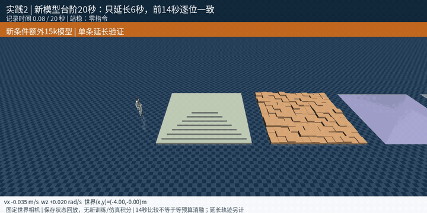

# G1人形机器人：强化学习与运动控制

基于Unitree G1开展速度与高度控制、地形行走、分层导航、全身动作跟踪、教师学生蒸馏和深度感知运动。项目包含算法组件、训练配置、量化实验和仿真视频。

**更新：2026-09-14。全部结果来自仿真或离线运动学验证。**

[视频合集](MEDIA.md) · [当前状态](PROJECT_STATUS.md) · [算法与框架来源](REFERENCES.md)

## 动态预览

以下为原视频前6秒的动画节选；点击动画打开完整视频。具体模型、播放条件和结果见对应实践页。

**实践02**

**实践04**

**实践06**

**实践09**

**实践10**

## 代表性结果

| 方向 | 已完成的结果 | 展示 |
|---|---|---|
| 速度与骨盆高度联合控制 | 高度0.5m、前向速度0.5m/s指令下连续蹲走22秒；统计后20秒的高度MAE为0.6116cm、前向均速0.5357m/s。三组动态指令均完成24秒窗口。 | [结果与视频](practices/04_velocity_height/README.md) |
| 教师学生蒸馏与全身动作 | Action和KL学生均有25/25动作到达参考末尾；对齐身体平均距离分别为2.580cm、2.537cm，世界身体平均距离为10.90cm、12.86cm。 | [结果与视频](practices/06_teacher_student/README.md) |
| 自适应采样与全身轨迹跟踪 | 标称CPU协议下学习残差连续跟完131.48秒单舞蹈，对齐身体平均距离3.633cm、世界锚点平均距离0.581m；零残差参考PD在0.28秒触发末端条件。 | [结果与视频](practices/09_motion_tracking/README.md) |
| 感知驱动的粗糙地形行走 | 新增15,000次更新；8组同初态、各14秒场景中，新策略的XY速度与转速RMSE均低于旧策略。另完成20秒台阶穿越轨迹。 | [结果与视频](practices/02_rough_terrain/README.md) |
| 地形感知的人物交互动作跟踪 | 所选model399走完309控制帧、6.18秒参考；世界锚点RMSE为0.1297m。两个指定初态平移也到达参考末尾。 | [结果与视频](practices/10_object_interaction/README.md) |

## 按实践浏览

每个目录统一放置成果说明、`training/`训练记录与算法组件、`media/`视频和结果图。训练和评估的条件在对应页面说明。

| 编号 | 内容 | 主要技术 |
|---|---|---|
| 01 | [仿真环境与行走策略部署](practices/01_simulation_baseline/README.md) | Isaac Lab · PPO · MuJoCo |
| 02 | [感知驱动的粗糙地形行走](practices/02_rough_terrain/README.md) | Isaac Lab · PPO · 高度扫描 · MuJoCo |
| 03 | [HoST起身与增量动作部署](practices/03_host_standup/README.md) | HoST · PD · MuJoCo |
| 04 | [速度与骨盆高度联合控制](practices/04_velocity_height/README.md) | MJLab · PPO · 双指令控制 |
| 05 | [分层强化学习导航](practices/05_hierarchical_navigation/README.md) | Isaac Lab · 高层PPO · 冻结低层策略 |
| 06 | [教师学生蒸馏与全身动作](practices/06_teacher_student/README.md) | MJLab · PPO · Action Matching · KL Matching |
| 07 | [人体到G1的运动重定向](practices/07_motion_retargeting/README.md) | GMR · SMPL-X · 逆运动学 |
| 08 | [AMP拟人运动与风格奖励](practices/08_amp_locomotion/README.md) | Isaac Lab · PPO · AMP |
| 09 | [自适应采样与全身轨迹跟踪](practices/09_motion_tracking/README.md) | BeyondMimic方法 · MJLab · PPO |
| 10 | [地形感知的人物交互动作跟踪](practices/10_object_interaction/README.md) | Isaac Lab · PPO · 高度扫描 |
| 11 | [深度感知运动与跨仿真部署](practices/11_depth_locomotion/README.md) | Project Instinct · 深度历史 · PPO/风格奖励 |

## 当前进展

已完成双指令控制、两类蒸馏、长动作跟踪、地形配对和平台路径的分项验证。分层导航已有1,536局配对结果，尚未得到随机布局训练的总体优势；AMP仍有明显航向漂移，深度策略尚未达到完整跑酷表现。

各项结果保留模型、统计窗口、坐标和初态限制。预训练部署、运动学回放与自主训练分别说明，具体数值和未覆盖场景见对应实践页。
