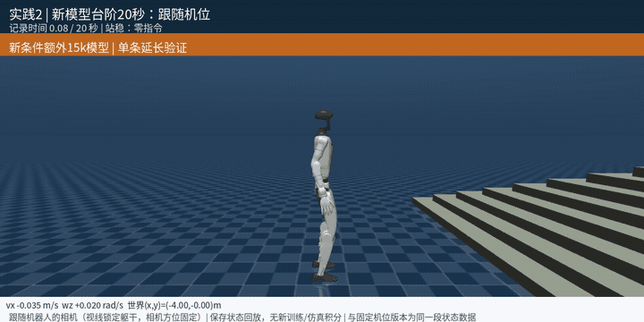
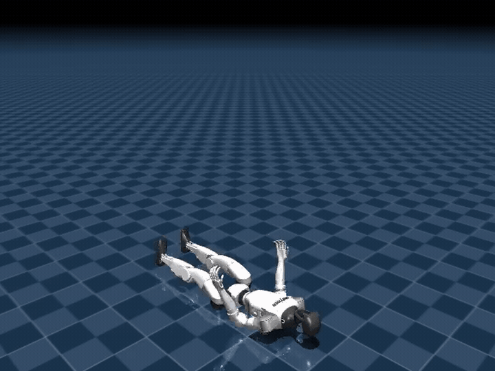
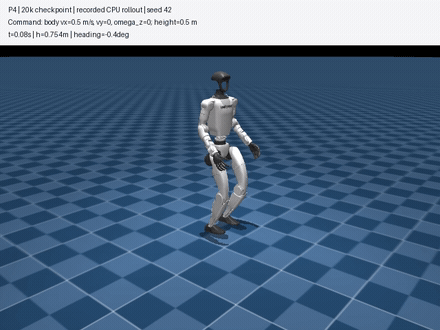
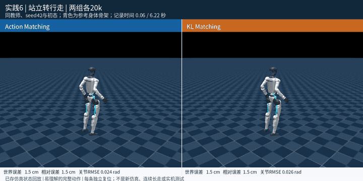
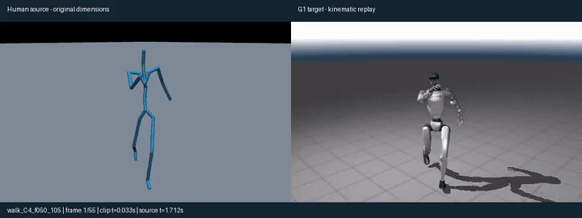
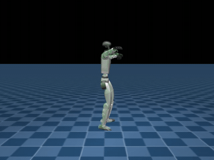
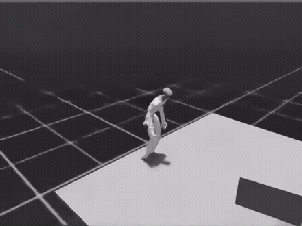

# G1人形机器人：强化学习与运动控制

基于Unitree G1开展速度与高度控制、地形行走、分层导航、全身动作跟踪、教师学生蒸馏和深度感知运动。项目包含算法组件、训练配置、量化实验和仿真视频。

更新：2026-09-16。全部结果来自仿真或离线运动学验证。

[源代码](code/) · [视频合集](MEDIA.md) · [当前状态](PROJECT_STATUS.md) · [算法与框架来源](REFERENCES.md)

## 源代码

11 个实践的完整源代码与最终策略权重在 [`code/`](code/)。每个实践目录下的 `MODIFIED.md` 逐文件列出哪些是我写的、哪些来自上游框架。

## 各实践概览

每项给出一段代表视频，点击动图打开完整 MP4。全部 32 段视频见[视频合集](MEDIA.md)。具体数值、统计窗口和模型阶段都在各实践页里，这里只讲做了什么。

### 实践01｜仿真环境与行走策略部署

Isaac Lab（训练）+ MuJoCo（跨仿真验证）· PPO

同一份权重要在两个仿真器里跑出同样的行为，中间隔着一串容易出错的对接。两边的关节排列顺序不同，得先建映射表；网络输出的是归一化动作，乘上 action scale 再加默认关节角才是 PD 的目标角度；两侧的增益、策略周期和物理步长也必须对齐，否则同样的网络会走出不同的步态。

核对方式是把同一批观测分别喂给训练时的权重和导出后的 policy，比对输出是否一致，再跑一段固定指令的闭环回放看行为。

还没做的是成对比较：同一份权重在两个仿真器里跑同一段指令、逐帧对轨迹。这一步没完成，所以只能说链路通了，不能说两边动力学一致。

尚无展示视频。[实践详情](practices/01_simulation_baseline/README.md)

### 实践02｜感知驱动的粗糙地形行走

Isaac Lab · PPO · 高度扫描 · MuJoCo

在机器人脚下布一圈射线量地面高度接进观测，它才能在踩上台阶前知道前面是高是低。实现时有两个坑。一是高度必须换算成相对机身的值，用绝对高度的话机器人一抬腿整张高度图都会跟着漂。二是射线打空时返回的是非有限值，直接进网络会把整个观测污染掉，得先做有限性掩码。观测侧策略加噪、价值网络不加噪，两条路分开配置。

在原策略基础上做了接触条件适配训练。评估用若干组相同初态的场景逐一配对，新策略的速度和转速误差都低于旧策略，另外跑通了一段台阶穿越。

结果来自固定场景，转向仍然欠跟踪，侧向有漂移。这轮适配同时包含额外训练和终止判据修改，不能把改善单独归到某一项上。

[实践详情](practices/02_rough_terrain/README.md)

### 实践03｜HoST仰躺起身（预训练策略部署）

HoST 预训练策略 · PD 控制 · MuJoCo

这一项不训练，重点是把一个别人训好的起身策略正确接进 MuJoCo。它的动作空间是增量式的：网络输出的不是关节目标角，而是相对上一帧的增量，要自己累加成绝对角度再送 PD。观测这边是多帧历史的拼接，关节顺序、仿真时钟的推进节奏都得逐项核对，错一处机器人就起不来。

接好之后从默认仰躺姿态完成起身并保持站立，另附一段增量动作与绝对动作的接口对比动画。

只验了默认仰躺这一种初态。任意跌倒姿态的恢复没测，HoST 本身也没有自己训过。

[实践详情](practices/03_host_standup/README.md)

### 实践04｜速度与骨盆高度联合控制

MJLab · PPO · 双指令控制

让机器人同时听两个指令：走多快，以及骨盆维持在多高。高度指令在训练中随机采样，和速度指令一起拼进 Actor 观测，再配一项高度跟踪奖励。做成之后它能一边压低身体一边前进，也就是蹲着走。

为了确认效果确实来自这条链路，另做两组同预算的消融：一组移除高度跟踪奖励，一组移除 Actor 的高度指令观测。两组都做不到按指令改变高度，说明观测和奖励缺一不可。除固定指令外还测了三组动态指令切换。

限制在于这是单种子的平地结果，朝向和横向都还有漂移。后来加的朝向反馈改善了角度，但没有做横向位置的闭环。

[实践详情](practices/04_velocity_height/README.md)

### 实践05｜分层强化学习导航

Isaac Lab · 高层 PPO + 冻结的低层行走策略

把已经训好的行走策略冻住当执行层，只训一个高层网络。高层看目标点的相对位姿，输出速度指令，低层负责怎么迈腿。这里最容易错的是层间接口：低层的观测分组必须从它自己的训练配置里深拷贝过来，手写重建看着一样，实际上噪声配置和历史长度都会对不上。

原本的假设是随机布局训练出来的高层泛化更好。为了检验，用两个模型、两个场景族、三个随机种子做了成对评估，每组场景清单都可复读。

结果是没有得到随机布局训练提高到达率的证据，两者的成功局数几乎一样。这一项按实际记为未达成预期，不做正面包装。成功条件里含距离缓存边界，固定布局那一组的补训也还没跑完。

[实践详情](practices/05_hierarchical_navigation/README.md)

### 实践06｜教师学生蒸馏：Action与KL对比

MJLab · PPO · Action Matching / KL Matching

教师策略能看到仿真里的特权信息，学生只能看到真机上拿得到的观测，要把教师的能力转移过去。对比了两条路：一条直接回归教师输出的动作，另一条匹配两者输出分布之间的对角高斯 KL 散度。实现时要处理梯度的边界条件，蒸馏系数还要随训练退火。

两种学生在同一预算下各训一轮，评估时对整个动作库逐条复位、等权统计。两者都能把全部动作跟到参考末尾，对齐后的姿态误差相当接近；换到世界坐标下看，KL 学生反而略差一些。

这里要说清楚：评估动作全部来自训练库，不是留出动作，所以这不构成泛化验证。两种方案的退火日程也不完全一致，KL 并非在所有指标上更优。

[实践详情](practices/06_teacher_student/README.md)

### 实践07｜人体到G1的运动重定向

GMR · SMPL-X · 逆运动学，不含强化学习

人的骨架比例、关节数量和转轴都跟 G1 对不上，动捕数据不能直接喂给机器人。这一项做的是格式和坐标的转换：世界坐标与根节点坐标的朝向约定、四元数的分量顺序、关节与身体的命名和排列、帧率重采样，以及运动库的存储格式。覆盖行走、加速跑、右转三类。

做完之后专门检查了下游的加载链路，确认这批文件能被实践 08 的 AMP 数据加载器直接读进去，四元数顺序和关节排列都对得上。

视频是姿态映射的运动学回放，直接把关节角写进仿真，不含力矩控制。换句话说机器人并没有真的在平衡，这些片段不能用来说明动态稳定性。片段本身也偏短，脚地关系还有质量问题。

[实践详情](practices/07_motion_retargeting/README.md)

### 实践08｜AMP拟人走跑与步态评估

Isaac Lab · PPO + AMP 对抗式动作先验 · G1 29 自由度

走得准靠速度跟踪奖励，走得像人靠一个判别器：它同时看人类参考动作和机器人当前动作，尽力分辨谁是谁；机器人骗过它的程度折算成风格奖励，和任务奖励按权重混合。

一开始机器人拖着腿走。查下来是判别器被稳定性保护全程暂停了，整轮训练里真正发生的优化步只有个位数，风格奖励一直卡在上限附近不动。解除之后抬脚高度立刻上来，拖腿和左右不协调随之消失。另外镜像损失的量级也不对，它比 PPO 主目标大了近两个数量级，系数取 1.0 时航向会整个转过去，换成尺度匹配的系数后对称性保住了、航向也回来了。

之后用十轮单因素实验查剩下的步态问题，每轮的判定门槛都在开训前写进冻结方案并算哈希。延长训练、调整风格与任务配比、加关节速度惩罚、用框架自带的接触时序奖励，这四条路都被排除。接触时序奖励那条要单独说：实测它可以被「一直双脚着地」套利，启用后双支撑不降反升。

找到两个真正有效的改动。一是提高判别器的梯度惩罚，摆臂方向修正了，肩关节与同侧髋关节从同向摆动变成反向摆动，换新随机种子后能复现。二是新增一项直接惩罚双支撑时长的奖励，该占比从四成多降到两成出头，落进人类常速行走的区间，而且每脚的摆动次数不降反升，说明不是靠单脚站立刷出来的，这条防套利条件开训前就登记为判据的一部分。

拟人走跑整体仍未通过验收。冻结门槛要求慢走和常速前进两个场景同时达标，目前没有模型做到。卡点是航向与左右对称性互相耦合：把双支撑压下去会让单脚支撑期变长、航向跟着退化；反过来提高航向权重能把航向拉回来，但双支撑回升、摆臂相位也再度转正。整个周期的腾空占比仍然是 0。

[实践详情](practices/08_amp_locomotion/README.md)

### 实践09｜全身舞蹈轨迹跟踪

MJLab · PPO · BeyondMimic 方法

让机器人跟着一段两分钟的舞蹈走完全程。长序列的麻烦在于只要有一处跟丢就会一路崩掉，所以采样概率按失败统计来调：哪些片段练得差，就让它们被更多抽到。相位推进和参考坐标的对齐也要一起处理。

动作接口用的是参考关节角加策略残差，这样能把局部动作误差和世界轨迹误差分开看。作为对照，零残差的纯参考 PD 撑不过一秒就触发末端条件，学习残差的版本能连续跟完整段。

问题出在世界坐标：姿态跟得住，但整个人在慢慢漂。没见过的动作和外部扰动都没有验证。另外完整展示视频用的是另一套带事件的播放条件，画面不能直接当作标称指标来读。

[实践详情](practices/09_motion_tracking/README.md)

### 实践10｜平台地形动作跟踪（HOI）

Isaac Lab · PPO · 高度扫描

在带平台的场景里跟踪全身参考动作。和纯动作跟踪的区别是机器人要和平台发生实际接触，而不只是把姿态复现出来，所以用高度扫描去感知地形，射线要和地形描述里的 box primitive 求交。另外比较了世界锚点奖励的两种尺度。

这一项此前最大的短板是训练量，所选模型的训练规模远低于参考配置。后来补做了扩容训练，环境数和更新次数都大幅提高。为了避免看完结果再挑模型，评估存档在开训前就按等间隔登记好了。

扩容后跟踪误差明显下降，而且世界锚点、朝向、关节这三项是同步下降的，不是单一指标的偶然，这就把「训练预算是主要约束」从推测变成了结论。

即便如此也还不算完整：受本机显存限制，环境数仍低于参考配置。模型也依然没有独立留出验证，是从同一批候选里挑的。

[实践详情](practices/10_object_interaction/README.md)

### 实践11｜深度感知与MuJoCo跨仿真验证

Project Instinct + MuJoCo（Sim2Sim）· PPO + 运动风格奖励

靠一个深度相机看路通过障碍。深度图不是直接拿最新一帧用，而是维护一个历史队列再从里面抽帧，以此模拟真实传感器的延迟。图像本身要走完一整条预处理：缩放、按边距裁剪、空洞修补、高斯模糊、线性归一化。这套实现照着训练侧的定义写，并配了单元测试逐项断言形状与映射关系。

训练好的策略导出成 ONNX 放进 MuJoCo，录了四组对照，覆盖参考策略和自训练模型、平地和粗糙地形。参考策略在平地连续走完全程、骨盆高度稳定，说明补全后的整条执行链路是对的；粗糙地形上它爬上台阶后蹲住，没摔但也没完成跑酷。

自训练的模型两种场景都几乎不前进。我一开始把这归因为跨仿真损失，扫描指令之后发现不是：回头看 Isaac 原生评估，它的速度误差和均速几乎相等，意思是这个策略在 Isaac 里本来就没学会跟踪速度。之前公开写的「迁移落差约 28%」这个说法不成立，已经更正。

[实践详情](practices/11_depth_locomotion/README.md)

## 按实践浏览

每个目录统一放置成果说明、`training/` 训练记录与算法组件、`media/` 视频和结果图。完整数值在各实践页的 `results.json` 与说明里。

| 编号 | 内容 | 主要技术 | 状态 |
|---|---|---|---|
| 01 | [仿真环境与行走策略部署](practices/01_simulation_baseline/README.md) | Isaac Lab · PPO · MuJoCo | 链路通过 |
| 02 | [感知驱动的粗糙地形行走](practices/02_rough_terrain/README.md) | Isaac Lab · PPO · 高度扫描 · MuJoCo | 优于旧策略 |
| 03 | [HoST起身与增量动作部署](practices/03_host_standup/README.md) | HoST · PD · MuJoCo | 部署复现 |
| 04 | [速度与骨盆高度联合控制](practices/04_velocity_height/README.md) | MJLab · PPO · 双指令控制 | 达成，含消融 |
| 05 | [分层强化学习导航](practices/05_hierarchical_navigation/README.md) | Isaac Lab · 高层PPO · 冻结低层策略 | 未达成预期 |
| 06 | [教师学生蒸馏与全身动作](practices/06_teacher_student/README.md) | MJLab · PPO · Action / KL Matching | 达成，非泛化验证 |
| 07 | [人体到G1的运动重定向](practices/07_motion_retargeting/README.md) | GMR · SMPL-X · 逆运动学 | 运动学回放 |
| 08 | [AMP拟人运动与风格奖励](practices/08_amp_locomotion/README.md) | Isaac Lab · PPO · AMP | 未通过验收 |
| 09 | [自适应采样与全身轨迹跟踪](practices/09_motion_tracking/README.md) | BeyondMimic方法 · MJLab · PPO | 达成，有世界漂移 |
| 10 | [地形感知的人物交互动作跟踪](practices/10_object_interaction/README.md) | Isaac Lab · PPO · 高度扫描 | 扩容后改善 |
| 11 | [深度感知运动与策略导出](practices/11_depth_locomotion/README.md) | Project Instinct · 深度历史 · PPO/风格奖励 | 自训练策略不足 |

## 当前进展

双指令控制、两类蒸馏、长动作跟踪、地形配对和平台路径这几项的分项验证已经完成。

没做成的有三项，都按实际结果记录。分层导航的随机布局训练没有显出总体优势；AMP 拟人走跑的自然摆臂和低速慢走没能同时通过冻结门槛；自训练的深度策略迁移后几乎不前进，跨仿真部署不算成功。

各项结果都保留了模型阶段、统计窗口、坐标系和初态限制。预训练部署、运动学回放和自主训练分开说明，具体数值与未覆盖的场景见对应实践页。
