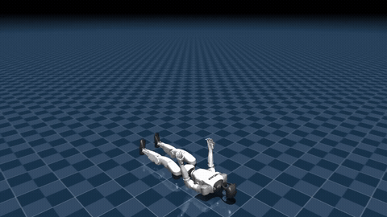

# 实践 3 — HoST 增量动作空间与 Sim2Sim 站起部署

> 在 MuJoCo 中部署 23DoF Unitree G1 的 HoST 预训练策略，让机器人从仰面躺倒自主站起。
> 本实践**不训练**，重点是让部署侧的状态读取、观测拼装、动作映射与训练时严格一致。



---

## 一、核心：两种动作空间的差别

强化学习策略几乎不直接输出关节力矩，而是输出一个"目标关节角"，
再由 PD 控制器转成力矩。关键问题是：**这个目标角以什么为基准？**

```
常规残差式:  q* = q_default + α·a       基准 = 固定的标称站姿
HoST 增量式: q* = q_current + α·a       基准 = 当前实际姿态
```

其中 `α = action_scale = 0.25`。

### 为什么站起任务必须用增量式

残差式等价于给每个关节挂了一根**始终指向 `q_default` 的弹簧**。

机器人平地行走时这没问题 —— 行走姿态本来就在标称站姿附近小幅摆动，
弹簧提供了一个合理的"回中"先验，策略只需输出小的修正量。

但机器人**躺在地上**时，当前姿态离站立标称姿态极远。这根弹簧会持续施加
一个巨大的恒定拉力，试图把机器人硬拽成站姿。而站起是一个有严格顺序的过程：

```
仰卧 → 收腿 → 肘/手撑地 → 臀部离地 → 深蹲 → 起身
```

每个阶段的"正确姿态"完全不同，根本不存在一个通用的标称基准。
被恒定拉力主导的结果就是四肢乱挥、重心失控，然后倒下。

增量式把基准锚在当前姿态上：

- `a = 0` 的语义变成"保持现状"，而不是"回到站姿"
- 策略输出的每个分量都是相对此刻的一次真实位移决策
- 策略可以自由地在任意接触构型上做局部调整

**一句话：接触状态频繁切换的任务，动作基准必须跟着状态走。**

---

## 二、四个实现要点

### TODO 1 — 读 MuJoCo 浮动基座状态

```
qpos[0:3]  基座位置       qvel[0:3]  基座线速度
qpos[3:7]  四元数 wxyz    qvel[3:6]  基座角速度
qpos[7:]   23 个关节角    qvel[6:]   23 个关节角速度
```

三个容易错的地方：

**(a) qpos 比 qvel 多一个。** 四元数用 4 个数表示 3 个旋转自由度，
所以基座在 qpos 里占 7 位、在 qvel 里占 6 位。关节起点因此是 `qpos[7:]` 和 `qvel[6:]`。

**(b) 四元数是 wxyz 不是 xyzw。** 读反了重力投影算出来是错的，机器人会倒置。
（同一个坑在实践 7 的 GMR→AMP 数据转换里会再遇到一次，那边要求 xyzw。）

**(c) `mj_data.qpos` 返回的是视图不是副本。** 后续 `mj_step` 会就地改写它。
必须 `np.array(..., dtype=np.float32)` 显式拷贝，否则 TODO 4 用到的
`current_joint_positions` 可能已经不是读取那一刻的值。

**投影重力**替代姿态角作为观测：把世界系重力方向旋转到基座系，得到单位向量。
站直时约 `(0,0,-1)`，躺平时 z 分量接近 0。用它而非欧拉角，是因为它没有万向节死锁，
且对 yaw 不敏感 —— 站起任务不关心朝向，只关心"哪边是下"。

### TODO 2 — 76 维单帧观测

```
[0:3]   基座角速度   × ang_vel_scale (0.25)
[3:6]   投影重力     （单位向量，不缩放）
[6:29]  关节角       × dof_pos_scale (1.0)
[29:52] 关节角速度   × dof_vel_scale (0.05)
[52:75] 上一帧动作
[75]    action_scale 标量
```

**缩放的意义**：角速度可达 ±10 rad/s，关节角只有 ±3 rad。不缩放的话
角速度会在数值上主导网络输入，梯度被它带偏。这三个 scale 必须和训练时
完全一致，否则策略读到的是"另一个世界"的数值。

**顺序是硬约束**。网络第一层权重按训练时的顺序排列，顺序错了不会报错，
只会让每个神经元读到错误的物理量 —— 表现为机器人乱动，且极难 debug。

`action_scale` 作为标量进观测，是让策略"知道"自己的输出会被乘以多大系数。

### TODO 3 — 6 步 FIFO 历史 → 456 维

站起是 POMDP：单帧观测里没有"我正在往哪个方向倒"这种趋势信息。
角速度只给了瞬时值，但躺倒姿态下策略需要判断是在翻身还是在滑。
6 帧 × 20 ms = 120 ms 窗口，让网络能从差分中隐式恢复加速度和接触变化。

```python
history = concat([history[76:],   # 丢弃最旧一帧
                  current_obs])   # 最新帧追加到末尾
```

**顺序必须"旧 → 新"，最新帧在最高索引端。** 写反了策略会把未来当过去。

### TODO 4 — 增量动作映射

```python
target = current_joint_positions + action_scale * policy_action
```

`current_joint_positions` 必须是**未缩放**的真实关节角（弧度）。
观测里的 `joint_positions_for_obs` 乘过 `dof_pos_scale`，不能拿来当基准。
本例中 `dof_pos_scale = 1.0` 使两者数值相同，**但这是巧合**，
换个配置就会出错，所以必须在语义上区分清楚。

---

## 三、验证方法

### 零动作检查（最有效的单元测试）

```python
target = action_to_joint_targets(np.zeros(23), current_q, 0.25)
assert np.allclose(target, current_q)      # 增量语义成立
assert not np.allclose(target, default_q)  # 基准不是标称姿态
```

这一条同时证明了"是增量式"和"不是残差式"，是验证 TODO 4 最直接的方法。

### 其他断言

| 检查 | 期望 |
|---|---|
| 投影重力模长 | `‖g‖ = 1.0` |
| 单帧观测 | `(76,)`，且各段位置与布局表一致 |
| 历史缓冲 | `(456,)`，最新帧在 `[-76:]`，次新在 `[-152:-76]` |
| `current_joint_positions` | 不与 `mj_data.qpos` 共享内存 |
| 单位动作 | `target - current == action_scale` |

### 运行期诊断

监控 `‖q* − q_current‖₂`：
- 长期为 0 → 观测/历史/状态读取可能返回全零
- 数值过大 → 优先查 `action_scale`、缩放参数、观测顺序

---

## 四、结果

16 项断言全部通过。完整仿真中机器人在约 **2 秒内从仰面躺倒完成站起**，
之后保持稳定站立。

```
控制频率 = 1 / (0.001 s × 20) = 50 Hz
```

### 一个工程细节：录像为什么只录到 6 秒

原脚本用 `mujoco.viewer.launch_passive` 开窗口，并在每个物理步 `sleep`
到 1 ms 以实现实时播放。但 1280×720 的离屏渲染每帧远超 1 ms，
于是墙钟 60 秒只推进了约 6 秒仿真时间。

解法是另写一份 headless 录制脚本：不开 viewer、不做实时对齐，
四个核心函数直接 import 原脚本，保证录的就是提交的那份实现。

---

## 五、与其他实践的关联

| 关联点 | 出现在 |
|---|---|
| 四元数 wxyz / xyzw 顺序 | 实践 3（MuJoCo wxyz）、实践 7（AMP 要 xyzw）、实践 11（wxyz 重力投影） |
| 观测顺序是硬约束 | 实践 2（sim2sim）、实践 5（低层契约）、实践 11（跨仿真器对齐） |
| 历史观测缓冲 | 实践 2（5 帧）、实践 3（6 帧）、实践 10（8 帧）、实践 11（8 帧深度图） |
| 缩放只用于观测 | 实践 3 明确要求动作映射用未缩放值 |
