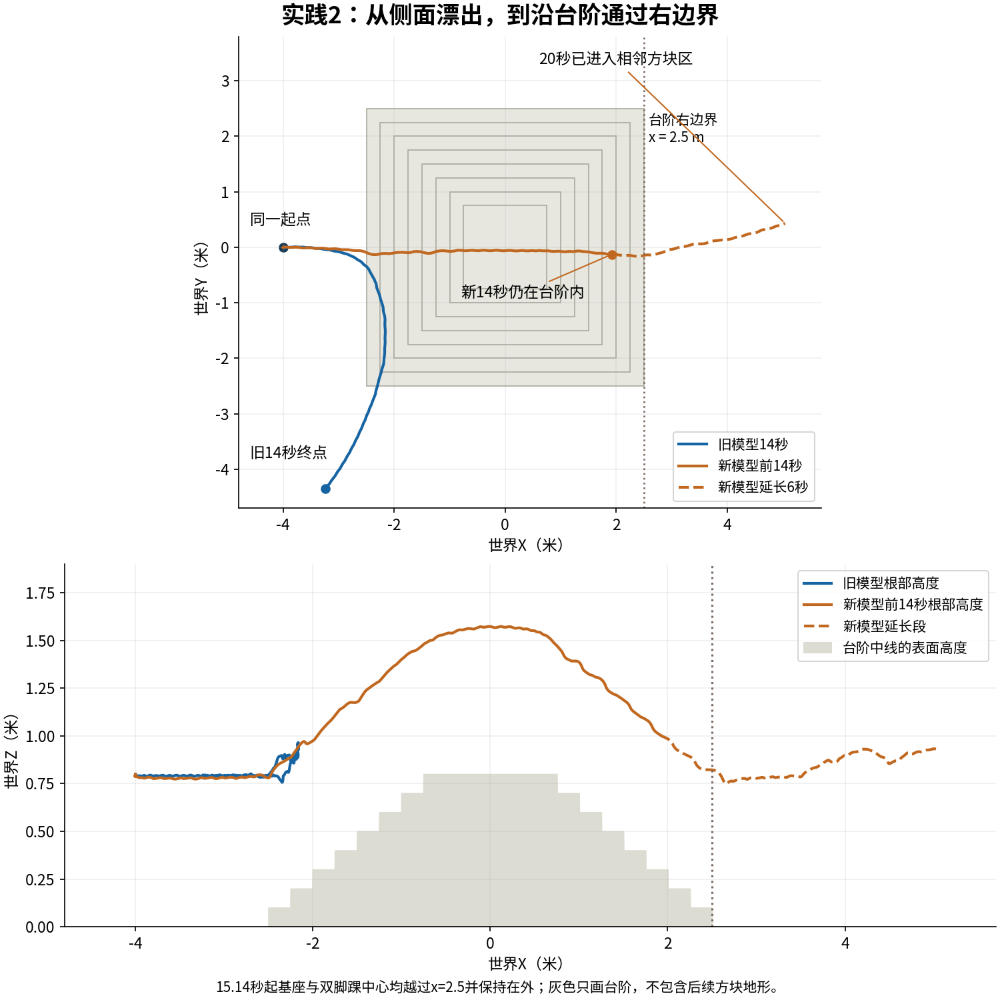

# 02 · 感知驱动的粗糙地形行走

Isaac Lab · PPO · 高度扫描 · MuJoCo

将地形扫描接入策略观测，修正相对地形高度与非有限射线处理，并完成新旧策略的跨仿真比较。

## 已实现

- 接入187维高度扫描，分别处理策略噪声与价值网络观测。
- 实现有限射线掩码、相对地形高度奖励和终止判据。
- 完成接触条件适配训练，核对坐标、历史与动作映射。

## 实验结果

新增15,000次更新；8组同初态、各14秒场景中，新策略的XY速度与转速RMSE均低于旧策略。另完成20秒台阶穿越轨迹。

**验证范围：**结果来自固定场景，存在转向欠跟踪与侧向漂移；适配同时包含额外训练，不能单独归因于某一终止项。

[查看数值结果](results.json) · [训练记录与实现文件](training/README.md)

## 视频与动画

### 台阶与方块地形行走（15k适配策略）

预览为前16秒截取，完整20.00秒见下方MP4

预览展示15k适配策略的台阶轨迹；另附旧策略与适配策略的同场景对比。

| 视频 / 动画标题 | 时长 | 内容与条件 |
|---|---:|---|
| [台阶与方块地形行走 · 跟随机位](media/p2_final_stairs_20s_follow.mp4) | 20.00秒 | 相机跟随机器人躯干，便于看清落脚与姿态；与下一行是同一段保存状态，只有相机不同 |
| [同一段状态 · 固定机位](media/p2_final_stairs_20s.mp4) | 20.00秒 | 固定世界相机，便于看清走过的距离与路径 |
| [粗糙地形行走：旧策略与适配策略对比](media/p2_old_final_comparison_28s.mp4) | 28.00秒 | 旧策略与15k适配策略：平地和台阶配对，28秒剪辑 |

全部结果图

- [p2_stair_crossing](media/p2_stair_crossing.png)

[返回项目首页](../../README.md) · [全部实践状态](../../PROJECT_STATUS.md)
