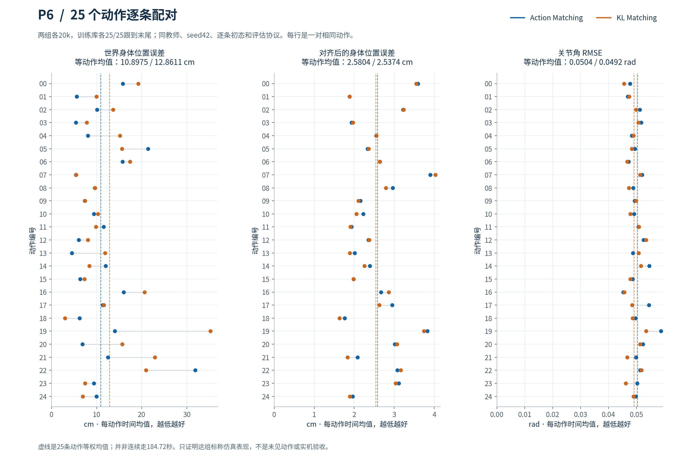

# 06 · 教师学生蒸馏与全身动作

MJLab · PPO · Action Matching · KL Matching

在全身参考动作跟踪中实现动作回归和高斯分布KL两类蒸馏，比较学生策略在相同动作库中的表现。

## 已实现

- 实现教师动作回归与对角高斯KL损失，核对梯度边界及蒸馏系数退火。
- 两种学生各完成20,000次更新，保留教师参考信息与学生观测的差别。
- 对25条训练库动作逐条复位、等权统计，并提供三段并排视频。

## 实验结果

Action和KL学生均有25/25动作到达参考末尾；对齐身体平均距离分别为2.580cm、2.537cm，世界身体平均距离为10.90cm、12.86cm。

**验证范围：**评估动作来自训练库，不是留出动作泛化；184.72秒是分别复位的总时长。两种方案的退火日程也不同，KL并非在所有指标上更优。

[查看数值结果](results.json) · [训练记录与实现文件](training/README.md)

## 视频与动画

*前6秒节选，完整视频及条件如下。*

| 内容与条件 | 时长 | 文件 |
|---|---:|---|
| Action与KL学生的三段并排比较；各20k，训练库分别复位，23秒剪辑 | 23.00s | [播放 / 下载](media/p6_action_kl_3clips_23s.mp4) |
| 动作13：Action与KL学生同协议比较 | 6.22s | [播放 / 下载](media/p6_clip13_comparison.mp4) |
| 动作19：Action与KL学生同协议比较 | 8.12s | [播放 / 下载](media/p6_clip19_comparison.mp4) |
| 动作22：Action与KL学生同协议比较，含较弱场景 | 8.66s | [播放 / 下载](media/p6_clip22_comparison.mp4) |

全部结果图

- [01_training_tracking](media/01_training_tracking.png)
- [02_training_process](media/02_training_process.png)
- [03_motion_pairs](media/03_motion_pairs.png)
- [04_clip22_weakness](media/04_clip22_weakness.png)
- [05_required_diagnostics](media/05_required_diagnostics.png)
- [06_motion_training_ema](media/06_motion_training_ema.png)
- [p6_clip13_poster](media/p6_clip13_poster.png)
- [p6_clip19_poster](media/p6_clip19_poster.png)
- [p6_clip22_poster](media/p6_clip22_poster.png)
- [viser_action_clip13_mid](media/viser_action_clip13_mid.png)
- [viser_action_clip22_mid](media/viser_action_clip22_mid.png)
- [viser_action_clip22_turn](media/viser_action_clip22_turn.png)
- [viser_kl_clip13_mid](media/viser_kl_clip13_mid.png)
- [viser_kl_clip22_mid](media/viser_kl_clip22_mid.png)
- [viser_kl_clip22_turn](media/viser_kl_clip22_turn.png)

[返回项目首页](../../README.md) · [全部实践状态](../../PROJECT_STATUS.md)
