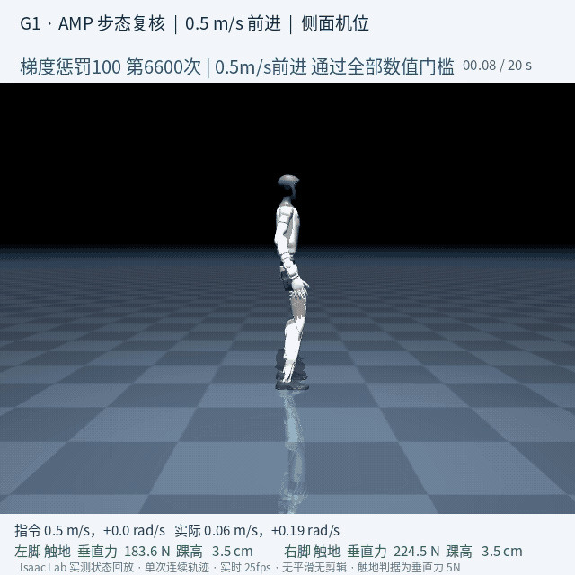
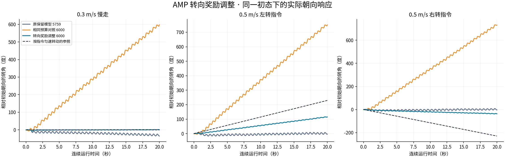

# 08 · AMP拟人运动与速度跟踪

Isaac Lab · PPO · AMP · G1 29DoF

把速度跟踪和AMP风格奖励合在一起训练，用统一的停止、前进、左右转和加减速命令挑模型。**自然步态尚未通过验证**，首页动态预览保持撤下；结果全部来自仿真。

## 已实现

- 定位并解除AMP判别器的饱和暂停：原设置下500次更新中500次判定饱和，判别器只发生4次优化步，风格奖励冻结在上限的24.8%；解除后优化步升至2000，两脚摆腿抬升的较小值由2.13cm提高到5.01cm，**拖腿与左右不协调已解决**。
- 修正镜像损失的量级失衡：该误差项约为PPO主目标的96倍，系数1.0时航向一度偏出310°；改用尺度匹配系数后对称性保留、航向恢复。
- 用十轮单因素实验定位步态问题，每轮判据在训练开始前写入冻结方案：已排除延长训练、风格与任务配比、关节速度惩罚、框架自带的接触时序奖励四条路径。
- 找到两个有效改动：**将判别器梯度惩罚由10提高到50—100，摆臂方向得到修正**（新随机种子下复现，更高剂量下保持）；**新增一项直接惩罚双支撑时长的奖励，走走停停明显改善**。

## 实验结果

0.5m/s前进场景中，`gp100_6600`通过全部数值门槛（20秒不终止、XY速度RMSE 0.171、航向-0.6°、左右摆腿时长比1.33、两脚抬升6.22/6.10cm、均速0.524m/s），并已单独排在第一位重新评估确认。

**摆臂方向已修正。** 肩关节与同侧髋关节的相位相关系数为-0.699/-0.839，即手臂与同侧腿反向摆动；此前发布的候选为+0.85，属于同手同脚。该相位在整段20秒的四个5秒窗口内保持稳定（-0.689/-0.830、-0.703/-0.842、-0.707/-0.842、-0.701/-0.841），肩关节幅度不衰减，左右腿各18次摆动、次数相同。

梯度惩罚的效果经预登记判据验证：换用新随机种子后肩关节活动范围为0.612rad（判据要求>0.60）、相位-0.880/-0.831（要求<-0.5），复现通过；提高到剂量100后为0.677rad、步频1.178Hz，仍满足判据。三次独立运行的肩幅分别为0.668、0.612、0.677，两种子散布0.056，均明显高于基线0.497。

**双支撑已改善。** 新增一项直接惩罚双支撑时长的奖励后，该占比由44.6%降至22.3%，落入人类常速行走的20%—25%区间，且每脚摆动次数由18次升至21/20次——不是靠单脚站立刷出来的，这条防套利条件在训练前就已登记为判据的一部分。未采用框架自带的接触时序奖励，因为实测该项可被"始终双脚着地"套利：启用后双支撑反而由44.3%升到49.8%。

同一改动还顺带修正了慢走的摆腿抬升，由2.50/2.70cm提高到5.49/5.17cm，首次明确达标。

**验证范围：**冻结门槛要求0.3m/s慢走与0.5m/s前进两个场景同时通过，无模型达成，因此不宣称自然步态达成。当前主要阻碍是航向与左右对称性：降低双支撑会使单脚支撑期变长，航向随之退化（二者在十个模型上的相关系数为−0.849）；提高航向跟踪权重可把航向拉回20度以内，但双支撑同时回升到31%—36%，且摆臂相位再度转正，说明三者互相耦合。最新一轮中20个场景判定有17个卡在左右摆动时长比这一项。整个周期腾空占比仍为0。

两处此前的表述需要更正。其一，此前写的"双支撑44.3%对正常人20%—25%"这一比较不成立：前者来自仿真接触力判定，后者是人类步态文献值，两者测法不同且未验证可比；用同一判据同时测量机器人与专家参考后，差距确实存在且在2—8cm各阈值下稳定（机器人高出25—37个百分点，专家有10.7%腾空而机器人为0）。其二，此前把慢走抬升不足归因为"参考动作库缺持续慢走、非调参可解"，这一归因过强：数据缺口解释了风格奖励为何教不出慢走姿态，但抬升不足并非只由该缺口决定，任务侧的接触约束同样能驱动它。

方法上还需说明：此前用于衡量摆臂的"肩关节活动范围"只测幅度不测相位，无法区分自然摆臂与同手同脚；相位指标与双支撑指标均登记为后续实验使用，不回溯套用于已完成轮次的判定。

[查看数值结果](results.json) · [训练记录与实现文件](training/README.md)

## 视频与动画

### 摆臂方向已修正的候选：侧面完整20秒

预览为前8秒截取，完整20.00秒见下方MP4

连续20秒未剪辑。可见手臂与同侧腿反向摆动、两脚交替抬起；也可见双支撑时间仍偏长，走走停停的节奏没有改善，这是本轮未解决的部分。

| 视频 / 动画标题 | 时长 | 内容与条件 |
|---|---:|---|
| [摆臂方向已修正 · 侧面](media/p8_armswing_fixed_side_20s.mp4) | 20.00秒 | gp100_6600，梯度惩罚100；相位-0.699/-0.839，通过前进场景全部数值门槛 |
| [摆臂方向已修正 · 正面](media/p8_armswing_fixed_front_20s.mp4) | 20.00秒 | 同一段评估轨迹的正面机位，用于观察左右协调 |
| [此前候选 · 正面（摆臂为同手同脚）](media/p8_gate_pass_front_20s.mp4) | 20.00秒 | 相位+0.85的对照记录，保留以显示改进前后差异 |
| [此前候选 · 侧面](media/p8_gate_pass_side_20s.mp4) | 20.00秒 | 同两个模型的侧面机位 |
| [早期6200模型回放（步态未通过）](media/amp_selected_20s.mp4) | 20.00秒 | 阶段记录：左右步态不协调、拖腿明显 |
| [转向奖励调整对照](media/yaw_reward_comparison_20s.mp4) | 20.00秒 | 0.3m/s下航向由−35.19°改善到+0.74°，前向速度由0.317降至0.186m/s |

全部结果图

- [p8_adaptation_final_comparison](media/p8_adaptation_final_comparison.png)
- [p8_command_support_pair](media/p8_command_support_pair.png)
- [p8_course_scale_first_stage](media/p8_course_scale_first_stage.png)
- [p8_expert_mixture_probe](media/p8_expert_mixture_probe.png)
- [p8_second_stage_turn_paths](media/p8_second_stage_turn_paths.png)
- [p8_step_commands_rewards](media/p8_step_commands_rewards.png)
- [p8_substeps_force_timing](media/p8_substeps_force_timing.png)
- [p8_support_diagnostic](media/p8_support_diagnostic.png)
- [yaw_reward_comparison](media/yaw_reward_comparison.png)

[返回项目首页](../../README.md) · [全部实践状态](../../PROJECT_STATUS.md)
