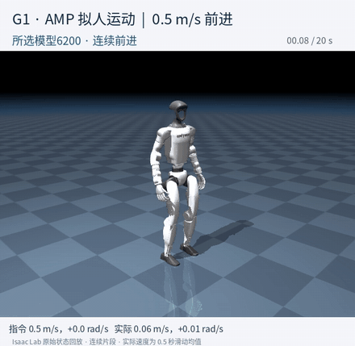

# 08 · AMP拟人运动与速度跟踪

Isaac Lab · PPO · AMP · G1 29DoF

将速度跟踪和AMP风格奖励结合，提高转向跟踪权重，并用统一的停止、前进、左右转和加减速命令选择模型。当前展示采用**yaw2_6200**，全部结果来自仿真。

## 连续回放

### AMP低速前进：0.5m/s指令的连续20秒回放

[观看完整20秒视频](media/amp_selected_20s.mp4)。6200模型，标称平地0.5m/s前进指令；20秒连续回放，实际前向均值0.435m/s，航向变化+9.26°。 动画覆盖完整20秒，MP4保留更高画质。画面中的动作来自Isaac Lab实际策略回放，根节点与关节状态使用相同G1几何渲染，并与原生双脚位置核对；没有修改动作或接入额外朝向控制器。

### 转向奖励调整：慢走对照

[观看20秒并排对照](media/yaw_reward_comparison_20s.mp4)：原保留5759与新增241次更新的6000候选。0.3m/s指令下，航向变化从−35.19°变为+0.74°，但实际前向速度从0.317降至0.186m/s，体现了速度和转向目标的取舍。

## 已完成的改进

- 保持模型恢复起点、专家库和4096环境容量一致，将角速度跟踪奖励权重从0.5提高到2.0；保留AMP任务混合权重0.5与风格尺度5。
- 完成241次同预算比较和500次候选续训，统一检查14个新旧模型；所有候选及未改善结果保留在[完整结果](results.json)中。
- 按本轮预先设定的速度与航向阈值，标称初态下通过3/9项：停止、慢走 0.3、前进 0.5。这些是本项目的筛选阈值。
- 另有7/9个场景持续20秒未触发物理终止；改变初始朝向后，此项记录为14/18。未摔倒的数量不等于命令跟踪通过数量。

## 当前模型的9场景结果

| 命令场景（m/s或rad/s） | 运行秒数 | 实际前向速度 m/s | XY速度RMSE m/s | 航向变化 ° | 运行结果 |
|---|---:|---:|---:|---:|---|
| 停止 | 20.00 | 0.000 | 0.002 | -1.2 | 20秒内无物理终止 |
| 慢走 0.3 | 20.00 | 0.266 | 0.098 | -9.8 | 20秒内无物理终止 |
| 前进 0.5 | 20.00 | 0.435 | 0.123 | +9.3 | 20秒内无物理终止 |
| 前进 1.0 | 20.00 | 0.858 | 0.188 | -47.3 | 20秒内无物理终止 |
| 高速指令 2.0 | 20.00 | 2.496 | 0.591 | +24.3 | 20秒内无物理终止 |
| 高速指令 2.5 | 3.00 | 2.681 | 0.472 | +48.3 | 姿态终止 |
| 左转 +0.2 | 20.00 | 0.416 | 0.143 | +106.7 | 20秒内无物理终止 |
| 右转 −0.2 | 20.00 | 0.453 | 0.105 | -79.5 | 20秒内无物理终止 |
| 加速—减速 | 10.56 | 1.047 | 0.487 | +32.8 | 姿态终止 |

条件：平地、标称质量与摩擦、固定初态；关闭观测噪声、外部推力和专家参考复位；保留原高度与倾角终止条件。速度统计排除前2秒，首次终止后不继续累计成功时长。左右转命令同时保持前向0.5m/s；加减速依次为0.3、1.0、2.5、0.5、0m/s，各持续4秒。

**能力范围：** 当前可用于展示低速行走；左右转方向已有响应，但转向幅度不足。2.5m/s恒速在3.00秒、加减速序列在10.56秒触发终止，高速与走跑切换尚未可靠。 连续未摔倒不能替代速度跟踪、正确转向或自然跑步的验证。完整走跑验收和有无AMP的动作自然性对照仍未完成。

[训练配置与全部指标](training/README.md) · [完整结果](results.json) · [返回首页](../../README.md)
