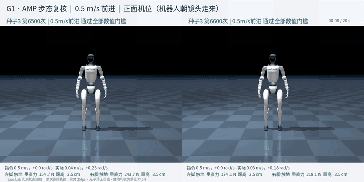

# 08 · AMP拟人运动与速度跟踪

Isaac Lab · PPO · AMP · G1 29DoF

把速度跟踪和AMP风格奖励合在一起训练，用统一的停止、前进、左右转和加减速命令挑模型。**自然步态尚未通过验证**，首页动态预览保持撤下；结果全部来自仿真。

## 已实现

- 定位并解除AMP判别器的饱和暂停：原设置下500次更新中500次判定饱和，判别器只发生4次优化步，风格奖励冻结在上限的24.8%；解除后优化步升至2000，两脚摆腿抬升的较小值由2.13cm提高到5.01cm，**拖腿与左右不协调已解决**。
- 修正镜像损失的量级失衡：该误差项约为PPO主目标的96倍，系数1.0时航向一度偏出310°；改用尺度匹配系数后对称性保留、航向恢复。
- 完成风格权重扫描与随机种子复现共5支训练、22个模型的9场景统一评估与独立复算，并建立正面／侧面人工复核流程。

## 实验结果

0.5m/s前进场景已有3个模型通过全部数值门槛（20秒不终止、XY速度RMSE≤0.2、航向≤20°、左右摆腿时长比0.7—1.43、两脚抬升≥2.5cm），最佳单步抬升达8.2cm。

**验证范围：**人工复核判定不批准，仍不作为自然步态成果。两处原因：一是摆臂不正确，肩关节活动范围虽由专家的9%—16%提高到32%—41%，但与同侧髋关节的相位相关系数为+0.85，即同手同脚；二是0.3m/s慢走未通过，参考动作库中0.2—0.45m/s的最长连续片段只有0.40秒，属数据缺口，非调参可解。另有一个模型摆臂相位正确（−0.82／−0.68）但航向项未通过，因此没有模型同时满足数值门槛与自然摆臂。方法上也发现此前使用的"肩关节活动范围"只测幅度不测相位，无法区分自然摆臂与同手同脚。

[查看数值结果](results.json) · [训练记录与实现文件](training/README.md)

## 视频与动画

### 通过0.5m/s数值门槛的候选：正面与侧面完整20秒

两个模型并排，连续20秒未剪辑。可见拖腿已消除、两脚交替抬起，也可见手臂全程前伸不摆，这正是复核未通过的原因。

| 视频 / 动画标题 | 时长 | 内容与条件 |
|---|---:|---|
| [通过数值门槛的候选 · 正面](media/p8_gate_pass_front_20s.mp4) | 20.00秒 | 两个通过0.5m/s全部数值门槛的模型；正面机位，可观察摆臂与左右协调 |
| [通过数值门槛的候选 · 侧面](media/p8_gate_pass_side_20s.mp4) | 20.00秒 | 同两个模型的侧面机位；同一段评估轨迹，仅相机不同 |
| [早期6200模型回放（步态未通过）](media/amp_selected_20s.mp4) | 20.00秒 | 保留的阶段记录：左右步态不协调、拖腿明显 |
| [转向奖励调整对照](media/yaw_reward_comparison_20s.mp4) | 20.00秒 | 0.3m/s下航向由−35.19°改善到+0.74°，前向速度由0.317降至0.186m/s |

全部结果图

- [p8_adaptation_final_comparison](media/p8_adaptation_final_comparison.png)
- [p8_command_support_pair](media/p8_command_support_pair.png)
- [p8_course_scale_first_stage](media/p8_course_scale_first_stage.png)
- [p8_expert_mixture_probe](media/p8_expert_mixture_probe.png)
- [p8_second_stage_turn_paths](media/p8_second_stage_turn_paths.png)
- [p8_step_commands_rewards](media/p8_step_commands_rewards.png)
- [p8_substeps_force_timing](media/p8_substeps_force_timing.png)
- [p8_support_diagnostic](media/p8_support_diagnostic.png)
- [yaw_reward_comparison](media/yaw_reward_comparison.png)

[返回项目首页](../../README.md) · [全部实践状态](../../PROJECT_STATUS.md)
