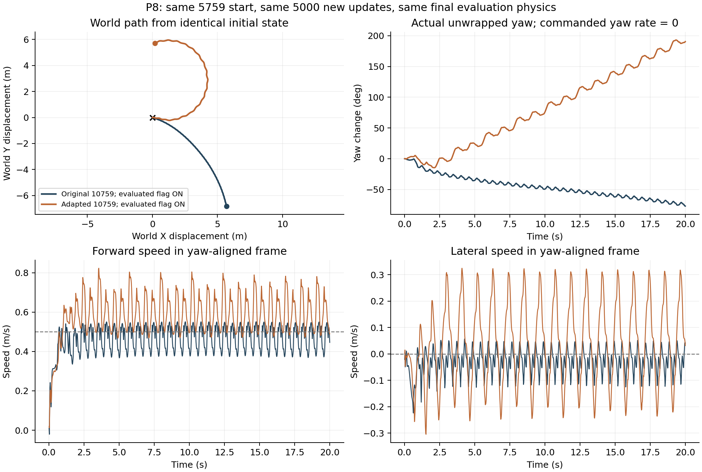

# 08 · AMP拟人运动与风格奖励

Isaac Lab · PPO · AMP

将任务奖励与判别器风格奖励结合，检查参考初始化、时序观测和物理执行对运动质量的影响。

## 已实现

- 核对运动库、参考初始化、关节与根节点速度接口。
- 完成4096环境的两段各5,000次更新，以及共享同一首段的独立适配分支。
- 以相同初态、速度指令和评估物理比较模型，保留未改善的结果。

## 实验结果

阶段模型在单初态20秒前进指令回放中保持站立，但有明显航向漂移。同预算适配对照的XY速度RMSE为0.09707与0.21461m/s，新增适配没有改善整体跟随。

**验证范围：**保留5759阶段模型；尚未实现稳定直行、可靠左右转向和完整变速走跑。每条分支各累计10,000次大规模更新，不能将共享首段重复计数。

[查看数值结果](results.json) · [训练记录与实现文件](training/README.md)

## 视频与动画

### AMP拟人运动策略回放（早期模型）

录像来自早期AMP模型；当前保留5759阶段模型，最新结果仍有航向漂移。

| 视频 / 动画标题 | 时长 | 内容与条件 |
|---|---:|---|
| [AMP拟人运动策略回放（早期模型）](media/early_amp_play.mp4) | 29.98秒 | 早期AMP模型播放；不是当前5759阶段模型，不用于证明稳定走跑 |

全部结果图

- [b1_starter_feasibility](media/b1_starter_feasibility.png)
- [c4_command_intersection](media/c4_command_intersection.png)
- [p8_adaptation_final_comparison](media/p8_adaptation_final_comparison.png)
- [p8_command_support_pair](media/p8_command_support_pair.png)
- [p8_course_scale_first_stage](media/p8_course_scale_first_stage.png)
- [p8_expert_mixture_probe](media/p8_expert_mixture_probe.png)
- [p8_second_stage_turn_paths](media/p8_second_stage_turn_paths.png)
- [p8_step_commands_rewards](media/p8_step_commands_rewards.png)
- [p8_substeps_force_timing](media/p8_substeps_force_timing.png)
- [p8_support_diagnostic](media/p8_support_diagnostic.png)
- [reset_clamp_geometry](media/reset_clamp_geometry.png)

[返回项目首页](../../README.md) · [全部实践状态](../../PROJECT_STATUS.md)
