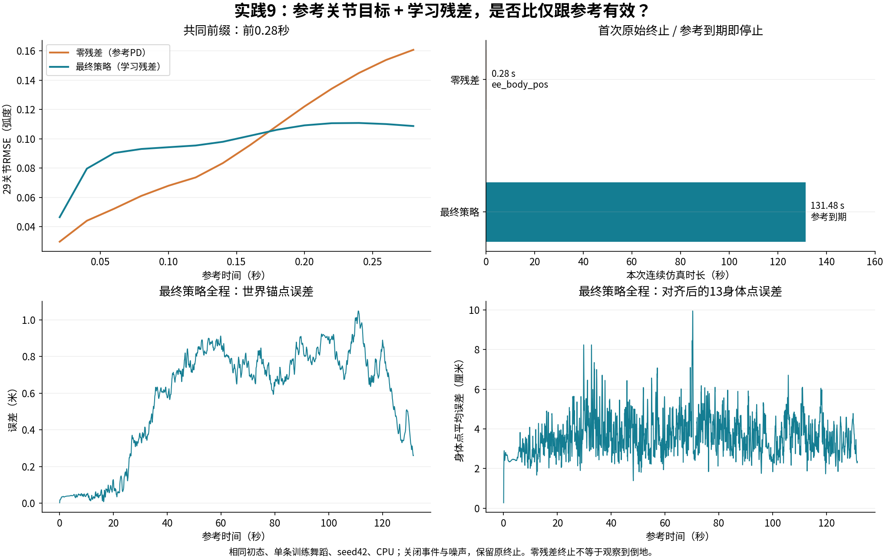

# 09 · 自适应采样与全身轨迹跟踪

BeyondMimic方法 · MJLab · PPO

实现失败统计驱动的参考采样、相位推进和参考坐标对齐，训练G1跟随长时间全身参考动作。

## 已实现

- 实现失败采样与参考相位更新，并在MJLab跟踪环境中完成对应接入。
- 采用参考关节角加策略残差的动作接口，区分局部动作误差和世界轨迹误差。
- 完成约30,000次训练及零残差PD/学习残差的同初态对照。

## 实验结果

标称CPU协议下学习残差连续跟完131.48秒单舞蹈，对齐身体平均距离3.633cm、世界锚点平均距离0.581m；零残差参考PD在0.28秒触发末端条件。

**验证范围：**仍有世界漂移，未验证未见动作或外部扰动泛化。完整展示视频来自另一套带事件的播放条件，不能把其画面直接当作标称CPU指标；视频条件在媒体清单中单列。

[查看数值结果](results.json) · [训练记录与实现文件](training/README.md)

## 视频与动画

### 全身舞蹈轨迹跟踪：131.48秒完整回放

完整录像长131.48秒；失败条件旁路监测，与标称CPU误差统计所用条件分列。

| 视频 / 动画标题 | 时长 | 内容与条件 |
|---|---:|---|
| [全身舞蹈轨迹跟踪：131.48秒完整回放](media/motion_tracking_30k_full.mp4) | 131.48秒 | model29999完整单舞蹈播放；保留事件、失败条件旁路监测，与标称CPU误差统计分开 |

全部结果图

- [p9_residual_comparison](media/p9_residual_comparison.png)

[返回项目首页](../../README.md) · [全部实践状态](../../PROJECT_STATUS.md)
