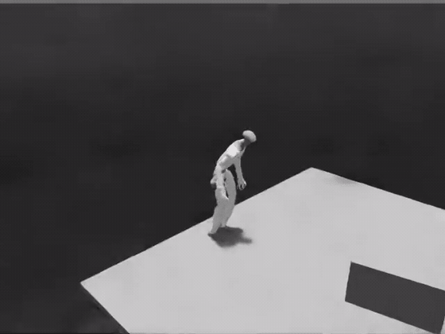

# 10 · 地形感知的人物交互动作跟踪

Isaac Lab · PPO · 高度扫描

在带平台场景中跟踪全身参考动作，比较世界锚点奖励尺度，并核对完整路径和指定初态变化。

## 已实现

- 完成std0.3/std0.6两支各500次新增更新与10份模型回放，对世界锚点、高度、关节和朝向分别统计。
- 完成6.18秒全长路径视频及世界X初态±5cm的两组复核。
- **完成扩容训练：1536并行环境×2000次更新，约7373万条环境转换，是此前训练量的60倍。** 评估存档在训练开始前按等间隔登记，避免按结果挑选。

## 实验结果

扩容训练显著降低跟踪误差。五个预先登记的存档在原Play协议下逐个评估，全部跑完309帧参考、无提前终止：

| 存档 | 世界锚点RMSE | 朝向RMSE | 关节RMSE |
|---|---:|---:|---:|
| 此前所选 model399（128环境） | 0.1297 m | 0.2202 rad | 1.0427 rad |
| model_400 | 0.1328 m | 0.2202 rad | 1.0427 rad |
| model_900 | 0.1167 m | 0.1267 rad | 0.7864 rad |
| model_1400 | 0.0616 m | 0.1102 rad | 0.6220 rad |
| model_1900 | 0.0649 m | 0.0906 rad | 0.5713 rad |
| **model_2399** | **0.0501 m** | **0.0825 rad** | **0.5375 rad** |

世界锚点RMSE由0.1297m降至0.0501m，降幅61%，低于事先写死的0.10m判据边界；三项误差随训练量同步下降，不是单一指标的偶然。**这确认了训练预算是此前的主要约束**——该结论此前只是推测。

**验证范围：**环境数为1536而非参考配置的4096。4096在本机23.54 GiB显存上无法运行：该次尝试完成了环境创建与策略权重恢复，随后在仅剩328 MiB时申请294 MiB失败。这是硬件上限，不是设计选择。本轮训练量为参考配置的1.5%，仍不能称达到参考配置。所选模型**仍无独立留出验证**：五个评估点虽在训练前登记、避免了按结果挑模型，但评估使用的仍是同一段参考动作，不构成泛化验证。足底与对象接触、无穿透和更广的攀爬能力尚未完整检查；评估结果本身标注行为验收为待复核，数值通过不等于行为通过。

[查看数值结果](results.json) · [训练记录与实现文件](training/README.md)

## 视频与动画

### 扩容训练后的平台路径（model_2399）

1536环境×2000次更新后的模型，世界锚点RMSE 0.0501m，跑完309帧参考、无提前终止。

| 视频 | 时长 | 内容与条件 |
|---|---:|---|
| [扩容训练后的平台路径 · model_2399](media/p10_scaleup_model2399_full.mp4) | 6.18秒 | 锚点RMSE 0.0501m、朝向RMSE 0.0825rad，原Play协议不变 |

扩容前的阶段记录（保留以便核对改进幅度）

| 视频 | 时长 | 内容与条件 |
|---|---:|---|
| [扩容前所选model399](media/p10_std03_model399_full.mp4) | 6.18秒 | 128环境、累计400次更新；锚点RMSE 0.1297m |
| [平台边缘路径（对照model299）](media/p10_model299_edge_path.mp4) | 6.18秒 | 更早期的对照，沿平台边缘通过 |

全部结果图

- [p10_common_errors](media/p10_common_errors.png)
- [p10_model299_first_frame](media/p10_model299_first_frame.png)
- [p10_model399_initial_x_conditions](media/p10_model399_initial_x_conditions.png)
- [p10_model399_world_path](media/p10_model399_world_path.png)
- [p10_reward_width_all_ten](media/p10_reward_width_all_ten.png)
- [p10_six_checkpoints](media/p10_six_checkpoints.png)
- [p10_std03_model399_platform](media/p10_std03_model399_platform.png)

[返回项目首页](../../README.md) · [全部实践状态](../../PROJECT_STATUS.md)
