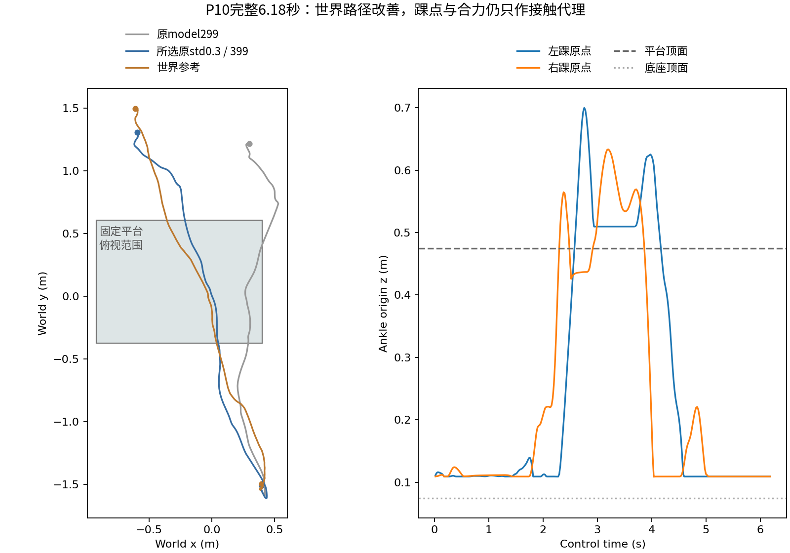

# 10 · 地形感知的人物交互动作跟踪

Isaac Lab · PPO · 高度扫描

在带平台场景中跟踪全身参考动作，比较世界锚点奖励尺度，并核对完整路径和指定初态变化。

## 已实现

- 完成std0.3/std0.6两支各500次新增更新与10份模型回放。
- 对世界锚点、高度、关节和朝向分别统计，选择原std0.3/model399用于展示。
- 完成6.18秒全长路径视频及世界X初态±5cm的两组复核。

## 实验结果

所选model399走完309控制帧、6.18秒参考；世界锚点RMSE为0.1297m。两个指定初态平移也到达参考末尾。

**验证范围：**模型是从已有候选中选择，未做独立留出评估；足底接触对象、无穿透和广泛攀爬能力尚未完整验证。加宽奖励尺度并非全面更优。训练预算也需说明：所选model399在当前控制频率基准下只累计400次更新、128并行环境，约123万条环境转换；原始材料给出的参考配置是4096环境×50000次迭代（约49.2亿条转换，材料明确允许按算力下调）。更早的2048环境、8999次更新属于修正控制频率之前的时间基准，只作为历史来源，不计入当前基准的训练量。

[查看数值结果](results.json) · [训练记录与实现文件](training/README.md)

## 视频与动画

### 平台路径完整回放（所选model399）

预览来自所选model399的6.18秒平台路径；另附model299对照录像。

| 视频 / 动画标题 | 时长 | 内容与条件 |
|---|---:|---|
| [平台路径完整回放（所选model399）](media/p10_std03_model399_full.mp4) | 6.18秒 | 所选std0.3/model399：309控制帧、6.18秒完整平台路径 |
| [平台边缘路径回放（对照model299）](media/p10_model299_edge_path.mp4) | 6.18秒 | 对照model299的早期平台边缘路径；不是所选model399 |

全部结果图

- [p10_common_errors](media/p10_common_errors.png)
- [p10_model299_first_frame](media/p10_model299_first_frame.png)
- [p10_model399_initial_x_conditions](media/p10_model399_initial_x_conditions.png)
- [p10_model399_world_path](media/p10_model399_world_path.png)
- [p10_reward_width_all_ten](media/p10_reward_width_all_ten.png)
- [p10_six_checkpoints](media/p10_six_checkpoints.png)
- [p10_std03_model399_platform](media/p10_std03_model399_platform.png)

[返回项目首页](../../README.md) · [全部实践状态](../../PROJECT_STATUS.md)
