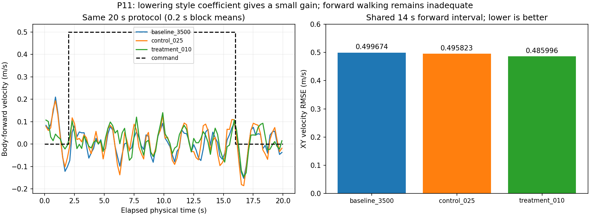

# 11 · 深度感知运动与策略导出

Project Instinct · 深度历史 · PPO/风格奖励

接入深度历史和运动风格训练，核对策略导出、观测编码与执行链路，并比较继续训练的实际收益。

## 已实现

- 核对深度帧历史、特征编码、策略输入与ONNX导出一致性。
- 完成风格系数配对和后续训练，比较5000与7500模型。
- 逐项统计身体速度、世界位移、终止和奖励组成。

## 实验结果

保留5000模型；20秒协议中前进统计段均速0.2572m/s、XY速度RMSE0.2604m/s。7500模型速度波动变大，XY误差约增加40.3%。

**验证范围：**尚未达到完整跑酷和跨障碍可靠性。现有视频是早期3000模型的部署展示，不代表5000模型或最终跑酷能力。跨仿真部分只核对到ONNX导出与观测编码的一致性，MuJoCo跨仿真运行本身尚未开始，因此本页不声称已完成跨仿真部署。训练预算不是这里的短板：保留模型为4096环境×24步×5000次更新，约4.92亿条环境转换，并且做过7500次续训对照后据实拒绝。

[查看数值结果](results.json) · [训练记录与实现文件](training/README.md)

## 视频与动画

### 深度感知策略部署回放（早期model3000）

预览为前8秒截取，完整19.98秒见下方MP4

录像展示早期model3000的部署；当前保留5000模型，完整跑酷效果仍待完善。

| 视频 / 动画标题 | 时长 | 内容与条件 |
|---|---:|---|
| [深度感知策略部署回放（早期model3000）](media/early_depth_policy_3000.mp4) | 19.98秒 | 早期model3000深度策略部署录像；不是当前保留的5000模型 |

全部结果图

- [p11_3500_comparison](media/p11_3500_comparison.png)
- [p11_boundary_diagnostic](media/p11_boundary_diagnostic.png)
- [p11_camera_pair](media/p11_camera_pair.png)
- [p11_native_command_pair](media/p11_native_command_pair.png)
- [p11_native_diagnostic](media/p11_native_diagnostic.png)
- [p11_reward_components](media/p11_reward_components.png)
- [p11_sampling_reward](media/p11_sampling_reward.png)
- [p11_style_pair](media/p11_style_pair.png)

[返回项目首页](../../README.md) · [全部实践状态](../../PROJECT_STATUS.md)
