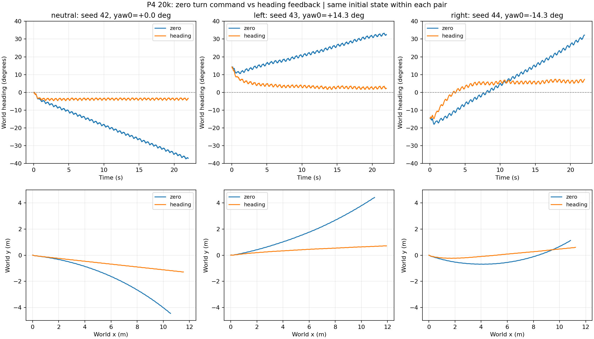

# 已测结果：保留改善与退化

## 实践4：3k与20k同协议比较

2026-09-10，MuJoCo Warp的CPU后端，单环境、seed42；从t=0固定高度0.5m、机体前向速度0.5m/s、侧向与转向命令0。关闭自动重置，初始x/y/yaw偏移为0，保留该play配置的启动随机化。每次22秒，统计后20秒，各1100条原始采样。

| 指标 | 旧3k | 续训20k |
|---|---:|---:|
| 高度MAE | 0.825cm | 0.612cm |
| 机体前向速度均值 | 0.5256m/s | 0.5357m/s |
| 前向速度MAE | 0.0321m/s | 0.0396m/s |
| 世界y净位移（全22秒） | 3.113m | -4.457m |
| 环境终止 | 未触发 | 未触发 |

20k模型的高度更准，速度误差略增，世界横向漂移绝对值更大。这说明“训练更久”与“所有性能都更好”不能画等号。图中前2秒为进入目标的过程；误差表不含这段，但总位移包含全22秒。

完成预算和这一场景的蹲走证据已取得；已补方向诊断与固定指令视频，方向纠偏和多条件回放仍待完成。未触发终止不代表所有任务误差都很小，单种子也不是成功率统计。

两次使用同一评估脚本，文件哈希为`703d25351a271c632c0eb4f379e7181e58712ce0abbdc20c3e5043ab31f84571`；本轮从2200条采样独立重算均值/误差并核对时间轴，结果与汇总一致。原始运行日志、配置和权重保留本地；本展示只发布自写结论与派生图表。

### 方向漂移的进一步测量

同日新增四元数、世界/机体线速度与角速度记录。新旧模型各1100条原有采样逐项完全复现，训练源码与模型未变；这是同一协议的诊断重复，不是新增独立种子。

| 新增指标 | 旧3k | 20k |
|---|---:|---:|
| 22秒最终朝向（初始0°） | +32.871° | −37.096° |
| 后20秒朝向变化 | +31.564° | −31.497° |
| 后20秒机体转向角速度MAE | 0.10063rad/s | 0.13668rad/s |
| 后20秒机体侧向速度MAE | 0.02548m/s | 0.04855m/s |

本协议关闭世界朝向反馈，指令含义是“朝自身前方走，并让转向角速度接近零”。20k后20秒世界y位移−4.32922m，分解得到：偏转后的前向运动贡献−3.90618m（约90.2%），机体侧向运动贡献−0.41169m，竖向贡献−0.02028m；50Hz离散积分残差约0.00893m。该窗口与前表的全22秒位移不同。

相同骨盆刚体的完整三维坐标转换复算误差小于1e−7，未发现这一观测边界的坐标混用。实际角速度仍偏离零命令，属于性能缺口；不能以“没有世界朝向锁定”为由将其忽略。后20秒新旧朝向变化幅值相近，20k最初2秒已产生更大的偏转；尚不能由这个单场景推断一般性变化趋势。

已将实际记录的状态制作成22秒、550帧、25fps的CPU渲染视频，文件解码及姿态对应检查通过，视频保留本地。随后完成了下述三组固定朝向反馈对照；原零转向命令基线完整保留，未更改奖励。

### 固定朝向反馈：三组配对CPU对照

同一20k权重和原奖励，新增评估模式调用已有heading反馈，增益0.5/s、限幅±0.7rad/s，目标朝向0rad。每对使用相同seed、初始角度与随机化；重置后才启用反馈，从第一步结束后的命令更新生效，避免额外采样改变初态。保持vx=0.5m/s、vy=0、高度0.5m，每段22秒。

| 条件 | 最终朝向：zero → heading | 世界y净位移：zero → heading | 高度MAE：zero → heading |
|---|---:|---:|---:|
| 朝向0°，seed42 | -37.10° → -3.32° | -4.457m → -1.284m | 0.612cm → 0.644cm |
| 初始偏左14.3°，seed43 | +32.60° → +2.27° | +4.420m → +0.712m | 1.346cm → 1.346cm |
| 初始偏右14.3°，seed44 | +32.22° → +7.34° | +1.128m → +0.600m | 1.477cm → 1.503cm |

表中朝向/净位移取22秒末，高度MAE取后20秒；正负号表示偏转或位移方向。每对13项初态指纹完全相同，配置值相同；每步验证实际纠偏命令进入策略。原neutral-zero的1100条记录完全复现。六段均未触发环境终止，这三个诊断条件不换算为成功率。

三个条件的朝向与横向净位移都有改善，但还有2.3—7.3°最终偏差和0.60—1.28m净横移。角速度跟踪MAE没有全面改善，偏右条件的高度和前向速度误差略增。heading反馈只修正角度，不包含横向位置闭环，不能据此宣称精确直线循迹或原零角速度任务已修好。

本轮决定是保留20k模型和两种明确协议，暂不追加P4长训；定向展示可使用已验证的heading评估模式，其他部署入口尚未改造。继续核对多高度/速度和完整作业报告。22秒CPU渲染视频已验证并保留本地。

## 实践3：预训练站起部署

课程23关节HoST模型在默认初态下完成60秒回放，包含站起和持续站立。个人实现重点是状态读取、76×6维历史、增量动作映射与PD执行接口。该结果不表示自行训练了HoST，也不覆盖任意跌倒姿态或真机。

## 实践9：相对动作与世界轨迹分开评价

最终模型完整回放6574帧、50Hz参考，按帧数口径为131.48秒。已有同条件对照中，相对身体位置均误差约3.798cm，全局锚点位置均误差约1.048m。相对目标对齐了水平位置和yaw，因此“动作像”和“世界位置漂移”可以同时成立。

保留全局漂移作为效果边界，不能把相对身体误差改写成世界轨迹精度。提交函数与实际训练后端的完整对应仍需整理；预算充足后优先完成这一证据和作业交付，不为轮数单独重复训练。
