# 人形机器人运控强化学习 · 算法原理零基础完全讲解

> **本文档定位**：与 `01_实践1_零基础版.md`（讲怎么操作）配套，本文讲**为什么**。
>
> **面向**：经典控制基础扎实（PD / 串级 LADRC / Slotine-Li 自适应 / RBF-NN / Lyapunov）、强化学习零基础的读者。
>
> **写法约定**：
> - 每一个数学公式，**前面必有一段大白话说明它要解决什么问题**，后面必有一句「读作」把符号翻译成中文。
> - 凡是能和经典控制对上的地方，全部标 **★ 对照**。
> - **不做任何证明**（策略梯度定理、GAE 推导、收敛性证明一律只陈述结论）。
> - 涉及数字的地方标注来源等级：〔源码核实〕= 从代码读到；〔同模型自洽算得〕= 由配置推算；〔尚未真机验证〕。
> - 机器人平台统一用开源的 **Unitree G1 (29 DOF)**。

---

## 怎么用这份文档

**全文第 0–27 章（共 28 章），分成四段。不要从头硬啃，按你的目的选路线。**

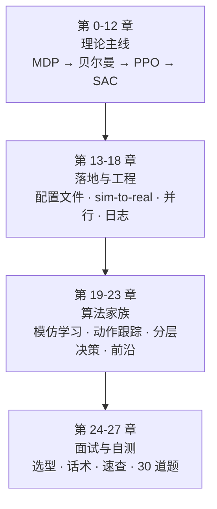

| 你的目的 | 推荐路线 |
|---|---|
| **系统学一遍** | 从第 0 章顺读到第 23 章，**第 8.5 节务必动笔手算** |
| **只想应付面试** | 第 22 章（主线）→ 第 25 章（话术）→ 第 26 章（速查）→ 回头补第 11、13、16 章 |
| ★ **投 JD①（决策规划 RL）** | **第 16 章（sim-to-real）+ 第 21 章（分层决策）+ 25.9/25.10/25.14 三段话术** |
| ★ **要讲空中机械臂项目** | **第 15 章（多智能体 / CTDE）+ 第 14 章（非对称 actor-critic）**，两章连着读 |
| **对着代码读** | 附录 B 有全部源码行号索引 |

> 📖 **遇到不认识的词，别停下来纠结 —— 翻 [附录 A · 术语词典](#附录-a--术语词典看不懂就翻这里)。**
> 那里收了全文 **约 150 个技术名词**（A.1–A.9 共 10 张表），每个只有一句大白话，外加它在 G1 上具体指什么。
> **建议第一次读之前先把 A.1 那十个扫一遍**，那十个不懂，后面全读不动。

> ⚠️ **一个提醒**：全文有 **30 道检验题**（第 27 章）+ **6 道本章题**（15.11 节）。**一道都不答，等于没学。**

---

## 目录

### 第一段 · 理论主线（第 1–12 章）

| 章 | 内容 | 你会得到什么 |
|---|---|---|
| 0 | 符号表 | 看懂后面所有公式的钥匙 |
| 1 | 强化学习在解决什么问题 | 和监督学习、经典控制的三方定位 |
| 2 | MDP：把问题写下来 | 五个格子 + 在 G1 配置文件里的位置 |
| 3 | 回报与折扣 | 折扣因子到底是什么旋钮 |
| 4 | 价值：V、Q、优势 | 强化学习的三个核心量 |
| 5 | 贝尔曼期望方程 | **★ 它就是 Lyapunov 方程** |
| 6 | 策略评估：蒙特卡洛 / TD / GAE | `lam=0.95` 在调什么 |
| 7 | 贝尔曼最优方程 | **★ 它就是 Riccati / HJB** |
| 8 | 最优策略、策略迭代、值迭代 | 含完整手算例子 |
| 9 | 三道门槛 → 现代 RL｜**含 Q-learning / DQN** | 为什么腿足只能用策略梯度 |
| 10 | 策略梯度与 actor-critic | 绕开 argmax 的办法 |
| 11 | **PPO** | **★ clip 就是投影算子** |
| 12 | DDPG → TD3 → **SAC** | 样本贵的时候用什么 |

### 第二段 · 落地与工程（第 13–18 章）

| 章 | 内容 | 本地有代码 |
|---|---|---|
| 13 | **落到 G1①：速度跟踪任务五个格子逐个讲** | ✅ `tasks/locomotion` |
| 14 | 非对称 actor-critic｜**含蒸馏 teacher-student** | ✅ `distillation.py` |
| 15 | ★★ **多智能体 RL：非平稳 / CTDE / MAPPO / 内力惩罚** | 🎓 **你的毕设**（双机搬运） |
| 16 | ★ **sim-to-real：域随机化 / 观测噪声 / 延迟** | ✅ `LowLevelEventCfg` |
| 17 | 为什么 4096 个并行环境 | 方差、样本量、瓶颈 |
| 18 | 训练日志怎么读 | 每个数落在链路哪一环 |

### 第三段 · 算法家族（第 19–23 章）

| 章 | 内容 | 本地有代码 | JD① 相关度 |
|---|---|---|---|
| 19 | 模仿学习：BC / DAgger / GAIL / **AMP** / **DeepMimic** | ❌ | 高 |
| 20 | **落到 G1②：`tasks/mimic` 动作跟踪逐行拆解** | ✅ **有** | 高 |
| 21 | ★★ **分层 RL 与决策规划（导航避障）** | ✅ **有（作业版）** | ★★★ **极高** |
| 22 | ★★ **一条主线：知识到底放在哪里** | — | ★★★ **开放题必用** |
| 23 | BeyondMimic 与 BFM | ❌ | 中（JD② 点名） |

### 第四段 · 面试与自测（第 24–27 章）

| 章 | 内容 |
|---|---|
| 24 | 算法选型地图 + JD 准备清单 |
| 25 | **面试话术合集（14 段，含 JD① 专用自我定位）** |
| 26 | 公式速查表 |
| 27 | **检验题 30 道**（另有 15.11 节 6 道多智能体专题题） |
| 附录 A | 术语对照表（大白话 ↔ 正式术语 ↔ 代码） |
| 附录 B | 代码位置索引（每个公式在哪一行） |

---

## ★ 三条最值得记住的线索

**如果这份文档你只记住三件事，应该是这三件：**

| # | 线索 | 在哪 |
|---|---|---|
| ① | **贝尔曼期望方程 = Lyapunov 方程；贝尔曼最优方程 = Riccati** | 第 5、7 章 |
| ② | **换任务 = 换观测 + 换奖励 + 换终止条件，算法不换**（三个任务验证了三次） | 第 13、20、21 章 |
| ③ | ★★★ **奖励项 19 → 11 → 6：先验的载体在从"人手写"迁移到"数据和模型"** | **第 22 章** |

---

# 第 0 章 · 符号表

**先背这张表。**后面每个公式都只用这些符号，不会再出现新的。

| 符号 | 念作 | 含义 | 本文大白话叫法 |
|---|---|---|---|
| $s$ | s | 状态：当前局面 | 局面 |
| $a$ | a | 动作：这一步做什么 | 这一手 |
| $r$ | r | 奖励：这一步立刻得的分 | 这一步的分 |
| $\pi(a \mid s)$ | pai | 策略：在局面 $s$ 下选动作 $a$ 的概率 | 打法 |
| $P(s' \mid s,a)$ | P | 转移概率：在 $s$ 做 $a$ 后到达 $s'$ 的概率 | 世界的规律 |
| $\gamma$ | gamma | 折扣因子，$0<\gamma<1$，G1 里 $=0.99$ | 打折率 |
| $G_t$ | G | 回报：从第 $t$ 步起的打折总分 | 一局的总分 |
| $V^\pi(s)$ | V | 状态值函数 | **局面分** |
| $Q^\pi(s,a)$ | Q | 动作值函数 | **这一手的分** |
| $A^\pi(s,a)$ | A | 优势函数 | **这一手好多少** |
| $\delta_t$ | delta | 时序差分误差 | 惊喜程度 |
| $\mathbb{E}[\cdot]$ | 期望 | **就是「取平均」** | 平均 |
| $\sum$ | 求和 | 把所有项加起来 | 加起来 |
| 上标 $\pi$ | | 「在策略 $\pi$ 之下的」 | 挂在这套打法上 |
| 上标 $*$ | 星 | 「最优的」 | 天花板 |
| $\theta$ | theta | 神经网络的全部权重 | 网络参数 |
| $\nabla_\theta$ | nabla | 对权重求梯度 | 往哪调权重能变好 |

**三个最容易卡住的符号，单独说明：**

1. **$\mathbb{E}[\cdot]$ 唯一的含义就是「平均」。** 看到它心里读成「平均一下」，从不会错。
2. **竖线 $\mid$ 读作「在……条件下」。** $\pi(a \mid s)$ = 「在局面 $s$ 这个条件下选 $a$ 的概率」。
3. **上标 $\pi$ 不是乘方。** $V^\pi$ 读作「策略 $\pi$ 的 V」，它在提醒你：**价值永远是挂在某一套打法上的，没有脱离打法的价值。**

---

---

# 第 1 章 · 强化学习在解决什么问题

## 1.1 三方对比

| | 监督学习 | 经典控制 | 强化学习 |
|---|---|---|---|
| 你手里有什么 | 一堆「输入 → 正确答案」 | 一个**模型**（微分方程） | 一个**打分器** |
| 你要什么 | 会预测的函数 | 一个控制律 | 一套打法 |
| 怎么知道对不对 | 和标准答案比 | 稳定性分析 + 仿真 | **试，然后看得分** |
| 卡在哪 | 得有标注 | **得有模型** | **得试很多次** |

**强化学习的适用条件只有一条：**

> **你说不出正确答案是什么，但你能给结果打分。**

人形行走恰好是这种问题：

- 「G1 以 0.5 m/s 走直线时，左膝第 137 毫秒应该是多少度」—— **没人能给出这个标注**，所以监督学习用不了。
- 「G1 全身 29 个关节 + 接触碰撞 + 地面摩擦的精确动力学模型」—— **建不准**，所以基于模型的最优控制受限。
- 但是「摔了 = 差，走得稳且速度对 = 好」—— **这个分谁都会打**。

**所以走强化学习。**

## 1.2 和你已有知识的坐标系

| 你会的 | 强化学习里对应什么 | 关系 |
|---|---|---|
| 被控对象 plant | 环境 environment | **同一个东西** |
| 控制器 | 策略 $\pi$ | **同一个东西** |
| 性能指标 $J=\int (x'Qx+u'Ru)\,dt$ | 奖励函数（**取负号**） | **同一个东西，符号相反** |
| cost-to-go | 状态值 $V$ | **同一个东西，符号相反** |
| 解 Riccati 求最优增益 | 求最优策略 | **同一件事，方法不同** |
| 给定 $K$ 解 Lyapunov 方程 | **策略评估** | **同一件事** |
| 系统辨识 | model-based RL | 类似 |
| LADRC 的 ESO 在线估扰动 | 域随机化离线练鲁棒 | **互补，不替代** |
| 自适应律的投影算子 | PPO 的 clip | **同一个思想** |
| 串级控制外环 | RL 策略（50 Hz） | **同构** |

> ★ **一句话定位**：**强化学习 = 不知道模型时的动态规划。**
> 它跟最优控制是同一棵树上的两根枝，共同的根是**贝尔曼方程 / HJB 方程**。

---

# 第 2 章 · MDP：把问题写下来

## 2.1 五个格子

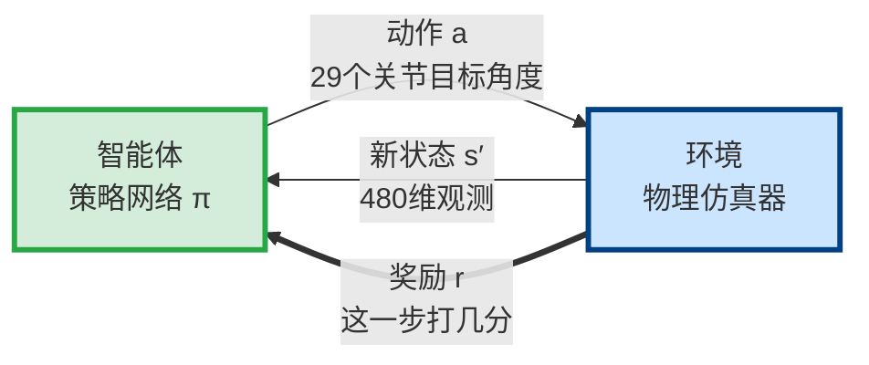

**读图**：这就是一个**反馈闭环**。绿框相当于控制器，蓝框相当于被控对象：智能体把动作送入环境，环境把新状态送回。经典控制器通常由人**设计**，这里的策略通过反复尝试**试**出来；加粗的奖励线专门告诉它“这次试得好不好”，这是经典控制框图里没有的反馈。

要用强化学习，第一步是把你的问题**塞进一个固定格式**。这个格式叫**马尔可夫决策过程（MDP）**，只有五个格子：

$$\text{MDP} = \langle\, \mathcal{S},\ \mathcal{A},\ P,\ r,\ \gamma \,\rangle$$

**读作**：一个 MDP 由五样东西定义：状态集合、动作集合、转移概率、奖励函数、折扣因子。

| 格子 | 名字 | 回答什么问题 | G1 上是什么 |
|---|---|---|---|
| $\mathcal{S}$ | 状态 | 机器人**能看到**什么 | 480 维观测向量 |
| $\mathcal{A}$ | 动作 | 机器人**能做**什么 | 29 个关节目标角度 |
| $P$ | 转移 | 做完动作**世界怎么变** | 物理仿真器 + 域随机化 |
| $r$ | 奖励 | 这一步**打几分** | 19 项加权求和 |
| $\gamma$ | 折扣 | **看多远** | 0.99 |

**「马尔可夫」这三个字是什么意思？**

$$P(s_{t+1} \mid s_t, a_t, s_{t-1}, a_{t-1}, \ldots) = P(s_{t+1} \mid s_t, a_t)$$

**读作**：下一个局面只取决于**当前局面和当前动作**，跟更早的历史无关。

> **通俗说**：**当前状态必须把「为了预测未来所需要知道的一切」都装进去了。**
>
> ★ **对照**：这就是控制里「状态变量」的定义——**状态是系统的完整记忆**。
> 你写 $\dot{x}=f(x,u)$ 的时候，已经默认了马尔可夫性。**这不是新概念。**

## 2.2 五个格子在 G1 配置文件里的位置

〔配置核实〕文件：`unitree_rl_lab/.../g1/29dof/velocity_env_cfg.py`

| 配置类 | 行号 | 落到哪个格子 |
|---|---|---|
| `RobotSceneCfg` | 41 | 转移 $P$（机器人本体、地形、传感器） |
| `EventCfg` | 88 | 转移 $P$（**域随机化：让 $P$ 变成一族而非一个**） |
| `CommandsCfg` | 160 | 状态 $\mathcal{S}$ 的一部分（指令进观测） |
| `ActionsCfg` | 180 | **动作 $\mathcal{A}$** |
| `ObservationsCfg` | 189 | **状态 $\mathcal{S}$** |
| `RewardsCfg` | 238 | **奖励 $r$** |
| `TerminationsCfg` | 341 | 转移 $P$ 的边界（什么时候一局结束） |
| `CurriculumCfg` | 350 | 转移 $P$ 的调度（难度随训练变化） |
| `rsl_rl_ppo_cfg.py` 的 `gamma=0.99` | 32 | **折扣 $\gamma$** |

**三个容易搞混的点：**

1. **转移 $P$ 横跨三处**：场景 + 事件 + 终止。它不在一个类里，因为它是「世界」不是「智能体」。
2. **折扣 $\gamma$ 不在环境配置里，在算法配置里。** 因为它属于「你想怎么学」，不属于「问题本身」。
3. **Terminations / Commands / Curriculum 不是新格子**，它们是前五个格子的辅助设定。

---

# 第 3 章 · 回报与折扣

## 3.1 先有一个问题：怎么把「一局的好坏」变成一个数

每一步都有分，一局有一千步。**最朴素的想法：全加起来。**

但这有两个毛病：

- **毛病一：可能加到无穷大。** 机器人如果永远不摔，分就永远加下去。无穷大之间没法比较。
- **毛病二：远期的事不该完全当真。** 一百步之后的事有太多不确定性。

**解决办法：打折。**

## 3.2 回报的定义

$$G_t \;=\; r_{t+1} + \gamma\, r_{t+2} + \gamma^2 r_{t+3} + \cdots \;=\; \sum_{k=0}^{\infty} \gamma^k\, r_{t+k+1}$$

**读作**：从第 $t$ 步往后，第 1 步的分算 100%，第 2 步的分打一次折，第 3 步打两次折……全部加起来。

**这个 $G_t$ 就叫「回报」。**

## 3.3 为什么打折能保证不发散

只要每步的分有上界 $r_{\max}$：

$$G_t \;\le\; r_{\max}\,(1 + \gamma + \gamma^2 + \cdots) \;=\; \frac{r_{\max}}{1-\gamma}$$

**读作**：这是等比级数求和。**折扣因子的全部数学作用，就是让这个无穷级数收敛。**

## 3.4 ★ 折扣因子的真实身份：它是「看多远」的旋钮

$$\text{有效视界} \;\approx\; \frac{1}{1-\gamma}$$

〔同模型自洽算得〕代入 G1 的参数：

| 量 | 值 | 来源 |
|---|---|---|
| $\gamma$ | 0.99 | 〔配置核实〕`rsl_rl_ppo_cfg.py:32` |
| 有效视界 | $1/(1-0.99) = 100$ 步 | 算得 |
| 每步时长 | $0.005 \times 4 = 0.02$ s | 〔配置核实〕`sim.dt=0.005`，`decimation=4` |
| **有效视界（秒）** | $100 \times 0.02 = \mathbf{2.0}$ **秒** | 算得 |
| 一局时长 | 20 s = 1000 步 | 〔配置核实〕`episode_length_s=20.0` |

> **结论**：$\gamma=0.99$ 意味着**策略基本只关心未来 2 秒**。
>
> **这个数是合理的**：人形行走一个步态周期约 0.8 s〔配置核实〕`gait` 项的 `period=0.8`，2 秒 ≈ 2.5 个步态周期。**策略能看到「这一步迈出去，下两三步会不会摔」，这正好够用。**
>
> 如果任务要求跨越长距离规划（比如「绕过障碍物到房间另一头」），$\gamma=0.99$ 就**不够**，要么调大 $\gamma$，要么上层加规划器。

---

# 第 4 章 · 价值：V、Q、优势

## 4.1 为什么需要「价值」这个概念

$G_t$ 每次跑都不一样，因为：

- **策略自己带随机**（训练时会随机试不同动作）
- **世界带随机**（摩擦系数不同、被随机推一把）

所以 $G_t$ 是个**随机变量**，不能直接用来比较两个局面的好坏。

**办法：跑无数次，取平均。**

## 4.2 两种价值的定义

$$V^\pi(s) \;=\; \mathbb{E}_\pi\!\left[\, G_t \;\middle|\; S_t = s \,\right]$$

**读作**：从局面 $s$ 出发，按策略 $\pi$ 走到底，**总分的平均值**。叫**状态值**，本文叫**局面分**。

$$Q^\pi(s,a) \;=\; \mathbb{E}_\pi\!\left[\, G_t \;\middle|\; S_t = s,\; A_t = a \,\right]$$

**读作**：从局面 $s$ 出发，**第一手强制走 $a$**，之后按 $\pi$ 走到底，总分的平均值。叫**动作值**，本文叫**这一手的分**。

**两者唯一的区别：**

| | $V^\pi(s)$ | $Q^\pi(s,a)$ |
|---|---|---|
| 第一手怎么定 | 按策略随机选 | **指定死了就是 $a$** |
| 之后怎么走 | 按策略 | 按策略 |
| 用来干什么 | 衡量**局面**好坏 | 衡量**选择**好坏 |

> **为什么要两个？** 因为**你没法用 $V$ 直接做决策。**
> $V$ 只告诉你「这个局面值 80 分」，不告诉你「往左迈还是往右迈」。
> **要做决策必须知道每一手分别值多少，那就是 $Q$。**

## 4.3 V 和 Q 的互换

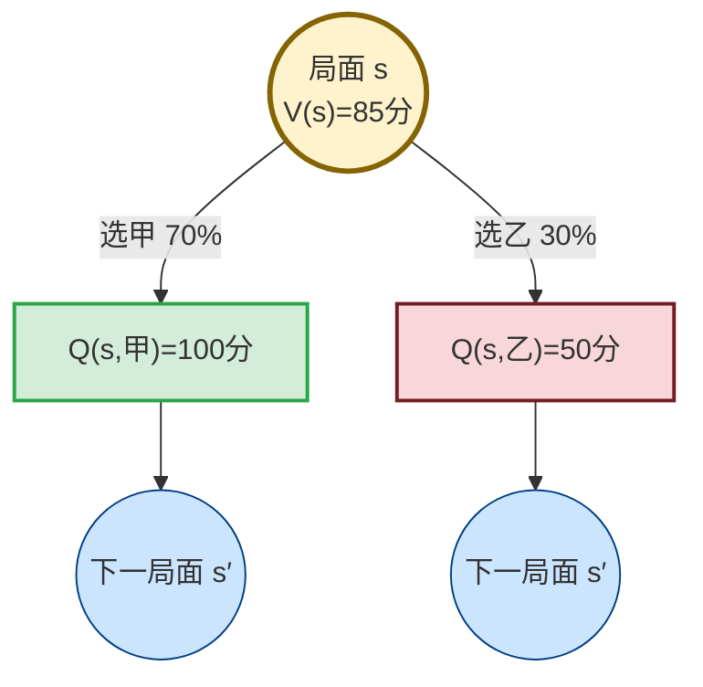

**读图**：黄色圆圈的 `V(s)` 是当前策略下所有动作分数的加权平均；每个 `Q(s,a)` 是先固定走某个动作后能拿到的分。优势 `A(s,a)=Q(s,a)−V(s)` 不另起一套分数，只是在问“这一手比当前平均好多少”。

| 量 | 图上位置 | 此例 | 大白话 |
|---|---|---|---|
| `V(s)` | 黄色圆圈 | 0.7×100+0.3×50=85 | 整个局面的平均分 |
| `Q(s,甲)` | 绿色方框 | 100 | 先走甲能拿多少 |
| `A(s,甲)` | 绿枝−黄圈 | 100−85，`A>0` | 这一手比平均好 |

> ⚠️ **`A>0` 不表示“这是好动作”，只表示“它比同局面的其他选择好”。**必输的局面里，最不烂的那一手，优势也可以为正。优势是相对分，`Q` 才是绝对分。

**方向一（由 Q 求 V）**：

$$V^\pi(s) \;=\; \sum_a \pi(a \mid s)\, Q^\pi(s,a)$$

**读作**：局面分 = 各手的分，**按策略选中它的概率加权平均**。

**一个具体例子**：策略在此局面 70% 走甲、30% 走乙，甲值 100 分、乙值 50 分：

$$V = 0.7 \times 100 + 0.3 \times 50 = 85$$

**方向二（由 V 求 Q）**：

$$Q^\pi(s,a) \;=\; r(s,a) \;+\; \gamma \sum_{s'} P(s' \mid s,a)\, V^\pi(s')$$

**读作**：这一手的分 = **这一步立刻拿到的分** + 打折 × **下一个局面的局面分**（对所有可能的下一个局面按概率平均）。

**一个具体例子**：走甲立刻得 3 分，之后到局面 B（局面分 20），$\gamma=0.99$：

$$Q = 3 + 0.99 \times 20 = 22.8$$

## 4.4 优势：改进策略的唯一依据

**先讲问题**：能不能直接用 $Q$ 来判断「这一手该不该多做」？

**不能。** 因为：

- 在**好局面**里，随便哪一手 $Q$ 都很高
- 在**烂局面**里，随便哪一手 $Q$ 都很低

拿绝对值去调整，等于**好局面里的烂招也被表扬**。

**办法：减掉这个局面的平均水平。**

$$A^\pi(s,a) \;=\; Q^\pi(s,a) \;-\; V^\pi(s)$$

**读作**：优势 = 这一手的分 − 这个局面的平均分 = **这一手比平均好多少**。

$$A > 0 \;\Rightarrow\; \text{比平均强，以后多做} \qquad A < 0 \;\Rightarrow\; \text{比平均差，以后少做}$$

**一个重要性质（不证）**：

$$\sum_a \pi(a \mid s)\, A^\pi(s,a) \;=\; 0 \quad \text{对每个 } s$$

**读作**：任何局面上，所有动作的优势按策略加权平均，**必然是 0**。

> ★ **对照**：优势就是**去掉共模、只留差模**。
> 这跟你做差分测量、参数辨识前去均值、控制里减掉工作点，是**完全同一个思想**：
> **要提取的是差异，共同的那部分是噪声源，不是信号。**

**这就是 critic 网络存在的唯一理由：提供 $V^\pi(s)$ 这个减数。**

---

# 第 5 章 · 贝尔曼期望方程

## 5.1 先讲问题：定义算不出来

$V^\pi(s)$ 的定义（4.2 节）要求「往后加无穷多项，再对无穷多条轨迹取平均」。**这没法算。**

## 5.2 方程

把 4.3 节的方向二代入方向一：

$$\boxed{\;V^\pi(s) \;=\; \sum_a \pi(a\mid s)\left[\, r(s,a) \;+\; \gamma \sum_{s'} P(s'\mid s,a)\, V^\pi(s') \,\right]\;}$$

**读作**：一个局面的分，等于「这一步的分 + 打折 × 下个局面的分」，**先对下个局面按转移概率平均，再对这一手按策略平均**。

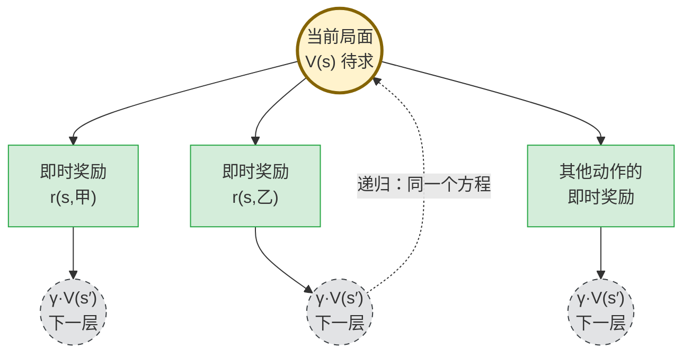

**读图**：贝尔曼方程做的唯一拆分，是把“从现在到永远”变成“这一步的即时奖励 + 打折后的下一层价值”。灰色圆圈里的 `V(s′)` 仍是同一种未知量，所以可以回到顶部，继续套用同一个方程；这就是递归，也是它能组成方程组求解的原因。★ 对照控制：写出 $V(x)=x^\top P x$ 后再看 $\dot V$，也是用同一个候选函数追踪下一步如何变化。

**Q 形式**（同样的东西换个写法）：

$$Q^\pi(s,a) \;=\; r(s,a) + \gamma \sum_{s'} P(s'\mid s,a) \sum_{a'} \pi(a'\mid s')\, Q^\pi(s',a')$$

## 5.3 它凭什么重要

| | 原始定义 | 贝尔曼方程 |
|---|---|---|
| 要算多少项 | 往后 1000 项 | **2 项** |
| 形式 | 展开式 | **递推式** |

> **打个比方**：你想知道一套房子未来 30 年总共值多少租金。
> 不用一年一年加 30 次，只要算：**今年的租金 + 明年这套房子的总价值**。
> 「明年的总价值」存起来反复用就行。

**注意左边是 $V^\pi$，右边也是 $V^\pi$。**
**这不是一个计算式，这是一个关于 $V^\pi$ 的方程。**

## 5.4 ★★ 矩阵形式 —— 它就是 Lyapunov 方程

> **这是全文和你已有知识接得最紧的一节，所以讲得最慢、拆得最细。**
> 全节只用到「矩阵乘法」和「解方程组」，没有别的数学。

### ⚠️ 先排一个雷：两个 $P$ 不是一个东西

强化学习和控制理论各自发展了几十年，**符号撞车了**。这是很多人读这段读不下去的真正原因：

| 字母 | 在**强化学习**里 | 在**控制理论**里 |
|---|---|---|
| $P$ | 转移概率 $P(s'\mid s,a)$，**世界的规律** | Lyapunov / Riccati 矩阵，**你要解的未知数** |
| $A$ | 优势函数 $A^\pi(s,a)$，**这一手好多少** | 状态矩阵，**系统自己怎么演化** |
| $R$ | 有时指奖励 | 控制代价权重，**你多讨厌费电** |

**本节的约定**：控制那边的矩阵一律加粗写成 $\mathbf{P}$、$\mathbf{A}$、$\mathbf{B}$，强化学习这边保持原样。看到加粗就知道是控制的。

---

### 5.4.1 为什么要写成矩阵：因为方程不止一个

回头看 5.2 的方程：

$$V^\pi(s) = \sum_a \pi(a\mid s)\left[\, r(s,a) + \gamma \sum_{s'} P(s'\mid s,a)\, V^\pi(s') \,\right]$$

**这里的 $s$ 是「随便哪个局面」。** 你的世界里有几个局面，这个方程就成立几次。

拿第 8.5 节那个例子（两个局面 **A=稳**、**B=危**，$\gamma=0.5$，打法是「A 快走、B 救一下」）：

| 在哪 | 干什么 | 立刻得分 | 去哪 |
|---|---|---|---|
| A | 快走 | +3 | 到 B |
| B | 救一下 | 0 | 回 A |

把方程分别在 A 和 B 上写一遍，就得到**两个**方程：

$$V(A) = 3 + 0.5\,V(B)$$
$$V(B) = 0 + 0.5\,V(A)$$

**读作**：A 的局面分 = 这步得 3 分 + 打个五折的 B 的局面分。B 同理。

**看出来了吗**：这就是一个普通的二元一次方程组，未知数是 $V(A)$ 和 $V(B)$。
初中就会解。**「矩阵形式」不过是把这组方程整齐地摞起来而已，没有任何新东西。**

摞起来长这样：

$$\begin{bmatrix} V(A) \\ V(B) \end{bmatrix} = \begin{bmatrix} 3 \\ 0 \end{bmatrix} + 0.5 \begin{bmatrix} 0 & 1 \\ 1 & 0 \end{bmatrix} \begin{bmatrix} V(A) \\ V(B) \end{bmatrix}$$

写成符号就是：

$$\boxed{\;\mathbf{V} \;=\; \mathbf{r}^\pi \;+\; \gamma\, \mathbf{P}^\pi \mathbf{V}\;}$$

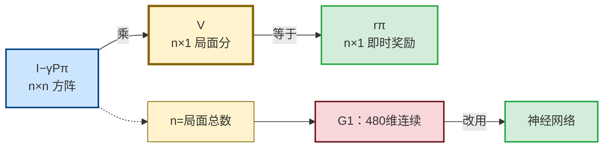

**读图**：左边是 `n×n` 的系数方阵，乘上中间 `n×1` 的局面分列，结果必须与右边 `n×1` 的即时奖励列同形——这就是熟悉的 `Ax=b`。这里 `n` 是局面总数；`P` 的每一行表示当前局面、每一列表示下一局面，而 `V` 和 `r` 的每一行各对应一个局面。G1 的状态是 480 维连续量，无法逐个局面建表，所以后面才改用神经网络近似 `V(s)`。

---

### 5.4.2 把这个式子里每个符号拆开

一个一个来，每个都告诉你：**它多大、里面装什么、谁给的**。

#### ① $\mathbf{V}$ —— 竖着排的一列局面分

$$\mathbf{V} = \begin{bmatrix} V(A) \\ V(B) \end{bmatrix} = \begin{bmatrix} ? \\ ? \end{bmatrix}$$

- **尺寸**：$n \times 1$，$n$ = 局面总数。这里 $n=2$，所以是 2 行 1 列
- **里面装什么**：每一行是一个局面的分
- **谁给的**：**没人给，这是你要解的未知数**

> 打个比方：$\mathbf{V}$ 就像一张房价表，每一行是一个小区，格子里填这个小区值多少钱。现在格子是空的，你要把它算出来。

#### ② $\mathbf{r}^\pi$ —— 竖着排的一列「这一步立刻得几分」

$$\mathbf{r}^\pi = \begin{bmatrix} 3 \\ 0 \end{bmatrix}$$

- **尺寸**：也是 $n \times 1$，和 $\mathbf{V}$ 一样高
- **里面装什么**：在这个局面下，**按你这套打法**走一步，立刻拿到几分
- **谁给的**：**你自己**——奖励函数是人写的（G1 那 19 项奖励就是它）
- **上标 $\pi$ 的意思**：换一套打法，这一列数字就会变。A 如果改成「慢走」，第一行就从 3 变成 1

#### ③ $\mathbf{P}^\pi$ —— 一张「从哪去哪」的方格表

$$\mathbf{P}^\pi = \begin{bmatrix} 0 & 1 \\ 1 & 0 \end{bmatrix}$$

行列的含义（**行 = 现在在哪，列 = 下一步去哪**）：

| | 到 A | 到 B |
|---|---|---|
| **在 A** | 0 | 1 |
| **在 B** | 1 | 0 |

- **尺寸**：$n \times n$，**方的**。这里 2×2
- **怎么读**：**第 $i$ 行第 $j$ 列 = 现在在第 $i$ 个局面，下一步跑到第 $j$ 个局面的概率**
  - 第 1 行 $[0\ \ 1]$：在 A 快走，100% 去 B，0% 留 A
  - 第 2 行 $[1\ \ 0]$：在 B 救一下，100% 回 A
- **谁给的**：**世界的物理规律**（在 G1 上就是 Isaac Sim 的物理引擎）。你改不了
- **一条铁律**：**每一行加起来必须等于 1**。因为「下一步总得去某个地方」，概率之和是 100%
- **上标 $\pi$ 的意思**：$P(s'\mid s,a)$ 本来还要看你选哪个动作 $a$；一旦打法 $\pi$ 定死了，动作就定了，$a$ 就被消掉了，只剩「从哪到哪」

> ★ **这里就能看出「策略评估」这个词的分量**：$\mathbf{P}^\pi$ 里已经**没有动作了**。
> 打法一旦定死，整个世界就退化成一台「从哪去哪」的自动机器——不再有选择，只剩演化。
> **这正是控制里「闭环系统」的意思**：$u = -\mathbf{K}x$ 一代进去，$\dot x = \mathbf{A}x + \mathbf{B}u$ 就变成 $\dot x = (\mathbf{A}-\mathbf{B}\mathbf{K})x$，控制量消失了。

#### ④ $\gamma$ —— 一个数，不是矩阵

- $0 < \gamma < 1$，G1 里是 **0.99**，这个例子里为了好算取 0.5
- 作用：**下个局面的分要打折**
- ★ 它还有一个更要紧的作用，5.4.4 讲

#### ⑤ $\mathbf{I}$ —— 单位矩阵

$$\mathbf{I} = \begin{bmatrix} 1 & 0 \\ 0 & 1 \end{bmatrix}$$

- 对角线全 1，其余全 0
- **它就是矩阵世界里的数字「1」**：任何矩阵乘它都不变
- **为什么需要它**：普通代数里 $v = r + av$ 可以写成 $(1-a)v = r$；矩阵世界里那个「1」必须写成 $\mathbf{I}$，因为你不能用数字 1 去减一个矩阵

---

### 5.4.3 解出来：移项、求逆

$$\mathbf{V} = \mathbf{r}^\pi + \gamma \mathbf{P}^\pi \mathbf{V}$$

把带 $\mathbf{V}$ 的项挪到一边（**和初中移项一模一样**）：

$$(\mathbf{I} - \gamma \mathbf{P}^\pi)\,\mathbf{V} = \mathbf{r}^\pi$$

两边左乘逆矩阵（**相当于两边同除一个数**）：

$$\boxed{\;\mathbf{V} = (\mathbf{I} - \gamma \mathbf{P}^\pi)^{-1}\, \mathbf{r}^\pi\;}$$

**读作**：局面分这一列，等于「单位阵减去打折的转移矩阵」求个逆，再乘上即时奖励那一列。**一步到位，不用迭代。**

**代进数字验算一遍**（$\gamma=0.5$）：

$$\mathbf{I} - \gamma\mathbf{P}^\pi = \begin{bmatrix} 1 & 0 \\ 0 & 1 \end{bmatrix} - 0.5\begin{bmatrix} 0 & 1 \\ 1 & 0 \end{bmatrix} = \begin{bmatrix} 1 & -0.5 \\ -0.5 & 1 \end{bmatrix}$$

2×2 求逆的公式是 $\begin{bmatrix} a & b \\ c & d\end{bmatrix}^{-1} = \frac{1}{ad-bc}\begin{bmatrix} d & -b \\ -c & a\end{bmatrix}$，这里 $ad-bc = 1 - 0.25 = 0.75$：

$$(\mathbf{I}-\gamma\mathbf{P}^\pi)^{-1} = \frac{1}{0.75}\begin{bmatrix} 1 & 0.5 \\ 0.5 & 1 \end{bmatrix}$$

$$\mathbf{V} = \frac{1}{0.75}\begin{bmatrix} 1 & 0.5 \\ 0.5 & 1 \end{bmatrix}\begin{bmatrix} 3 \\ 0 \end{bmatrix} = \frac{1}{0.75}\begin{bmatrix} 3 \\ 1.5 \end{bmatrix} = \begin{bmatrix} 4 \\ 2 \end{bmatrix}$$

**$V(A)=4$，$V(B)=2$ —— 和 8.5 节一步步代入手算的结果完全一样。**

> **这说明了一件事**：矩阵形式**没有**带来任何新知识，它只是把「代入消元」这个动作打包成了一次求逆。
> 好处是：**局面有 100 万个的时候，你没法手动消元，但计算机能求逆。**

---

### 5.4.4 ★ 这个逆矩阵凭什么一定存在？—— $\gamma$ 的真实身份

求逆是有风险的：**不是所有矩阵都可逆**。万一 $(\mathbf{I}-\gamma\mathbf{P}^\pi)$ 不可逆，这一切就白搭。

**结论是：只要 $\gamma < 1$，它永远可逆。** 理由：

1. $\mathbf{P}^\pi$ 每行之和为 1（概率），这种矩阵的**特征值绝对值都 $\le 1$**
2. 所以 $\gamma\mathbf{P}^\pi$ 的特征值绝对值都 $\le \gamma < 1$
3. 而 $(\mathbf{I}-\gamma\mathbf{P}^\pi)$ 的特征值 = $1 - (\gamma\mathbf{P}^\pi \text{的特征值})$，**绝对不可能是 0**
4. 特征值里没有 0 $\Rightarrow$ **行列式不为 0** $\Rightarrow$ **可逆**

> ★★ **翻译成控制的语言**：$\gamma$ 把所有特征值**强行拉进单位圆内**，保证了闭环稳定。
>
> **$\gamma$ 表面上是「未来打个折」，实际上是「把这个方程掰成有唯一解」的那根定海神针。**
> 这就是为什么 $\gamma$ 必须严格小于 1 —— $\gamma=1$ 时特征值可以正好等于 1，矩阵就奇异了，$V$ 会跑到无穷大。

---

### 5.4.5 ★★ 现在看控制那边：LQR 的 Lyapunov 方程

**先把场景摆出来。** 一个单关节机械臂，你要它稳在目标角度：

- **状态** $x = \begin{bmatrix} \theta \\ \dot\theta \end{bmatrix}$ —— 角度误差和角速度，**2 维列向量**
- **控制量** $u = \tau$ —— 你给的力矩，**1 维**
- **系统方程**（离散时间）：$x_{k+1} = \mathbf{A}x_k + \mathbf{B}u_k$

#### 逐个拆开

| 符号 | 尺寸 | 大白话 | 谁定的 |
|---|---|---|---|
| $\mathbf{A}$ | 2×2 | **不管的话，下一时刻会变成什么样**（惯性、重力） | 物理规律，改不了 |
| $\mathbf{B}$ | 2×1 | **你给一份力矩，状态会被推动多少** | 物理规律，改不了 |
| $\mathbf{K}$ | 1×2 | **反馈增益** —— 看到状态，决定给多大力矩 | **你设计的** |
| $\mathbf{Q}$ | 2×2 | **你有多讨厌误差** | **你写的（口味）** |
| $\mathbf{R}$ | 1×1 | **你有多讨厌费电 / 大力矩** | **你写的（口味）** |
| $\mathbf{P}$ | 2×2 | **解出来的结果** —— 见下 | **算出来的，不是你给的** |

> ★★★ **一个能瞬间打通的点：$\mathbf{K}$ 就是你的 PD 增益。**
>
> $$u = -\mathbf{K}x = -\begin{bmatrix} k_p & k_d \end{bmatrix}\begin{bmatrix} \theta \\ \dot\theta \end{bmatrix} = -(k_p\,\theta + k_d\,\dot\theta)$$
>
> **这不就是 PD 控制器吗。** LQR 干的事，就是**帮你把 $k_p$、$k_d$ 自动算出来**，
> 而不是靠你试凑。你在 G1 上写的关节 PD，形式上就是一个 $\mathbf{K}$。

> **$\mathbf{Q}$ 和 $\mathbf{R}$ 是「口味」，不是「事实」。**
> 比如 $\mathbf{Q} = \begin{bmatrix} 100 & 0 \\ 0 & 1\end{bmatrix}$ 读作「角度误差我看得很重（100），角速度无所谓（1）」。
> $\mathbf{R}$ 越大 = 越不想费力气 = 增益越软。
> ★ **这正好对应 RL 里的奖励函数权重** —— G1 那 19 项奖励每项前面的系数，就是 $\mathbf{Q}$、$\mathbf{R}$ 的同类。**都是人的口味，都得手调。**

#### 现在把增益 $\mathbf{K}$ 定死

$u = -\mathbf{K}x$ 代进 $x_{k+1} = \mathbf{A}x_k + \mathbf{B}u_k$：

$$x_{k+1} = \mathbf{A}x_k - \mathbf{B}\mathbf{K}x_k = (\mathbf{A} - \mathbf{B}\mathbf{K})\,x_k$$

**控制量 $u$ 消失了。** 剩下一个纯粹的演化矩阵 $(\mathbf{A}-\mathbf{B}\mathbf{K})$，业内叫**闭环矩阵**。

> ★ **停一下，对照 5.4.2 的 ③**：
> 强化学习里打法 $\pi$ 一定死，动作 $a$ 消失，只剩 $\mathbf{P}^\pi$。
> 控制里增益 $\mathbf{K}$ 一定死，控制量 $u$ 消失，只剩 $(\mathbf{A}-\mathbf{B}\mathbf{K})$。
> **$\mathbf{P}^\pi \longleftrightarrow (\mathbf{A}-\mathbf{B}\mathbf{K})$：这两个是同一个位置上的东西。**

#### 那 $\mathbf{P}$ 是什么

你想知道「从状态 $x$ 出发，一直到最后，总共要付出多少代价」。这个总代价写成：

$$J(x) = x^\top \mathbf{P}\, x$$

它满足**离散 Lyapunov 方程**：

$$\mathbf{P} \;=\; \underbrace{\mathbf{Q} + \mathbf{K}^\top \mathbf{R} \mathbf{K}}_{\text{这一步的代价}} \;+\; \underbrace{(\mathbf{A}-\mathbf{B}\mathbf{K})^\top\, \mathbf{P}\, (\mathbf{A}-\mathbf{B}\mathbf{K})}_{\text{到了下一个状态之后，还要付的代价}}$$

**读作**：从这儿出发的总代价 = 这一步付的 + 到下一个状态之后还要付的。

**……这句话你已经见过了。** 5.2 节的原话是：

> 「一个局面的分，等于这一步的分 + 打折 × 下个局面的分」

**一模一样。只是一个说「得分」，一个说「代价」。**

---

### 5.4.6 ★★ $x^\top \mathbf{P} x$ 到底是个什么东西

这个写法可能是最劝退的地方，但它极其简单。

**它算出来是一个数（标量），不是矩阵。** 验算一下，取 $\mathbf{P} = \begin{bmatrix} 2 & 0 \\ 0 & 1\end{bmatrix}$，$x = \begin{bmatrix} 3 \\ 1 \end{bmatrix}$：

$$x^\top \mathbf{P} x = \begin{bmatrix} 3 & 1\end{bmatrix}\begin{bmatrix} 2 & 0 \\ 0 & 1\end{bmatrix}\begin{bmatrix} 3 \\ 1\end{bmatrix} = \begin{bmatrix} 3 & 1\end{bmatrix}\begin{bmatrix} 6 \\ 1\end{bmatrix} = 18 + 1 = \mathbf{19}$$

尺寸上也能看出来：$(1\times 2)\times(2\times 2)\times(2\times 1) = 1\times 1$，**就是一个数**。

**它是什么含义**：$2\theta^2 + \dot\theta^2$ —— **一个加权的平方和**，永远 $\ge 0$，只有 $x=0$（完全稳住了）时才等于 0。

> **打个比方**：$\mathbf{P}$ 是一张「罚款单价表」。
> 角度偏 1 单位罚 2 块，角速度偏 1 单位罚 1 块。$x^\top\mathbf{P}x$ 就是这个状态一共罚多少钱。
> **离目标越远，罚得越狠（平方增长）。**

#### ★★★ 同一个 $x^\top \mathbf{P} x$，三个名字

这是本节最值钱的一句话：

| 学科 | 叫它什么 | 你怎么用它 |
|---|---|---|
| **稳定性分析**（你最熟） | **Lyapunov 函数** $V(x)$，「能量」 | 证 $V$ 一直减小 $\Rightarrow$ 系统稳定 |
| **最优控制 LQR** | **cost-to-go**，「还要花多少」 | 求 $\mathbf{K}$ 让它最小 |
| **强化学习** | **状态值函数** $V^\pi(s)$，「局面分」 | 训练 critic 去逼近它 |

**三个学科，三个名字，同一个东西。**

**唯一的实质区别是符号**：控制里是**代价**（越小越好，$\ge 0$），RL 里是**奖励**（越大越好）。
所以 RL 要 $\max$ 的地方，控制要 $\min$；RL 里的 $r$ 对应控制里的 $-(\mathbf{Q}+\mathbf{K}^\top\mathbf{R}\mathbf{K})$。

> ★ 顺带解开一个困惑：**为什么 Lyapunov 函数总要写成 $x^\top \mathbf{P}x$ 而不是别的形状？**
> 因为你要它「永远非负、且只在原点为 0」。二次型只要 $\mathbf{P}$ 正定就天然满足这条，
> 而且求导之后还是二次型，能推下去。**是为了好证，不是为了好看。**

---

### 5.4.7 逐项对照表（结论）

| 强化学习 | 最优控制 | 共同点 |
|---|---|---|
| $\mathbf{V} = \mathbf{r}^\pi + \gamma \mathbf{P}^\pi \mathbf{V}$ | $\mathbf{P} = (\mathbf{Q}{+}\mathbf{K}^\top \mathbf{R}\mathbf{K}) + (\mathbf{A}{-}\mathbf{B}\mathbf{K})^\top \mathbf{P}(\mathbf{A}{-}\mathbf{B}\mathbf{K})$ | 「现在的分 + 以后的分」 |
| $\mathbf{V}$（局面分） | $x^\top \mathbf{P} x$（cost-to-go） | 都是「从这里到终点的总账」 |
| $\mathbf{r}^\pi$（即时奖励） | $\mathbf{Q} + \mathbf{K}^\top\mathbf{R}\mathbf{K}$（即时代价） | **符号相反** |
| $\mathbf{P}^\pi$（转移矩阵） | $\mathbf{A} - \mathbf{B}\mathbf{K}$（闭环矩阵） | 都是「一步之后到哪」 |
| 策略 $\pi$ 固定 | 增益 $\mathbf{K}$ 固定 | **关键前提** |
| 奖励权重（19 项系数） | $\mathbf{Q}$、$\mathbf{R}$ | **都是人的口味，都得手调** |
| $\gamma$ 保证可逆 | 闭环稳定保证有解 | 都是「特征值进单位圆」 |
| **对 $\mathbf{V}$ 是线性的** | **对 $\mathbf{P}$ 是线性的** | **所以都能一次解完** |

> ★★ **一句话**：**给定固定增益 $\mathbf{K}$ 解 Lyapunov 方程，这件事在强化学习里的名字就叫「策略评估」。**
>
> **你早就做过这件事，只是不知道它有这个名字。**这是本文最值钱的一条对照。

> **面试可以这样说**：
> 「贝尔曼期望方程在策略固定时对 $V$ 是线性的，矩阵形式 $\mathbf{V}=(\mathbf{I}-\gamma\mathbf{P}^\pi)^{-1}\mathbf{r}^\pi$，
> 结构上就是给定反馈增益后的离散 Lyapunov 方程 —— 转移矩阵 $\mathbf{P}^\pi$ 对应闭环矩阵 $\mathbf{A}-\mathbf{B}\mathbf{K}$，
> 即时奖励对应即时代价，只是符号相反。$\gamma<1$ 起的作用相当于把特征值压进单位圆，保证解存在唯一。
> 所以『策略评估』这件事我以前做过，只是不知道它在 RL 里叫这个名字。」

---

# 第 6 章 · 策略评估：怎么把价值真的算出来

**策略评估**（policy evaluation）= 给定一套打法 $\pi$，求出每个局面的 $V^\pi(s)$。

有三条路。

## 6.1 路线一：直接解线性方程组

就是 5.4 节的 $\mathbf{V} = (\mathbf{I}-\gamma\mathbf{P}^\pi)^{-1}\mathbf{r}^\pi$。

| 优点 | 缺点 |
|---|---|
| 一步到位，精确 | 必须**知道 $P$**（世界的规律） |
| | 必须**状态数有限**且不太大（要求逆） |

**G1 上两条都不满足**：$P$ 未知，状态是 480 维连续量。**这条路走不通。**

## 6.2 路线二：蒙特卡洛 —— 跑到底，数一数

**想法**：既然 $V$ 的定义是「$G_t$ 的平均」，那我就**真的跑很多次，真的取平均**。

$$V(s_t) \;\leftarrow\; V(s_t) + \alpha \left[\, G_t - V(s_t) \,\right]$$

**读作**：$\alpha$ 是步长。把 $V$ 往「这次实际拿到的总分 $G_t$」的方向挪一小步。

| 优点 | 缺点 |
|---|---|
| **完全不需要知道 $P$**，跑就完了 | **必须等一整局结束**才能学 |
| **无偏**：跑够多次一定收敛到真值 | **方差极大** |

**方差为什么极大**：$G_t$ 把一局里**上千步的随机性全堆进了一个数**。同一个局面，这次得 100，下次得 20，下下次得 150。平均值是对的，但你要跑非常多次才看得出来。

## 6.3 路线三：时序差分（TD）—— 走一步就学

**这是强化学习最核心、也最反直觉的一个想法。**

不跑到底了。**只走一步，然后用贝尔曼方程把剩下的部分用估计值顶替**：

$$V(s_t) \;\leftarrow\; V(s_t) + \alpha \Big[\, \underbrace{r_{t+1} + \gamma V(s_{t+1})}_{\text{目标}} \;-\; V(s_t) \,\Big]$$

**读作**：目标值 = 这一步真实拿到的分 + 打折 × **下一个局面的估计分**。

**注意 $V(s_{t+1})$ 是一个估计值，不是真值。**

> **用一个估计去更新另一个估计**——这个操作叫**自举（bootstrapping）**。
>
> **听起来像空手套白狼，为什么有效？**
> 因为 $r_{t+1}$ 是**真实观测到的**。每更新一次，就有一点点真实信息被注入。反复做，估计被真实信息一点一点校正过来。

## 6.4 TD 误差

方括号里那一坨单独拿出来，就是整个强化学习的心跳：

$$\boxed{\;\delta_t \;=\; r_{t+1} + \gamma V(s_{t+1}) - V(s_t)\;}$$

**读作**：走完这一步后发现的「惊喜程度」。

$$\delta > 0:\ \text{比预期好} \qquad \delta < 0:\ \text{比预期差} \qquad \delta = 0:\ \text{完全符合预期，不用学}$$

> TD、Q-learning、GAE、PPO 全都在算 $\delta$。**神经科学还发现多巴胺信号的行为与 $\delta$ 高度吻合。**

## 6.5 两条路线的取舍，和它们的折中


**读图**：MC 用真实奖励一直看到终止；TD(0) 只走一步就用 $V$ 自举；GAE 则把不同 $n$ 步回报按 $\lambda^{n-1}$ 混合，而不是直接给每一步奖励乘图中的权重。$\lambda=0$ 退化为 TD(0)，$\lambda=1$ 退化为 MC，项目采用的 $\lambda=0.95$ 落在两者之间。

| | 蒙特卡洛 | 时序差分 |
|---|---|---|
| 何时学 | 一局结束后 | **每一步** |
| 偏差 | **无** | 有（因为 $V(s_{t+1})$ 是猜的） |
| 方差 | **极大** | 小 |
| 比方 | 考完试才知道复习方法好不好 | 做完一道题就调整方法 |

**两者不是二选一，中间有连续的谱**——**$n$ 步回报**：

$$G_t^{(n)} \;=\; r_{t+1} + \gamma r_{t+2} + \cdots + \gamma^{n-1} r_{t+n} \;+\; \gamma^n V(s_{t+n})$$

**读作**：先走 $n$ 步真实奖励，第 $n$ 步之后才切换成估计值。

$$n=1 \Rightarrow \text{TD(0)} \qquad n=\infty \Rightarrow \text{蒙特卡洛}$$

**看清楚：两者的区别只有一个——走多少步真实奖励之后切换成估计。**

## 6.6 ★ GAE：`lam=0.95` 那个旋钮的真面目

### 6.6.1 先讲清楚问题：$n$ 该取几？

6.5 节留下一个尴尬：$n$ 越小偏差越大，$n$ 越大方差越大。**那到底取几？**

$n=1$ 太短视，$n=100$ 噪声太大，$n=7$？凭什么是 7？**任何一个选择都是拍脑袋。**

**GAE 的想法**：**别选了，全都要 —— 把所有 $n$ 的结果做个加权平均。**

> **打个比方**：预测一支股票的价值。
> 「看 1 天」太短视，「看 10 年」太不确定。
> 与其纠结看几天，不如**1 天、2 天、3 天……全都算一遍，然后加权平均**，
> 而且**越近的越信得过，权重给大点**。

### 6.6.2 权重怎么给：几何衰减

第 $n$ 步的估计，权重取 $\propto \lambda^{n-1}$（$\lambda$ 就是 `lam`）：

| $n$ | 1 | 2 | 3 | 4 | … |
|---|---|---|---|---|---|
| 权重（$\lambda=0.95$） | 1 | 0.95 | 0.90 | 0.86 | 逐渐衰减 |

**为什么用这种「一路打折」的权重**：① 越远的估计越不可靠，权重该越小；② **只有几何衰减能化简成下面那个干净的递推式**，别的权重算不动。

**神奇的地方是**：这么一大堆加权平均，化简之后极其干净：

$$\boxed{\;\hat{A}_t \;=\; \sum_{l=0}^{\infty} (\gamma\lambda)^l\, \delta_{t+l}\;}$$

**读作**：**把未来每一步的「惊喜」$\delta$，按 $\gamma\lambda$ 一路打折，加起来。**

- $\delta_t$ = 当前这步的惊喜（6.4 节）
- $\delta_{t+1}$ = 下一步的惊喜，打 $\gamma\lambda$ 折
- $\delta_{t+2}$ = 再下一步，打 $(\gamma\lambda)^2$ 折
- ……

**递推写法**（代码里就是这么写的，从后往前扫一遍）：

$$\hat{A}_t \;=\; \delta_t + \gamma\lambda\, \hat{A}_{t+1}$$

**两个极端：**

| $\lambda$ | $\hat{A}_t$ 退化成 | 等价于 |
|---|---|---|
| $0$ | $\delta_t$ | 纯 TD(0)：方差最小、偏差最大 |
| $1$ | $G_t - V(s_t)$ | 纯蒙特卡洛：方差最大、无偏 |
| **0.95** | 两者之间，偏蒙特卡洛一侧 | 〔配置核实〕G1 用这个 |

### 6.6.3 ★★ `gamma` 和 `lam` 到底差在哪（这里最容易混）

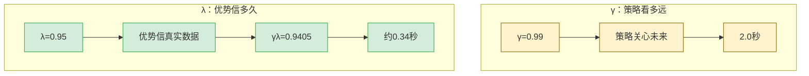

**读图**：在原文的 $50\,\mathrm{Hz}$ 计算中，$\gamma=0.99$ 对应约 $100$ 步、$2.0$ 秒，回答“策略在乎多远”；$\gamma\lambda=0.9405$ 对应约 $17$ 步、$0.34$ 秒，回答“优势估计肯信多久的真实数据”。对控制背景读者，$\lambda$ 可类比互补滤波系数：它调的是实测与模型估计的交接点，不要把它与 $\gamma$ 混成同一个旋钮。

两个都是「打折」，看起来像一回事。**其实管的是完全不同的两件事，算个具体数就一清二楚。**

**几何级数 $\sum x^l$ 的「有效长度」约等于 $\dfrac{1}{1-x}$**（超过这个长度的项加起来也没多少）。

| 旋钮 | 算式 | 有效步数 | 换算成时间（50 Hz） |
|---|---|---|---|
| **只看 $\gamma=0.99$** | $\dfrac{1}{1-0.99}$ | **100 步** | **2.0 秒** |
| **$\gamma\lambda = 0.99\times0.95 = 0.9405$** | $\dfrac{1}{1-0.9405}$ | **约 17 步** | **约 0.34 秒** |

> ★★★ **结论，一句话记住**：
>
> **$\gamma$ 决定「这个策略关心未来多久」——2 秒，约 2.5 个步态周期。**
> **$\lambda$ 决定「算优势时肯信多久的真实数据」——0.34 秒，大约一个单腿支撑相。**
>
> 超过 0.34 秒之后的事，$\hat A$ 基本就交给 critic 的估计值 $V$ 去背了，不再采信实测奖励。

**所以调它们的后果完全不同：**

| 你改了 | 后果 |
|---|---|
| 调大 $\gamma$ | 策略变得更有远见（也更难训，因为要预测更远） |
| 调大 $\lambda$ | **更信实测、少信 critic** → 无偏但抖 |
| 调小 $\lambda$ | **更信 critic** → 平稳但 critic 不准时会被带偏 |

> ★ **对照你熟的东西**：$\lambda$ 很像**互补滤波的系数**。
> 短期信实测（加速度计 / 实测奖励），长期信模型估计（陀螺积分 / critic 的 $V$）。
> **调 $\lambda$ 就是在调这个交接点在哪。** 0.95 把交接点放在了 0.34 秒。

> **推导按要求不讲。你只要知道：它是「信实测 vs 信估计」的旋钮，0.95 对应 0.34 秒的信任窗口。**

## 6.7 〔源码核实〕这些公式在代码里长什么样

文件：`rsl_rl/storage/rollout_storage.py:134-147`

```python
for step in reversed(range(self.num_transitions_per_env)):
    next_values = last_values if step == last else self.values[step + 1]
    next_is_not_terminal = 1.0 - self.dones[step].float()

    # δ_t = r_t + γ·V(s_{t+1}) − V(s_t)
    delta = self.rewards[step] + next_is_not_terminal * gamma * next_values - self.values[step]

    # Â_t = δ_t + γλ·Â_{t+1}
    advantage = delta + next_is_not_terminal * gamma * lam * advantage

    # R_t = Â_t + V(s_t)
    self.returns[step] = advantage + self.values[step]
```

**逐行对应：**

| 代码 | 公式 | 说明 |
|---|---|---|
| `delta = ...` | $\delta_t = r_t + \gamma V(s_{t+1}) - V(s_t)$ | 6.4 节 |
| `advantage = delta + γλ·advantage` | $\hat{A}_t = \delta_t + \gamma\lambda \hat{A}_{t+1}$ | 6.6 节递推式 |
| `returns = advantage + values` | $R_t = \hat{A}_t + V(s_t)$ | critic 的回归目标 |
| `next_is_not_terminal` | 终止时置 0 | **摔倒后没有未来，把 $\gamma V$ 和 $\gamma\lambda\hat A$ 一起掐断** |

**注意最后一行的深意**：critic 的训练目标 $R_t$ **不是**实际跑出来的总分，而是 $\hat{A}_t + V(s_t)$。**这是一个自举目标。**

## 6.8 ★ 超时（truncation）与摔倒（termination）必须区别对待

**问题**：一局跑到 20 秒被计时器叫停，此时 `dones=1`，上面的 `next_is_not_terminal` 会把未来掐断——**但机器人明明还好好站着，未来价值不是 0！**

〔源码核实〕`rsl_rl/algorithms/ppo.py:176-180` 的处理：

```python
# Bootstrapping on time outs
if "time_outs" in extras:
    self.transition.rewards += self.gamma * torch.squeeze(
        self.transition.values * extras["time_outs"].unsqueeze(1).to(self.device), 1
    )
```

**读作**：如果这一步是「时间到」而非「摔了」，就**手动把 $\gamma V$ 加回奖励里**，补偿被掐断的未来。

$$\text{摔倒（termination）：}\ \ \text{目标} = r \qquad\qquad \text{超时（truncation）：}\ \ \text{目标} = r + \gamma V$$

**这解释了配置里那个标志的全部意义**〔配置核实〕`velocity_env_cfg.py:344`：

```python
time_out = DoneTerm(func=mdp.time_out, time_out=True)   # ← 这个 True 一路影响到 PPO
base_height = DoneTerm(func=mdp.root_height_below_minimum, params={"minimum_height": 0.2})
bad_orientation = DoneTerm(func=mdp.bad_orientation, params={"limit_angle": 0.8})
```

只有第一条带 `time_out=True`。后两条是真·失败，不补偿。

> **〔一个可以在面试里说的实现细节〕** rsl-rl 这里用的是 `self.transition.values`，也就是 $V(s_t)$，当作 $V(s_{t+1})$ 的替身。**严格说是个近似**（应该用下一个状态的价值）。这是实现上有意的简化，不是笔误。**能指出这一点，说明你真的读了源码。**

---

# 第 7 章 · 贝尔曼最优方程

## 7.1 前面六章都在「评估」，现在开始「控制」

**强化学习一共只回答两个问题：**

| 问题 | 名字 | 前面讲到哪了 |
|---|---|---|
| 这套打法有多好？ | **评估**（prediction / evaluation） | 第 4–6 章 |
| 最好的打法是什么？ | **控制**（control） | **从这里开始** |

## 7.2 方程

**贝尔曼期望方程**（第 5 章）里，「这一手选什么」是**按策略概率平均**的：

$$V^\pi(s) = \sum_a \pi(a\mid s)\Big[ r(s,a) + \gamma \sum_{s'} P(s'\mid s,a) V^\pi(s') \Big]$$

**贝尔曼最优方程**只改一个地方：**不平均了，直接挑最好的那一手**。

$$\boxed{\;V^*(s) \;=\; \max_a \Big[\, r(s,a) + \gamma \sum_{s'} P(s'\mid s,a)\, V^*(s') \,\Big]\;}$$

**读作**：最优局面分 = 在所有可选动作里，挑「立刻的分 + 打折 × 下个局面的最优分」**最大的那个**。

**Q 形式：**

$$Q^*(s,a) \;=\; r(s,a) + \gamma \sum_{s'} P(s'\mid s,a)\, \max_{a'} Q^*(s',a')$$

**这就是全部改动：$\sum_a \pi(a\mid s)$ → $\max_a$。**

## 7.3 ★★ 这一个 max 造成的后果：方程从线性变成非线性

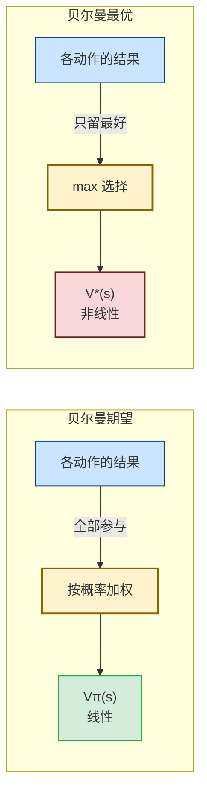

**读图**：左边是“所有动作按既定概率一起算账”，所以仍满足叠加原理；右边是“只挑当前最大的动作”，一旦最优动作发生切换就会出现折点，线性拆分失效。对照经典控制，这正是从给定增益时可线性求解的 Lyapunov 方程，走到需要反复迭代的非线性 Riccati 方程的同一处分水岭。

> 承接 5.4。那一节的符号约定继续用：**控制的矩阵加粗**（$\mathbf{A}$、$\mathbf{B}$、$\mathbf{K}$、$\mathbf{Q}$、$\mathbf{R}$、$\mathbf{P}$），强化学习的不加粗。

### 7.3.1 「线性」到底是什么意思

先说清楚这个词，不然后面全是空话。

**一个运算是「线性」的，意思是它满足两条：**

1. **拆得开**：$f(x + y) = f(x) + f(y)$
2. **提得出**：$f(3x) = 3f(x)$

合起来叫**叠加原理**。你做控制时天天用它——两个输入分别产生的响应，可以直接加起来。

**求和是线性的**：$\sum(x+y) = \sum x + \sum y$ ✅

**取最大值不是。** 拿具体数字验一下：

| 算法 | 算式 | 结果 |
|---|---|---|
| 先各自取大再加 | $\max(3,5) + \max(2,1) = 5 + 2$ | **7** |
| 先加再取大 | $\max(3{+}2,\ 5{+}1) = \max(5,6)$ | **6** |

$7 \ne 6$。**$\max$ 拆不开。**

> **为什么这很致命**：矩阵求逆 $(\mathbf{I}-\gamma\mathbf{P}^\pi)^{-1}$ 这套操作，**整个建立在叠加原理上**。
> $\max$ 一进来，叠加原理没了，矩阵那套工具**全部失效**。

### 7.3.2 两个方程的对比

| | 贝尔曼期望方程 | 贝尔曼最优方程 |
|---|---|---|
| 中间那个算子 | $\sum_a \pi(a\mid s)$（**按概率加权平均**） | $\max_a$（**只挑最好的那个**） |
| 对 $V$ 是 | **线性的** | **非线性的** |
| 能不能直接求逆 | **能** | **不能** |
| 怎么解 | 一步：$(\mathbf I-\gamma\mathbf P^\pi)^{-1}\mathbf r^\pi$ | **只能一遍一遍迭代** |

> **直觉上的区别**：
> 「加权平均」是**你已经知道每个动作选多少概率**，照单算账 —— 账是死的，一次算完。
> 「取最大」是**选谁取决于算出来的值，而值又取决于选谁** —— **鸡生蛋蛋生鸡，只能猜一个开头，反复迭代逼近。**

---

### 7.3.3 ★★ 控制那边发生了完全一样的事

| 强化学习 | 最优控制 | 数学结构 |
|---|---|---|
| **贝尔曼期望方程**（$\pi$ 固定） | **Lyapunov 方程**（$\mathbf{K}$ 固定） | **线性**，直接解 |
| **贝尔曼最优方程**（对 $a$ 取 $\max$） | **Riccati 方程**（对 $u$ 取 $\min$） | **非线性**，迭代解 |
| 连续时间版本 | **HJB 方程** | 偏微分方程 |

**离散时间 Riccati 方程长这样：**

$$\mathbf P = \mathbf{Q} + \mathbf{A}^\top \mathbf P \mathbf{A} - \underbrace{\mathbf{A}^\top \mathbf P \mathbf{B}\,(\mathbf{R} + \mathbf{B}^\top \mathbf P \mathbf{B})^{-1} \mathbf{B}^\top \mathbf P \mathbf{A}}_{\text{这一坨，就是 } \min_u \text{ 的产物}}$$

第一眼看上去很唬人。**但它是推出来的，不是天上掉的。下面推一遍，只用到「求导置零」。**

---

### 7.3.4 ★ 那一坨二次项是怎么冒出来的（可以跟着推）

**第一步：写出「从 $x$ 出发的总账」。**

在状态 $x$，你要选一个力矩 $u$。总账分两块：

$$\underbrace{x^\top \mathbf{Q} x + u^\top \mathbf{R} u}_{\text{这一步的代价}} \;+\; \underbrace{(\mathbf{A}x+\mathbf{B}u)^\top\,\mathbf{P}\,(\mathbf{A}x+\mathbf{B}u)}_{\text{到了下一个状态之后还要付的}}$$

**逐项读**：
- $x^\top\mathbf{Q}x$ —— 现在偏离目标，罚这么多（5.4.6 讲过，是个数）
- $u^\top\mathbf{R}u$ —— 你用了这么大力矩，罚这么多
- $\mathbf{A}x+\mathbf{B}u$ —— **下一时刻的状态**（系统方程）
- 最后那项 —— **下一个状态的 cost-to-go**，也就是「以后还要付的总账」

**第二步：对 $u$ 求导，令导数为零。**

（跟你求极值的做法一样：导数为 0 的地方是最小值。）

$$\frac{\partial}{\partial u} = 2\mathbf{R}u + 2\mathbf{B}^\top \mathbf{P}(\mathbf{A}x + \mathbf{B}u) = 0$$

**第三步：把 $u$ 解出来。**

展开、把带 $u$ 的项归到一起：

$$\mathbf{R}u + \mathbf{B}^\top\mathbf{P}\mathbf{B}u = -\mathbf{B}^\top\mathbf{P}\mathbf{A}x$$
$$(\mathbf{R} + \mathbf{B}^\top\mathbf{P}\mathbf{B})\,u = -\mathbf{B}^\top\mathbf{P}\mathbf{A}\,x$$

两边左乘逆矩阵：

$$\boxed{\;u^* = -\underbrace{(\mathbf{R} + \mathbf{B}^\top\mathbf{P}\mathbf{B})^{-1}\mathbf{B}^\top\mathbf{P}\mathbf{A}}_{\text{这就是最优增益 } \mathbf{K}}\;x\;}$$

> ★★★ **停一下，这里出来了一个大东西**：
>
> $$\mathbf{K} = (\mathbf{R} + \mathbf{B}^\top\mathbf{P}\mathbf{B})^{-1}\mathbf{B}^\top\mathbf{P}\mathbf{A}$$
>
> **这就是 LQR 的最优增益公式**，也就是 5.4.5 里说的「自动算出来的 $k_p$、$k_d$」。
> 你在 MATLAB 里敲 `K = dlqr(A,B,Q,R)`，它内部算的就是这一行。
>
> **注意 $\mathbf{K}$ 里含 $\mathbf{P}$，而 $\mathbf{P}$ 又要靠 $\mathbf{K}$ 才能算** —— 又是鸡生蛋蛋生鸡。这就是为什么它只能迭代。

**第四步：把 $u^*$ 代回总账。**

代回去、整理（代数比较长，结论直接给）：

$$\mathbf{P} = \mathbf{Q} + \mathbf{A}^\top\mathbf{P}\mathbf{A} - \mathbf{A}^\top\mathbf{P}\mathbf{B}(\mathbf{R}+\mathbf{B}^\top\mathbf{P}\mathbf{B})^{-1}\mathbf{B}^\top\mathbf{P}\mathbf{A}$$

**那一坨减去的东西，就是「因为你会挑最好的 $u$，所以能少付的钱」。**

> ★★ **一句话总结这一节**：
> Lyapunov 方程里 $\mathbf{P}$ **只出现一次**（线性）；
> Riccati 方程里 $\mathbf{P}$ 出现了**三次而且乘在一起**（$\mathbf{P}\mathbf{B}(\cdots\mathbf{P}\cdots)^{-1}\mathbf{B}^\top\mathbf{P}$，二次项）。
> **多出来的这个二次项，纯粹是「对 $u$ 取最小」造成的。**
>
> **强化学习那边的 $\max_a$，造成的是一模一样的麻烦。**

---

### 7.3.5 ★★★ 于是两边的解法也长得一样

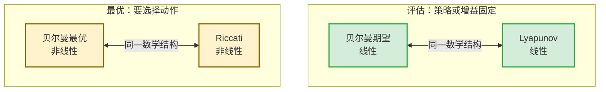

**读图**：固定策略做价值评估，等价于固定反馈增益后解 Lyapunov 方程；一旦要挑最优动作或最优控制量，两边都会进入非线性问题。于是策略迭代与 Kleinman 迭代也自然对应：先评估当前方案，再用评估结果改进方案，循环到不再变化。

既然都是「鸡生蛋」，两边就都只能**猜一个开头，然后反复迭代**。而且迭代的步骤也对得上：

| 步骤 | 最优控制（**Kleinman 迭代**） | 强化学习（**策略迭代**，第 8 章） |
|---|---|---|
| 开头 | 随便猜一个能稳住的增益 $\mathbf{K}_0$ | 随便来一套打法 $\pi_0$ |
| **第 1 步** | 用当前 $\mathbf{K}$ 解 **Lyapunov 方程** 得 $\mathbf{P}$ | 用当前 $\pi$ 算出 $V^\pi$（**策略评估**） |
| **第 2 步** | 用 $\mathbf{P}$ 算新增益 $\mathbf{K} = (\mathbf{R}{+}\mathbf{B}^\top\mathbf{P}\mathbf{B})^{-1}\mathbf{B}^\top\mathbf{P}\mathbf{A}$ | 用 $V^\pi$ 挑更好的动作（**策略改进**） |
| 然后 | 回到第 1 步 | 回到第 1 步 |
| 停在哪 | $\mathbf{K}$ 不再变 | $\pi$ 不再变 |

> ★★★ **Kleinman 迭代就是线性系统上的策略迭代。同一个算法，两个学科各自起了个名字。**
>
> 这条对照的价值在于：**你在最优控制里建立的所有直觉，可以直接搬到强化学习。**
> 比如「初始增益必须是能稳住系统的」这条要求，在 RL 里对应的就是「初始策略不能烂到一开始就摔」——
> 这也是为什么 G1 训练要从平地起步、要用课程学习。

> **面试可以这样说**：
> 「贝尔曼期望方程对 $V$ 是线性的，结构上就是给定增益 $\mathbf{K}$ 的 Lyapunov 方程；
> 加上 $\max_a$ 之后变成贝尔曼最优方程，非线性，对应 Riccati —— Riccati 里那个二次项正是 $\min_u$ 的产物，
> 是把最优 $u^*=-(\mathbf{R}+\mathbf{B}^\top\mathbf{P}\mathbf{B})^{-1}\mathbf{B}^\top\mathbf{P}\mathbf{A}x$ 代回去得到的。
> 所以最优控制的 Kleinman 迭代和强化学习的策略迭代本质是同一件事：解 Lyapunov = 策略评估，更新增益 = 策略改进。」

## 7.4 为什么 PPO 根本不解这个方程

〔源码核实〕**rsl-rl 的 PPO 实现里没有任何一处对动作取 max。** critic 学的是 $V^{\pi}$（当前策略的价值），不是 $V^*$。

**原因**：$\max_a$ 要求**把所有动作枚举一遍**。

G1 的动作是 **29 维连续量**〔配置核实〕。哪怕每个关节只离散成 10 档，也是 $10^{29}$ 种组合。**这个 max 算不了。**

> **这是理解现代强化学习分家的关键**：
> - 动作**离散且不多**（围棋、Atari）→ 可以枚举 → **可以用 max** → **Q-learning / DQN 一家**
> - 动作**连续且高维**（人形、机械臂）→ 枚举不了 → **不能用 max** → **策略梯度 / PPO 一家**
>
> **所以 G1 用 PPO 不是选择，是必然。**（第 9 章展开）

---

# 第 8 章 · 最优策略、策略迭代、值迭代

## 8.1 最优策略是什么

$$\pi^*(s) \;=\; \arg\max_a\, Q^*(s,a)$$

**读作**：在每个局面上，挑 $Q^*$ 最大的那一手。

**三条结论（只陈述，不证）：**

1. **最优策略一定存在**（有限 MDP 里）。
2. **最优策略可以是确定性的**——不需要掷骰子。
3. **最优策略是「逐点最优」的**：它在**每一个**局面上都不比任何其他策略差。

> 第 3 条很重要：**不存在「这套打法总体更好但某些局面更差」的最优策略。** 最优就是全面最优。

## 8.2 策略改进定理（只陈述）

给定策略 $\pi$，已经算出了 $Q^\pi$。构造新策略：

$$\pi'(s) = \arg\max_a Q^\pi(s,a)$$

**结论**：

$$V^{\pi'}(s) \;\ge\; V^{\pi}(s)\quad \text{对所有 } s$$

**读作**：新打法在**每一个**局面上都不比旧打法差。

**这个定理是整个强化学习的地基。** 它保证了「评估 → 贪心改进 → 再评估 → 再改进」这个循环**只会变好，不会变坏**。

## 8.3 策略迭代

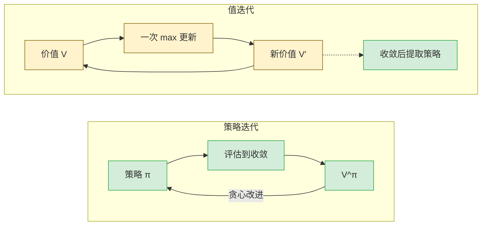

**读图**：策略迭代每次先把当前策略彻底评估到收敛，再贪心改进；值迭代每次只做一次 max 更新，反复收敛后才提取策略。对经典控制而言，左环就是 Kleinman 迭代的同构物：解 Lyapunov 方程相当于策略评估，更新增益相当于策略改进。PPO 位于两端之间：critic 做 `num_learning_epochs=5` 个 epoch 的近似评估，actor 再做受 clip 约束的近似改进，这叫 GPI。

$$\pi_0 \xrightarrow{\text{评估}} V^{\pi_0} \xrightarrow{\text{贪心}} \pi_1 \xrightarrow{\text{评估}} V^{\pi_1} \xrightarrow{\text{贪心}} \pi_2 \to \cdots \to \pi^*$$

**两步交替：**

| 步骤 | 做什么 | 第几章 |
|---|---|---|
| **策略评估** | 固定 $\pi$，**彻底算准** $V^\pi$ | 第 5、6 章（= 解 Lyapunov 方程） |
| **策略改进** | 固定 $V^\pi$，每个局面贪心挑最好的一手 | 8.2 |

**特点**：评估那一步**要算到收敛**，很慢；但改进的步子大，**总的轮数很少**。

## 8.4 值迭代

**想法**：评估那一步凭什么要算到收敛？**扫一遍就改进，行不行？**

$$V_{k+1}(s) \;=\; \max_a \Big[ r(s,a) + \gamma \sum_{s'} P(s'\mid s,a)\, V_k(s') \Big]$$

**读作**：直接把贝尔曼最优方程当赋值语句反复执行。

**特点**：每轮很便宜，但**轮数多**。

| | 策略迭代 | 值迭代 |
|---|---|---|
| 评估算到 | 收敛 | **只扫一遍** |
| 每轮成本 | 高 | 低 |
| 轮数 | **少** | 多 |
| 有没有显式策略 | **有** | 没有（最后才提取） |

## 8.5 ★ 完整手算例子（务必自己算一遍）

**问题设定**（$\gamma = 0.5$，故意取大打折方便手算）：

- 状态：**A = 稳**、**B = 危**、**T = 摔倒**（终止状态，$V(T)=0$ 永远不变）

| 局面 | 可选动作 | 立刻得分 | 去哪 |
|---|---|---|---|
| A | 慢走 | +1 | 留在 A |
| A | 快走 | +3 | 到 B |
| B | 救一下 | 0 | 回 A |
| B | 硬撑 | +0.5 | 到 T（摔） |

### 第一部分：策略迭代

**初始策略 $\pi_0$ = {A: 慢走, B: 硬撑}**（一个很烂的打法）

**评估 $\pi_0$**（解线性方程组）：

$$V(A) = 1 + 0.5\,V(A) \;\Rightarrow\; 0.5\,V(A) = 1 \;\Rightarrow\; V(A) = 2$$
$$V(B) = 0.5 + 0.5\,V(T) = 0.5 + 0 = 0.5$$

得 $V^{\pi_0} = (2,\ 0.5)$。

**改进**（用 $V^{\pi_0}$ 算每一手的 $Q$，取大的）：

| 局面 | 动作 | $Q = r + \gamma V(\text{下一个局面})$ | 值 | 选谁 |
|---|---|---|---|---|
| A | 慢走 | $1 + 0.5 \times V(A) = 1 + 0.5(2)$ | 2 | |
| A | 快走 | $3 + 0.5 \times V(B) = 3 + 0.5(0.5)$ | **3.25** | ✅ |
| B | 救 | $0 + 0.5 \times V(A) = 0 + 0.5(2)$ | **1.0** | ✅ |
| B | 硬撑 | $0.5 + 0.5 \times V(T) = 0.5 + 0$ | 0.5 | |

**新策略 $\pi_1$ = {A: 快走, B: 救}**

**评估 $\pi_1$**：

$$V(A) = 3 + 0.5\,V(B), \qquad V(B) = 0 + 0.5\,V(A)$$

代入：$V(A) = 3 + 0.5(0.5\,V(A)) = 3 + 0.25\,V(A) \Rightarrow 0.75\,V(A)=3 \Rightarrow V(A)=4$，$V(B)=2$。

**再改进**：

| 局面 | 动作 | $Q$ | 值 | 选谁 |
|---|---|---|---|---|
| A | 慢走 | $1+0.5(4)$ | 3 | |
| A | 快走 | $3+0.5(2)$ | **4** | ✅ |
| B | 救 | $0+0.5(4)$ | **2** | ✅ |
| B | 硬撑 | $0.5+0$ | 0.5 | |

**策略没变 → 收敛。** $\pi^* = \{A:\text{快走},\ B:\text{救}\}$，$V^* = (4,\ 2)$。

**策略迭代只用了 2 轮。**

### 第二部分：值迭代

从 $V_0 = (0,\ 0)$ 开始，每轮 $V_{k+1}(s) = \max_a [r + 0.5 V_k(s')]$：

| 轮 | $V(A)$ 的计算 | $V(A)$ | $V(B)$ 的计算 | $V(B)$ | 此时贪心策略 |
|---|---|---|---|---|---|
| 0 | — | 0 | — | 0 | — |
| 1 | $\max(1{+}0,\ 3{+}0)$ | **3** | $\max(0{+}0,\ 0.5)$ | **0.5** | **{快走, 救}** ✅ 已最优 |
| 2 | $\max(1{+}1.5,\ 3{+}0.25)$ | 3.25 | $\max(0{+}1.5,\ 0.5)$ | 1.5 | {快走, 救} |
| 3 | $\max(1{+}1.625,\ 3{+}0.75)$ | 3.75 | $\max(1.625,\ 0.5)$ | 1.625 | {快走, 救} |
| 4 | $\max(1{+}1.875,\ 3{+}0.8125)$ | 3.8125 | $\max(1.875,\ 0.5)$ | 1.875 | {快走, 救} |
| … | | ↓ | | ↓ | |
| ∞ | | **4** | | **2** | {快走, 救} |

### ★★★ 从这个例子必须带走的洞察

看第 1 轮：$V=(3,\ 0.5)$，离真值 $(4,\ 2)$ **差得很远**（B 差了 4 倍！）。

**但此时贪心出来的策略已经是最优的了。**

$$\boxed{\textbf{策略比价值先收敛。}}$$

**为什么**：策略只需要知道 $Q$ 之间的**大小顺序**，不需要知道 $Q$ 的**准确数值**。
第 1 轮 A 处：$Q(\text{慢走})=1 < Q(\text{快走})=3$，**顺序已经对了**，虽然两个数都不准。

**这条洞察直接解释了 PPO 里 critic 的角色：**

> **critic 不需要把 $V$ 估准，只需要让优势的正负号大致正确。**
>
> 训练日志里 `value_function_loss` 一直不小（比如 0.5、1.0），**这完全正常，不是 bug**。策略照样在变好。
> **应该盯的是 `Mean reward` 和 `Mean episode length`，不是 value loss。**

**只有一种情况需要 $V$ 估得准**：两个动作的 $Q$ 差距 $\Delta$ 很小时，估计误差必须小于 $\Delta/2$ 才能排对序。**所以精度要求由「动作之间的差距」决定，不由「价值的绝对大小」决定。**

## 8.6 收敛速度

$$\|V_{k+1} - V^*\|_\infty \;\le\; \gamma\,\|V_k - V^*\|_\infty$$

**读作**：值迭代每做一轮，**最大误差至少缩小到原来的 $\gamma$ 倍**。（数学上叫「$\gamma$-压缩映射」，不证。）

〔同模型自洽算得〕$\gamma=0.99$ 时，误差压小 100 倍需要：

$$0.99^n \le 0.01 \;\Rightarrow\; n \ge \frac{\ln 0.01}{\ln 0.99} \approx 458 \ \text{轮}$$

> **$\gamma$ 越接近 1，看得越远，但收敛越慢。这就是折扣因子的真实代价。**

## 8.7 广义策略迭代（GPI）—— PPO 属于哪一档

策略迭代和值迭代，其实是**同一根光谱的两端**：

| 评估做多少 | 名字 |
|---|---|
| 做到完全收敛 | **策略迭代** |
| **只扫一遍** | **值迭代** |
| **做几个 epoch 的梯度下降** | **PPO** ← 〔配置核实〕`num_learning_epochs=5` |

**这个统一框架叫广义策略迭代（GPI）**：

$$\text{评估（让 } V \text{ 追上 } \pi) \;\rightleftarrows\; \text{改进（让 } \pi \text{ 对 } V \text{ 贪心)}$$

**两个过程互相追赶，同时收敛。** 几乎所有强化学习算法都是 GPI 的一个实例，区别只在**两边各做多少**。

> **面试可以这样说**：「PPO 是广义策略迭代的一个实例：critic 做几个 epoch 的近似策略评估，actor 做受 clip 约束的近似策略改进。它既不是策略迭代也不是值迭代，是中间档。」

---

---

# 第 9 章 · 三道门槛垮掉 → 现代强化学习

## 9.1 前八章成立的三个前提

| 前提 | 用在哪 | G1 上成不成立 |
|---|---|---|
| **知道 $P(s'\mid s,a)$** | 所有 $\sum_{s'} P(\cdot)$ | ❌ 接触动力学建不准 |
| **状态数有限，能建表** | $V(s)$ 是个查找表 | ❌ 480 维连续 |
| **动作能枚举** | $\max_a$、$\arg\max_a$ | ❌ 29 维连续 |

**三条全垮。第 1–8 章的算法一个都不能直接用。**

**现代强化学习的全部内容，就是逐条绕过这三道门槛。**

## 9.2 三个替代方案

### 门槛一：不知道 $P$ → **用采样代替求期望**

$$\sum_{s'} P(s'\mid s,a) f(s') \;\;\longrightarrow\;\; \text{让机器人真跑一步，用实际到达的 } s' \text{ 的 } f(s')$$

**读作**：算不出期望，就**用样本平均代替期望**。

这就是第 6 章 TD 和蒙特卡洛做的事。**「强化学习不需要模型」这句话的全部含义就在这里：把 $\sum_{s'} P(\cdot)$ 换成「跑一次看看」。**

### 门槛二：状态太多 → **用神经网络代替查找表**

$$V(s) \ \text{查表} \;\;\longrightarrow\;\; V_\phi(s) \ \text{神经网络}$$

〔配置核实〕G1 的两个网络都是 `[512, 256, 128]`，激活函数 `elu`。

> ★ **对照**：这就是**函数逼近**。你用 RBF-NN 逼近机械臂的未知动力学项，跟这里用 MLP 逼近 $V$，**是同一类做法**。
> **区别**：你的 RBF-NN 有 Lyapunov 意义下的**跟踪误差有界性证明**；这里的 MLP **没有任何这类保证**。这是强化学习相对你熟悉的自适应控制**最大的短板**，也是面试里最该主动承认的一点。

### 门槛三：动作连续 → **绕开 argmax，直接学策略**

这一条最关键。$\arg\max_a$ 在 29 维连续动作上根本没法做。

**解决办法：干脆不做 argmax，把策略本身参数化成一个网络，直接对它求梯度。**

$$\pi_\theta(a \mid s) = \mathcal{N}\big(\mu_\theta(s),\ \sigma^2\big)$$

**读作**：策略网络输出一个高斯分布的**均值**（29 维），标准差单独存一份参数〔配置核实〕`init_noise_std=1.0`。采样得到实际动作。

## 9.3 现代强化学习的两大家族

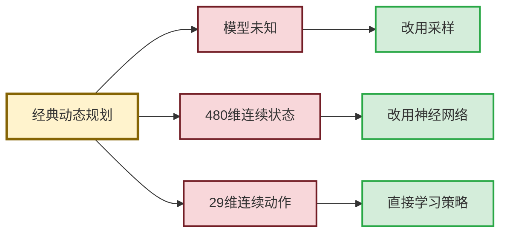

**读图**：前面动态规划依赖的三件事，在 G1 上分别被接触动力学、连续高维状态和连续高维动作卡住。现代 RL 不是凭空换了一套理论，而是逐项替换：算不出模型期望就采样，状态不能建表就用神经网络，动作不能枚举做 argmax 就直接学习策略。

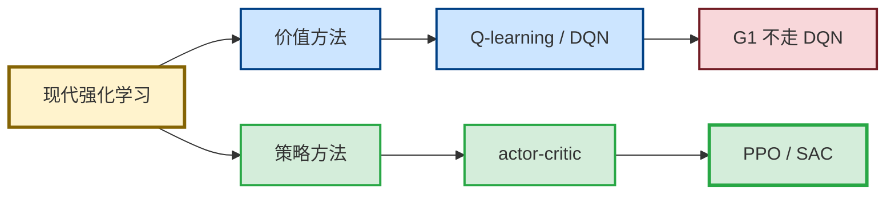

**读图**：价值方法靠 $Q$ 值再做 argmax，适合可枚举动作；G1 的动作是连续量，因此不走 DQN 这条支路。策略方法让网络直接给动作，actor-critic 再用价值估计辅助训练，所以 PPO 和 SAC 能落到连续控制。这里的 critic 只负责评价，不替 actor 选动作。

| | **价值方法** | **策略梯度方法** |
|---|---|---|
| 学什么 | $Q(s,a)$ | $\pi_\theta(a\mid s)$ |
| 怎么选动作 | $\arg\max_a Q$ | **网络直接输出** |
| 动作空间 | **必须离散** | **连续也行** |
| 代表算法 | Q-learning, DQN | REINFORCE, TRPO, **PPO** |
| 数据怎么用 | off-policy，可复用 | on-policy，用完就扔 |

**中间派：actor-critic**（既学策略又学价值，但价值只用来算优势，不用来 argmax）→ **PPO / SAC / DDPG 都在这一档**。

> **面试可以这样说**：
> 「G1 的动作是 29 维连续量，Q-learning 那条路要求对动作做 argmax，在连续高维空间上做不了。所以只能走策略梯度。PPO 是 actor-critic：critic 学 V 用来算优势，它不参与选动作，所以不需要 argmax。」

---

## ★ 先把「价值方法」这一支走完：Q-learning 与 DQN

> **G1 运控不会用 DQN，为什么还要讲？** 三个理由：
> 1. 它是**贝尔曼最优方程的直接采样版**，学它能把第 7 章坐实
> 2. 它是 **SAC 的直接基础**（第 12 章要用）
> 3. **面试常问**「PPO 和 DQN 什么区别」

> **先说清楚**：**G1 运控不会用 DQN。** 讲它有三个理由：
> 1. 它是 **SAC 的直接基础**（第 12 章要用）
> 2. **面试常问**「PPO 和 DQN 什么区别」
> 3. 它是**贝尔曼最优方程的直接采样版**，学它能把第 7 章坐实

## 9.4 Q-learning：把贝尔曼最优方程变成一条更新式

回忆第 7 章的贝尔曼最优方程：

$$Q^*(s,a) = r(s,a) + \gamma \sum_{s'} P(s'\mid s,a)\, \max_{a'} Q^*(s',a')$$

**问题**：$\sum_{s'} P(\cdot)$ 需要知道转移概率，我们不知道（第 9 章门槛一）。

**办法**（第 9.2 节的招）：**用实际采到的那一个 $s'$ 代替求期望。**

$$\boxed{\;Q(s_t,a_t) \;\leftarrow\; Q(s_t,a_t) + \alpha\Big[\, \underbrace{r_{t+1} + \gamma \max_{a'} Q(s_{t+1},a')}_{\text{目标}} - Q(s_t,a_t) \,\Big]\;}$$

**读作**：把 $Q$ 往「这一步真实得的分 + 打折 × 下个局面里**最好那一手**的分」的方向挪一小步。

**和第 6.3 节的 TD 对比，只差一个字：**

| | TD（学 $V^\pi$） | Q-learning（学 $Q^*$） |
|---|---|---|
| 目标 | $r + \gamma V(s_{t+1})$ | $r + \gamma \max_{a'} Q(s_{t+1},a')$ |
| 学到的是 | **当前策略的**价值 | **最优**策略的价值 |
| 对应方程 | 贝尔曼**期望**方程 | 贝尔曼**最优**方程 |

> ★ **一句话**：**Q-learning 就是值迭代（第 8.4 节）的采样版本。**
> 值迭代要对所有 $s'$ 按 $P$ 求和；Q-learning 只用实际到达的那一个 $s'$，用大量样本把期望「跑」出来。

## 9.5 ★ off-policy 是什么意思（这里最容易糊涂）

注意更新式里那个 $\max_{a'}$：**它用的是「下个局面里最好的那一手」，而不是「我实际走的那一手」。**

$$\text{实际执行的策略（会随机探索）} \;\neq\; \text{被学习的策略（永远贪心）}$$

| | 行为策略 behavior policy | 目标策略 target policy |
|---|---|---|
| 干什么 | **实际去采数据** | **被学习的那个** |
| Q-learning 里是 | $\epsilon$-贪心（带随机探索） | **纯贪心 $\arg\max Q$** |
| 两者相同吗 | **不同 → off-policy** | |
| PPO 里 | 当前策略 | 当前策略 |
| | **相同 → on-policy** | |

**off-policy 的直接好处：数据可以反复用、可以用别人采的数据。**

因为更新式里**没有出现「这条数据是哪个策略采的」**——只要 $(s,a,r,s')$ 这个四元组是真实的物理转移，它就永远有效。

> **对比第 11.7 节**：PPO 必须扔数据，因为重要性采样比 $\pi_\theta/\pi_{\theta_{old}}$ 要求新旧策略接近。**Q-learning 没有这个比值，所以不受此限。**

## 9.6 DQN：把 Q 表换成神经网络，加两个补丁

$Q(s,a)$ 状态多了建不了表（第 9 章门槛二）→ 用网络 $Q_\theta(s,a)$。

**但直接换会训崩。DQN（2015, Nature）加了两个关键补丁：**

| 补丁 | 解决什么 | 怎么做 |
|---|---|---|
| **经验回放 replay buffer** | 连续采的数据**高度相关**，违反梯度下降的独立同分布假设 | 存进大池子，**随机抽 batch** 训练 |
| **目标网络 target network** | 目标 $r+\gamma\max Q_\theta$ 里也含 $\theta$，**自己追自己会震荡** | 用一份**冻结的旧权重** $\theta^-$ 算目标，隔 N 步才同步 |

损失函数：

$$L(\theta) \;=\; \mathbb{E}_{(s,a,r,s')\sim \mathcal{D}}\Big[\big(\, r + \gamma \max_{a'} Q_{\theta^-}(s',a') \;-\; Q_\theta(s,a) \,\big)^2\Big]$$

**读作**：让网络预测的 $Q$，去逼近「真实奖励 + 打折的未来最优 $Q$（用冻结的旧网络算）」，用平方误差。

> ★ **对照**：目标网络这个技巧，本质是**把一个不动点迭代的右端固定住**，避免左右两边同时动。
> 你在做数值迭代求解非线性方程时，也常把某些项**冻在上一步**（类似 Gauss-Seidel vs Jacobi 的取舍）。**同一个数值稳定性思想。**

**网络结构上的关键设计**：$Q_\theta$ 的输入只有 $s$，输出是**每个动作各一个 $Q$ 值**（比如 Atari 上 18 个输出）。这样求 $\max$ 只是一次前向 + 取最大值。

**★ 这个设计恰恰暴露了它的死穴：输出维度 = 动作个数。29 个连续关节，输出层要多少个神经元？无穷个。**

## 9.7 为什么腿足运控用不了 DQN

| 门槛 | DQN 的处理 | G1 上 |
|---|---|---|
| 不知道 $P$ | ✅ 采样解决 | 没问题 |
| 状态太多 | ✅ 网络解决 | 没问题 |
| **动作连续** | ❌ **必须枚举做 $\max$** | **29 维连续，做不了** |

**硬要用只能离散化**：每个关节切 $k$ 档 → $k^{29}$ 种组合。$k=3$ 就已经是 $6.8\times 10^{13}$。

**而且离散化本身有害**：关节角度是连续的物理量，切成几档会引入**量化误差**和**动作抖动**——这对需要平滑力矩的机器人是灾难。

> **面试可以这样说**：
> 「DQN 的输出层维度等于动作个数，它必须对动作做 argmax。G1 是 29 维连续动作，离散化后组合爆炸，而且量化会让关节指令不平滑。所以腿足运控这条路走不通，只能走策略梯度或者确定性策略梯度（DDPG/SAC）那一支。」

---

---

# 第 10 章 · 策略梯度与 actor-critic

## 10.1 目标

$$J(\theta) \;=\; \mathbb{E}_{\pi_\theta}\!\left[\, G_0 \,\right]$$

**读作**：目标是「按这套策略跑一局，平均能得多少分」。**要让它最大。**

## 10.2 策略梯度定理

> **这是整个 PPO 的心脏。** 前面所有章节都是铺垫，PPO 之后所有内容都是在这条式子上打补丁。
> **所以这一节拆到不能再细。**

### 10.2.1 先说清楚 $\theta$ 和 $J(\theta)$ 是什么

| 符号 | 是什么 | G1 上具体是什么 |
|---|---|---|
| $\theta$ | 神经网络的**全部权重**，就是一大堆数 | 三层 MLP `[512,256,128]`〔配置核实〕，**大约 20 万个数** |
| $\pi_\theta(a\mid s)$ | 这套权重决定的**打法** | 看到 480 维观测，吐出 29 个关节该转到哪 |
| $J(\theta)$ | 用这套权重去跑，**平均一局能拿多少分** | 跑 20 秒，19 项奖励的加权总和 |

**目标很朴素**：找一组 $\theta$ 让 $J(\theta)$ 最大。

方法也很朴素 —— **梯度上升**，跟你调 PID 参数往好的方向挪是一个意思：

$$\theta \;\leftarrow\; \theta + \alpha\, \nabla_\theta J(\theta)$$

**读作**：往「让分数变高」的方向挪一小步。$\alpha$ 是步长（学习率）。

**所以全部问题变成一个**：$\nabla_\theta J(\theta)$ 怎么算？

---

### 10.2.2 ★ 难点在哪：动一下权重，连「走到哪」都变了

这是 RL 和普通深度学习**最本质的区别**，值得停下来想清楚。

**普通的监督学习**（比如图像分类）：

- 数据集是**固定的**，10 万张猫狗照片摆在那儿
- 你改权重，只改变「对同一张照片的输出」
- 求导直接求，没有任何麻烦

**强化学习**：

- 你改权重 → **动作变了** → **机器人走到的地方也变了** → **下一步看到的观测全变了**
- **数据分布本身是 $\theta$ 的函数**

> **打个比方**：你想算「把方向盘握法改一改，油耗会降多少」。
> 麻烦在于：**换个握法之后，你开的路线也变了**，遇到的红绿灯、上下坡全变了。
> 所以你不能只算「同一条路上油耗变化多少」——**路本身跟着变了。**

写成式子，$J(\theta)$ 长这样：

$$J(\theta) = \sum_{\tau} \underbrace{P_\theta(\tau)}_{\text{走出这条轨迹的概率}} \cdot \underbrace{R(\tau)}_{\text{这条轨迹的总分}}$$

**$\theta$ 藏在概率 $P_\theta(\tau)$ 里面。** 要对它求导，就得对一个**概率分布**求导。这就是难点。

---

### 10.2.3 ★★ 破解的关键：一个高中就学过的恒等式


**读图**：恒等式 $\nabla_\theta f(\theta)=f(\theta)\nabla_\theta\log f(\theta)$ 的关键，是把原来的概率 $f(\theta)$ 乘回了右边。代入轨迹概率后，“概率乘某个量再求和”正好变成期望，于是原本无法直接计算的“对分布求导”，就能改成让机器人采样很多条轨迹后求平均；这一步是所有策略梯度算法的地基。

对 $\log$ 求导，链式法则：

$$\nabla_\theta \log f(\theta) \;=\; \frac{\nabla_\theta f(\theta)}{f(\theta)}$$

（因为 $(\ln x)' = 1/x$，再乘上里层导数。）

**把它反过来写**：

$$\boxed{\;\nabla_\theta f(\theta) \;=\; f(\theta)\cdot \nabla_\theta \log f(\theta)\;}$$

**这条叫「log 导数技巧」，整个策略梯度就靠它。**

**它凭什么值钱？** 因为等号右边**冒出来一个 $f(\theta)$ 乘在前面**。而 $f$ 正好是概率 —— **「概率乘以某个东西再加起来」，那不就是求平均（期望）吗！**

用它改写：

$$\nabla_\theta J = \sum_\tau \nabla_\theta P_\theta(\tau)\, R(\tau) \;=\; \sum_\tau \underbrace{P_\theta(\tau)}_{\text{权重}} \big[\nabla_\theta \log P_\theta(\tau)\, R(\tau)\big] \;=\; \mathbb{E}\big[\nabla_\theta \log P_\theta(\tau)\cdot R(\tau)\big]$$

> ★★ **这一步的意义**：左边是「**对分布求导**」——没法算；
> 右边是「**在分布下取平均**」——**跑 4096 个机器人，把每个样本的值加起来除以个数就行了。**
>
> **一个不可计算的量，变成了一个可以用采样估计的量。这就是全部的魔法。**

再往下推（用到「环境的转移概率 $P(s'\mid s,a)$ 不含 $\theta$，求导时直接消掉」这一条），并把 $R(\tau)$ 换成更好的 $A^\pi$（理由见 4.4），就得到：

$$\boxed{\;\nabla_\theta J(\theta) \;=\; \mathbb{E}_{\pi_\theta}\!\Big[\, \nabla_\theta \log \pi_\theta(a\mid s)\ \cdot\ A^{\pi}(s,a) \,\Big]\;}$$

> ★ **注意那个被消掉的 $P(s'\mid s,a)$**：这就是第 9 章说的「**不需要知道世界的规律**」的来源。
> 它在求 $\log$ 的导数时因为不含 $\theta$ 而变成 0，**自己消失了**。

---

### 10.2.4 ★★★ 高斯策略下，$\nabla\log\pi$ 到底长什么样

上面还是抽象。**代入 G1 实际用的高斯策略，它会变得极其具体。**

策略输出的是一个正态分布：均值 $\mu_\theta(s)$（网络算出来的），标准差 $\sigma$（探索幅度）。
把正态分布的密度取 $\log$：

$$\log \pi_\theta(a\mid s) \;=\; -\frac{(a-\mu_\theta)^2}{2\sigma^2} \;-\; \log\sigma \;-\; \underbrace{\tfrac12\log 2\pi}_{\text{常数，求导为 0}}$$

对均值 $\mu$ 求导（就是普通的复合函数求导）：

$$\boxed{\;\frac{\partial \log\pi}{\partial \mu} \;=\; \frac{a - \mu}{\sigma^2}\;}$$

**这个式子简单到可以直接翻译成人话：**

| 符号 | 含义 |
|---|---|
| $\mu$ | **你平时的做法**（网络认为该转到的角度） |
| $a$ | **这次实际做的**（在 $\mu$ 上加了随机噪声之后采样出来的） |
| $a - \mu$ | **这次比平时多做了多少** |
| $\div\ \sigma^2$ | 除以探索幅度（**平时就很随机的话，这次偏一点不算什么**） |

再乘上优势 $A$，完整的更新方向是：

$$\Delta\mu \;\propto\; \underbrace{(a-\mu)}_{\text{这次偏了多少}} \times \underbrace{A}_{\text{结果好不好}}$$

**四种情况，穷举一遍：**

| 这次比平时 | 结果 | 乘积 | 网络怎么改 |
|---|---|---|---|
| **多**做了（$a>\mu$） | **好**（$A>0$） | 正 | **把平时的做法往「多」调** ✅ |
| **多**做了 | **差**（$A<0$） | 负 | 往「少」调 |
| **少**做了（$a<\mu$） | **好** | 正 | 往「少」调 ✅ |
| **少**做了 | **差** | 负 | 往「多」调 |

> ★★★ **一句话概括整个策略梯度**：
> **「这次比平时用力了一点，而且效果更好 —— 那以后平时就用力一点。」**
>
> **G1 上的实际画面**：某一帧，左膝关节的网络均值是 $\mu=0.30$ rad，加噪声后实际发出 $a=0.34$ rad，
> 这一步优势 $A=+0.2$（比平均走得稳）。于是 $(a-\mu)\times A = 0.04 \times 0.2 > 0$，
> **梯度就把「左膝在这种观测下的默认角度」往大的方向推一点点。**
> 4096 个环境、每次更新 98304 个这样的样本，一起投票，**推的方向就是所有环境的共识。**

> ★ **顺便解答一个常见困惑：为什么非要套个 $\log$？**
> 三个理由：① 10.2.3 那个恒等式必须要它；
> ② 高斯密度里有 $e^{(\cdot)}$，取 $\log$ 正好把指数消掉，剩下干净的二次式；
> ③ 概率连乘容易下溢到 0，$\log$ 把连乘变连加，**数值上稳定得多**（11.2 节代码里的 `torch.exp(logp - logp_old)` 就是这个原因）。

---

### 10.2.5 逐块读一遍最终式子

$$\nabla_\theta J(\theta) \;=\; \mathbb{E}_{\pi_\theta}\!\Big[\, \nabla_\theta \log \pi_\theta(a\mid s)\ \cdot\ A^{\pi}(s,a) \,\Big]$$

| 部分 | 读作 | 作用 |
|---|---|---|
| $\mathbb{E}_{\pi_\theta}[\cdot]$ | 「用**当前**策略跑一批数据，求平均」 | ★ 下标 $\pi_\theta$ 是 **on-policy 的根源**（11.7 节） |
| $\nabla_\theta \log \pi_\theta(a\mid s)$ | 「往哪调权重，能让这一手更可能被选中」 | **方向** |
| $A^\pi(s,a)$ | 「这一手比平均好多少」 | **大小和正负号** |
| 两者相乘 | | **好的多做，坏的少做** |

**整句话读作**：
> **优势为正的动作，把它的概率往上推；优势为负的动作，把它的概率往下压。推多用力，由优势的大小决定。**

**这就是全部。整个 PPO 就是在这句话上加三道安全闸（第 11 章）。**

## 10.3 ★ 这个定理凭什么重要

**它里面没有 $\max$，没有 $\arg\max$，也没有 $P(s'\mid s,a)$。**

| 门槛 | 怎么绕过的 |
|---|---|
| 不知道 $P$ | 期望 $\mathbb{E}$ 用采样估计 |
| 状态太多 | $\pi_\theta$ 是神经网络 |
| **动作连续** | **公式里根本没有 argmax** |

**三道门槛一次全过。这就是策略梯度定理的全部价值。**

## 10.4 actor-critic 的分工

$A^\pi(s,a)$ 是要估的。$A = Q - V$，需要 $V$。**于是需要第二个网络。**

| 网络 | 输入 | 输出 | 职责 |
|---|---|---|---|
| **actor**（策略网络） | 480 维观测 | 29 维动作均值 | **做决策** |
| **critic**（价值网络） | 495 维观测 | **1 个数** $V(s)$ | **打分（只在训练时用）** |

**关键点：**

1. **部署时只带 actor。** critic 训练完就扔掉。
2. **critic 输出只有 1 维。** 它不预测未来状态，只回答「这个局面值多少分」。
3. **critic 的唯一用途是当减数**（第 4.4 节），用来把优势的共模去掉。

> ★ **对照**：actor 是控制器，critic 是**在线性能评估器**。
> 在自适应控制里，你也常有「控制律 + 参数估计律」两套东西并行；这里是「策略网络 + 价值网络」并行，**结构上同源**。

---

# 第 11 章 · PPO

## 11.1 朴素策略梯度的致命问题

按 10.2 直接做梯度上升，会出事：

| 问题 | 后果 |
|---|---|
| **步子太大** | 策略一步跳到很差的区域，**之后采到的数据全是垃圾，再也爬不回来** |
| **数据只能用一次** | 策略一变，旧数据就不符合新策略的分布，浪费严重 |

**第二个问题的名字叫 on-policy 限制。**

> ★ **对照**：这跟自适应控制里的**参数漂移**是同一类问题。
> 你用**投影算子**或 **σ-modification** 强行把参数估计限制在一个可信集合里。**PPO 干的是同一件事。**

## 11.2 重要性采样比

想用旧策略采的数据来更新新策略，需要一个修正系数：

$$r_t(\theta) \;=\; \frac{\pi_\theta(a_t \mid s_t)}{\pi_{\theta_{\text{old}}}(a_t \mid s_t)}$$

**读作**：**同一个动作，新策略选它的概率是旧策略的几倍。**

$$r = 1:\ \text{没变} \qquad r = 1.3:\ \text{新策略更爱这一手了} \qquad r = 0.7:\ \text{新策略不爱了}$$

〔源码核实〕`rsl_rl/algorithms/ppo.py:294`：

```python
ratio = torch.exp(actions_log_prob_batch - torch.squeeze(old_actions_log_prob_batch))
```

**为什么用 exp 和减法**：$\dfrac{a}{b} = e^{\ln a - \ln b}$。概率连乘容易下溢，**在对数域做减法在数值上稳定得多**。

## 11.3 ★★ PPO 的核心：clip

$$\boxed{\;L^{\text{CLIP}}(\theta) \;=\; \mathbb{E}\Big[\, \min\big(\, r_t(\theta)\,\hat A_t,\ \ \text{clip}(r_t(\theta),\ 1-\epsilon,\ 1+\epsilon)\,\hat A_t \,\big) \,\Big]\;}$$

〔配置核实〕$\epsilon = 0.2$（`clip_param=0.2`），所以 $r$ 被夹在 $[0.8,\ 1.2]$。


**读图**：$r=1$ 表示新旧策略选择这个动作的概率没变。$\hat A>0$ 时，只在 $r>1.2$ 后形成平台；$\hat A<0$ 时，只在 $r<0.8$ 前形成平台，所以不能把 clip 误记成“两边同时把梯度归零”。平台表示代理目标不再奖励继续朝外更新，不是把实际概率比物理钳死。它和自适应控制的投影算子都在限制更新范围，但 PPO clip 只是工程启发式，没有投影算子的 Lyapunov 有界性保证。

**这个式子拆开看，只有两种情况：**

| 情况 | 含义 | clip 干了什么 | 效果 |
|---|---|---|---|
| $\hat A > 0$（好动作） | 想提高它的概率 | $r$ 超过 1.2 就**截断**，梯度归零 | **好动作也不许一次加太多** |
| $\hat A < 0$（坏动作） | 想降低它的概率 | $r$ 低于 0.8 就**截断**，梯度归零 | **坏动作也不许一次砍太狠** |

**用大白话说：**

> **「这一手不错，多做一点——但一次最多多做 20%。」**
> **「这一手不行，少做一点——但一次最多少做 20%。」**

**为什么外层是 $\min$**：取两项中较小的那个，等于**总是选更保守的估计**。这样保证新目标是真实目标的一个**下界**，优化下界不会把自己骗了。

### 11.3.1 ★★ 对照自适应控制的投影算子（这一段拆细讲）

这条对照面试价值很高，但**必须先把「参数漂移」是什么讲清楚**，否则说了等于没说。

#### 先讲你熟的那一半：参数漂移

Slotine-Li 自适应律长这样（$\hat\Theta$ 是参数估计，$s$ 是滑模面，$Y$ 是回归矩阵）：

$$\dot{\hat\Theta} \;=\; -\Gamma\, Y^\top s$$

**读作**：**误差往哪偏，参数就往哪个方向调一点。** $\Gamma$ 是调多快的旋钮。

**问题在于**：这条律只保证**跟踪误差**收敛，**不保证参数估计本身有界**。
现实里只要有一点测量噪声或者激励不充分（PE 条件不满足），$\hat\Theta$ 就可能**慢慢往无穷大爬**——
跟踪看着还行，参数已经在天上了，然后某一刻突然发散。**这就是参数漂移。**

#### 你的两个补丁

| 做法 | 公式 | 大白话 |
|---|---|---|
| **投影算子** | 若 $\hat\Theta$ 要跑出可信集合 $\mathcal{S}$，就把梯度里**朝外的那个分量删掉** | **「撞墙就贴着墙走，不许出去」** |
| **σ-modification** | $\dot{\hat\Theta} = -\Gamma Y^\top s \;-\; \sigma \hat\Theta$ | **「加一根皮筋，一直往 0 拽」** |

σ-modification 那一项拆开看：
- $-\sigma\hat\Theta$ ——$\hat\Theta$ 越大，这个拉回来的力越大
- $\sigma$ 是皮筋硬度。太小没用，太大会把真参数也拽偏
- **代价是**：即使参数估对了，皮筋也在拽，所以**存在稳态偏差**。这是你为「不发散」付的钱

#### 现在对回 PPO

| | 自适应控制 | PPO |
|---|---|---|
| 谁会跑飞 | 参数估计 $\hat\Theta$ | 策略网络权重 $\theta$ |
| 跑飞的后果 | 控制律发散 | **采到的数据全是垃圾，再也爬不回来** |
| 限制在哪 | 可信集合 $\mathcal{S}$ | 概率比 $r_t \in [0.8,\ 1.2]$ |
| 手段 | 删掉朝外的梯度分量 | **超出就把梯度置零** |
| **本质** | **一步更新不许离上一步太远** | **完全一样** |

> ★★ **一句话**：**PPO 的 clip = 自适应控制的投影算子。** 都是「更新时强行限制在可信邻域内，防止跑飞」。
>
> **但必须主动说出区别**：你的投影算子是在 **Lyapunov 框架下证明过**信号有界的；
> **PPO 的 clip 是工程启发式，没有任何这类证明**——$\epsilon=0.2$ 这个数是试出来的，不是算出来的。
> 面试时主动讲这个区别，比只说相似之处**加分得多**。

## 11.4 ★ 第二道闸：自适应学习率（这是一个真正的反馈控制器）

〔源码核实〕`rsl_rl/algorithms/ppo.py:259-292`。

### 11.4.1 先看 KL 散度这个式子

$$\text{KL} \;=\; \sum_{i} \left[\, \log\frac{\sigma_{\text{new},i}}{\sigma_{\text{old},i}} \;+\; \frac{\sigma_{\text{old},i}^2 + (\mu_{\text{old},i}-\mu_{\text{new},i})^2}{2\,\sigma_{\text{new},i}^2} \;-\; \frac{1}{2} \,\right]$$

**别被吓到，把每个符号拆开就很简单。**

#### 符号是什么

策略网络输出的不是一个确定动作，而是**一个高斯分布**（钟形曲线）。描述一条钟形曲线只需要两个数：

| 符号 | 念作 | 是什么 | G1 上的实际含义 |
|---|---|---|---|
| $\mu$ | miu | **中心**，钟形曲线的峰在哪 | 网络认为「这个关节最该转到这」，29 维 |
| $\sigma$ | sigma | **胖瘦**，标准差 | **探索幅度**：越胖越敢乱试。初值 `init_noise_std=1.0` |
| 下标 new / old | | 更新后 / 更新前 | 同一个网络，一次梯度更新的前后 |
| $\sum_i$ | | 把 29 个关节各算一遍再加起来 | 每个关节一条独立的钟形曲线 |

#### 三项分别在算什么

| 项 | 在管什么 | 什么时候变大 |
|---|---|---|
| $\log\dfrac{\sigma_{\text{new}}}{\sigma_{\text{old}}}$ | **胖瘦变了多少** | 探索幅度突然放大或缩小 |
| $\dfrac{\sigma_{\text{old}}^2 + (\mu_{\text{old}}-\mu_{\text{new}})^2}{2\sigma_{\text{new}}^2}$ | **中心挪了多少**（挪动量除以胖瘦） | 动作均值跳得远 |
| $-\dfrac{1}{2}$ | 常数，保证两分布完全一样时 KL $=0$ | 不变 |

**验算一下**：如果新旧完全一样（$\mu_{\text{new}}{=}\mu_{\text{old}}$，$\sigma_{\text{new}}{=}\sigma_{\text{old}}$），
第一项 $=\log 1 = 0$，第二项 $= \frac{\sigma^2 + 0}{2\sigma^2} = \frac12$，加上 $-\frac12$，**总和正好是 0**。✅

#### ★ 关键直觉：为什么要除以 $\sigma_{\text{new}}^2$

看第二项的分母。**「挪了多远」这件事要相对于「你本来有多胖」来衡量。**

> **打个比方**：一个人往旁边挪 1 米。
> 如果他站在**足球场**上（$\sigma$ 大），几乎没区别；如果他站在**独木桥**上（$\sigma$ 小），那是天翻地覆。
>
> **所以 KL 衡量的不是「绝对挪了多少」，而是「相对于你自己的不确定性，挪了多少」。**

#### ★★ 算一个具体数，感受 `desired_kl=0.01` 有多严

设 $\sigma$ 不变 $=1.0$，29 个关节每个均值都挪 $\Delta\mu$。式子退化成：

$$\text{KL} = 29 \times \frac{(\Delta\mu)^2}{2}$$

要让 KL 正好等于设定值 0.01：

$$\frac{29\,(\Delta\mu)^2}{2} = 0.01 \;\Longrightarrow\; \Delta\mu \approx 0.026$$

再乘上动作缩放 `scale=0.25`〔配置核实〕，换算成真实关节角度：

$$0.026 \times 0.25 = 0.0066\ \text{rad} \approx \mathbf{0.38^\circ}$$

> ★★★ **翻译**：**一次梯度更新，平均每个关节的目标角度只许挪 0.4 度左右。超了学习率就自动降下来。**
>
> 这就是 PPO「小步慢跑」四个字的**定量**含义。跟你整定 LADRC 时不敢一次把带宽翻倍，是同一种谨慎。

### 11.4.2 这段代码就是一个反馈控制器

然后：

```python
if kl_mean > self.desired_kl * 2.0:
    self.learning_rate = max(1e-5, self.learning_rate / 1.5)
elif kl_mean < self.desired_kl / 2.0 and kl_mean > 0.0:
    self.learning_rate = min(1e-2, self.learning_rate * 1.5)
```

〔配置核实〕`desired_kl = 0.01`，`learning_rate = 1.0e-3` 初值，`schedule="adaptive"`。

**★ 这段代码就是一个控制器，逐项对应：**

| 控制概念 | 这里是什么 | 值 |
|---|---|---|
| **被控量**（输出） | KL 散度 | 实测 |
| **设定值** | `desired_kl` | 0.01 |
| **执行器**（控制量） | 学习率 | 初值 1e-3 |
| **死区** | 不调节的区间 | $[0.005,\ 0.02]$ |
| **调节方式** | **乘性**（不是加性） | $\times 1.5$ / $\div 1.5$ |
| **执行器饱和限幅** | 学习率上下限 | $[10^{-5},\ 10^{-2}]$ |


**读图**：PPO 更新是被控对象，实测 KL 是输出，学习率 $lr$ 是控制量。这个控制器不是把误差乘一个比例增益：若 $KL>0.02$，执行 $lr\leftarrow\max(10^{-5},lr/1.5)$；若 $0<KL<0.005$，执行 $lr\leftarrow\min(10^{-2},1.5lr)$；其余情况保持不变。因此它准确地说是“带死区、带饱和的乘性反馈控制器”，学习率曲线也应当被当作闭环状态来观察。

> **面试可以这样说**：
> 「PPO 的 adaptive KL 本质上是一个带死区的乘性反馈控制器：被控量是新旧策略的 KL 散度，设定值 0.01，执行器是学习率，还带上下限饱和。所以 `learning_rate` 这个日志曲线不该看成超参数，应该看成一个**闭环观测量**——它降下来说明策略在剧烈变化被系统压住了，升上去说明策略变化太保守。」

## 11.5 第三道闸：梯度裁剪

〔配置核实〕`max_grad_norm = 1.0`。

$$\text{if } \|g\| > 1.0:\quad g \leftarrow \frac{g}{\|g\|}$$

**读作**：梯度向量太长就归一化到长度 1。**方向保留，长度限死。**

**★ 三道闸的分工（面试常问）：**

| 闸 | 限制什么 | 层次 |
|---|---|---|
| **clip** ($\epsilon=0.2$) | **单个动作**的概率变化幅度 | 最细 |
| **adaptive KL** | **整个策略分布**的移动距离 | 中 |
| **grad clip** ($1.0$) | **单次梯度更新**的步长 | 最粗 |

**三道闸互不替代，管的是三个不同层次的「别一步跨太大」。**

## 11.6 完整损失函数

〔源码核实〕`rsl_rl/algorithms/ppo.py:294-313`：

$$L(\theta) \;=\; \underbrace{L^{\text{CLIP}}}_{\text{策略}} \;+\; \underbrace{c_v \cdot L^{V}}_{\text{价值}} \;-\; \underbrace{c_e \cdot H[\pi_\theta]}_{\text{熵}}$$

〔配置核实〕$c_v = 1.0$（`value_loss_coef`），$c_e = 0.01$（`entropy_coef`）。

**三项分别是干什么的：**

| 项 | 系数 | 作用 | 拿掉会怎样 |
|---|---|---|---|
| $L^{\text{CLIP}}$ | 1 | 让 actor 变好 | 不学了 |
| $L^{V}$ | 1.0 | 让 critic 估准 $V$ | 优势全错，学不动 |
| $-c_e H$ | 0.01 | **鼓励保持随机性** | **过早收敛到局部最优，动作僵死** |

**熵那一项为什么是减号**：熵 $H$ 越大 = 越随机 = 探索越多。损失里减去它，**等于奖励高熵**。这是**防止策略过早变成确定性**的正则项。

**价值损失也做了 clip**（〔配置核实〕`use_clipped_value_loss=True`）：

```python
value_clipped = target_values_batch + (value_batch - target_values_batch).clamp(-clip_param, clip_param)
value_losses        = (value_batch   - returns_batch).pow(2)
value_losses_clipped= (value_clipped - returns_batch).pow(2)
value_loss = torch.max(value_losses, value_losses_clipped).mean()
```

**读作**：critic 也不许一次改太多，**取两种损失中较大的**（保守）。

## 11.7 on-policy：数据为什么用完就扔

$r_t(\theta) = \pi_\theta / \pi_{\theta_{\text{old}}}$ 只在**新旧策略差不多**的时候才是好的修正。策略一旦跑远，这个比值会爆炸，估计彻底失真。

**所以 PPO 的做法是：**

| 步骤 | 〔配置核实〕 |
|---|---|
| 用当前策略采一批数据 | `num_steps_per_env = 24` × `num_envs = 4096` |
| 在这批数据上更新几轮 | `num_learning_epochs = 5`，`num_mini_batches = 4` |
| **扔掉，重新采** | — |

〔同模型自洽算得〕每个 iteration：

$$4096 \times 24 = 98{,}304 \ \text{条转移} \qquad \text{mini-batch} = \frac{98304}{4} = 24{,}576 \qquad \text{梯度更新次数} = 5\times4 = 20$$

| | on-policy（PPO） | off-policy（SAC/DDPG） |
|---|---|---|
| 数据 | **用完就扔** | 存 buffer 反复用 |
| 样本效率 | **低** | 高 |
| 稳定性 | **高** | 较低，调参难 |
| 适合 | **仿真（样本便宜）** | 真机（样本贵） |

> **为什么人形仿真用 on-policy**：仿真里样本几乎免费（4096 个环境并行），**样本效率不是瓶颈，稳定性才是**。PPO 用样本效率换稳定性，**在这个场景下是划算的**。

## 11.8 ★ 训练随机、部署确定

〔源码核实〕`rsl_rl/modules/actor_critic.py`：

```python
def act(self, observations, **kwargs):          # 训练时
    self.update_distribution(observations)
    return self.distribution.sample()            # ← 采样，带随机

def act_inference(self, observations):           # 部署时
    return self.actor(observations)              # ← 直接取均值，确定性
```

$$\text{训练：}\ a \sim \mathcal{N}(\mu_\theta(s), \sigma^2) \qquad\qquad \text{部署：}\ a = \mu_\theta(s)$$

**为什么**：训练时的随机性是**探索工具**；部署时不需要探索，只要最好的那个动作。**上真机绝对不能带这个噪声。**

---

---

# 第 12 章 · off-policy 连续控制：DDPG → TD3 → SAC

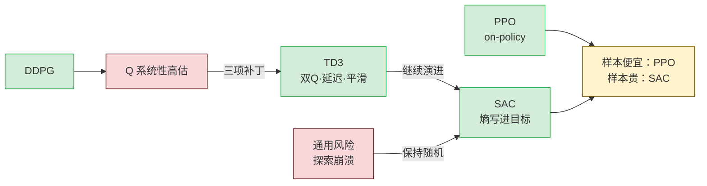

**读图**：DDPG 的直接故障是 $Q$ 系统性高估；TD3 用双 Q 取小、延迟策略更新、目标策略平滑三项补丁处理它。探索崩溃是策略过早确定时的通用风险，SAC 把熵直接写进优化目标来保持探索，不应误记成 TD3 自身的补丁。工程选择看样本成本：仿真样本便宜时用 PPO，真机或慢仿真样本贵时用 SAC；从控制角度看，SAC 后文的自动温度调节还是一个以熵为被控量、以 $\alpha$ 为执行器的反馈环。

> **这条线为什么值得学**：PPO 是 on-policy，样本效率低。**当样本很贵时（真机 RL、复杂仿真）就得换 off-policy。**
> **SAC 是目前连续控制里最常用的 off-policy 算法。**

## 12.1 DDPG：用一个网络去做 argmax

**核心想法**：$\max_{a'} Q(s',a')$ 做不了，那我**再训一个网络专门负责输出那个 argmax**。

$$\mu_\theta(s) \;\approx\; \arg\max_a Q_\phi(s,a)$$

**读作**：actor 网络 $\mu_\theta$ 的职责，就是「给我一个局面，我告诉你哪一手 $Q$ 最大」。

**怎么训这个 actor？** 让它输出的动作使 $Q$ 最大，直接对 $\theta$ 求梯度：

$$\nabla_\theta J \;=\; \mathbb{E}\Big[\, \nabla_a Q_\phi(s,a)\big|_{a=\mu_\theta(s)} \cdot \nabla_\theta \mu_\theta(s) \,\Big]$$

**读作**：链式法则。「$Q$ 对动作的梯度」× 「动作对权重的梯度」= **往哪调权重能让 $Q$ 变大**。

> ★★ **这跟 PPO 的策略梯度是完全不同的机制，别混：**
>
> | | PPO（随机策略梯度） | DDPG（确定性策略梯度） |
> |---|---|---|
> | 策略 | 随机 $\pi(a\mid s)$ | **确定性** $a=\mu(s)$ |
> | 梯度怎么来 | $\nabla\log\pi \cdot A$，**靠采样估计** | **$\nabla_a Q$ 直接反传穿过 critic** |
> | 需要 critic 可导吗 | ❌ 不需要 | ✅ **必须对动作可导** |
> | 探索靠什么 | **策略本身的随机性** | **人为往动作加噪声** |
>
> **DDPG 里梯度是"穿过" critic 流到 actor 的**，这是它样本效率高的原因，也是它不稳定的原因。

**DDPG 的问题**：$Q$ 会被**系统性高估**。因为 $\max$ 操作会把估计误差里偏高的那个挑出来，误差越大高估越狠，然后 actor 去追这个虚高的 $Q$，训练崩掉。

## 12.2 TD3：给 DDPG 打三个补丁

| 补丁 | 名字 | 干什么 |
|---|---|---|
| 1 | **双 Q 取小** (Clipped Double Q) | 训两个 critic，目标用 $\min(Q_1,Q_2)$ —— **宁可低估不要高估** |
| 2 | **延迟策略更新** | critic 更新几次，actor 才更新一次 —— **让打分器先站稳** |
| 3 | **目标策略平滑** | 算目标时给动作加小噪声 —— **防止 actor 钻 critic 的尖峰** |

> ★ **补丁 3 的思想很值得说**：给目标动作加噪声再求 $Q$，等于**把 $Q$ 在动作维度上做了平滑**。
> 这是在防止 actor 找到 critic 函数上一个**虚假的窄尖峰**去薅。**本质是正则化。**

## 12.3 ★ SAC：把「保持随机」写进目标本身

**SAC = Soft Actor-Critic，目前连续控制的主力。**

### 先讲清楚「熵」是什么（零基础必读）

后面的公式里会出现一个符号 $\mathcal{H}$，叫**熵**。**它听起来很吓人，其实就是一句话：**

> **熵 = 这个策略「有多不确定」的一个数值。**

举个最简单的例子。假设机器人面前只有两个选择，往左或往右：

| 策略的行为 | 熵 |
|---|---|
| **每次都往左**（100% 确定） | **熵 = 0**（最小） |
| 70% 往左、30% 往右 | 熵是中间值 |
| **50/50 完全随机** | **熵最大** |

**就这么简单**：越犹豫、越随机，熵越大；越果断、越固定，熵越小。

### 为什么要故意「保持不确定」

**因为过早变得果断是危险的。**

> **打个比方**：你刚到一个新城市，第一天随便找了家餐馆，觉得还行。
> **如果你从此每天都去这家**（熵 = 0），你可能永远不知道隔壁那家更好吃。
> **保持一点随机**（今天试试别家），才有机会发现更好的选择。

强化学习里这个问题特别严重：策略一旦过早收敛到某个动作，**它就再也采不到别的动作的数据了**，也就永远不知道别的动作好不好。这叫**探索崩溃**。

**SAC 的做法就是：把「保持不确定」这件事，直接写进要最大化的目标里。**

### 核心改动只有一条：把熵加进优化目标

$$J(\pi) \;=\; \mathbb{E}\left[\sum_t \gamma^t \Big(\, r_t \;+\; \alpha\, \underbrace{\mathcal{H}\big(\pi(\cdot\mid s_t)\big)}_{\text{这一步的随机程度}} \,\Big)\right]$$

**读作**：目标不只是「拿高分」，而是「**在拿高分的同时尽量保持随机**」。$\alpha$ 是权衡系数（叫温度）。

### ★ 插一句：熵为什么会写成 $-\log\pi$

下面的公式里，熵会突然变成 $-\alpha\log\pi(a'\mid s')$ 的样子。**这不是新东西，就是熵的定义式。**

熵的定义是：

$$\mathcal{H}(\pi) \;=\; \mathbb{E}_{a\sim\pi}\big[-\log \pi(a\mid s)\big]$$

**读作**：**「按自己的概率抽一个动作，看看 $-\log(\text{它的概率})$ 是多少，求个平均。」**

**为什么 $-\log(\text{概率})$ 能衡量「有多意外」**，代两个数就懂了：

| 这个动作的概率 | $-\log(\text{概率})$ | 意思 |
|---|---|---|
| $1.0$（一定会选它） | $-\log 1 = \mathbf{0}$ | **一点都不意外** |
| $0.5$ | $-\log 0.5 = 0.69$ | 有点意外 |
| $0.01$（几乎不选它） | $-\log 0.01 = 4.6$ | **非常意外** |

**概率越小 $\Rightarrow$ 越意外 $\Rightarrow$ 这个数越大。** 熵就是「平均而言有多意外」。

所以：**每次看到 $-\log\pi$，心里读成「这一手有多出乎意料」，看到 $\mathcal{H}$ 读成「平均有多出乎意料」。** 两者是同一件事。

对应的贝尔曼方程也变了（叫 soft Bellman）：

$$Q(s,a) = r + \gamma\, \mathbb{E}_{s'}\Big[\, \underbrace{\mathbb{E}_{a'\sim\pi}\big[Q(s',a') - \alpha\log\pi(a'\mid s')\big]}_{\text{soft value：不是 max，是"软"的 max}} \,\Big]$$

**读作**：把硬邦邦的 $\max_{a'}$，换成「期望值 + 熵奖励」这个**软化版本**。

$$\alpha \to 0:\ \text{退化成普通 max（TD3）} \qquad \alpha \text{ 大}:\ \text{越随机、越探索}$$

## 12.4 ★★ SAC 的熵 vs PPO 的 entropy_coef —— 面试易混点

看起来都是「鼓励随机」，**但位置完全不同：**

| | PPO 的 `entropy_coef=0.01` | SAC 的 $\alpha$ |
|---|---|---|
| 熵出现在哪 | **损失函数里的一个正则项** | **优化目标 / 贝尔曼方程里** |
| 影响价值函数吗 | ❌ **不影响** $V$ 的定义 | ✅ **$Q$ 的定义本身就含熵** |
| 是什么 | **外挂的正则** | **问题定义的一部分** |
| 怎么定 | 手调超参 | **可以自动调**（约束平均熵到目标值） |

> **面试可以这样说**：「PPO 的熵项是加在损失上的正则，不改变价值函数的定义；SAC 是把熵写进了目标和贝尔曼方程，学的是 soft Q。所以 SAC 叫最大熵 RL，PPO 只是加了熵正则——**这是定义层面的区别，不是调参层面的**。」

**SAC 还有自动温度调节**：把 $\alpha$ 当成一个约束优化的对偶变量，让平均熵维持在目标值。

> ★ **对照**：这又是一个**反馈控制器**（跟第 11.4 节的 adaptive KL 同构）：
> 被控量是策略的熵，设定值是目标熵，执行器是 $\alpha$。**PPO 用 KL 做闭环，SAC 用熵做闭环。**

## 12.5 ★ 运控里到底该用 PPO 还是 SAC

| 维度 | PPO | SAC |
|---|---|---|
| 数据 | on-policy，**用完就扔** | off-policy，**replay buffer 反复用** |
| 样本效率 | **低**（要几十亿步） | **高**（可低 1–2 个数量级）〔趋势性〕 |
| 稳定性/调参 | **高，超参鲁棒** | **较敏感**（尤其 $\alpha$、目标熵） |
| 大规模并行 | ✅ **天然适配 4096 环境** | ⚠️ replay buffer 成为内存/带宽瓶颈 |
| 主流腿足仿真训练 | ✅ **几乎全是 PPO** | 少 |
| 真机上直接学 / 微调 | ❌ 样本代价不可接受 | ✅ **这是它的主场** |

> ★★ **关键判断（面试可以直接说）**：
> 「**在 GPU 大规模并行仿真里，样本几乎免费，瓶颈是稳定性和吞吐，所以 PPO 占优**——这也是为什么 Isaac Lab / legged_gym 生态几乎全是 PPO。
> **SAC 的优势在样本贵的场景**：真机上做在线微调、或者仿真步进特别慢（比如带精细接触、流体、可变形体）的任务。
> 所以不是谁更先进，是**样本便宜就用 PPO，样本贵就用 SAC**。」

---

---

# 第 13 章 · 落到 G1①：速度跟踪任务，五个格子逐个讲

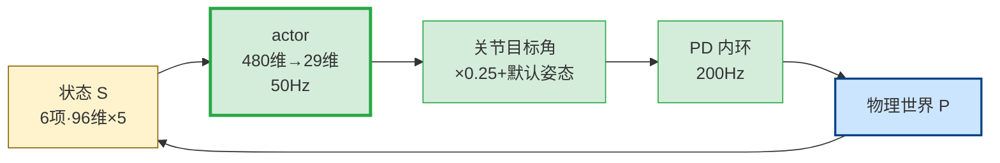

**读图**：部署时就是熟悉的“控制器—被控对象”闭环。状态 $S$ 的 $6$ 项观测每帧共 $96$ 维，叠 $5$ 帧成为 $480$ 维，其中也含速度指令；actor MLP `[512,256,128]` 以 $50\,\mathrm{Hz}$ 输出 $29$ 维动作，经 $\times0.25+$ 默认姿态变成关节目标角，再由 $200\,\mathrm{Hz}$ 的 PD 内环产生力矩，物理世界算出下一状态。这里依次对应 MDP 的 $S$、$A$、$P$。

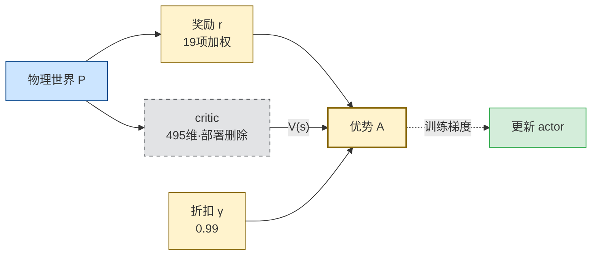

**读图**：训练时，物理世界还会给出 $19$ 项加权奖励 $r$；折扣 $\gamma=0.99$ 决定未来奖励怎么进入优势估计。critic 用 $495$ 维特权观测给出 $V(s)$，帮助形成优势并更新 actor。于是第二张补齐 MDP 的 $r$ 和 $\gamma$；灰色 critic 不是 MDP 的新格子，只是训练时的“评价教练”，部署时整条删除。

> 本章全部依据 `unitree_rl_lab/source/unitree_rl_lab/unitree_rl_lab/tasks/locomotion/robots/g1/29dof/velocity_env_cfg.py`〔配置核实〕。
> **前 11 章是数学，这一章是这些数学在真实工程里长什么样。**

## 13.1 格子① 状态 —— 机器人能看到什么

### 13.1.1 policy 观测：6 项，96 维

〔配置核实〕`velocity_env_cfg.py:197-208`

| # | 观测项 | 维度 | `scale` | `noise`（均匀分布） | 物理含义 |
|---|---|---|---|---|---|
| 1 | `base_ang_vel` | 3 | 0.2 | ±0.2 | 躯干角速度（IMU 陀螺仪） |
| 2 | `projected_gravity` | 3 | — | ±0.05 | **重力在机身系的方向** = 姿态 |
| 3 | `velocity_commands` | 3 | — | 无 | **指令**：$v_x,\ v_y,\ \omega_z$ |
| 4 | `joint_pos_rel` | 29 | — | ±0.01 | 关节角**相对默认姿态**的偏差 |
| 5 | `joint_vel_rel` | 29 | 0.05 | **±1.5** | 关节角速度 |
| 6 | `last_action` | 29 | — | 无 | **上一步网络输出的动作** |
| | **合计** | **96** | | | |

### 13.1.2 ★ 五个「为什么」

**① 为什么用 `projected_gravity` 而不是欧拉角？**

重力向量在机身坐标系下的投影，是一个 3 维单位向量。

- **没有万向节死锁**（欧拉角有）
- **不需要角度归一化**（$\pm\pi$ 的跳变）
- **真机上 IMU 直接给**，不需要额外解算
- **它只包含 roll 和 pitch，不含 yaw**——而 yaw 对「会不会摔」不重要，摔倒只跟 roll/pitch 有关

> **面试可以这样说**：「用 projected gravity 而不是欧拉角，是因为它无奇异、无跳变、IMU 直出，而且天然只编码与稳定性相关的 roll/pitch 分量。」

**② 为什么没有基座线速度 $v_x, v_y, v_z$？**

**因为真机上测不准。** 腿足机器人没有全局定位，基座线速度只能靠 IMU 加速度积分（漂移）或腿式里程计（打滑就废）。

**训练时能拿到（仿真里是已知量），但故意不给 policy。** 因为**训练时给了、部署时给不出来，就会 sim-to-real 崩溃**。

**这是 sim-to-real 的第一原则：policy 的每一维观测，真机上必须能以相近的质量拿到。**

**③ 为什么要有 `last_action`？**

- **让网络知道自己上一步干了什么** —— 否则动作会剧烈抖动（网络不知道自己刚发了什么指令）
- **对应 `action_rate` 那个惩罚项**（13.3 节）：要惩罚动作变化率，网络必须能看到上一次动作
- ★ **对照**：这跟控制里在状态里显式包含 $u_{k-1}$ 做增量式控制，**是同一个动机**

**④ 为什么指令要进观测？**

**因为策略必须是「条件化」的。** 同一个局面，指令是「前进 1 m/s」和「原地不动」，正确动作完全不同。**不把指令喂进去，策略无从区分。**

> ★ **对照**：这就是**跟踪问题**。你的控制器输入是 $e = r - y$（误差），这里是把 $r$（指令）和 $y$（状态）**都喂进网络，让它自己去算误差**。

**⑤ 为什么 `joint_vel_rel` 的噪声是 ±1.5 这么大？**

**因为噪声加在物理量纲上。** ±1.5 rad/s 是关节角速度的噪声。

**这个数不夸张**：真机上关节速度通常由**编码器位置差分**得到，差分会把量化噪声放大。所以速度通道就是比位置通道脏得多（位置只有 ±0.01 rad）。

### 13.1.3 ★★ 处理顺序：噪声在 scale 之前

〔源码核实〕`IsaacLab/source/isaaclab/isaaclab/managers/observation_manager.py:392-407`：

$$\text{算物理量} \;\to\; \textbf{加噪} \;\to\; \text{clip} \;\to\; \textbf{乘 scale} \;\to\; \text{存历史}$$

**为什么这个顺序重要**：

> 噪声必须加在**数据本来的物理量纲**上。`scale` 是给网络做**数值归一化**用的，它是「网络的事」，不是「传感器的事」。
> 如果先 scale 再加噪，配置里那个 ±1.5 就**不再是「1.5 rad/s 的传感器噪声」**，而变成一个没有物理意义的数，**调参就失去依据了**。

**推论：配置里的 noise 值可以直接和真机传感器手册对照。**〔尚未真机验证〕

### 13.1.4 ★★ 历史帧：96 → 480

〔配置核实〕`PolicyCfg.__post_init__`：

```python
self.history_length = 5
self.enable_corruption = True
self.concatenate_terms = True
```

$$96 \times 5 = \mathbf{480}\ \text{维}$$

**480 维是怎么排的？**〔源码核实〕`observation_manager.py:409-426` + `circular_buffer.py:80-90`

**按「项」排，不是按「帧」排：**

$$\underbrace{[\text{ang\_vel} \times 5\text{帧}]}_{15}\ \underbrace{[\text{gravity} \times 5]}_{15}\ \underbrace{[\text{cmd} \times 5]}_{15}\ \underbrace{[\text{joint\_pos} \times 5]}_{145}\ \underbrace{[\text{joint\_vel} \times 5]}_{145}\ \underbrace{[\text{last\_action} \times 5]}_{145}$$

**每一项内部：最老的在前，最新的在后。**

> **这个细节在部署时是致命的。** 真机推理时你要自己拼这个 480 维向量，**排错一位，策略输出就是垃圾。** 必须和训练时字节对齐。

### 13.1.5 ★★★ 5 帧历史的真正含义：网络内部长出了一个隐式状态观测器

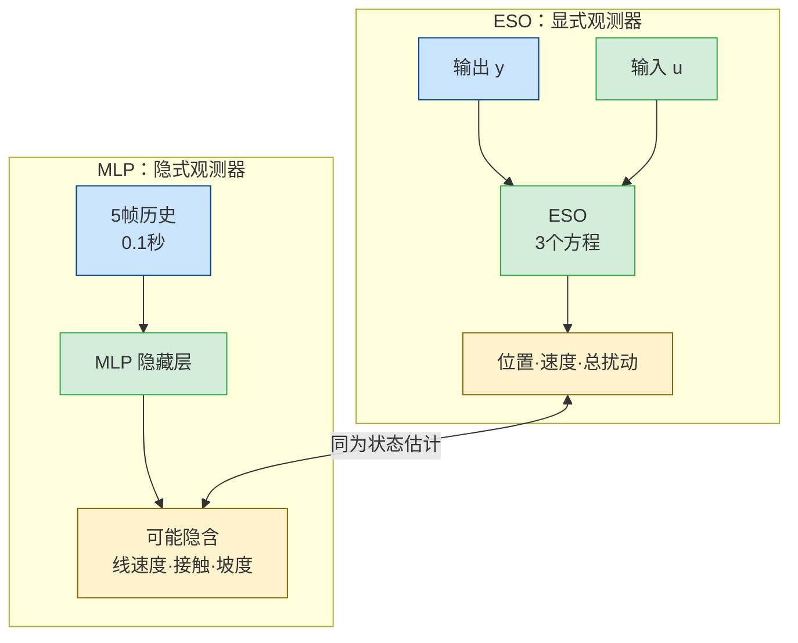

**读图**：两条路都利用输入输出历史恢复“眼前没直接测到的状态”，但只是功能对应，不是数学等价。ESO 的 $3$ 个方程由人写出，带宽 $\omega_o$ 可计算、可调，估计误差有界性还能分析；MLP 可能从 $5\times0.02=0.1$ 秒历史中隐式恢复基座线速度、接触状态等量，却没有可见的带宽旋钮，也没有同类保证。面试时这正是控制背景的差异化切入点：既能说出类比，也能说清边界。

> 📕 **本节的控制侧完整讲解**：`../LADRC_零基础完全讲解.md` **第 8 章**（扩张状态观测器 ESO，
> 三个方程逐行拆 + $\beta_1\beta_2\beta_3$ 带宽整定 + 手算）。
> **ESO 和这里的 5 帧历史干的是同一件事**，区别是 ESO 的带宽算得出来、MLP 的算不出来。

**表面理由**：单帧观测不满足马尔可夫性（2.1 节）。

**深层理由**：给 5 帧历史（$5 \times 0.02 = 0.1$ 秒的窗口），**网络就能从这个窗口里自己反推出观测里没有的东西**：

| 网络可能反推出什么 | 怎么反推的 |
|---|---|
| **基座线速度** | 从姿态 + 关节角序列做腿式里程计 |
| **地面接触状态** | 从关节速度突变判断触地 |
| **地形坡度** | 从姿态和关节角的关系推断 |
| **外部扰动** | 从「预期姿态 vs 实际姿态」的偏差推断 |
| **系统惯量/摩擦的偏差** | 从响应快慢推断（域随机化下有效） |

> ★★★ **对照 LADRC 的 ESO（面试最高价值的一条）**
>
> **先把 ESO 摆出来，不然这条对照是空的。**
>
> 二阶对象写成：$\ddot y = \underbrace{f(y,\dot y,w,t)}_{\text{总扰动}} + b_0 u$
>
> $f$ 里装的是**所有你没建模的东西**：非线性、参数误差、外扰、耦合。ADRC 的想法是**不管它具体是什么，把它当成一个额外的状态估出来，然后减掉。**
>
> 把 $f$ 当作第三个状态 $x_3$，观测器写成：
>
> $$\dot{\hat x}_1 = \hat x_2 + \beta_1(y-\hat x_1),\quad \dot{\hat x}_2 = \hat x_3 + b_0 u + \beta_2(y-\hat x_1),\quad \dot{\hat x}_3 = \beta_3(y-\hat x_1)$$
>
> **逐项读**：
> - $\hat x_1,\hat x_2,\hat x_3$ —— 估计出来的位置、速度、**总扰动**
> - $(y - \hat x_1)$ —— **估错了多少**（真实输出减估计输出）
> - $\beta_1,\beta_2,\beta_3$ —— 三个增益，**「估错了就按这个力度往回拽」**
>
> **关键在于这三个增益怎么定。** 高志强的带宽整定法：把三个极点全配到 $-\omega_o$，于是
>
> $$\beta_1 = 3\omega_o,\qquad \beta_2 = 3\omega_o^2,\qquad \beta_3 = \omega_o^3$$
>
> ★ **三个增益塌缩成一个旋钮 $\omega_o$。** 调大 = 估得快但放大噪声；调小 = 干净但跟不上。**这个权衡是显式的、可算的。**
>
> ---
>
> **现在对回来**：`history_length=5` 给网络的是 0.1 秒的输入输出历史，
> **网络从这个窗口里恢复出观测里没有的量** —— 这跟 ESO 从 $(u, y)$ 历史里估出 $x_3$ 是**结构上同一件事**。
>
> **但三个区别必须讲清楚，否则就是空对空：**
>
> | | LADRC 的 ESO | 5 帧历史 + MLP |
> |---|---|---|
> | 结构 | **你写出来的**（上面那三行） | **训练自己长出来的**，看不到 |
> | 带宽 | **一个旋钮 $\omega_o$，可算可调** | **看不见，配不了** |
> | 保证 | **估计误差有界性可证** | **无任何保证** |
> | 扰动模型 | 假设 $\dot f$ 有界 | 无显式假设 |
> | 在线/离线 | **在线实时估计**，没见过的扰动照估 | **离线练进权重**，分布外就失效 |
>
> **面试话术**：「history_length=5 在功能上相当于让网络内部隐式学出一个状态观测器，从 0.1 秒历史窗口里恢复出观测里没有的基座线速度和接触状态。跟 ESO 的区别是：ESO 的带宽我能配、误差有界性我能证；网络学出来的这个观测器我既看不见也配不了，只能靠域随机化和大量数据去覆盖。这是我认为 RL 相对 ADRC 最不踏实的地方。」

## 13.2 格子② 动作 —— 机器人能做什么

〔配置核实〕`velocity_env_cfg.py:183-185`

```python
joint_pos = mdp.JointPositionActionCfg(
    asset_name="robot", joint_names=[".*"], scale=0.25, use_default_offset=True
)
```

### 13.2.1 ★ 动作不是力矩，是关节目标角度

$$q^{\text{target}} \;=\; q^{\text{default}} \;+\; 0.25 \times a_{\text{net}}$$

**读作**：网络输出 $a_{\text{net}}$（29 维），乘以 0.25，**加在默认站姿上**，得到关节目标角度。

**然后交给底层 PD 控制器：**

$$\tau \;=\; K_p\,(q^{\text{target}} - q) \;-\; K_d\,\dot q$$

### 13.2.2 ★★ 这是一个标准的串级结构

$$\underbrace{\text{RL 策略}}_{50\ \text{Hz}} \ \xrightarrow{\ q^{\text{target}}\ } \ \underbrace{\text{PD 控制器}}_{200\ \text{Hz}} \ \xrightarrow{\ \tau\ } \ \underbrace{\text{电机}}_{}$$


**读图**：外环策略先按 $q^{\mathrm{target}}=q^{\mathrm{default}}+0.25a_{\mathrm{net}}$ 给出关节目标角，内环再按 $\tau=K_p(q^{\mathrm{target}}-q)-K_d\dot q$ 产生力矩；因此动作不是力矩。物理仿真和 PD 运行 $4$ 步，策略才更新 $1$ 次。它与串级 LADRC、伺服三环遵守同一条工程纪律：内环更快，先把局部对象稳住，外环再发较慢的设定值。

〔同模型自洽算得〕频率怎么来的：

| 量 | 值 | 来源 |
|---|---|---|
| 仿真步长 `sim.dt` | 0.005 s | 〔配置核实〕 |
| 物理频率 | 200 Hz | $1/0.005$ |
| `decimation` | 4 | 〔配置核实〕 |
| **策略频率** | **50 Hz** | $200/4$ |
| **一个策略步** | **0.02 s** | $0.005 \times 4$ |

**读作**：物理仿真跑 4 步，策略才决策 1 次。中间这 4 步，PD 拿着同一个目标角度反复算力矩。

> ★★ **面试可以这样说**：
> 「RL 在这里扮演的是**串级控制的外环**：50 Hz 输出关节目标角度，内环是 200 Hz 的关节 PD。这跟我做串级 LADRC 时外环给内环发指令是同一个结构。区别是外环不是我设计的解析控制律，而是一个训出来的网络。」
>
> **为什么输出位置不输出力矩（要点）**：
> 1. **PD 内环提供了天然阻尼**，让策略即使输出得不完美，系统也不会立刻发散——**降低了 RL 的探索难度**
> 2. **位置指令的 sim-to-real 鲁棒性远好于力矩**：真机的力矩常数、摩擦、传动效率都有误差，直接发力矩会把这些误差全暴露给策略
> 3. **真机电机驱动器普遍原生支持位置模式**，接口现成

### 13.2.3 `scale=0.25` 和 `use_default_offset=True` 在干什么

| 参数 | 作用 | 拿掉会怎样 |
|---|---|---|
| `scale=0.25` | 网络输出（初期是 $\mathcal N(0,1)$ 量级）**缩到合理的关节偏移范围** | 太大 → 一上来关节就撞限位；太小 → 迈不开腿 |
| `use_default_offset=True` | 以**默认站姿**为原点 | 拿掉的话，网络输出 0 = 所有关节回零位 = **直接躺平**，探索起点极差 |

> **`use_default_offset` 的深层价值：它给了策略一个良好的初始先验。** 训练第 0 步，网络输出接近 0，机器人**保持默认站姿**而不是散架。**这是「让随机初始化的策略不至于一开始就一无是处」的工程技巧。**

## 13.3 格子③ 奖励 —— 怎么打分

〔配置核实〕`velocity_env_cfg.py:242-337`，**共 19 项：5 正 14 负**。

### 13.3.1 正奖励（5 项）—— 告诉它「要干什么」

| 项 | 权重 | 参数 | 目的 |
|---|---|---|---|
| `track_lin_vel_xy` | **+1.0** | `std=sqrt(0.25)` | **跟上线速度指令**（核心任务） |
| `track_ang_vel_z` | **+0.5** | `std=sqrt(0.25)` | **跟上转向指令** |
| `alive` | +0.15 | — | **活着就有分** |
| `gait` | +0.5 | `period=0.8, offset=[0,0.5], threshold=0.55` | **鼓励左右腿交替**（相位差 0.5） |
| `feet_clearance` | +1.0 | `std=0.05, target_height=0.1, tanh_mult=2.0` | **抬脚要抬够 10 cm** |

**★ 跟踪奖励为什么用高斯核而不是负二次型？**

$$r_{\text{track}} \;=\; \exp\!\left(-\frac{\|v^{\text{cmd}} - v\|^2}{\sigma^2}\right), \qquad \sigma^2 = 0.25$$

**读作**：误差为 0 时得满分 1；误差越大，分数按高斯曲线**衰减到 0，但不会变成负无穷**。

| | 负二次型 $-\lVert e\rVert^2$（LQR 风格） | 高斯核 $\exp(-\lVert e\rVert^2/\sigma^2)$ |
|---|---|---|
| 误差很大时 | **趋于 $-\infty$** | **饱和到 0** |
| 训练早期的后果 | 惩罚爆炸，**梯度被这一项主导** | **有界，其他项还能起作用** |
| 好处 | — | **早期"先学会站住"，而不是被跟踪误差压垮** |

> **面试可以这样说**：「跟踪项用有界的高斯核而不是 LQR 那种负二次型，是因为训练早期误差极大，负二次型会趋于负无穷、把梯度全占了，机器人连站都学不会。高斯核在大误差处饱和，让 alive 和姿态项还有话语权。」

**★ `alive=+0.15` 的作用（很容易被低估）：**

〔同模型自洽算得〕稳定行走时，每步 +0.15，$\gamma=0.99$，有效视界 100 步：

$$V_{\text{alive}} \approx 0.15 \times \frac{1}{1-0.99} = 15$$

**这意味着「不摔」本身就值 15 分的状态价值。** 训练早期机器人还不会跟踪速度，`alive` 是**唯一稳定的正信号**，它把策略先拉到「站着」这个区域，之后才有机会学走。

**★ `gait` 项在干什么：**

`offset=[0, 0.5]` 表示左右脚的**期望相位差是半个周期**。`period=0.8` 秒是一个完整步态周期。

**没有这一项会怎样**：策略很可能学出**双脚同时蹦跳**或者**拖着一条腿滑行**——这些也能满足速度指令，但**不是走路**。**gait 项是把"人形步态"这个先验塞进奖励的手段。**

### 13.3.2 负奖励（14 项）—— 告诉它「不许怎么干」

| 类别 | 项 | 权重 | 在防什么 |
|---|---|---|---|
| **姿态** | `base_height`（`target=0.78`） | **−10** | 蹲着走、腿软 |
| | `flat_orientation_l2` | **−5.0** | 躯干歪斜 |
| | `base_linear_velocity`（$v_z$） | −2.0 | 上下颠簸 |
| | `base_angular_velocity`（$\omega_{xy}$） | −0.05 | 躯干晃动 |
| **限位安全** | `dof_pos_limits` | **−5.0** | 关节撞限位 |
| | `undesired_contacts`（非踝的所有 body） | −1.0 | **膝盖/手/躯干碰地** |
| **平滑性** | `action_rate` | −0.05 | **动作抖动** |
| | `joint_vel` | −0.001 | 关节速度过大 |
| | `joint_acc` | −2.5e-7 | 关节加速度过大 |
| | `energy` | −2e-5 | 功耗 |
| **姿势先验** | `joint_deviation_waists`（腰） | **−1.0** | 扭腰 |
| | `joint_deviation_legs`（hip_roll / hip_yaw） | **−1.0** | 外八、内八 |
| | `joint_deviation_arms`（肩肘腕） | −0.1 | 甩手（**权重小 = 允许摆臂平衡**） |
| **接触质量** | `feet_slide` | −0.2 | **脚底打滑** |

### 13.3.3 ★★ 权重量级的三层结构（这里最见功力）

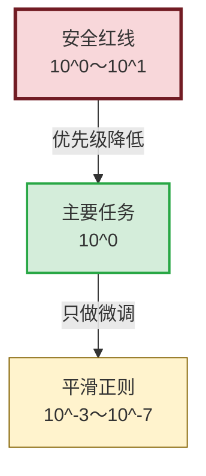

**读图**：这不是“所有相邻层都固定差 $10$ 倍”，而是优先级结构：安全红线必须压住违规行为，任务项决定主要目标，平滑正则只能微调、不能反客为主。真正调参时还不能只看权重，要看“权重 $\times$ 该项典型数值”的实际贡献；这与 LQR 调 $Q/R$ 看相对作用相通，但这里有 $19$ 项耦合，没有解析整定法。

$$\underbrace{-10,\ -5}_{\text{安全红线}} \quad\gg\quad \underbrace{+1,\ -1,\ +0.5}_{\text{任务与姿态}} \quad\gg\quad \underbrace{-0.001,\ -2.5\times10^{-7}}_{\text{平滑正则}}$$

| 层 | 量级 | 角色 | ★ 对照 |
|---|---|---|---|
| 安全红线 | $10^0 \sim 10^1$ | **绝对不能违反** | 硬约束的软化 / 罚函数法 |
| 任务 | $10^{0}$ | **主要目标** | LQR 的 $Q$ 矩阵 |
| 平滑正则 | $10^{-3} \sim 10^{-7}$ | **微调，不能主导** | LQR 的 $R$ 矩阵 |

**为什么 `joint_acc` 是 $-2.5\times10^{-7}$ 这么小？**

因为**关节加速度的数值本身极大**（rad/s²，行走时轻易上千）。$10^{-7}$ 的权重乘上 $10^3\sim10^6$ 的量，最终贡献才落到 $10^{-4}\sim10^{-1}$ 这个合理区间。

> **★★ 关键认识：奖励权重不能孤立地看大小，要看「权重 × 该项典型数值」的乘积。**
> **调奖励的第一步永远是打印每一项的实际数值贡献，而不是盯着权重猜。**

> ★ **对照 LQR 调 Q/R**：你调 $Q$ 和 $R$ 时也是这个逻辑——权重的绝对值没有意义，**相对贡献才有意义**。
> **区别**：LQR 的 $Q,R$ 只有 2 个矩阵、有明确的物理解释、还有 Bryson 法则可用；**这里是 19 项耦合、没有解析指导、只能靠实验**。这是 RL 工程最脏的部分，也是最该老实承认的部分。

### 13.3.4 ★★ 奖励塑形与 reward hacking

**先说一个反例（务必理解）**：

假设你只写 `track_lin_vel_xy`（跟上速度就给分），会发生什么？

| 策略可能学到的"聪明"办法 | 为什么它满足奖励 | 为什么它是错的 |
|---|---|---|
| **溜冰步**：双脚不抬，贴地滑行 | 速度确实跟上了 | 真机上脚底摩擦力不够，直接摔 |
| **前倾摔**：向前扑倒 | 摔倒过程中质心速度确实是前进的 | 摔了 |
| **高频抖动**：疯狂震颤维持平衡 | 速度平均值对 | 真机电机烧掉 |

**14 项负奖励里，绝大多数就是在堵这些洞：**

| 洞 | 堵它的项 |
|---|---|
| 溜冰步 | `feet_slide` (−0.2) + `feet_clearance` (+1.0) + `gait` (+0.5) |
| 蹲着走 | `base_height` (−10) |
| 高频抖动 | `action_rate` (−0.05) + `joint_acc` + `energy` |
| 用膝盖爬 | `undesired_contacts` (−1.0) |
| 扭麻花 | `joint_deviation_waists/legs` (−1.0) |

> **★★ 这是强化学习在人形上最真实的工作量所在：**
> **80% 的时间不是在调 PPO 超参，是在设计奖励和堵 reward hacking 的洞。**
>
> **面试可以这样说**：「G1 这个配置里 19 项奖励，5 项正的定义任务、14 项负的全在堵 reward hacking。比如只给速度跟踪奖励，策略会学出脚不抬的溜冰步——仿真里速度确实跟上了，真机上摩擦力一变就摔。所以要配 feet_slide、feet_clearance、gait 三项一起堵。这也是我认为 RL 相比经典控制最不透明的地方：经典控制里我改一个增益能预测系统响应怎么变，这里我改一个奖励权重，只能重训一次看结果。」

## 13.4 格子④ 转移 —— 世界怎么变

### 13.4.1 转移由谁定

| 来源 | 作用 |
|---|---|
| **物理仿真器**（`sim.dt=0.005`） | 刚体动力学 + 接触求解 |
| **`EventCfg`**（`velocity_env_cfg.py:88`） | **域随机化：把单一的 $P$ 变成一族 $P$** |
| **`TerminationsCfg`**（341） | 定义一局什么时候结束 |
| **`CurriculumCfg`**（350） | 训练过程中逐渐改变 $P$ 的难度 |

### 13.4.2 ★★ 域随机化的数学含义

**没有域随机化时**，策略学的是：

$$\pi^* = \arg\max_\pi\ \mathbb{E}_{P_{\text{sim}}}[\,G_0\,]$$

**读作**：在**这一个特定的仿真世界**里最优。

**加了域随机化后**（每次 reset 随机摩擦、质量、外推力）：

$$\pi^* = \arg\max_\pi\ \mathbb{E}_{P \sim \mathcal{D}}\ \mathbb{E}_{P}[\,G_0\,]$$

**读作**：在**一整族世界**上平均最优。$\mathcal{D}$ 是参数分布。

> **这就是 sim-to-real 的核心逻辑**：
> **真机的 $P_{\text{real}}$ 你建不准，但你可以让训练分布 $\mathcal{D}$ 足够宽，宽到把 $P_{\text{real}}$ 罩在里面。**
> 只要罩住了，策略在真机上就是**分布内**的，不是外推。

**代价**：分布越宽，策略越保守、性能越低。**这是 sim-to-real 领域最核心的一组权衡。**

### 13.4.3 ★★ 域随机化 vs LADRC（面试高价值对照）

| | LADRC 的 ESO | 域随机化 |
|---|---|---|
| 什么时候处理扰动 | **在线，实时** | **离线，训练时** |
| 怎么处理 | **估计出总扰动，然后抵消** | **练到对扰动不敏感** |
| 需要什么 | 一个带宽 $\omega_o$ 的设计 | 一个参数分布 $\mathcal{D}$ 的设计 |
| 面对分布外扰动 | **能实时估计并补偿** | **可能直接失效** |
| 面对高频/接触类扰动 | 受观测器带宽限制 | 只要训练时见过就行 |
| 保证 | **有界性可证** | **无** |

> **面试可以这样说（这段很值钱）**：
> 「域随机化和 ADRC 处理不确定性的方式是**互补的，不是替代的**：域随机化是**离线**把扰动分布练进权重，好处是能覆盖接触、地形这类难以建模的高维扰动，坏处是分布外就完蛋、而且没有任何保证；ADRC 是**在线**估计总扰动然后抵消，好处是有明确带宽和有界性分析、能应对训练时没见过的慢变扰动，坏处是带宽有限、对接触突变这种快扰动力不从心。
> **我认为务实的做法是两者叠加**：用 RL 学步态和高层协调，在关节层或某个中间层保留基于模型的补偿/观测器，把可解释的那部分留在经典控制里。」

### 13.4.4 终止条件

〔配置核实〕`velocity_env_cfg.py:344-346`

| 项 | 条件 | `time_out` | 处理方式（见 6.8） |
|---|---|---|---|
| `time_out` | 20 秒到 | **`True`** | **自举补偿** $r + \gamma V$ |
| `base_height` | 高度 < 0.2 m | False | 真失败，目标 = $r$ |
| `bad_orientation` | 倾角 > 0.8 rad (≈46°) | False | 真失败，目标 = $r$ |

**★ 终止条件的作用不只是"结束一局"，它是一种极强的负奖励。**

摔倒 → 后续所有奖励归零 → **状态价值直接掉到 0**。

〔同模型自洽算得〕稳定行走时的状态价值粗估：

$$V_{\text{walking}} \approx (\underbrace{1.0}_{\text{track}} + \underbrace{0.15}_{\text{alive}} + \cdots) \times \frac{1}{1-0.99} \ \sim\ 10^2 \ \text{量级}$$

**摔倒把 $10^2$ 变成 $0$。这比任何一项负奖励都狠得多。**

> **所以终止条件本质上是「最强的那一条奖励」，设计它比设计奖励权重更需要谨慎。**
> 终止条件太严 → 早期全在摔，没有有效样本；太松 → 学出爬行、跪着走这类退化解。

### 13.4.5 课程学习

〔配置核实〕`velocity_env_cfg.py:353-354`

```python
terrain_levels = CurrTerm(func=mdp.terrain_levels_vel)      # 走得好 → 换更难地形
lin_vel_cmd_levels = CurrTerm(func=mdp.lin_vel_cmd_levels)  # 走得好 → 给更快的速度指令
```

**为什么需要**：一上来就给「2 m/s + 崎岖地形」，策略**永远采不到成功样本**，优势全是负的，学不动。

> ★ **对照**：这跟你调控制器时**先在低增益/小信号下整定，再逐步加大**是同一个思路。**只是这里是自动的、由性能指标触发的。**

## 13.5 格子⑤ 折扣 —— 看多远

见第 3.4 节。核心结论重复一遍：

$$\gamma = 0.99 \;\Rightarrow\; \text{有效视界} = 100\ \text{步} = \mathbf{2.0}\ \text{秒} \approx 2.5\ \text{个步态周期}$$

**$\gamma$ 该怎么调（判断依据）：**

| 现象 | 可能原因 | 方向 |
|---|---|---|
| 策略过于短视，为了眼前速度不惜摔倒 | 视界太短 | 调大 $\gamma$（如 0.995） |
| 训练收敛极慢、价值估计方差大 | 视界太长 | 调小 $\gamma$（如 0.98） |

**但注意 8.6 节的代价**：$\gamma$ 越大收敛越慢，$\gamma=0.995$ 时压缩速度比 $0.99$ 慢约一倍。

---

---

# 第 14 章 · 非对称 actor-critic 与蒸馏

## 14.1 两个网络看到的东西不一样

〔配置核实〕`velocity_env_cfg.py:197-231`

| | **PolicyCfg**（actor） | **CriticCfg**（critic） |
|---|---|---|
| 项数 | 6 | **7** |
| 单帧维度 | 96 | **99** |
| 历史帧 | 5 | 5 |
| **总维度** | **480** | **495** |
| **多的那一项** | — | **`base_lin_vel`（3 维）** |
| `enable_corruption` | **`True`** | **未设置 → 默认 `False`** |
| 各项 `noise` 参数 | 有 | **全部没有** |

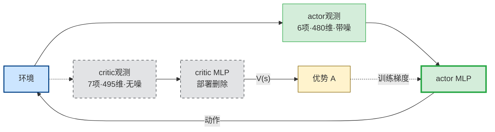

**读图**：同一环境分出两套观测：actor 看 $6$ 项、$480$ 维带噪数据；critic 看 $7$ 项、$495$ 维无噪数据，其中每帧多一项 $3$ 维 `base_lin_vel`。绿色闭环在训练和部署时完全相同；灰色支路只在训练时用 $V(s)$ 帮助计算优势，部署时删除，所以不会把特权信息带上真机，也不会让 actor 遭遇由此造成的输入分布偏移。对照控制设计，这像离线阶段可用完整模型做整定，在线控制器仍只使用可测信号。

## 14.2 ★★ 两重不对称

### 不对称一：critic 多看到基座线速度

**为什么 actor 不能有**：真机测不准（13.1.2 节 ②）。

**为什么 critic 可以有**：**critic 部署时不上机。** 它只在训练时用来算优势，训练完就扔。

**给了有什么好处**：$V(s)$ 估得更准 → 优势 $A = R - V$ 的**方差更小** → 策略梯度更干净 → 收敛更快更稳。

### 不对称二：critic 看到的是干净数据

〔源码核实〕IsaacLab `manager_term_cfg.py:221` 确认 `enable_corruption` 默认为 `False`，且 CriticCfg 的 `__post_init__` 里只设了 `history_length=5`，**没设 corruption**。

$$\text{actor 看：带噪的观测} \qquad\qquad \text{critic 看：无噪的真值}$$

**为什么这样安排：**

| 网络 | 为什么这样 |
|---|---|
| **actor 带噪** | **它要上真机**，必须在训练时就适应传感器噪声，否则 sim-to-real 崩 |
| **critic 无噪** | **它只是个打分器**，噪声只会让打分更不准，**没有任何好处** |

## 14.3 ★★ 这个设计的核心思想

$$\boxed{\;\textbf{训练时可以"作弊"，部署时不能。}\;}$$

**只要作弊的那部分不上真机，就是纯赚。**

> ★ **对照**：这个思路在控制里也有对应——
> **离线设计时用完整模型信息（做仿真、做整定、做鲁棒性分析），在线运行时只用可测量。**
> 你设计 LADRC 时也是在**已知模型**的仿真里配 ESO 带宽，上机时 ESO 只吃输入输出。**同一个哲学。**

> **面试可以这样说**：
> 「这是非对称 actor-critic。critic 多拿了基座线速度、而且拿的是无噪声的真值，因为它训练完就扔、不上真机；actor 只能拿真机可获得的量，而且要带噪训练。这个设计让价值估计的方差降下来、策略梯度更干净，同时不损害 sim-to-real——**训练时可以用特权信息，只要它不出现在部署路径上**。」

---

## ★ 更进一步：把特权信息用到底 —— 蒸馏（teacher-student）

> 前面 14.1–14.3 讲的非对称 actor-critic，特权信息只用来给 critic **打分**。
> **还有一种更彻底的用法：让一个「能作弊」的老师先学会，再把本事教给「看不见」的学生。**
> ★ 你本地就有实现〔源码核实〕：`rsl_rl/algorithms/distillation.py` + `rsl_rl/modules/student_teacher.py`

> **为什么这一章重要**：**它是 BFM 和 BeyondMimic 的关键工程环节**，而且你本地就有实现：
> `rsl_rl/algorithms/distillation.py` + `rsl_rl/modules/student_teacher.py`〔源码核实〕

## 14.4 要解决什么问题

本章 14.1–14.3 节和第 20.4 节讲了非对称 actor-critic：**critic 可以用特权信息，因为它不上真机。**

**但这有个限制：actor 从头到尾只能看真机可得的观测，学习难度大。**

**能不能让 actor 也先"作弊"学一遍，学会了再改成不作弊？**

**能。这就是 teacher-student 两阶段特权学习：**

$$\underbrace{\text{阶段 1：训 teacher}}_{\text{用特权观测，RL 训练，学得又快又好}} \;\longrightarrow\; \underbrace{\text{阶段 2：蒸馏出 student}}_{\text{只用真机可得观测，监督学习模仿 teacher}}$$

## 14.5 ★★ 别和非对称 actor-critic 搞混（面试易错点）

| | **非对称 actor-critic**（第 14 章） | **teacher-student 蒸馏**（本章） |
|---|---|---|
| 几个阶段 | **1 个**，端到端 | **2 个** |
| 谁用特权信息 | **只有 critic** | **阶段 1 的 teacher（是个完整策略）** |
| 特权网络会输出动作吗 | ❌ critic 只输出 1 个数 $V$ | ✅ **teacher 是完整的策略** |
| 阶段 2 用什么学 | — | **监督学习（行为克隆）** |
| 本地代码 | `PolicyCfg` / `CriticCfg` | `distillation.py` / `student_teacher.py` |

**一句话区分：**
- **非对称 actor-critic**：特权信息只用来**打分**
- **teacher-student**：特权信息用来**先造一个会做事的老师**，再把老师的本事教给学生

## 14.6 ★ 蒸馏的损失函数：就是行为克隆

〔源码核实〕`rsl_rl/algorithms/distillation.py`：

```python
def act(self, obs):
    self.transition.actions = self.policy.act(obs).detach()                 # student 的动作
    self.transition.privileged_actions = self.policy.evaluate(obs).detach() # teacher 的动作
    ...

def update(self):
    for obs, _, privileged_actions, dones in self.storage.generator():
        actions = self.policy.act_inference(obs)              # student 前向
        behavior_loss = self.loss_fn(actions, privileged_actions)   # ← 就是 MSE
```

$$L_{\text{distill}} \;=\; \mathbb{E}\Big[\, \big\lVert\, \pi_{\text{student}}(o^{\text{真机}}) \;-\; \pi_{\text{teacher}}(o^{\text{特权}}) \,\big\rVert^2 \,\Big]$$

**读作**：让学生看着**残缺的观测**，输出和老师看着**完整观测**时一样的动作。

〔源码核实〕默认 `loss_type="mse"`，`num_learning_epochs=1`，`gradient_length=15`（累积 15 步再反传，为了支持 RNN）。

**★ 这就是第 19.2 节的行为克隆 —— 但没有 BC 的复合误差问题。为什么？**

> **因为数据是 student 自己跑出来的！**
>
> 看 `act()`：实际执行的是 `self.policy.act(obs)`（**student 的动作**），teacher 的动作只是**记下来当标签**。
>
> **所以 student 遇到的状态分布，就是 student 自己的分布。** 它不会遇到"没见过的状态"。
>
> ★★ **这正是第 19.3 节 DAgger 的思想：在 student 自己会遇到的状态上，向专家查询正确动作。**
> **而这里"专家随时可查询"是成立的——因为 teacher 是个网络，不是人。**

## 14.7 StudentTeacher 网络结构

〔源码核实〕`rsl_rl/modules/student_teacher.py:45-75`：

```python
num_student_obs = sum(obs[g].shape[-1] for g in obs_groups["student"])
num_teacher_obs = sum(obs[g].shape[-1] for g in obs_groups["teacher"])

self.student = MLP(num_student_obs, num_actions, student_hidden_dims, activation)
self.teacher = MLP(num_teacher_obs, num_actions, teacher_hidden_dims, activation)
self.teacher.eval()          # ← teacher 冻结，不参与训练
```

| | student | teacher |
|---|---|---|
| 输入 | **真机可得的观测** | **特权观测** |
| 输出 | 动作 | 动作 |
| 训练 | ✅ | ❌ **`.eval()` 冻结** |
| 部署 | ✅ **上真机的是它** | ❌ 扔掉 |

还有 `student_teacher_recurrent.py` —— **student 可以是 RNN**。

> ★ **这是很自然的搭配**：teacher 靠特权信息直接知道答案；**student 没有那个信息，只能从时序里推**——所以给它 RNN（或者像 velocity 任务那样给历史帧，见 13.1.5）。
>
> **本质上：student 必须在内部学出一个状态观测器，来补上 teacher 白拿的那部分信息。**

## 14.8 什么时候值得上蒸馏

| 场景 | 要不要蒸馏 |
|---|---|
| 观测缺失不严重（比如只少一个线速度） | ❌ 直接非对称 actor-critic 就够（velocity 任务就是） |
| **特权信息很多**（地形高度图、接触力、外部扰动真值、精确物体位姿） | ✅ **值得** |
| **要把多个专家策略合成一个** | ✅✅ **这是 BFM 的做法（第 23 章）** |
| **要把大模型压成能实时跑的小模型** | ✅ |

> **面试可以这样说**：「rsl-rl 里的 Distillation 算法本质就是行为克隆，损失是 student 和 teacher 动作的 MSE。但它不会有 BC 的复合误差问题，因为 rollout 是 student 自己跑的、teacher 只提供标签——**这实际上是 DAgger，只不过专家是个网络所以可以无限查询**。这条路线在人形上的典型用法是：先用特权信息训一个强 teacher，再蒸馏成只用 IMU 和关节编码器的 student 上真机。」

---

> ➡️ **接着往下看第 15 章**：本章讲的「critic 可以看 actor 看不到的东西」，
> 换到**两台机器协作**的场景，就直接变成了多智能体的主流方法 **CTDE**。
> **是同一个道理，不是新东西** —— 15.5.4 节会把这件事讲透。

---

---

# 第 15 章 · 多智能体强化学习：两台机器一起干一件事

> **这一章紧接第 14 章**。第 14 章刚讲完「critic 可以看 actor 看不到的东西」，
> 这一章会告诉你：**同一个招式换个场景，就是多智能体的主流方法**。
> 前 14 章讲的全是**一个** agent 怎么学，这一章讲**两个及以上** agent 怎么一起学。
>
> **为什么这章对你特别重要**：JD① 写的是「决策规划的深度强化学习」，
> 多机协同是决策规划里最常被追问的一块；而你**手上正好有一个双机协同的项目**
> （空中机械臂搬运刚性杆）。这一章就是把那个项目的原理讲透，
> 让你从「我做过」升级到「我讲得清为什么」。
>
> **读之前需要有的基础**：第 2 章（MDP）、第 6 章（PPO 与优势）、**第 14 章（非对称 actor-critic）**。
> 后面第 21 章讲分层时会再回头引用本章。

---

## 15.1 先建立一个画面：两个人抬一张桌子

想象你和一个朋友抬一张长桌，从客厅搬到卧室。

**这件事和一个人搬椅子有什么不同？** 三点：

| | 一个人搬椅子 | 两个人抬桌子 |
|---|---|---|
| 我的动作决定结果吗 | **是**，我怎么动椅子就怎么动 | **不是**，桌子怎么动取决于**我和他一起** |
| 失败了是谁的错 | 只能是我 | **可能是我，也可能是他** —— 分不清 |
| 我需要知道他在想什么吗 | 不需要 | **需要**，但我看不见他脑子里想什么 |

第二行那个「分不清」，在多智能体里有个专门的名字。

> 📖 **信用分配问题（credit assignment）**：一件事做成了或搞砸了，
> **怎么知道是谁的功劳、谁的锅**。人多了以后这件事会变得非常难。

第三行那个「看不见」，会引出这一章最重要的一个概念（15.2 节）。

**再加一件事**：如果你想往左、他想往右，桌子**可能一动不动**，
但你俩都在拼命使劲，桌子里全是**互相抵消的力**。
外面看桌子没动，其实你俩都快累死了 —— 这叫**内力**（15.7 节详讲）。

---

## 15.2 ★★★ 核心困难：环境在动，因为队友在变

这一节是整章的地基。**只记一件事的话，记这一节。**

### 15.2.1 先回忆单智能体为什么能学

第 2 章讲过，强化学习能成立，靠的是一个假设：

$$P(s' \mid s, a)$$

**读作**：在状态 $s$ 下做动作 $a$，环境跳到下一个状态 $s'$ 的概率。

逐个拆：

- $s$ —— **当前状态**。多大？G1 上是 480 维那个向量（第 13 章）。谁给的？仿真器。
- $a$ —— **我做的动作**。多大？12 维关节目标位置。谁给的？我的策略网络。
- $s'$ —— **下一个状态**。多大？和 $s$ 一样，480 维。谁给的？仿真器算出来的。
- $P$ —— **转移概率**。它是一张"查询表"：给定 $(s,a)$，告诉你 $s'$ 长什么样。

**关键在于**：这张表是**固定不动**的。物理定律不会因为你今天训练了 1000 轮就改变。

> 📖 **平稳（stationary）**：规则不随时间变。
> 单智能体 RL 之所以能收敛，前提就是环境是平稳的 —— **靶子不动，你才射得准**。

### 15.2.2 两个 agent 一起学，这个假设立刻塌了

现在有两台无人机，编号 1 和 2。站在 **1 号的视角**看世界：

$$P(s' \mid s, a_1, a_2), \qquad a_2 \sim \pi_2$$

**读作**：下一个状态不只取决于我（$a_1$），还取决于队友的动作 $a_2$；
而 $a_2$ 是队友的策略 $\pi_2$ 抽出来的。

新符号：

- $a_1$ —— **我的动作**。我自己决定，我知道。
- $a_2$ —— **队友的动作**。**我不知道，也控制不了。**
- $\pi_2$ —— **队友的策略网络**。是一堆权重参数，**它每一轮训练都在变**。
- $\pi_{-i}$ —— 通用写法，读作「**除了我之外所有人的策略**」。下标 $-i$ 就是"非 $i$"。

现在把 $a_2$ 藏起来（因为我本来就看不见它），我眼里的环境变成：

$$P_{\text{我看到的}}(s' \mid s, a_1) = \sum_{a_2} \pi_2(a_2 \mid s)\, P(s' \mid s, a_1, a_2)$$

**读作**：我眼里的转移概率，是把队友所有可能的动作按他的策略概率加权平均。

**⚠️ 问题就在这**：右边有一个 $\pi_2$。**$\pi_2$ 在训练中一直在变**，
所以左边这个 $P_{\text{我看到的}}$ **也一直在变**。

> 📖 **非平稳（non-stationary）**：规则本身随时间改变。
> 从单个 agent 的视角看，**队友在学习 = 环境在变形**。

```mermaid
flowchart TB
    subgraph ONE["单智能体：固定靶"]
        direction LR
        PI["我的策略 π"] -->|"动作"| PF["固定转移 P"] -->|"新状态"| PI
    end
    subgraph TWO["联合训练：移动靶"]
        direction LR
        PI1["我的策略 π₁"] -->|"动作 a₁"| PM["我看到的 P<br/>随训练变化"] -->|"新状态"| PI1
        PI2["队友策略 π₂<br/>持续更新"] ==>|"改变边缘分布"| PM
    end
    style PI fill:#d4edda,stroke:#28a745
    style PF fill:#cce5ff,stroke:#004085
    style PI1 fill:#d4edda,stroke:#28a745
    style PM fill:#f8d7da,stroke:#721c24,stroke-width:2px
    style PI2 fill:#f8d7da,stroke:#721c24,stroke-width:2px
```

**读图**：联合训练期间，真正的物理核 $P(s'\mid s,a_1,a_2)$ 没有变；变化的是把队友动作边缘化以后，我看到的 $P_{\mathrm{我看到的}}=\sum_{a_2}\pi_2(a_2\mid s)P(s'\mid s,a_1,a_2)$。因为队友策略 $\pi_2$ 持续更新，这个有效转移规律也持续移动。对控制背景读者，它像一边辨识对象、另一边又不断改变对象参数：刚学到的“手感”很快失效；部署后策略固定时则不能继续笼统地说环境还在训练式地变化。

### 15.2.3 用大白话说清这有多要命

你在练习接发球。教练每天换一种发球方式：今天上旋、明天下旋、后天侧旋。

你永远练不出手感 —— 因为**你刚适应的那套规律，第二天就不作数了**。

具体到网络上，第 5 章讲过 critic 在学什么：预测「从这个状态出发，未来能拿多少分」。

现在 critic 看到同一个状态 $s$，第 100 轮时算出未来能拿 50 分，
第 300 轮时同一个 $s$ 只能拿 20 分 —— **不是因为我变差了，是因为队友变了**。

critic 分不清这两种情况，于是：

| 现象 | 后果 |
|---|---|
| critic 对同一个状态给出忽高忽低的估值 | **价值函数不收敛** |
| $A_t = R_t - V(s_t)$ 里的 $V$ 不准 | **优势估计有偏，方差爆炸**（6.5 节） |
| 策略梯度方向乱 | **训练要么震荡、要么直接崩** |

**这就是多智能体 RL 的头号困难。后面所有方法，都是在绕开它。**

---

## 15.3 三条路线：把两台机器塞进 RL 的三种方式

面对上面那个困难，历史上出现过三条路。

### 15.3.1 路线一：完全分布式（各学各的）

每台机器当作独立的单智能体，**假装队友是环境的一部分**，各训各的。

> 📖 **IPPO / Independent PPO**：每个 agent 跑一份自己的 PPO，互相不通信。

- **优点**：实现最简单，把单智能体代码复制两份就行。
- **缺点**：**15.2 那个非平稳问题一点没解决**。任务耦合一强就学不出来。

**什么时候能用**：agent 之间几乎不互相影响（比如两台机器人在不同房间扫地）。
**你的项目不能用** —— 两机夹着同一根杆，耦合强到不能再强。

### 15.3.2 路线二：完全集中式（合成一个大脑）

把两台机器**当成一台**：观测拼起来、动作拼起来，训一张大网。

$$\mathbf{o}_{\text{joint}} = [\mathbf{o}_1;\ \mathbf{o}_2], \qquad
\mathbf{a}_{\text{joint}} = [\mathbf{a}_1;\ \mathbf{a}_2]$$

**读作**：把两机的观测首尾接成一个长向量，动作也一样。

- $[\ ;\ ]$ —— **拼接（concatenate）**。比如两个 30 维观测拼成 60 维。
- $\mathbf{o}_1$ —— 1 号机自己的观测。
- $\mathbf{o}_{\text{joint}}$ —— 拼完的联合观测，维度是两者之和。

**这样一来非平稳问题消失了** —— 因为现在只有**一个** agent（那张大网），
它同时决定两机的动作，没有"队友在变"这回事，退化回标准的单智能体 MDP。

**但代价是致命的**：

| 问题 | 说明 |
|---|---|
| **动作空间指数爆炸** | 每机 $n$ 个动作，两机联合就是 $n^2$，三机 $n^3$ |
| **⚠️ 部署时需要中央节点** | 必须有一台机器实时收齐所有观测、算完再分发指令 |
| 通信一断就全瘫 | 真机上无线链路丢包是常态 |
| 加一台机器就要重训 | 网络的输入输出维度都变了 |

**"需要中央节点"这一条，直接判了它在真机上的死刑。**

### 15.3.3 路线三：★ CTDE —— 训练时集中，执行时分散

> 📖 **CTDE**：Centralized Training with Decentralized Execution，
> 「**集中式训练、分布式执行**」。这是目前多智能体的主流范式。

一句话讲清它的想法：

> **训练是在我自己的电脑里做的，我想给网络看什么就看什么；
> 部署是在真机上跑的，那时候只能看到传感器给的东西。
> 那何不 —— 训练时开上帝视角，执行时关掉？**

具体做法：

| | 训练时 | 执行时（真机） |
|---|---|---|
| **actor（策略网）** | 只看自己的观测 $\mathbf{o}_i$ | 只看自己的观测 $\mathbf{o}_i$ |
| **critic（评价网）** | ★ **看全局状态** $\mathbf{s}$ | **根本不用**（critic 训完就扔） |

**关键点**：actor 在训练和执行时看到的东西**完全一样**，
所以训练出来什么样、部署就是什么样，**没有分布偏移**。

而 critic 只在训练时存在 —— 它是"教练"，比赛的时候教练不上场。

### 15.3.4 三条路线对照

```mermaid
flowchart LR
    subgraph IP["IPPO：分散执行"]
        direction TB
        I1["actor 1<br/>各自在线"]
        I2["actor 2<br/>各自在线"]
    end
    subgraph CE["完全集中式"]
        direction TB
        C["中央大网<br/>必须在线"]
    end
    subgraph CT["CTDE：分散执行"]
        direction TB
        T1["actor 1<br/>各自在线"]
        T2["actor 2<br/>各自在线"]
    end
    style I1 fill:#d4edda,stroke:#28a745
    style I2 fill:#d4edda,stroke:#28a745
    style C fill:#f8d7da,stroke:#721c24,stroke-width:2px
    style T1 fill:#d4edda,stroke:#28a745
    style T2 fill:#d4edda,stroke:#28a745
```

**读图**：只看部署拓扑，IPPO 与 CTDE 都是每台机器保留自己的 actor；完全集中式则必须让中央大网实时收齐观测并分发动作，中央节点或通信失效会拖垮整个系统。集中式可以作为性能上界，CTDE 是可部署方案，不能简单说谁“更先进”。

```mermaid
flowchart LR
    subgraph IPT["IPPO：本机打分"]
        direction TB
        IC1["critic 1<br/>看本机"] -.->|"训练打分"| IA1["actor 1"]
        IC2["critic 2<br/>看本机"] -.->|"训练打分"| IA2["actor 2"]
    end
    subgraph CTT["CTDE：全局打分"]
        direction TB
        CC["共享 critic<br/>看全局"] -.->|"训练打分"| TA1["actor 1"]
        CC -.->|"训练打分"| TA2["actor 2"]
    end
    style IC1 fill:#e2e3e5,stroke:#383d41,stroke-dasharray:5 5
    style IC2 fill:#e2e3e5,stroke:#383d41,stroke-dasharray:5 5
    style CC fill:#e2e3e5,stroke:#383d41,stroke-dasharray:5 5
    style IA1 fill:#d4edda,stroke:#28a745
    style IA2 fill:#d4edda,stroke:#28a745
    style TA1 fill:#d4edda,stroke:#28a745
    style TA2 fill:#d4edda,stroke:#28a745
```

**读图**：IPPO 的每个 critic 只看本机信息，强耦合任务里的非平稳问题没有解决；CTDE 让共享 critic 在训练时看全局，从而大幅缓解打分混乱，但不是彻底消除。两边所有灰色 critic 在部署时都删除，留下的绿色 actor 与第一张中的分散执行一致。对控制背景读者，可把它类比为分散控制器配一个只在训练阶段拥有全局测量的评价器。

| | 完全分布式 IPPO | 完全集中式 | ★ CTDE / MAPPO |
|---|---|---|---|
| actor 输入 | 自己的观测 | 拼接观测 | 自己的观测 |
| actor 输出 | 自己的动作 | 拼接动作 | 自己的动作 |
| critic 输入 | 自己的观测 | 拼接观测 | ★ **全局状态** |
| 非平稳问题 | ❌ 没解决 | ✅ 不存在 | 🟡 **大幅缓解** |
| 动作空间 | 小 | ❌ 指数爆炸 | 小 |
| 真机部署 | ✅ 各跑各的 | ❌ 要中央节点 | ✅ **各跑各的** |
| 扩展到 N 机 | ✅ | ❌ 要重训 | ✅ 参数可共享 |

**面试要点**：不要说「CTDE 比集中式好」。正确说法是 **15.4.3 节**那句。

---

## 15.4 你的项目里那组对照实验，到底在对照什么

〔来自你的毕设：双机协同搬运刚性杆〕

### 15.4.1 你做了什么

同一个任务（两台四旋翼夹住一根刚性杆搬到目标点），
用**同奖励、同初始条件、同随机种子**，跑了两套方法：

- **集中式 PPO**：一张网看两机拼接观测，一次输出两机拼接动作。
- **分布式 MAPPO / CTDE**：每机只看自己的 egocentric 观测，各自输出动作；
  训练时共用一个中心化 critic。

> 📖 **egocentric 观测**：「以自我为中心的观测」。
> 比如"目标在我左前方 2 米"，而不是"目标在世界坐标 (3.5, 1.2)"。
> 好处是**换个地方、换台机器都能用**，因为它描述的是相对关系。

### 15.4.2 ⚠️ 这不是"哪个更好"

这是**最容易被面试官挖坑**的地方。如果你说"分布式更好"，
他会问"那为什么你的集中式指标更高？"；
如果你说"集中式更好"，他会问"那你部署怎么办？"

**正确答案是：两者回答的是不同的问题。**

| 方法 | 它回答什么问题 | 它的角色 |
|---|---|---|
| **集中式** | 信息完全共享时，这个任务**最好能做到什么** | **性能上界（oracle）** |
| **分布式 CTDE** | 每台机只有自己的传感器时，**实际能做到什么** | **可部署方案** |

> 📖 **上界 / oracle**：一个现实中做不到、但可以用来当尺子的理想结果。
> 就像考试的满分线 —— 它的意义不是让你去拿，是让你知道自己差多远。

### 15.4.3 ★ 这句话背下来

> 「集中式是我的**性能上界**，分布式是我的**可部署方案**。
> 我关心的不是谁赢，而是**分布式相对集中式损失了多少** ——
> 这个差值衡量的是『**信息不完整到底要付出多大代价**』。
> 如果差值很小，说明这个任务本来就不太需要全局信息，可以放心去中心化部署。」

**这段话的价值**：它把一个"跑了两个 baseline"的普通实验，
说成了一个**有明确科学问题的对照实验**。这是本科毕设和研究工作的区别。

---

## 15.5 ★★★ 中心化 critic 凭什么帮得到分布式 actor

这是整章最值钱的一节，也是面试官最爱追问的一句：

> **"critic 执行时又不用，训练时给它看全局信息，怎么可能帮到只看局部的 actor？"**

很多人答不上来。答案要分两层。

### 15.5.1 先想清楚 critic 到底在策略梯度里干什么

回忆第 6 章，PPO 更新 actor 用的是这个东西：

$$\nabla_\theta J \;=\; \mathbb{E}\big[\, \nabla_\theta \log \pi_\theta(a \mid o)\, \cdot\, A_t \,\big]$$

```mermaid
flowchart LR
    O["本机观测 o"] --> DIR["∇log π<br/>方向基向量"] --> MUL["×"] --> GR["actor 梯度"]
    S["全局状态 s"] --> CR["critic<br/>V(s) 基线"] -->|"与实际 R 作差"| ADV["优势 A<br/>尺度与正负"] --> MUL
    style O fill:#d4edda,stroke:#28a745
    style DIR fill:#d4edda,stroke:#28a745,stroke-width:2px
    style S fill:#cce5ff,stroke:#004085
    style CR fill:#e2e3e5,stroke:#383d41,stroke-dasharray:5 5
    style ADV fill:#e2e3e5,stroke:#383d41,stroke-dasharray:5 5
    style MUL fill:#fff3cd,stroke:#856404
    style GR fill:#fff3cd,stroke:#856404,stroke-width:2px
```

**读图**：$\nabla_\theta\log\pi_\theta(a\mid o)$ 是 actor 根据本机观测给出的向量基方向；critic 看全局状态只负责提供 $V(s_t)$ 基线，再与实际回报组成 $A_t=R_t-V(s_t)$。这个带正负号的标量乘上基向量，决定最终步长，并能把更新方向反转；因此 critic 不生成方向基向量，却会影响最终朝正还是朝负。灰色部分只用于训练，部署时不上场。对控制背景读者，结构上可类比“参数更新基方向 $\times$ 带符号误差信号”，但不是同一条控制律。

**读作**：策略往哪个方向改，等于「让这个动作概率变大的方向」乘以「这个动作有多好」。

逐个拆：

- $\theta$ —— **actor 的网络权重**。就是要被更新的那堆数。
- $\pi_\theta(a \mid o)$ —— actor 在观测 $o$ 下输出动作 $a$ 的概率。
- $\nabla_\theta \log \pi_\theta$ —— **"让这个动作更可能被选中"的方向**。纯粹由 actor 自己决定，**和 critic 无关**。
- $A_t$ —— ★ **优势（advantage）**，「这个动作比平均水平好多少」。**这一项是 critic 算的。**

$$A_t \;=\; \underbrace{R_t}_{\text{实际拿到的回报}} \;-\; \underbrace{V(s_t)}_{\text{critic 预测的平均水平}}$$

**读作**：优势 = 实际结果 − 本来预期的结果。比预期好就是正的，比预期差就是负的。

**★ 关键洞察**：

> critic **不决定方向**（方向由 actor 自己的 $\nabla\log\pi$ 给），
> critic 决定的是**这一步该迈多大、朝正还是朝负** —— 它是**打分员**，不是**执行者**。

所以：**打分员坐在看台上（有全局视野）完全不影响球员在场上只能用自己的眼睛。**
球员照样只看自己能看到的，只是**收到的反馈更准确了**。

### 15.5.2 第一层：全局状态让 critic 分得清"谁的锅"

回到 15.2 的困难：critic 看到同一个状态估值忽高忽低，因为它**分不清是我变差了还是队友变了**。

现在给 critic 看全局状态 $\mathbf{s}$，里面**包含队友的状态**。于是：

| critic 输入 | 它能回答的问题 |
|---|---|
| 只有我的观测 $\mathbf{o}_1$ | 「杆歪了，未来大概能拿 20 分」—— 但**不知道为什么歪** |
| 全局状态 $\mathbf{s}$ | 「杆歪了，**因为 2 号机偏了 0.3 米**，未来能拿 20 分」 |

第二行里，critic **看得到那个"原因"**。所以下次再遇到「我做得一样好，但队友偏了」的情况，
它能给出**一致的**估值 —— 因为对它来说这两次的输入本来就不同。

> **一句话**：非平稳的根源是「变化的原因被藏起来了」。
> **把原因显式喂给 critic，对 critic 来说环境就重新变平稳了。**

### 15.5.3 第二层：估值准 → 方差小 → 梯度稳

第 6.5 节讲过，$V(s_t)$ 在这里的角色是**基线（baseline）**。

> 📖 **基线**：一个用来做减法的参考值。减去它不改变梯度的期望方向，但能**大幅降低方差**。
> 生活里的例子：评价一个销售，看"卖了 100 万"没意义，
> 要看"比同区平均多卖了 20 万" —— 减掉平均值，好坏立刻清楚。

现在做个对比。假设真实回报 $R_t = 50$：

| 情况 | $V(s_t)$ | $A_t = R_t - V$ | 后果 |
|---|---|---|---|
| critic 估不准（局部观测） | 一会 20、一会 80 | 一会 $+30$、一会 $-30$ | ⚠️ **同样的好动作，一半时候被鼓励、一半时候被惩罚** |
| critic 估得准（全局状态） | 稳定在 48 | 稳定在 $+2$ | ✅ 好动作稳定被鼓励 |

第一行那个「一半鼓励一半惩罚」就是**梯度方差大**的直观含义 —— 网络被来回拉扯，学得极慢甚至不收敛。

### 15.5.4 ★★★ 和第 14 章是同一个数学理由

**这是本章最重要的一句话，也是你面试里最能加分的一句。**

第 14 章讲过 G1 上的**非对称 actor-critic**：

| | 第 14 章（单机 G1） | 本章（双机搬运） |
|---|---|---|
| actor 看什么 | 480 维，**没有** `base_lin_vel` | 自己的 egocentric 观测 |
| critic 看什么 | 495 维，★ **多了 `base_lin_vel`** | ★ **全局状态（含队友）** |
| 多的那部分叫什么 | **特权信息**（真机测不到） | **全局信息**（真机通信拿不全） |
| 为什么可以这么干 | **critic 执行时不上场** | **critic 执行时不上场** |
| 解决什么 | 观测缺失导致的估值不准 | 队友不可见导致的估值不准 |

> 📖 **特权信息（privileged information）**：仿真里能拿到、真机上拿不到的量。
> 比如物体真实质量、地面摩擦系数、机器人真实线速度。

**两件事的底层逻辑完全一样**，可以浓缩成一条通用原则：

> ★ **只要一个网络在部署时不参与决策，训练时就可以给它看任何东西。**

**面试可以这样说**：

> 「非对称 actor-critic 和 CTDE 的中心化 critic，在我看来是**同一个设计模式**的两个实例。
> 前者补的是**单机的观测缺失**（线速度真机估不准），
> 后者补的是**多机的信息隔离**（队友状态拿不到），
> 但用的是同一条理由 —— critic 只在训练时存在，所以它可以是上帝视角，
> 而 actor 从头到尾看的都是部署时真实拿得到的东西，**训练和部署之间没有分布偏移**。」

---

## 15.6 MAPPO：其实就是 PPO 换了个 critic 输入

> 📖 **MAPPO**：Multi-Agent PPO。名字听着像新算法，**实际上和 PPO 的区别小得惊人**。

### 15.6.1 逐行对比

| | 单智能体 PPO（第 6 章） | MAPPO |
|---|---|---|
| actor 输入 | $\mathbf{o}$ | $\mathbf{o}_i$（每机自己的） |
| actor 网络 | 一份 | **N 份，但通常共享权重** |
| critic 输入 | $\mathbf{o}$ | ★ **$\mathbf{s}$（全局状态）** |
| critic 网络 | 一份 | **一份（所有 agent 共用）** |
| 裁剪目标 $L^{CLIP}$ | 不变 | **不变** |
| GAE 算优势 | 不变 | **不变** |
| 熵正则 | 不变 | **不变** |

**看清楚了：真正改的只有一行 —— critic 的输入。** 其它全是原样。

> 📖 **参数共享（parameter sharing）**：N 个 agent 用**同一份**网络权重，
> 只是喂进去的观测不同。好处：样本量 ×N、参数量不变、**加机器不用重训**。
> 前提：agent 是**同质**的（两台一样的无人机可以，一台无人机加一台地面车就不行）。

### 15.6.2 全局状态 $\mathbf{s}$ 里到底放什么

这是实现时唯一需要动脑的地方。常见三种做法：

| 做法 | 内容 | 问题 |
|---|---|---|
| **拼接所有观测** | $\mathbf{s} = [\mathbf{o}_1; \mathbf{o}_2]$ | 有冗余（共同能看到的东西重复了） |
| **环境提供的真状态** | 杆的位姿、两机位姿、真实速度 | ★ 最常用，仿真里本来就有 |
| **拼接 + 特权量** | 上面两者都加 | 维度大，但训练时不心疼 |

你的项目用的是第二类思路 —— 因为 IsaacGym / Isaac Lab 里
杆的真实位姿、两机真实速度**本来就在仿真状态里**，直接取即可。

### 15.6.3 ⚠️ 一个容易记混的点

**MAPPO 里 critic 只有一个，不是每机一个。**

原因：critic 学的是「这个**局面**值多少分」，而在**合作**任务里，
两机拿的是**同一个奖励**（一起把杆搬到就都成功），所以局面的价值对两机是一样的，
一个 critic 就够了。

> 📖 **合作型 / 完全合作（fully cooperative）**：所有 agent 共享同一个奖励函数。
> 反面是**竞争型**（我赢你就输，比如围棋）和**混合型**（比如足球，队内合作队间竞争）。
> **你的搬运任务是完全合作型** —— 这是最简单的一类，面试时可以主动点明。

---

## 15.7 内力惩罚：多智能体特有的"互相较劲"

### 15.7.1 先讲清什么是内力

回到 15.1 抬桌子的画面。两台无人机夹住**同一根刚性杆**：

- 1 号想往左走，2 号想往右走。
- 杆是**刚性**的，不能拉长也不能压短。
- 结果：杆**几乎不动**，但杆内部承受着巨大的挤压 / 拉扯。

> 📖 **内力（internal force）**：系统内部各部分之间互相抵消的力。
> 它**不产生任何运动**，纯粹是内耗。
> 生活例子：两个人隔着门一个推一个拉，门没动，但两人都累。

**为什么必须惩罚它**：

| 危害 | 说明 |
|---|---|
| **能耗高** | 电机在满负荷输出，但机器没动，电全变成热 |
| **容易失稳** | 一旦一方稍微松劲，积攒的力会突然释放，杆猛地弹开 |
| **硬件损伤** | 真机上这是拧坏夹爪和机械臂关节的头号原因 |
| **奖励看不出来** | ⚠️ 位置误差的奖励项**完全反映不了**这个问题 —— 杆确实在目标点 |

最后一行是关键：**这是一个"任务完成得很好、但系统正在自残"的状态**，
必须专门加一项惩罚才能被优化掉。

### 15.7.2 你的做法：用相对速度当代理量

**理想做法**是直接测内力，但那需要在杆上装**六维力传感器**，或者做约束力求解 —— 都很贵。

**你的做法**：用两机**沿杆轴方向的相对速度**作为内力的代理。

$$v_{\text{rel}} \;=\; (\mathbf{v}_1 - \mathbf{v}_2)\cdot \hat{\mathbf{n}}$$

**读作**：两机速度之差，**投影到杆的轴线方向上**。


**读图**：黄色相对速度按 $v_{\mathrm{rel}}=(\mathbf v_1-\mathbf v_2)\cdot\hat{\mathbf n}$ 投影后，红色轴向分量会被刚性杆约束挡住，因此用 $r_{\mathrm{internal}}=-w\,v_{\mathrm{rel}}^2$ 惩罚；绿色垂直分量只会让杆旋转，属于正常运动，不能误罚。这里 $v_{\mathrm{rel}}$ 是标量，而且只是内力代理量：两机静止互顶时速度为零但力仍可能很大，这一项检测不到；严格做法需要力传感器或拉格朗日乘子求约束力。几何上就是力学里熟悉的“沿约束方向 / 自由方向”正交分解。

逐个拆：

- $\mathbf{v}_1$ —— 1 号机的线速度。**多大**？3 维向量 $(v_x,v_y,v_z)$，单位 m/s。**谁给的**？仿真状态。
- $\mathbf{v}_2$ —— 2 号机的线速度，同样 3 维。
- $\mathbf{v}_1 - \mathbf{v}_2$ —— **相对速度**，3 维。表示"我相对于队友在怎么动"。
- $\hat{\mathbf{n}}$ —— ★ **杆的单位轴向量**。3 维，长度为 1，指向杆从一端到另一端的方向。
- $\cdot$ —— **点积**。把 3 维向量压成 1 个数。
- $v_{\text{rel}}$ —— **1 个标量**，单位 m/s。**正负号表示在拉开还是在挤压。**

> 📖 **点积投影**：$\mathbf{a}\cdot\hat{\mathbf{n}}$ 的含义是「$\mathbf{a}$ 有多少分量是沿着 $\hat{\mathbf{n}}$ 的」。
> 生活例子：你推一个箱子，只有**沿地面方向**的分力让它移动，向下压的那部分不算。
> 这里我们只关心**沿杆**的相对运动，因为**只有这个方向才会被刚性杆挡住从而产生内力**。

**⚠️ 为什么只取轴向**：垂直于杆的相对速度会让杆**旋转**（正常运动，不该罚）；
只有**沿杆轴**的相对速度才是"一个想往前一个想往后"，被刚性约束挡住，变成内力。

奖励项：

$$r_{\text{internal}} \;=\; -\,w \cdot v_{\text{rel}}^2$$

**读作**：沿杆的相对速度越大，扣分越多；平方是为了让**正反两个方向都罚**且**大误差重罚**。

- $w$ —— **权重**，你手调的一个正数。它决定"防内耗"和"快到达"之间的取舍。

### 15.7.3 ⚠️ 必须主动说的边界

**这一段能显著提升面试印象分**，因为它体现你知道自己方法的局限：

> 「我用的是**代理量**，不是真实内力。
> 相对速度为零只能说明**两机没有在互相挤压的趋势**，
> 但如果两机**静止地互相顶着**（速度都为零、力却很大），我这一项**是罚不到的**。
> 严格做法是在杆上加力传感器，或者对刚性约束做**拉格朗日乘子求解**把约束力算出来。
> 我在仿真里选代理量，是因为它**零成本、可微、且覆盖了动态过程中的绝大部分内耗**。」

> 📖 **拉格朗日乘子（约束力）**：处理"必须满足某个约束"的数学工具。
> 在多体动力学里，把"杆不能变形"写成约束方程，
> 求解时会自然冒出一个乘子 $\lambda$，**它的物理含义正好就是维持这个约束所需的力**。
> （你在 LADRC 文档第 2 章用拉格朗日法建模时，用的是同一套框架。）

---

---

## 15.8 整章串起来：你的项目从头到尾是怎么回事

把前面七节按**做的顺序**排一遍，这就是你面试时讲项目的完整脉络。

| 步骤 | 你做了什么 | 为了解决 15.x 哪个问题 |
|---|---|---|
| ① | 认识到两机夹同一根杆，**耦合极强**，不能各训各的 | 15.3.1 完全分布式不适用 |
| ② | 先做**集中式 PPO**，拼接观测拼接动作 | 15.4.2 拿到性能上界 |
| ③ | 再做 **MAPPO / CTDE**，每机只看自己的 egocentric 观测 | 15.3.3 可部署方案 |
| ④ | 给 critic 喂**全局状态**（杆位姿 + 两机状态） | 15.5 缓解非平稳、降方差 |
| ⑤ | 加**内力惩罚**（沿杆相对速度的平方） | 15.7 位置奖励罚不到的内耗 |
| ⑥ | 用**严格判据**统计成功率（距离 + 倾斜 + 双接触 + 连续 50 步） | 防止自己骗自己 |
| ⑦ | 主动列出**域随机化很弱**等三条局限 | 15.9 边界 |

**一句话版本**（面试开场用）：

> 「我做的是双机四旋翼协同搬运一根刚性杆。核心难点是**多智能体的非平稳性** ——
> 从单机视角看队友一直在变，价值函数学不动。
> 我用 **CTDE** 解决：训练时 critic 看全局状态，执行时每机只看自己的观测。
> 另外因为两机夹着刚体，会出现**位置奖励罚不到的内力对抗**，我专门加了一项惩罚。」

---

## 15.9 ⚠️ 必须自己先说出来的边界

第 16 章会讲 sim-to-real，这里先把**本项目的**局限列清楚。
**面试里主动说局限，比被问出来强十倍。**

### 15.9.1 三条硬局限

| # | 局限 | 怎么说 |
|---|---|---|
| 1 | **纯仿真结果** | 「这是仿真结论，没上真机，我不会声称它能直接部署」 |
| 2 | ★ **域随机化很弱** | 初始状态只有**毫米级扰动**；质量、惯量、摩擦、电机常数、观测噪声、执行延迟**全都没随机化** |
| 3 | **每种方法只跑了一次** | 「只有单次保留运行，**不能声称统计意义上的优势**」 |

第 2 条是最关键的。展开说法：

> 「我的域随机化只覆盖了初始状态的毫米级扰动，
> **物理参数和传感器特性一个都没随机化**。所以严格讲，
> 我这个结果证明的是『在这个特定仿真配置下 CTDE 可行』，
> **不能证明泛化性**。要补的话，按第 16 章那五个 gap 来源逐个加随机化。」

> 📖 **保留运行（retained run）**：跑了很多次，只把其中一次的结果拿出来汇报。
> 如果不说清楚跑了几次、怎么选的，容易变成**挑好看的报**。
> 严谨做法是报多个随机种子的均值 ± 标准差。

### 15.9.2 关于成功率 100%

你的严格判据是 **4 个条件同时满足并连续保持 50 步（1 秒）**：

- 杆中心到目标距离 < 10 cm
- 杆的倾斜度 < 阈值（保持水平）
- **两机双指同时接触**
- 以上**连续保持 50 步**

> ★ **一个必须点明的细节**：**训练奖励里有课程放宽的版本，
> 但上报的成功率始终用严格阈值。**

> 📖 **课程学习（curriculum）**：先给简单版本，学会了再逐步加难。
> ⚠️ **陷阱**：如果统计成绩时也用放宽的标准，那"成功率"就注水了。
> 你的做法（**训练可以放宽、汇报必须严格**）是正确的，**要主动讲出来**。

---

## 15.10 面试可以这样说

### Q1：「讲讲多智能体强化学习和单智能体的本质区别」

> 「本质区别只有一个：**环境不再平稳**。
> 单智能体的 $P(s'\mid s,a)$ 是固定的，所以价值函数有确定的收敛目标；
> 多智能体时，从我的视角看，转移概率里含着队友的策略 $\pi_{-i}$，
> 而队友一直在学，**等于环境本身在变形**。
> critic 会分不清『回报变差是我做错了，还是队友变了』，
> 价值估计不收敛、策略梯度方差爆炸。**后面所有方法都是在绕开这一点。**」

### Q2：「CTDE 是什么？为什么中心化 critic 帮得到分布式 actor？」

> 「CTDE 是集中式训练、分布式执行。actor 训练和执行都只看自己的观测，
> critic 只在训练时存在、看全局状态。
>
> 它之所以帮得上，是因为**critic 不决定动作方向**——
> 策略梯度里 $\nabla_\theta\log\pi$ 那部分完全由 actor 自己给，
> critic 只提供优势 $A_t$，也就是**这一步该迈多大、朝正还是朝负**。
> 打分员坐看台上不影响球员用自己的眼睛踢球，只是**反馈更准了**。
>
> 具体两个作用：一是全局状态里含队友信息，
> critic **能区分回报变化的原因**，对它来说环境重新变平稳了；
> 二是基线估得准，**优势的方差大幅下降**，梯度更稳。」

### Q3：★「这和你说的非对称 actor-critic 有什么关系？」（**这题答好最加分**）

> 「我认为是**同一个设计模式的两个实例**。
> 非对称 actor-critic 给 critic 补的是**单机的特权信息**（比如真机估不准的基座线速度）；
> CTDE 的中心化 critic 补的是**多机的全局信息**（队友的状态）。
> 用的是同一条理由：**critic 在部署时不参与决策，所以训练时可以给它看任何东西**，
> 而 actor 从头到尾看的都是部署时真实拿得到的量，**训练和部署之间没有分布偏移**。
>
> 一般化成一句话就是：**只要一个网络在执行时不上场，训练时就可以开上帝视角。**」

### Q4：「你那组集中式 vs 分布式，哪个更好？」

> 「不是谁更好，**它们回答的是不同的问题**。
> 集中式给的是**性能上界**——信息完全共享时这个任务最好能做到什么；
> 分布式给的是**可部署方案**——真机上每台无人机只有自己的传感器和有限通信。
> 我关心的是**两者的差值**，它衡量『信息不完整要付出多大代价』。
> 集中式在真机上其实**没法用**，因为它要求一个中央节点实时收齐所有观测再分发指令，
> 通信一断就全瘫。」

### Q5：「内力惩罚为什么需要？你怎么测的？」

> 「因为两机夹着一根**刚性杆**，如果一台想往左一台想往右，杆可能不动，
> 但内部有巨大的对抗力——**能耗高、易失稳、真机上会拧坏夹爪**。
> 关键是**位置误差的奖励项完全看不到这个问题**，因为杆确实在目标点上。
>
> 我用**两机沿杆轴方向的相对速度**做代理量来惩罚。
> 只取轴向是因为垂直方向的相对速度只会让杆旋转，是正常运动。
>
> 但这是**代理不是真实内力**：如果两机静止地互相顶着，速度为零、力却很大，我这一项罚不到。
> 严格做法要在杆上装力传感器，或者对刚性约束做拉格朗日乘子求解。」

---

## 15.11 本章检验题（6 道）

> 第 27 章有全文 30 道检验题，这 6 道是本章专属，**建议读完立刻答**。

**1.** 用一句话说明：为什么"两个 agent 各自跑一份 PPO"在强耦合任务上学不出来？
（答案要出现 $\pi_{-i}$ 这个符号。）

**2.** 完全集中式训练能**彻底消除**非平稳问题。既然如此，为什么它反而不能上真机？

**3.** critic 在训练时看了全局状态，执行时 actor 却看不到 —— 为什么这不算"作弊"？
（提示：从 $\nabla_\theta J$ 的两个因子分别是谁给的说起。）

**4.** 把第 14 章的**非对称 actor-critic**和本章的**中心化 critic** 归纳成**同一句话**。

**5.** 你的内力惩罚为什么要把相对速度**投影到杆轴方向**？如果不投影、直接用相对速度的模，会错罚掉哪种正常运动？

**6.** ⚠️ 你报告成功率 100%。面试官问："训练时用的阈值和统计时用的阈值一样吗？"
—— 这个问题在考你什么？你该怎么答？

---

# 第 16 章 · sim-to-real：仿真里学会的东西，怎么在真机上还能用

> **为什么单独立一章**：JD① 明确写了「负责模型开发、调试与**实际机器人验证**」。
> 前面第 13、14 章里其实已经散落讲了好几个 sim-to-real 的设计，但它们分散在「观测」「动作」「转移」各处，**看不出这是一套完整的防御体系**。这一章把它们收拢。
>
> ★ 这一章是你**最该讲透**的一章——因为多数 RL 候选人只有仿真经验。

## 16.1 先把问题说清楚：为什么仿真里好好的，上真机就摔

先讲一个最朴素的画面。

你在仿真里训练了 2000 轮，机器人在屏幕里走得又稳又好看。你把这个网络导出来，拷到真机上，按下启动——**它走了三步就摔了。**

**这不是你的代码写错了，这是 sim-to-real gap。**

**根本原因只有一句话**：

> **策略网络是在「仿真这个世界」里学会的，而真机是「另一个世界」。**

用第 2 章的话说：策略学的是**仿真的那个转移概率 $P_{\text{sim}}$**，真机上的是 $P_{\text{real}}$，两者不一样。

$$\pi^* = \arg\max_\pi \mathbb{E}_{P_{\text{sim}}}\big[G\big] \quad\text{但部署时面对的是}\quad P_{\text{real}}$$

**读作**：我们优化的目标里写的是仿真的世界，但考试考的是真实的世界。**学霸做了一整年的模拟题，考场上换了一套卷子。**

## 16.2 gap 到底来自哪：五个来源

这是面试最容易被追问的地方。**能把来源拆清楚，比会背「域随机化」这个名词值钱得多。**

| # | gap 来源 | 具体是什么 | 严重程度 |
|---|---|---|---|
| ① | **执行器模型** | 仿真里电机是理想的：给多少力矩就出多少。真机有摩擦、有齿轮间隙、有力矩常数误差、有电流环动态、有堵转限制 | **最严重** |
| ② | **通信与计算延迟** | 仿真里「读传感器→算网络→发指令」是瞬间的。真机上有传感器采样延迟、通信延迟、推理耗时，加起来常有 10–30 ms | **很严重** |
| ③ | **状态估计误差** | 仿真里基座姿态、速度都是**直接读出来的真值**。真机上这些要靠 IMU + 运动学 + 滤波器**估**出来，有噪声有漂移 | **严重** |
| ④ | **接触与地面** | 仿真的接触模型是简化的（刚体、库仑摩擦）。真机上地面有弹性、有滑动、脚底有形变 | 中等 |
| ⑤ | **物理参数偏差** | 质量、质心、惯量、连杆长度，URDF 里写的和真机造出来的不完全一样 | 中等 |

> ★ **这张表你可以直接拿来答面试**。关键在于：**你有真机经验，你可以说「我实际遇到的是哪一条」**——这是纯仿真候选人给不出的细节。

**注意 ① 和 ③ 之所以最严重，是因为它们直接进了策略的输入输出通路**：
- ③ 状态估计误差 → **污染观测**（策略的输入错了）
- ① 执行器模型 → **污染动作执行**（策略的输出没被正确执行）

## 16.3 第一道防线：域随机化 —— 不训练「一个世界」，训练「一族世界」

### 16.3.1 核心思想（这是最重要的一句）

**普通训练**：仿真参数固定，策略学的是「在这个特定世界里怎么走最好」。

**域随机化**：**每次开局，把仿真参数随机换一套。**

$$\pi^* = \arg\max_\pi \; \mathbb{E}_{\xi \sim \Xi}\,\mathbb{E}_{P_\xi}\big[G\big]$$

**读作**：$\xi$ 是一套物理参数（摩擦多大、多重、质心在哪），$\Xi$ 是这些参数的随机范围。我们要找的策略，是**在整个参数范围内平均表现最好**的那个，而不是在某一套参数下最好的那个。

**打个比方**：

> 你要训练一个司机。
> **不做域随机化** = 只让他在同一辆车、同一条路上练一万遍 → 换辆车就不会开了。
> **做域随机化** = 让他在轻的车、重的车、刹车灵的、刹车钝的、下雨的路、结冰的路上轮流练 → **他学会的是「开车」这件事本身，而不是「开这辆车」。**

**赌的是什么**：赌真机的那套参数 $\xi_{\text{real}}$ **落在训练时随机的范围 $\Xi$ 里面**。

### 16.3.2 ★★ 你代码里的域随机化逐项拆解

〔源码核实〕`tasks/locomotion/robots/g1/29dof/low_level_env_cfg.py:86-171`，`LowLevelEventCfg` 一共 8 项。

**先讲三种 `mode`，这个分类特别好记**：

| `mode` | 什么时候随机 | 对应现实里的什么 |
|---|---|---|
| `startup` | **仿真启动时，一次** | **出厂差异**：这台机器人造出来就是这样的 |
| `reset` | **每局开始** | **起步差异**：这次从什么姿势、什么位置开始 |
| `interval` | **运行中每隔几秒** | **走着走着遇到的事**：被人推了一把 |

**8 项逐个看**：

| 项 | mode | 随机范围〔源码核实〕 | 在模拟什么 |
|---|---|---|---|
| `physics_material` | startup | 静摩擦 $0.3\text{–}1.6$，动摩擦 $0.3\text{–}1.2$，恢复系数 $0\text{–}0.3$ | **地面材质**：瓷砖？地毯？湿地？ |
| `add_base_mass` | startup | 躯干质量 $+(-1, +3)$ kg | **负载不确定**：背了包？装了电池？ |
| `base_com` | startup | 躯干质心三轴各 $\pm 2.5$ cm | **质心装配偏差** |
| `add_joint_default_pos` | startup | 所有关节零位 $\pm 0.01$ rad | ★ **关节零位标定误差** |
| `base_external_force_torque` | reset | $(0, 0)$ —— **未启用** | 预留接口 |
| `reset_base` | reset | 位置 $\pm 0.5$ m，偏航角 $\pm\pi$ | 起始位置和朝向 |
| `reset_robot_joints` | reset | 关节位置 $\times 1.0$（不变），速度 $\pm 1.0$ rad/s | 起始关节速度 |
| `push_robot` | **interval，每 3–7 秒** | 瞬间把水平速度改 $\pm 0.3$ m/s | ★ **随机推搡** |

### 16.3.3 ★ 三个值得单独说的细节

**① `add_joint_default_pos` 的 $\pm 0.01$ rad 是什么？**

这是**关节零位标定误差**。

真机上，电机编码器读数为零的那个位置，和 URDF 模型里定义的零位，**几乎不可能完全对齐**。装配公差、编码器安装角度、标定流程精度，都会留下零点几度的偏差。

$0.01$ rad $\approx 0.57°$——**这个数很实在，就是真机标定能做到的精度量级。**

> **为什么这条重要**：如果不随机化零位，策略会学出一个**对零位极度敏感**的步态。真机零位差半度，它的整个平衡逻辑就偏了。

**② `push_robot` 为什么用「改速度」而不是「加力」？**

注意 `base_external_force_torque` 的力被设成了 $(0,0)$，**没启用**；真正干活的是 `push_robot`，它用 `push_by_setting_velocity` —— **直接把基座速度改掉**。

**区别在于**：加一个力，效果取决于质量和作用时间，**扰动幅度不好控制**；直接改速度，**扰动幅度就是你写的那个数**，干净利落。

$\pm 0.3$ m/s 的瞬间速度突变，对一个正在行走的人形来说**是个不小的推搡**。每 3–7 秒来一次，策略必须一直保持「随时会被推」的准备。

> ★ **这条直接对应你的经典控制知识**：这是在做**抗扰动测试**，而且是**持续在线**的。相当于你在做 LADRC 时往系统里注入的阶跃扰动，只不过这里是训练的一部分，不是测试。

**③ 为什么 `physics_material` 摩擦范围这么宽（0.3 到 1.6）？**

$0.3$ 大概是**打过蜡的地板**，$1.6$ 大概是**橡胶垫**。这个跨度覆盖了几乎所有室内地面。

**代价是**：策略必须学一个**在光滑地面也不敢大步迈、在粗糙地面也不敢用尽摩擦**的保守步态。这就引出下一节。

## 16.4 ★★ 域随机化的代价：你在用性能换鲁棒

**这是这一章最重要的权衡，也是面试的高价值点。**

| 随机范围 $\Xi$ | 结果 |
|---|---|
| **调太窄** | 策略在仿真里性能很高，**真机参数一超出范围就崩** |
| **调太宽** | 策略必须应付所有极端情况 → **变得保守**：步子小、速度慢、动作僵 |

**数学上看得很清楚**。我们优化的是**期望**：

$$\max_\pi \; \mathbb{E}_{\xi\sim\Xi}\big[J_\xi(\pi)\big]$$

**读作**：在所有可能的世界上平均得分最高。

**问题**：平均意味着**妥协**。为了在冰面上不摔，它在正常地面上也不敢跑快。**没有任何一个世界里它是最优的。**

### 16.4.1 ★★ 对照 $H_\infty$：$\min\max$ 和「取期望」差在哪

这条对照面试价值很高，但要先把 $\min\max$ 讲清楚。

#### 三种设计哲学，用一句话区分

| 做法 | 数学写法 | 大白话 |
|---|---|---|
| **标称设计**（PD、LQR） | $\max_\pi J_{\xi_0}(\pi)$ | **「就按图纸上那台机器设计」** |
| **$H_\infty$ 鲁棒** | $\max_\pi \;\min_{\xi \in \Xi} J_\xi(\pi)$ | **「按最倒霉的那台设计」** |
| **域随机化** | $\max_\pi \;\mathbb{E}_{\xi\sim\Xi}\,J_\xi(\pi)$ | **「按平均那台设计」** |

```mermaid
flowchart TB
    U["面对不确定性"] --> N["标称设计<br/>只看 ξ₀"]
    U --> R["域随机化<br/>对分布取期望"]
    U --> H["H∞ 鲁棒<br/>取集合最坏"]
    style U fill:#fff3cd,stroke:#856404
    style N fill:#cce5ff,stroke:#004085
    style R fill:#fff3cd,stroke:#856404
    style H fill:#f8d7da,stroke:#721c24
```

**读图**：标称设计只优化 $J_{\xi_0}(\pi)$；域随机化优化 $\mathbb E_{\xi\sim\Xi}[J_\xi(\pi)]$，因此追求训练分布上的平均表现，不能保证每个工况。原文按奖励最大化写成 $\max_\pi\min_{\xi\in\Xi}J_\xi(\pi)$：先在不确定集合里找最差参数，再提高最差成绩，这对应经典鲁棒控制的 worst-case 思路。它的保证只覆盖已建模集合；域随机化虽能覆盖接触和地形这类难写成方程的变化，却没有单工况保证，两者是不同取舍。

#### 把 $\min\max$ 拆开

$$\max_\pi \;\underbrace{\min_{\xi\in\Xi} J_\xi(\pi)}_{\text{① 先找最坏}}$$

**① 里层的 $\min_\xi$**：给定一套控制器，**在不确定集合里找那个让它表现最差的参数**。
可以想成有个跟你作对的对手，专门挑你最怕的工况。

**② 外层的 $\max_\pi$**：**在「最坏情况的成绩」上做到最好。**

> **打个比方**：考试有 100 种题型，你不知道会考哪种。
> - $H_\infty$：**按你最不擅长的那一种来复习**，保证最差也能及格
> - 域随机化：**按 100 种的平均分来复习**，总分最高，但可能某一种直接挂掉

#### 差别的实质：一个有保证，一个只有统计

| | $H_\infty$ | 域随机化 |
|---|---|---|
| 优化谁 | **最坏情况** | **平均情况** |
| 结果 | 集合内**每一个** $\xi$ 都不低于某条线 | 只保证**平均**好，个别 $\xi$ 可以很烂 |
| 拿得到什么 | **一条定量的性能-鲁棒权衡曲线**（$\gamma$ 值一调，性能掉多少算得出来） | **什么都算不出来**，只能训完了测 |
| 集合外 | 也没保证，但至少边界清楚 | 分布外**直接失效** |
| 能处理什么 | 需要写得出不确定性模型（加性/乘性摄动） | **接触、地形这些写不出方程的东西也能覆盖** ✅ |

> ★★ **两边各有一个致命短板，正好互补**：
> $H_\infty$ 有保证但**要求你能把不确定性写成数学模型** —— 脚底和地面的接触你写不出来。
> 域随机化能覆盖写不出来的东西，但**一点保证都没有**。

> ★ **面试可以这样说**：
> 「域随机化本质上是把鲁棒控制里的**最坏情况设计**换成了**期望情况设计**。$H_\infty$ 是对不确定性集合取 $\min\max$——里层找最坏参数，外层在最坏成绩上做最优——所以有明确的性能-鲁棒性权衡曲线；域随机化是对参数分布取期望，**同样存在这个权衡，但没有任何定量指导**：分布调宽多少、性能掉多少，只能训完了测。反过来它的好处是不需要把不确定性写成模型，接触和地形这类 $H_\infty$ 处理不了的东西它能覆盖。所以我认为这两者是互补的。」

**这段话之所以值钱，是因为它把 RL 的做法翻译成了控制的语言，而且指出了 RL 缺的是什么。**

## 16.5 第二道防线：观测噪声 —— 让策略习惯「传感器是脏的」

第 13 章讲过〔源码核实〕`velocity_env_cfg.py:197-208`，actor 的观测里每一项都加了均匀噪声：

| 观测项 | 噪声范围 | 为什么是这个量级 |
|---|---|---|
| `base_ang_vel` | $\pm 0.2$ rad/s | IMU 陀螺仪噪声 |
| `projected_gravity` | $\pm 0.05$ | IMU 姿态估计误差 |
| `joint_pos_rel` | $\pm 0.01$ rad | 编码器量化 |
| **`joint_vel_rel`** | **$\pm 1.5$ rad/s** | ★ **位置差分放大噪声** |
| `velocity_commands` | 无 | 这是人给的指令，不是传感器 |
| `last_action` | 无 | 这是自己的输出，精确已知 |

★ **`joint_vel` 的噪声比 `joint_pos` 大 150 倍**，这个对比特别能说明问题：

真机上关节速度通常不是直接测的，而是**位置差分**得来的：

$$\dot{q} \approx \frac{q_t - q_{t-1}}{\Delta t}$$

**读作**：用相邻两次位置读数的差，除以时间间隔。

**问题**：$\Delta t$ 很小（比如 0.005 s），分母小，**分子上的量化噪声被放大 200 倍**。所以速度通道天生就比位置通道脏得多。

> ★ **这一条你能讲得比别人深**，因为你做过实际部署。可以说：「配置里 `joint_vel` 的噪声是 $\pm 1.5$ rad/s，而 `joint_pos` 只有 $\pm 0.01$——这个 150 倍的差距不是随便写的，它反映的是差分测速对量化噪声的放大。这个数可以直接和编码器分辨率、控制周期对照着算。」

**顺带一个容易被问的细节**〔源码核实〕`observation_manager.py:392-407`：

处理顺序是 **算物理量 → 加噪 → 裁剪 → 乘 scale**。**噪声加在原始物理量纲上，不是加在归一化之后。**

**为什么重要**：这样配置里的 $\pm 1.5$ 就**真的是 1.5 rad/s**，可以直接跟传感器手册对照。如果先归一化再加噪，这个数就失去物理意义，调参就没依据了。

## 16.6 第三道防线：不给 actor 它在真机上拿不到的东西

这就是第 14 章的非对称 actor-critic。这里只强调 sim-to-real 的那一面：

> **sim-to-real 第一原则**：
> **policy 的每一维观测，真机上必须能以相近的质量拿到。**

`base_lin_vel`（基座线速度）在仿真里是现成的真值，但真机上**没有直接的传感器能测它**——只能靠 IMU 积分（会漂移）或者视觉里程计（有延迟）。所以它**只给 critic，不给 actor**。

**如果违反了会怎样**：仿真里性能会更好看（策略拿到了更多信息），**但真机上这一维填什么都是错的**，策略直接失效。

> ★ 这是一个**很典型的自己骗自己**的坑：仿真指标涨了，真机崩了。

## 16.7 第四道防线：动作空间选位置指令，不选力矩

第 13 章讲过：策略输出的是**关节目标位置**（缩放 0.25 + 默认姿态偏置），底层再由 PD 控制器转成力矩。

**从 sim-to-real 角度，这个选择至关重要**：

| 方案 | sim-to-real 风险 |
|---|---|
| 策略直接输出**力矩** | 力矩常数误差、摩擦、传动效率误差**全部暴露给策略** |
| 策略输出**目标位置**，PD 转力矩 | **PD 环在真机上自己闭环**，把执行器的一部分误差吸收掉了 |

**用你熟悉的话说**：位置指令方案里，**底层 PD 是一个局部反馈环**，它对执行器的建模误差有天然的抑制作用。策略只需要在更高的层面上指挥，不需要精确知道力矩怎么产生。

> ★ **这就是串级控制的思想**：外环（策略，50 Hz）出位置指令，内环（PD，200 Hz）跟踪。**内环把被控对象的不确定性吃掉一部分，外环看到的对象就更「干净」、更接近仿真。**

## 16.8 ★★★ 域随机化 vs LADRC：你的差异化武器

**这一节是你在这个岗位上最能拉开差距的地方。**面试官问「你怎么看 RL 处理不确定性的方式」时，这段话能直接把你和只会调包的候选人区分开。

| | **LADRC 的 ESO** | **域随机化** |
|---|---|---|
| **什么时候起作用** | **在线**，实时估计 | **离线**，训练时练进权重 |
| **怎么处理扰动** | 把总扰动**估出来再抵消** | 把扰动**见多了就习惯了** |
| **需要什么** | 系统的相对阶、一个带宽参数 | 大量仿真样本 |
| **能不能调** | ✅ 带宽 $\omega_o$ 直接可调 | ❌ 训练完就固定了 |
| **有没有保证** | ✅ 估计误差有界性可以证 | ❌ **完全没有** |
| **擅长什么** | 慢变扰动、可建模的不确定性 | ★ **接触、地形这类高维难建模的** |
| **不擅长什么** | 快速接触突变、高维耦合 | ★ **分布外就完蛋** |

> ★★ **核心判断（一定要说这句）**：
> **它们是互补的，不是替代关系。**

**为什么互补**：

- 域随机化能覆盖**难以建模**的东西——脚底和地面的接触、不平地形、多体碰撞。这些你写不出方程，ESO 也没法估。
- ESO 能应对**训练时没见过**的慢变扰动——比如机器人搬了个重物、某个关节磨损了。这些超出了训练分布，策略会失效，但 ESO 照样估得出来。

> ★ **面试完整话术**：
> 「域随机化和 ADRC 处理不确定性的方式是**互补的，不是替代的**。
> 域随机化是**离线**把扰动分布练进网络权重，好处是能覆盖接触、地形这类难以建模的高维扰动，坏处是分布外就失效，而且没有任何理论保证；
> ADRC 是**在线**估计总扰动再抵消，好处是带宽可配、估计误差有界性可以证明，能应对训练时没见过的慢变扰动，坏处是带宽有限、对接触突变这种快扰动力不从心。
> **我倾向于两者叠加**：底层用 ADRC 或者阻抗控制吸收可建模的部分，上层用 RL 策略处理接触和地形。这样每一层的不确定性都交给最擅长处理它的方法。」

## 16.9 ★ 一个还没解决的 gap：延迟

前面四道防线里，**没有一条在处理延迟**〔配置核实：`LowLevelEventCfg` 里确实没有延迟随机化项〕。

**这是个真实的缺口。** 真机上从「传感器采样」到「力矩输出」，中间有：

$$\tau_{\text{total}} = \tau_{\text{sensor}} + \tau_{\text{comm}} + \tau_{\text{inference}} + \tau_{\text{actuator}}$$

**读作**：总延迟 = 传感器延迟 + 通信延迟 + 网络推理耗时 + 执行器响应延迟。

在 50 Hz 控制下，一个控制周期是 20 ms。**如果总延迟有 15 ms，那就是接近一整拍的滞后。**

**常见的处理办法**（这份代码里没做，但你应该知道）：
1. **在仿真里显式建模延迟**：把动作缓存几拍再执行
2. **随机化延迟量**：让策略适应一个延迟范围
3. **靠 `history_length=5`**：给网络历史观测，让它自己学会补偿（★ **这份代码实际上是靠这条**）

> ★ **面试可以这样说**（这是个能体现深度的回答）：
> 「这份配置里我没看到显式的延迟随机化。它实际上是靠 `history_length=5` 给网络 0.1 秒的历史窗口，让网络自己学出延迟补偿。
> **这跟 Smith 预估器的思路有点像**——都是用历史信息去抵消滞后，区别是 Smith 预估器需要知道延迟量和对象模型，而网络是隐式学的，我既不知道它学到了多少，也没法验证。
> **如果我来改，我会加一个延迟随机化项**，因为真机延迟是会变的（负载不同、通信拥塞），只靠固定历史窗口不一定够。」

## 16.10 完整防御体系一览

把这一章收成一张图：

```mermaid
flowchart TB
    A["执行器模型"] --> G["仿真 P ≠ 真机 P"]
    D["通信与计算延迟"] --> G
    S["状态估计误差"] --> G
    C["接触与地面"] --> G
    M["物理参数偏差"] --> G
    style A fill:#f8d7da,stroke:#721c24
    style D fill:#f8d7da,stroke:#721c24
    style S fill:#f8d7da,stroke:#721c24
    style C fill:#f8d7da,stroke:#721c24
    style M fill:#f8d7da,stroke:#721c24
    style G fill:#fff3cd,stroke:#856404
```

**读图**：五个来源分别污染策略闭环的不同位置：状态估计误差让输入观测变脏，执行器模型误差让输出动作没有被如实执行，通信与计算延迟让因果关系错拍，接触与地面以及物理参数偏差则直接改变世界的转移规律。把它们都叫作一个 sim-to-real gap 会掩盖故障入口；像经典控制一样，先分清是传感、执行、时延还是对象模型问题，才能选择对应的防线。

```mermaid
flowchart TB
    R["四道显式防线"] --> D1["域随机化<br/>物理·接触"]
    R --> D2["观测加噪<br/>状态噪声"]
    R --> D3["actor无特权<br/>状态缺失"]
    R --> D4["位置动作+PD<br/>执行器"]
    R -.-> X["延迟<br/>仅历史隐补偿"]
    style R fill:#fff3cd,stroke:#856404
    style D1 fill:#d4edda,stroke:#28a745
    style D2 fill:#d4edda,stroke:#28a745
    style D3 fill:#d4edda,stroke:#28a745
    style D4 fill:#d4edda,stroke:#28a745
    style X fill:#f8d7da,stroke:#721c24
```

**读图**：域随机化覆盖物理参数与部分接触差异，观测加噪让 actor 习惯状态估计噪声，不给 actor 特权信息可避免部署时缺输入，位置指令加底层 PD 则用局部反馈吸收一部分执行器误差。这四道都能在训练或控制结构中明确指出；延迟却没有显式随机化，只靠 `history_length=5` 的历史观测隐式补偿。它有点像借历史信息做 Smith 预估，但没有已知延迟模型，也没有可验证的补偿保证，所以仍是红色缺口。

| gap 来源 | 防御手段 | 在代码哪里〔源码核实〕 |
|---|---|---|
| 物理参数偏差 | 域随机化（startup） | `LowLevelEventCfg:90-129` |
| 外部扰动 | 随机推搡（interval） | `LowLevelEventCfg:166-171` |
| 状态估计噪声 | 观测加噪 | `velocity_env_cfg.py:197-208` |
| 状态估计**缺失** | 非对称 actor-critic | `velocity_env_cfg.py:217-231` |
| 执行器模型误差 | 位置指令 + 底层 PD | `velocity_env_cfg.py:183-185` |
| **延迟** | ⚠️ **只靠 history_length 隐式补偿** | `PolicyCfg.__post_init__` |
| 起始状态多样性 | reset 随机化 | `LowLevelEventCfg:141-164` |

> ★ **面试总结话术**：
> 「sim-to-real 不是单一技巧，是一整套防御：**物理参数用域随机化、传感器噪声用观测加噪、拿不到的量用非对称 actor-critic 隔离、执行器误差用底层 PD 环吸收**。
> 这份配置里**唯一没有显式处理的是延迟**，它是靠历史观测隐式补偿的，我认为这是个可以改进的点。
> 而且这些手段都有代价——**域随机化的分布调宽一分，策略就保守一分**。这个权衡目前没有理论指导，只能靠真机反复试。」

---

---

# 第 17 章 · 为什么要 4096 个并行环境

〔配置核实〕`num_envs = 4096`，`env_spacing = 2.5`

## 17.1 数学理由：降方差

策略梯度是用样本平均去估计期望（10.2 节）。样本均值的方差：

$$\mathrm{Var}[\hat g] \;=\; \frac{\sigma^2}{N}\qquad\Longrightarrow\qquad \text{标准差} \propto \frac{1}{\sqrt{N}}$$

**读作**：样本量翻 4 倍，梯度估计的噪声只降到一半。

**这个 $1/\sqrt{N}$ 很慢，所以只能靠堆量。**

$$N = 4096 \times 24 = 98{,}304 \ \text{条转移／iteration}$$

**★ 但并行环境的价值不只是"多"，更重要的是"多样"：**

4096 个环境**同时**处在不同的状态——有的刚起步、有的在转弯、有的快摔了、有的地形不同、有的域随机化参数不同。

> **单环境采 98304 步，和 4096 环境各采 24 步，样本数一样，但后者的数据分布覆盖广得多、相关性低得多。**
> **这才是并行的真正价值：不是速度，是数据的独立性和多样性。**

## 17.2 数据量到底有多大

〔同模型自洽算得〕

| 量 | 计算 | 结果 |
|---|---|---|
| 每 iteration 控制步 | $4096 \times 24$ | 98,304 步 |
| 每步时长 | $0.005 \times 4$ | 0.02 s |
| **每 iteration 的机器人经验** | $98304 \times 0.02$ | **1966 s ≈ 32.8 分钟** |
| 2000 iterations 的经验 | $1966 \times 2000$ | **≈ 45.5 天连续行走** |
| 2000 iterations 的墙钟 | 单卡 4090 量级 | **≈ 1 小时**〔趋势性〕 |

> **一句话**：**一小时的 GPU 时间，换机器人 45 天的行走经验。**
>
> **这就是为什么人形 RL 只能在 GPU 并行仿真里做，不可能在真机上做。**真机上 45 天连续行走（还要摔几百万次）在物理上不可行。

## 17.3 GPU 并行为什么可行

**关键在于：所有 4096 个环境的计算是同构的。**

| 阶段 | 形状 | 是否天然并行 |
|---|---|---|
| 观测 | $(4096, 480)$ 张量 | ✅ |
| 网络前向 | 一次矩阵乘法 | ✅ **这就是 GPU 最擅长的** |
| 物理仿真 | 4096 套刚体，同一套求解器 | ✅ |
| 奖励计算 | 逐元素张量运算 | ✅ |

**整条链路上没有 Python 循环，全是张量操作。**

> ★ **面试可以这样说**：
> 「Isaac Lab 的核心价值不是仿真更准，是把 4096 个环境的观测、物理、奖励、网络推理全做成 GPU 上的批量张量运算，没有 CPU-GPU 往返。所以 4096 环境的吞吐相对单环境是接近线性的加速，不是 4096 个进程那种并行。」

## 17.4 瓶颈在哪

〔趋势性，需实测确认〕典型分配：

$$\text{物理仿真} \sim 90\% \qquad\qquad \text{网络前向+反向} \sim 10\%$$

**所以：**

- **把网络从 `[512,256,128]` 改小，几乎不会让训练变快** —— 因为瓶颈不在网络
- **要提速应该去动**：`decimation`（策略频率）、接触求解器迭代次数、地形复杂度、`num_envs`

---

---

# 第 18 章 · 训练日志怎么读

**每一个数落在前面链路的哪一环：**

| 日志字段 | 对应章节 | 正常表现 | 异常说明什么 |
|---|---|---|---|
| **`Mean reward`** | 第 3 章（回报） | **稳定上升** | 平台期 = 卡住；断崖 = 策略崩了 |
| **`Mean episode length`** | 13.4.4（终止） | **上升到接近 1000** | 一直低 = 还在摔；**这是最诚实的指标** |
| `Mean action noise std` | 9.2（$\sigma$） | 从 1.0 **缓慢下降** | 降太快 = 过早收敛，加 `entropy_coef`；不降 = 没学到东西 |
| `Value function loss` | 11.6（$L^V$） | **可以一直不小** | ⚠️ 见 8.5：**不必强求它小** |
| `Surrogate loss` | 11.3（$L^{\text{CLIP}}$） | 在 0 附近波动 | 它的绝对值没有直接意义 |
| **`Mean KL`** | 11.4 | **被压在 0.01 附近** | **这是闭环被控量，说明反馈在工作** |
| **`Learning rate`** | 11.4 | **上下浮动** | ⚠️ **它是观测量不是超参**：一路降到 1e-5 = 策略在剧烈震荡 |
| 各项 `Episode_Reward/*` | 12.3 | 逐项看贡献 | **调奖励必须看这个，不能只看总 reward** |

```mermaid
flowchart LR
    A["actor<br/>噪声·代理损失"] -->|"动作"| E["环境采样<br/>总回报"]
    E -->|"观测"| A
    E --> R["分项奖励<br/>Reward/*"]
    E --> T["终止<br/>平均时长"]
    E --> C["critic<br/>价值损失"]
    C --> U["PPO 更新<br/>KL·学习率"]
    R --> U
    U --> A
    style A fill:#d4edda,stroke:#28a745
    style E fill:#cce5ff,stroke:#004085
    style R fill:#fff3cd,stroke:#856404
    style T fill:#fff3cd,stroke:#856404
    style C fill:#e2e3e5,stroke:#383d41,stroke-dasharray:5 5
    style U fill:#e2e3e5,stroke:#383d41,stroke-dasharray:5 5
```

**读图**：按控制系统的“测点”来读日志：`Mean reward` 与 `Episode_Reward/*` 看奖励链路，`Mean episode length` 看终止链路；`Mean action noise std` 和 `Surrogate loss` 看 actor，`Value function loss` 看 critic，`Mean KL` 与 `Learning rate` 看 PPO 更新反馈。灰色的 critic 和更新器只在训练时存在，部署时真机闭环只保留 actor 与物理环境；不要因为 value loss 不好看，就误判执行策略一定变差。

## ★ 三条最实用的读法

**① `Mean episode length` 比 `Mean reward` 更可信。**
reward 可以被 hack（13.3.4），但「能活满 20 秒」很难作假。

**② `Value function loss` 不小是正常的，别去修它。**
根据 8.5 的洞察，critic 只需要让优势的**符号和排序**大致对，**不需要估准数值**。花时间调 critic 通常是浪费。

**③ `Learning rate` 曲线是在告诉你策略稳不稳。**
它是 11.4 那个反馈控制器的**执行器输出**。一路降到下限，说明 KL 一直超标 = 策略在剧烈变化 = 通常是奖励设计有冲突项在拉扯。

## ★ 分项奖励怎么用

**调奖励的正确流程：**

1. **先看 `Episode_Reward/*` 每一项的实际数值贡献**（不是权重！见 13.3.3）
2. 找出**贡献异常大**的项 —— 它在主导策略
3. 找出**贡献接近 0** 的项 —— 它形同虚设，要么调大要么删掉
4. 出现 reward hacking 时，**先看是哪一项被薅了**，再针对性加惩罚项

---

---

# 第 19 章 · 模仿学习：不写奖励，改给示范

## 19.1 先说清楚它在解决什么问题

回顾第 13.3 节：G1 走路那个任务，**19 项奖励，14 项是负的，全在堵 reward hacking**。

**而这还只是「走直线」。**

现在假设任务是「跳一段江南 style」。你打算怎么写奖励？

- 「右手要抬到 1.2 米高」？—— 那是第几拍的右手？
- 「腰要扭 30 度」？—— 什么时候扭、扭多快？

$$\boxed{\;\textbf{有些任务，人根本写不出奖励函数，但人能做一遍给你看。}\;}$$

**这就是模仿学习存在的全部理由。**

| | 强化学习 | 模仿学习 |
|---|---|---|
| 你提供 | **奖励函数** | **示范数据** |
| 适合 | 目标能量化（走多快、别摔） | **目标是"动作长什么样"** |
| 人形上的例子 | 速度跟踪、平衡 | **舞蹈、体操、拳击、拟人步态** |

## 19.2 路线一：行为克隆（BC）—— 最直接，也最脆

**想法**：把示范当监督学习数据，直接学「状态 → 动作」的映射。

$$\min_\theta\ \mathbb{E}_{(s,a^*)\sim \mathcal{D}}\big[\, \lVert \pi_\theta(s) - a^* \rVert^2 \,\big]$$

**读作**：让网络输出的动作，尽量接近示范里那个动作。**这就是普通的回归，跟强化学习没关系。**

**★ 致命问题：复合误差（compounding error / distribution shift）**

> **比方**：你照着教练录像学开车，学得 99% 像。
> 但那 1% 的偏差让车偏离了 10 cm ——**而教练的录像里从来没有"偏离 10 cm"这个状态**。
> 网络没见过这个状态，输出什么都不知道，于是偏离 30 cm。然后 1 米。然后撞了。

**误差随时间的增长**〔理论结论，不证〕：

$$\text{单步误差 } \epsilon \;\Longrightarrow\; \text{整条轨迹的代价误差} \;\sim\; O(\epsilon\, T^2)$$

**读作**：$T$ 是轨迹长度，误差是**平方级**累积，不是线性。

**根本原因**：监督学习假设**训练和测试的数据分布相同**。但这里**策略自己会改变自己遇到的状态分布**——这个假设被违反了。

> ★ **对照**：这跟**开环控制 vs 闭环控制**是同一件事。
> BC 学的是「照着录像做」，**没有任何机制把自己拉回参考轨迹**。误差只会积累。
> **后面所有方法，本质都是在给它加"闭环"。**

## 19.3 路线二：DAgger —— 让专家在你犯错的地方补数据

$$\text{跑自己的策略} \to \text{记录遇到的状态} \to \textbf{让专家标注这些状态该怎么做} \to \text{加进数据集重训}$$

**核心**：数据集覆盖**策略自己会遇到的状态分布**，而不只是专家的分布。

**问题**：需要专家能**随时被查询**。人类专家做不到（要标几百万个状态），**但如果"专家"是另一个网络就完全可行**——这直接引出第 14 章的 teacher-student 蒸馏。

## 19.4 路线三：逆强化学习与 GAIL —— 从示范里"猜"出奖励

**逆强化学习（IRL）**：不直接学动作，而是**反推出示范者在最大化什么奖励**，再用 RL 去优化它。

### 先讲清楚 GAN 是什么（零基础必读）

**GAIL 是把 GAN 的思路搬到了模仿学习上，所以要先知道 GAN。一句话：**

> **GAN = 让两个网络互相较劲，一个负责造假，一个负责打假。**

**打个比方：造假钞的人 vs 验钞的警察。**

| 角色 | 网络 | 目标 |
|---|---|---|
| **造假者** | 生成器 generator | **造出警察分辨不出来的假钞** |
| **警察** | 判别器 discriminator | **把假钞挑出来** |

**两个人一起变强**：警察越来越会验，造假者就被逼着造得越来越真。**练到最后，造假者造出的东西和真的没区别了**——而这正是我们想要的。

★ **关键点**：**没有人告诉造假者"真钞长什么样"的规则**。他只是不断被警察打回来，然后调整。**规则是在对抗中自己浮现的。**

### GAIL：把「专家动作」当真钞

**GAIL** 把这件事做成了 GAN：

| GAN 里 | GAIL 里 |
|---|---|
| 生成器 generator | **策略 $\pi_\theta$**（造"假的专家动作"） |
| 判别器 discriminator | **判别器 $D$：分辨这是真专家还是策略产生的** |
| 生成器目标 | **让 $D$ 认不出来** = 动得像专家 |

判别器给出的分数**就当作奖励**：

$$r_{\text{GAIL}}(s,a) \;=\; -\log\big(1 - D(s,a)\big)$$

**读作**：判别器越觉得「这像是专家干的」，奖励越高。

> ★ **对照**：这是一个**自动生成的奖励函数**。你不写奖励，判别器帮你写，而且**在训练中不断进化**。
> 缺点也明显：**对抗训练不稳定**（GAN 的通病），而且判别器学到的东西不可解释。

## 19.5 ★ 路线四：AMP —— 目前腿足最常用的对抗式方法

**AMP（Adversarial Motion Priors, SIGGRAPH 2021）** 是 GAIL 的改良，**专门为物理角色/机器人设计**：

$$r_{\text{total}} \;=\; w_{\text{task}}\, r_{\text{task}} \;+\; w_{\text{style}}\, r_{\text{AMP}}$$

**读作**：总奖励 = **任务奖励**（比如走多快，你自己写）+ **风格奖励**（判别器给的，让动作"像人"）。

**★ 这个拆分是 AMP 最漂亮的地方：**

| 部分 | 谁负责 | 例子 |
|---|---|---|
| **做什么** | **你写的任务奖励** | 以 1 m/s 前进、走到某个点 |
| **怎么做才自然** | **判别器从动捕数据里学** | 步态像人、摆臂自然 |

**判别器只看「状态转移片段」$(s_t, s_{t+1})$，不看动作。** 所以它学的是「**动作看起来像不像**」而不是「**是不是一模一样**」。

> ★★ **AMP 和 DeepMimic（下一节）的根本区别：**
> - **DeepMimic**：**逐帧对齐**参考动作，「第 137 帧你的左膝必须是这个角度」
> - **AMP**：**只要求风格分布相似**，「你动起来要像这个数据集里的人，但不必是哪一帧」
>
> **所以 AMP 能自由地把动作和任务组合**（用走路的风格去完成任意导航任务），**DeepMimic 只能复现那一段动作**。

## 19.6 ★★ 路线五：DeepMimic —— 你本地代码用的就是这条

**DeepMimic（SIGGRAPH 2018）的做法极其直接：把「跟上参考动作」直接写成奖励，然后用普通 PPO 去优化。**

$$r_t \;=\; \sum_i w_i \exp\!\left(-\frac{\lVert \text{参考}_i(t) - \text{实际}_i(t)\rVert^2}{\sigma_i^2}\right)$$

**读作**：对每一类量（关节角、身体位置、姿态、速度），算「参考 vs 实际」的误差，套进高斯核，加权求和。

**★ 注意这个高斯核 —— 和第 13.3.1 节速度跟踪的形式一模一样。** 只是被跟踪的量从「速度指令」换成了「动捕的每一帧姿态」。

**DeepMimic 有两个关键技巧，缺一不可：**

### 技巧一：RSI（Reference State Initialization，参考状态初始化）

**不要总是从动作第 0 帧开始。每次 reset 随机挑一帧开始。**

**为什么必须有**：假设要学后空翻。如果每次都从站立开始，机器人**必须先学会前面所有动作，才有机会看到空中姿态**。而它在学会起跳之前会一直摔——**空中那部分的样本一条都采不到**。

> **RSI 把一个长序列的困难探索问题，拆成了很多个短的、并行的、简单的问题。**
> ★ **对照**：这跟你调试一个长流程时**直接从中间某一步的断点启动**，是同一个思路。

### 技巧二：Early Termination（提前终止）

**跟丢了就立刻结束这一局。**

**为什么必须有**（回顾第 13.4.4 节）：终止 = 后续奖励全部归零 = **最强的负信号**。
没有它，机器人可以躺在地上，靠「反正每帧都有一点跟踪奖励」混分。

**有了它，「跟丢」的代价被放大了几十倍。**

## 19.7 五条路线对比

```mermaid
flowchart TB
    S["纯监督<br/>不用RL"] --> B["BC<br/>状态-动作对"]
    S --> D["DAgger<br/>可查询专家"]
    R["奖励驱动<br/>使用RL"] --> G["GAIL<br/>示范轨迹"]
    R --> A["AMP<br/>动捕数据集"]
    R --> M["DeepMimic<br/>参考动作"]
    style S fill:#cce5ff,stroke:#004085
    style B fill:#cce5ff,stroke:#004085
    style D fill:#cce5ff,stroke:#004085
    style R fill:#cce5ff,stroke:#004085
    style G fill:#cce5ff,stroke:#004085
    style A fill:#fff3cd,stroke:#856404
    style M fill:#fff3cd,stroke:#856404
```

**读图**：BC 和 DAgger 都直接拟合专家动作，不用 RL；区别是 BC 只吃固定状态—动作对，DAgger 会在学生实际走到的状态上继续查询专家。GAIL、AMP、DeepMimic 都让策略在环境中用 RL 优化，但奖励来源不同：GAIL 从示范轨迹学习判别奖励，AMP 用动捕数据约束动作风格，DeepMimic 则把参考动作的逐帧跟踪误差直接写成奖励。用控制语言说，前一组是在拟合专家控制律，后一组是在闭环 rollout 中优化性能指标。原文没有给出五者“示范量少到多”的可靠排序，所以图只画可核实的算法分组和示范形式。

| 方法 | 你要提供 | 用不用 RL | 能否超越示范 | 稳定性 | 腿足实际用得多吗 |
|---|---|---|---|---|---|
| **BC** | 状态-动作对 | ❌ 纯监督 | ❌ | 高（就是回归） | ⚠️ 只用于**蒸馏**（第 14 章） |
| **DAgger** | 可查询的专家 | ❌ | ❌ | 高 | ✅ **teacher-student 的核心** |
| **GAIL** | 示范轨迹 | ✅ | ✅ | ⚠️ 对抗训练不稳 | 少 |
| **AMP** | 动捕数据集 | ✅ | ✅ | 中 | ✅ **很多** |
| **DeepMimic** | **单段/多段参考动作** | ✅ | ⚠️ 受参考限制 | **高** | ✅✅ **最多，你本地就是** |

> **为什么 DeepMimic 路线在工程上最受欢迎**：
> **它没有引入任何新算法** —— 还是第 11 章那个 PPO，只是把奖励换成了跟踪误差。
> **稳定、可调试、可复现。** 对抗式方法（GAIL/AMP）多一个判别器，就多一整套不稳定性来源。

---

---

# 第 20 章 · 落到 G1②：`tasks/mimic` 动作跟踪逐行拆解

> **这一章全部依据你本地已有的代码**〔源码核实〕：
> `repos/unitree_rl_lab/source/unitree_rl_lab/unitree_rl_lab/tasks/mimic/`
>
> 里面有两个现成任务：`g1_29dof/dance_102`（Take 102 舞蹈）和 `g1_29dof/gangnanm_style`（江南 Style）。
> 数据是 **BVH 动捕文件转的 60 Hz CSV**，训练前用 `scripts/mimic/csv_to_npz.py` 转成 npz。
>
> **这是你面试时最该讲的一块——因为你手上真有这个代码，而且它就是 BeyondMimic 那条线的基础。**

## 20.1 ★★★ 先看最震撼的一个事实：奖励项从 19 条降到 11 条

| | **velocity（走路）** | **mimic（跳舞）** |
|---|---|---|
| **奖励总数** | **19** | **11** |
| 正奖励 | 5 | **6（全部是跟踪项）** |
| **负奖励** | **14** | **5** |

**velocity 里有、mimic 里被删掉的负奖励：**

| 被删的项 | velocity 权重 | 它原本在干什么 |
|---|---|---|
| `base_height` | **−10** | 强迫躯干保持 0.78 m |
| `flat_orientation_l2` | **−5.0** | 强迫躯干不歪 |
| `base_linear_velocity` ($v_z$) | −2.0 | 不许上下颠簸 |
| `base_angular_velocity` | −0.05 | 不许晃 |
| `joint_deviation_waists` | **−1.0** | 不许扭腰 |
| `joint_deviation_legs` | **−1.0** | 不许外八内八 |
| `joint_deviation_arms` | −0.1 | 不许乱甩手 |
| `feet_slide` | −0.2 | 脚不许打滑 |
| `energy` | −2e-5 | 省电 |
| `joint_vel` | −0.001 | 关节别太快 |
| **`alive`**（正） | +0.15 | 活着给分 |
| **`gait`**（正） | +0.5 | 左右腿交替 |
| **`feet_clearance`**（正） | +1.0 | 抬脚 10 cm |

**为什么能全删掉？**

$$\boxed{\;\textbf{因为这些"人该怎么动"的先验，全部已经编码在动捕数据里了。}\;}$$

- 不用写「躯干保持 0.78 m」——**参考动作里躯干本来就在那个高度**
- 不用写「左右腿相位差 0.5」——**参考动作里本来就是交替的**
- 不用写「抬脚 10 cm」——**参考动作里脚本来就抬那么高**
- 不用写「不许扭腰」——**跳舞本来就要扭腰**（写了反而是错的！）

> ★★★ **这是模仿学习最核心的价值，也是这一章最值钱的一句话：**
>
> **纯 RL 是「用奖励函数手工描述你想要什么样的动作」，**
> **模仿学习是「把这个描述任务外包给数据」。**
>
> **19 项奖励里那 14 项负的，本质是在用工程师的直觉一条一条逼近「人形该长什么样」。**
> **给一段动捕，这 14 条一次性全解决了。**

**面试可以这样说**：
> 「我对比过 unitree_rl_lab 里 velocity 和 mimic 两个任务的奖励配置：走路任务 19 项奖励，其中 14 项是负奖励，全在手工描述姿态先验——躯干高度、躯干平整、步态相位、抬脚高度、不许扭腰。跳舞任务只有 11 项，负奖励只剩 5 项，而且是纯粹的物理约束（关节加速度、力矩、限位、动作平滑、非法接触）。
> **差别就在于：姿态先验从奖励函数搬到了动捕数据里。** 这也是为什么动作模仿这条路线在人形上发展得这么快——**它把最脏的奖励工程给绕开了。**」

## 20.2 剩下的 5 项负奖励是什么

〔配置核实〕`tracking_env_cfg.py:222-276`

| 项 | mimic 权重 | velocity 权重 | 变化 | 为什么 |
|---|---|---|---|---|
| `joint_acc` | −2.5e-7 | −2.5e-7 | 一样 | 纯物理平滑 |
| `joint_torque` | −1e-5 | （用 `energy` −2e-5） | 类似 | 力矩别太大 |
| **`action_rate_l2`** | **−1e-1** | −0.05 | **×2** | **舞蹈动作更剧烈，更要压抖动** |
| **`joint_limit`** | **−10.0** | −5.0 | **×2** | **舞蹈更容易撞限位** |
| `undesired_contacts` | −0.1 | −1.0 | **÷10** | **舞蹈可能有蹲、跪、手撑地** |

**这三处权重变化全都能讲出物理道理，不是随便调的：**

- **`action_rate` 加倍**：跳舞的参考动作变化快，策略会倾向于用更激进的动作去追，**抖动风险更高**
- **`joint_limit` 加倍**：舞蹈的关节活动范围远大于走路，**撞限位的概率高得多**
- **`undesired_contacts` 减到 1/10**：走路时膝盖碰地一定是摔了；**跳舞可能本来就要下蹲甚至触地**，罚太狠会限制动作空间

**注意豁免名单也变了**〔配置核实〕`:271`：

```python
r"^(?!left_ankle_roll_link$)(?!right_ankle_roll_link$)(?!left_wrist_yaw_link$)(?!right_wrist_yaw_link$).+$"
```

**读作**：除了「双脚 + **双手腕**」，其他 body 碰到东西都罚。

**velocity 任务只豁免双脚，mimic 多豁免了双手腕**——**因为舞蹈动作里手是要大幅运动甚至接触的。**

## 20.3 6 项跟踪奖励：DeepMimic 的标准配方

〔配置核实〕`tracking_env_cfg.py:232-262`，实现在 `mdp/rewards.py`

| 奖励项 | 权重 | `std` | 跟踪什么 | 坐标系 |
|---|---|---|---|---|
| `motion_global_anchor_pos` | 0.5 | 0.3 | **锚点（躯干）的位置** | **全局** |
| `motion_global_anchor_ori` | 0.5 | 0.4 | **锚点的姿态** | **全局** |
| `motion_body_pos` | **1.0** | 0.3 | **14 个身体点的位置** | **相对锚点** |
| `motion_body_ori` | **1.0** | 0.4 | 14 个身体点的姿态 | 相对锚点 |
| `motion_body_lin_vel` | **1.0** | **1.0** | 14 个点的线速度 | 全局 |
| `motion_body_ang_vel` | **1.0** | **3.14** | 14 个点的角速度 | 全局 |

**全部形式一致**〔源码核实〕`mdp/rewards.py:20-74`：

$$r_i \;=\; \exp\!\left(-\frac{\text{error}^2}{\text{std}^2}\right)$$

**★ 三个必须看懂的设计：**

### 设计① 为什么分「全局锚点」和「相对身体点」两组

$$\text{全局锚点} \to \textbf{我整个人在世界里的位置对不对} \qquad \text{相对身体} \to \textbf{我的姿势本身对不对}$$

**这个拆分极其关键：**

> 如果所有点都用全局位置，那么**躯干偏了 10 cm，14 个身体点会全部报错**——
> 明明姿势是完全正确的，只是整体平移了。**误差信号被严重污染。**
>
> 拆开之后：**位置偏移只影响 2 项锚点奖励，姿势质量由 4 项相对奖励独立衡量。**

★ **对照**：这就是**把误差分解到合适的坐标系里去**。你做机械臂时区分「末端在基座系的位姿」和「关节构型」，是同一个思路——**在错误的坐标系里定义误差，会让不相关的自由度耦合进来。**

`anchor_body_name="torso_link"`〔配置核实〕`:92` —— **锚点选的是躯干**，不是骨盆。

### 设计② `std` 的差异反映了各通道的可信度

| 通道 | `std` | 含义 |
|---|---|---|
| 位置 | **0.3** m | 要求较严 |
| 姿态 | **0.4** rad | 中等 |
| 线速度 | **1.0** m/s | 宽松 |
| **角速度** | **3.14** rad/s | **极宽松** |

**读作**：$\text{std}$ 越大，高斯核越平坦，**对误差越宽容**。

**为什么速度通道要这么宽容**：速度是**微分量，噪声大得多**（回顾 13.1.2 ⑤：关节速度噪声 ±1.5 rad/s）。**要求速度精确跟踪是不现实的，硬要求只会让训练崩掉。**

> **这跟你在控制里给微分通道加低通滤波、降低微分增益，是同一个工程判断：微分信号不可信，别太依赖它。**

### 设计③ 位置类权重比锚点高一倍

$$\text{锚点：} 0.5+0.5 = 1.0 \qquad\text{vs}\qquad \text{身体点：} 1.0\times 4 = 4.0$$

**含义很明确：姿势正确 > 站位正确。** 舞跳对了但站偏了 10 cm，可以接受；站对了但姿势不对，不行。

## 20.4 ★★ 观测：不对称比 velocity 任务极端得多

〔配置核实〕`tracking_env_cfg.py:138-170`

| | **PolicyCfg（actor，上真机）** | **PrivilegedCfg（critic，训练用完就扔）** |
|---|---|---|
| 项数 | **6** | **10** |
| 参考动作指令 | ✅ `motion_command` | ✅ `command` |
| **参考锚点位置** | ❌ **没有** | ✅ **`motion_anchor_pos_b`** |
| 参考锚点姿态 | ✅ `motion_anchor_ori_b`（**带噪 ±0.05**） | ✅ `motion_anchor_ori_b`（**无噪**） |
| **自身各 body 位置** | ❌ 没有 | ✅ **`body_pos`** |
| **自身各 body 姿态** | ❌ 没有 | ✅ **`body_ori`** |
| **基座线速度** | ❌ 没有 | ✅ **`base_lin_vel`** |
| 基座角速度 | ✅ 带噪 ±0.2 | ✅ 无噪 |
| 关节位置 | ✅ 带噪 ±0.01 | ✅ 无噪 |
| 关节速度 | ✅ 带噪 **±0.5** | ✅ 无噪 |
| 上一步动作 | ✅ | ✅ |
| `enable_corruption` | **True** | **未设 → False** |

### ★★★ 最关键的一条：actor 拿不到 `motion_anchor_pos_b`

**critic 知道「参考动作要求我此刻站在哪」，actor 不知道。**

**为什么**：`motion_anchor_pos_b` 是「参考锚点相对机器人当前锚点的**位置**」。要算出它，**必须知道机器人在世界里的绝对位置** —— 真机上没有全局定位（回顾 13.1.2 ②）。

**所以 actor 只能拿到姿态误差（`ori`），拿不到位置误差（`pos`）。**

> **这直接决定了这类策略的能力边界**：
> **它能跟上「动作的姿态序列」，但无法精确跟上「在世界里的绝对轨迹」。**
> 机器人会跳出正确的舞步，但**跳着跳着可能整体平移出去**——因为它根本看不见自己漂了。
>
> **面试提到这一点，说明你真的读进去了，而不是背结论。**

### 另一个差异：mimic 任务**没有** `history_length`

〔配置核实〕对比：

```python
# velocity 任务 PolicyCfg.__post_init__
self.history_length = 5       # ← 有
self.enable_corruption = True
self.concatenate_terms = True

# mimic 任务 PolicyCfg.__post_init__
self.enable_corruption = True  # ← 没有 history_length
self.concatenate_terms = True
```

**为什么不需要 5 帧历史了？**

回顾 13.1.5：velocity 任务里，5 帧历史的作用是**让网络隐式学出一个状态观测器**，从历史里反推相位、接触状态、线速度。

**而在 mimic 任务里，参考动作本身就提供了这些信息：**

- **相位**？—— 参考动作指令里直接带着「现在是第几帧」
- **接下来该干什么**？—— 参考动作直接告诉你了
- **当前处在动作的哪个阶段**？—— 同上

> ★ **一句话**：**参考动作替代了历史帧的作用。**
> velocity 任务要从过去猜现在处于步态的哪一相；**mimic 任务直接被告知了。**
>
> 这也解释了为什么 mimic 的观测维度小得多——**信息从"要自己推"变成了"直接给"。**

## 20.5 ★ 6D 旋转表示：一个容易忽略但很能加分的细节

〔源码核实〕`mdp/observations.py:14-18`：

```python
def robot_anchor_ori_w(env, command_name):
    mat = matrix_from_quat(command.robot_anchor_quat_w)
    return mat[..., :2].reshape(mat.shape[0], -1)   # ← 取旋转矩阵前两列
```

**读作**：把四元数转成 $3\times3$ 旋转矩阵，**只取前两列**（$3\times2 = 6$ 个数）。

**为什么不用四元数（4 维）或欧拉角（3 维）？**

| 表示 | 维度 | 问题 |
|---|---|---|
| 欧拉角 | 3 | **万向节死锁 + $\pm\pi$ 跳变** |
| 四元数 | 4 | **双覆盖**：$q$ 和 $-q$ 是同一个旋转，**网络会困惑** |
| 轴角 | 3 | 在 $\pi$ 附近不连续 |
| **6D（旋转矩阵前两列）** | **6** | ✅ **连续、无奇异** |

**核心问题是「连续性」**：神经网络学的是连续映射。如果表示本身不连续（姿态微小变化 → 表示突变），**网络必须在不连续处硬拟合，误差永远下不去**。

**第三列不需要存**，因为它可以由前两列叉乘恢复（旋转矩阵是正交的）。**6 个数已经无冗余地确定了姿态。**

> **面试可以这样说**：「mimic 任务的姿态观测用的是 6D 表示——旋转矩阵的前两列，而不是四元数。因为四元数有双覆盖问题，$q$ 和 $-q$ 表示同一旋转但数值差一个符号，网络学起来是不连续的。6D 表示是连续的、无奇异的，第三列可以叉乘恢复所以不冗余。这是 2019 年那篇讨论旋转表示连续性的工作之后的标准做法。」〔通用知识，非本仓库独有〕

## 20.6 RSI 和 Early Termination 在代码里长什么样

### RSI（19.6 技巧一）

〔配置核实〕`tracking_env_cfg.py:95-104`：

```python
pose_range={
    "x": (-0.05, 0.05), "y": (-0.05, 0.05), "z": (-0.01, 0.01),
    "roll": (-0.1, 0.1), "pitch": (-0.1, 0.1), "yaw": (-0.2, 0.2),
},
velocity_range=VELOCITY_RANGE,
joint_position_range=(-0.1, 0.1),
```

**读作**：每次 reset 时，**从参考动作的某一帧初始化机器人**，并在那个状态上加一点随机扰动。

**两个作用叠加：**

| 作用 | 效果 |
|---|---|
| **从参考动作的随机帧起步（RSI）** | 长动作被拆成很多短的、并行的、简单的探索问题 |
| **在起始状态上加扰动** | 策略必须学会**从偏离状态恢复**，而不只是复现完美轨迹 |

> ★★ **第二点尤其重要，它把开环的 BC 变成了闭环的控制器：**
> 因为起始状态被随机扰动过，**策略见过"我已经偏了，怎么回去"这种情况**。
> 这正是 19.2 节说的 BC 复合误差问题的解法——**用 RL + 扰动初始化，强行把闭环恢复能力练出来。**

### Early Termination（19.6 技巧二）

〔配置核实〕`tracking_env_cfg.py:283-304`，实现在 `mdp/terminations.py`：

| 终止项 | 条件 | 阈值 |
|---|---|---|
| `time_out` | 30 秒到 | `time_out=True`（要自举补偿，见 6.8） |
| **`anchor_pos`** | **锚点 z 方向**偏离参考 | **0.25 m** |
| **`anchor_ori`** | 姿态偏离（比 projected gravity 的 z 分量） | **0.8** |
| **`ee_body_pos`** | **双脚 + 双手腕**的 z 偏离参考 | **0.25 m** |

**★ 全部只看 z 方向（`_z_only`）！**

```python
def bad_anchor_pos_z_only(env, command_name, threshold):
    return torch.abs(command.anchor_pos_w[:, -1] - command.robot_anchor_pos_w[:, -1]) > threshold
```

**为什么只看高度，不看 xy？**

**因为 xy 的全局位置在真机上测不准**（和 20.4 节 actor 拿不到 `motion_anchor_pos_b` 是同一个原因）。

> **如果 xy 也设终止条件，会训练出一个"依赖全局定位"的策略——仿真里表现极好，真机上直接废掉。**
> **这是一处非常清醒的 sim-to-real 工程妥协：明知道有信息，但故意不用。**

**监控的 4 个末端**：双脚（`ankle_roll`）+ 双手腕（`wrist_yaw`）—— **这是人体运动里位置误差最大、最能反映"跟没跟上"的四个点。**

## 20.7 完整对比总表：走路 vs 跳舞

| 维度 | velocity（走路） | mimic（跳舞） | 差异原因 |
|---|---|---|---|
| **算法** | **PPO** | **PPO** | ★ **完全相同** |
| `num_envs` | 4096 | 4096 | 同 |
| `sim.dt` / `decimation` | 0.005 / 4 → 50 Hz | 0.005 / 4 → 50 Hz | 同 |
| `gamma` / `lam` | 0.99 / 0.95 | 0.99 / 0.95 | 同 |
| `clip_param` / `desired_kl` | 0.2 / 0.01 | 0.2 / 0.01 | 同 |
| 网络结构 | [512,256,128] elu | [512,256,128] elu | 同 |
| **`entropy_coef`** | **0.01** | **0.005** | **有参考动作，需要的探索更少** |
| `max_iterations` | 50000 | 30000 | 任务更"有引导" |
| `episode_length_s` | 20 s | **30 s** | 舞蹈序列更长 |
| **奖励项数** | **19（5正14负）** | **11（6正5负）** | ★★ **姿态先验搬进了数据** |
| **指令来源** | 随机采样的速度指令 | **动捕文件（BVH→CSV→npz）** | ★ **核心差异** |
| **observation history** | **5 帧（480 维）** | **无** | ★ 参考动作替代了历史 |
| **课程学习** | ✅ 地形 + 速度 | ❌ **`curriculum = None`** | 任务难度由数据固定 |
| 终止条件 | 高度 / 倾角 | **跟踪误差超限（z only）** | ★ Early Termination |
| 泛化能力 | ✅ **任意速度指令** | ❌ **只会这一段动作** | 根本区别 |

> ★★★ **最重要的一行是第一行：算法完全相同，都是 PPO。**
>
> **换任务 = 换奖励 + 换观测 + 换终止条件，不换算法。**
>
> **面试可以这样说**：「我对比过 unitree_rl_lab 里 velocity 和 mimic 两个任务，PPO 的超参几乎完全一样，只有 entropy_coef 从 0.01 降到 0.005——因为有参考动作引导，不需要那么多探索。**变的全是 MDP 的定义：奖励、观测、终止条件。** 这让我理解了一件事：**在这个领域，算法本身是相对稳定的基础设施，真正的工作量在 MDP 建模上。**」

---

---

# 第 21 章 · 分层强化学习：从「怎么走」到「往哪走」

> **这一章直接对应 JD①**：「研发适用于多自由度机器人、双足、四足仿生机器人控制，**决策规划**的深度强化学习算法」。
>
> ★★★ **而且你本地就有这份代码**〔源码核实〕：
> `source/unitree_rl_lab/unitree_rl_lab/tasks/navigation/`，共 12 个文件、约 2400 行。
> ⚠️ **它是课程的学生作业版，有 7 处 `HOMEWORK_TODO` 没填**（21.9 节列出）。
> **把这 7 处做完，你就有一个能讲的「决策规划 RL」项目。这是你目前投 JD① 最缺的那块拼图。**

## 21.1 一个新问题：目标在 20 米外，中间堆满了柱子

前面第 13 章的任务是**速度跟踪**：人给一个速度指令 $(v_x, v_y, \omega_z)$，机器人照着走。

**但「人给指令」这件事本身，就是没解决的问题。**

现在换个任务：

> 机器人站在一片场地里，**目标点在 5–25 米外**，中间随机散布着圆柱障碍物。
> 没有人给速度指令。**机器人要自己决定往哪走。**

这就从「**控制**」变成了「**决策规划**」。

## 21.2 为什么不能拿一个网络端到端硬解

最直接的想法：**再训一个大网络，输入是「目标 + 周围环境 + 关节状态」，输出直接是 29 个关节角。**

这条路能走通吗？理论上能，实际上非常难。**三个原因，都很好懂**：

| 问题 | 具体是什么 |
|---|---|
| **① 时间尺度差太远** | 「迈这一步脚往哪落」是 0.02 秒的事；「绕过这根柱子」是 5 秒的事。**一个网络要同时管两个差 250 倍的时间尺度** |
| **② 奖励信号太稀疏** | 走到目标才给奖励。但从起点到目标要走 1000 多个控制步，**中间 999 步都不知道自己做得对不对** |
| **③ 已经学会的东西被浪费** | 「怎么保持平衡、怎么迈步」你已经训好了（第 13 章那个策略）。**端到端重训等于从零再学一遍走路** |

> **打个比方**：
> 你要从家开车去公司。
> **端到端** = 你每一毫秒都在同时思考「油门踩多深」和「走哪条路线避开堵车」。
> **分层** = 导航软件告诉你「下个路口右转」，你的手脚负责把方向盘打过去。**两件事分开想，都变简单了。**

## 21.3 分层的做法：高层出速度指令，低层负责执行

**核心设计一句话**：

> **高层策略的「动作」，就是低层策略的「指令」。**

$$\underbrace{\pi_{\text{high}}(s_{\text{nav}})}_{\text{高层网络}} \;\longrightarrow\; \underbrace{(v_x, v_y, \omega_z)}_{\text{速度指令}} \;\longrightarrow\; \underbrace{\pi_{\text{low}}}_{\text{冻结不训}} \;\longrightarrow\; \underbrace{29\ \text{个关节目标角}}_{\text{真正的动作}}$$

**读作**：高层看着地图和目标，决定「现在该往前 0.8 米/秒、稍微左转」；这个速度指令喂给第 13 章训好的那个走路策略；走路策略负责把它变成 29 个关节该转到哪。

```mermaid
flowchart TB
    S["目标+高度扫描"] --> H["高层策略<br/>5 Hz"]
    H --> V["速度指令<br/>vx,vy,ωz"]
    V -->|"低层快10倍"| L["低层策略<br/>50 Hz·冻结"]
    L --> J["29个关节目标角"]
    J --> P["PD<br/>200 Hz"]
    P --> W["物理世界"]
    style S fill:#fff3cd,stroke:#856404
    style H fill:#d4edda,stroke:#28a745
    style V fill:#fff3cd,stroke:#856404
    style L fill:#d4edda,stroke:#28a745
    style J fill:#fff3cd,stroke:#856404
    style P fill:#d4edda,stroke:#28a745
    style W fill:#cce5ff,stroke:#004085
```

**读图**：高层把目标位置和局部高度扫描变成速度指令 $(v_x,v_y,\omega_z)$；冻结的低层再以 50 Hz 把它变成 29 个关节目标角，最内层 PD 以 200 Hz 落到物理世界。高层只有 5 Hz，所以它的动作正是低层的设定值，低层比高层快 10 倍。对经典控制读者，这就是串级控制：慢外环管“往哪走”，快内环管“怎么走”；与 LADRC 的位置外环约 2 Hz、姿态内环约 20 Hz 是同一种时间尺度分离。不同之处是两层策略都是黑箱，但高层能直接处理局部障碍这种难写成传递函数的决策问题。

〔源码核实〕`navigation/mdp/pre_trained_policy_action.py:70`：

```python
@property
def action_dim(self) -> int:
    return 3          # ★ 高层的动作只有 3 维
```

**高层网络的输出层只有 3 个神经元。** 第 13 章那个 locomotion 策略的输出层是 29 个。**任务的复杂度被切开了。**

### ★ 动作还要被裁剪

〔源码核实〕`pre_trained_policy_action.py:146-150`：

$$v_x \in [-0.5,\, 1.0]\ \text{m/s}, \quad v_y \in [-0.5,\, 0.5]\ \text{m/s}, \quad \omega_z \in [-0.5,\, 0.5]\ \text{rad/s}$$

**为什么要裁剪**：低层策略是在**某个速度指令范围内**训练出来的。如果高层发一个 5 m/s 的指令，**低层从没见过这么大的数，输出会完全不可预测**。

> ★ **这条在控制里叫什么你很熟**：**执行器饱和限幅**。外环的输出必须限制在内环能正常工作的范围内，否则内环失效、整个串级系统崩掉。
>
> **面试可以直接这么说**：「高层动作的 clip 本质是执行器限幅——低层策略的有效工作区间就是它的执行能力边界，超出就是开环。」

## 21.4 ★★★ 这就是串级控制（你的知识对接点）

**这一节是你在这个岗位上最容易讲出深度的地方。**

〔源码核实〕`navigation_env_cfg.py:749` + `pre_trained_policy_action.py:143`：

```python
self.decimation = self.actions.pre_trained_policy_action.low_level_decimation * 10
#                 = 4 * 10 = 40
low_level_decimation: int = 4
sim.dt = 0.005
```

**算一下三个频率**〔同模型自洽算得〕：

| 层 | 周期 | 频率 | 干什么 |
|---|---|---|---|
| 物理仿真 | $0.005$ s | **200 Hz** | 积分动力学 / 底层 PD 出力矩 |
| **低层策略**（冻结） | $0.005 \times 4 = 0.02$ s | **50 Hz** | 速度指令 → 29 个关节角 |
| **高层策略**（在训） | $0.005 \times 40 = 0.2$ s | **5 Hz** | 目标+感知 → 速度指令 |

**高层比低层慢 10 倍。**

> ★★ **这就是标准的串级控制频率分离**：
>
> | 串级 LADRC | 分层 RL |
> |---|---|
> | 外环（位置环，慢） | **高层导航策略，5 Hz** |
> | 内环（速度环，快） | **低层运动策略，50 Hz** |
> | 最内环（电流/力矩） | **底层 PD，200 Hz** |
> | 外环输出 = 内环设定值 | **高层动作 = 低层指令** |
> | 内外环带宽要拉开 5–10 倍 | ★ **这里正好是 10 倍** |
>
> **为什么带宽必须拉开**：如果内外环速度接近，两个环会互相"打架"——外环还没看到内环的响应就又改了指令，系统震荡。**这条规律在 RL 里同样成立，只是没人从控制的角度说破。**

**面试话术**（这段能直接把你和别人区分开）：

> 「分层 RL 在结构上就是串级控制：高层 5 Hz 出速度指令，低层 50 Hz 跟踪，底层 PD 200 Hz 出力矩，**三级频率各差一个数量级**，这跟串级 LADRC 里内外环带宽要拉开 5–10 倍是同一条设计规律。
> 区别在于：**串级 LADRC 每一环我都能写出传递函数、配极点、分析稳定裕度；分层 RL 的每一层都是黑箱，我只能靠仿真验证。**
> 但反过来，RL 的高层能处理「绕过障碍物」这种**没法写成传递函数**的决策问题，这是经典方法给不了的。」

## 21.5 低层为什么要「冻结」

〔源码核实〕`pre_trained_policy_action.py:45-52` 的注释：用 `torch.jit.load` 加载，**切到 `eval` 模式**。训练高层时，**低层的权重完全不动**。

**为什么不联合训练两层？**

| 冻结低层 | 联合训练 |
|---|---|
| ✅ 低层行为**稳定可预测**，高层学的东西不会被"地基晃动"毁掉 | ❌ 低层一边变，高层刚学会的映射就失效，**两层互相追**，极难收敛 |
| ✅ 低层可以**复用**：训一次，导航/搬运/巡检都能接 | ❌ 每个新任务都要从头训整套 |
| ✅ 训练量小得多（只训 3 维输出的小网络） | ❌ 计算量大 |
| ❌ 低层的能力上限锁死了 | ✅ 理论上性能上限更高 |

> ★ **控制里的对应**：**内环整定好再整定外环**。你不会在内环参数还在变的时候去调外环——那样根本调不出来。**同一条工程纪律。**

## 21.6 高层看什么：感知进来了

这是和前面所有章节最大的不同：**高层策略需要「看见」环境。**

〔源码核实〕`navigation_env_cfg.py:150-217`，用的是 `MultiMeshRayCasterCfg`（射线投射高度扫描仪）：

| 版本 | 扫描范围 `size` | 分辨率 | 射线数〔同模型自洽算得〕 |
|---|---|---|---|
| 基础 | $1.6 \times 1.0$ m | 0.1 m | $17 \times 11 = 187$ |
| V3/V4 迷宫 | $2.4 \times 1.6$ m | 0.1 m | $25 \times 17 = 425$ |

**怎么工作**：从机器人上方 20 米处向下打一片网格状的射线，**记录每条射线打到的地面/障碍物高度**。这等价于一张**机器人周围的局部高度图**。

> **说人话**：这就是给机器人装了一个**朝下看的深度相机**，它能看到"我前面 2.4 米、左右各 0.8 米范围内，地面高低起伏是什么样"。柱子在高度图上就是一块凸起。

### ★ 为什么要做 max pooling

〔源码核实〕`navigation/mdp/observations.py:44-55`，`height_scan_pooled(pool_size=2)`：

$425$ 维经过 $2\times2$ 最大池化 → 约 $12 \times 8 = 96$ 维〔同模型自洽算得〕。

**两个理由**：

1. **降维**：425 维观测太大，网络难训、算得慢。
2. ★ **取最大值 = 取最高点 = 保守**。$2\times2$ 的格子里有一个是障碍物，池化后整格都算障碍物。**宁可高估障碍，不可低估。**

> ★ **这是个安全裕度的设计**，跟你在做碰撞检测时把障碍物包络放大一圈是同一个思路。**面试提到这一点会显得你真读过代码。**

**高层策略的完整观测**（〔源码核实〕`navigation_env_cfg.py:546-552` 是 `HOMEWORK_TODO_7`，以下是注释里给的基线清单）：

| 观测项 | 作用 |
|---|---|
| 机体线速度 / 角速度 | 我现在动得多快 |
| 投影重力 | 我的姿态 |
| `pose_command` | **目标在哪**（相对我的位置） |
| `last_high_level_command` | 我上一步发的速度指令 |
| **`height_scan_pooled`** | ★ **我周围有什么障碍** |
| 关节位置 / 速度 | 我的身体状态 |
| `low_level_last_action` | 低层上一步输出的 29 维关节动作 |

> ★ 注意 `last_high_level_command` 取的是**裁剪之后**的指令〔源码核实〕`observations.py:14-20` 注释明确要求。
> **为什么**：如果高层输出 5.0 但实际执行的是 1.0，观测里必须记 **1.0**——否则策略以为自己发出去的是 5.0，**它对世界的因果模型就是错的**。
>
> **这个坑在控制里也有**：抗积分饱和（anti-windup）就是处理同类问题——**必须让控制器知道执行器实际做了什么，而不是它以为的。**

## 21.7 高层的奖励只有 6 项

〔源码核实〕`navigation_env_cfg.py:567-592`，`NavigationRewardsCfg`：

| 奖励项 | 权重 | 密集/稀疏 | 干什么 |
|---|---|---|---|
| `position_progress` | **+1.0** | 密集 | ★ 这一步靠近目标多少米 |
| `position_tracking_fine_grained` | +0.5 | 密集（近距离才明显） | 最后一米的精调，`std=0.2` |
| **`success_bonus`** | **+100** | ★ **稀疏** | 进入目标半径才给 |
| **`termination_penalty`** | **−400** | 稀疏 | ★ 摔倒重罚 |
| `action_rate` | −0.05 | 密集 | 指令别抖 |
| `action_magnitude` | −0.01 | 密集 | 指令别太大 |

**对比第 13 章 locomotion 的 19 项——少了 13 项。**

**为什么能少这么多？**

> ★★ **因为「怎么走路」的全部知识，已经封装在冻结的低层策略里了。**
> 高层根本不需要操心躯干高度、身体平不平、步态相位、抬脚高度——**那些是低层的事，而且低层已经会了。**

### ★ 注意奖励的量级完全变了

locomotion 里最大的负奖励是 $-10$（躯干高度），navigation 里是 $\mathbf{-400}$。

**这不是随便写的**。高层只有 5 Hz，一局 30 秒 = **150 个决策步**〔同模型自洽算得〕。而 locomotion 是 50 Hz、20 秒 = 1000 步。

**步数少了，每一步的奖励就得放大**，否则累计回报的量级不对，价值网络学不动。

> ★ **一个可以直接说的判断**：**换控制频率的时候，奖励权重必须跟着重新标定。** 这是个很实际的工程经验，不是理论。

## 21.8 ★★ 稀疏奖励与 reward shaping（这一节最有理论价值）

**问题来了**：`success_bonus` 只在到达目标时给 +100。从起点走到目标要 150 个决策步，**中间 149 步的这一项都是 0**。

**这叫稀疏奖励。它是 RL 里最难的一类问题**——机器人随机乱走，几乎永远碰不到目标，也就永远学不到任何东西。

**解决办法：加一个「引路」的密集奖励。**

〔源码核实〕`navigation/mdp/rewards.py:28-37`，`pose_command_progress`：

```python
distance = torch.norm(command[:, :2], dim=1)   # 现在离目标多远
progress = self.prev_distance - distance        # ★ 上一步的距离 − 这一步的距离
```

$$r_{\text{progress}} = d_{t-1} - d_t$$

**读作**：这一步比上一步**靠近了多少米**。靠近了就是正的，走远了就是负的。

**为什么这个设计特别好**：把它沿一整局加起来：

$$\sum_{t=1}^{T} (d_{t-1} - d_t) = d_0 - d_T$$

**读作**：中间全部消掉了，**总和只取决于「起点距离 − 终点距离」**。

> ★★ **这意味着：怎么走都不影响这一项的总分，只有「最终离目标多近」才影响。**
> 所以这个密集奖励**只负责引路，不会扭曲最优策略**——它不会诱导机器人去做绕远路刷分之类的事。
>
> 这在理论上叫**势函数塑形（potential-based reward shaping）**，是**唯一被证明不改变最优策略**的一类奖励塑形。势函数就是 $\Phi(s) = -d(s)$。

```mermaid
flowchart LR
    S["中间149步<br/>奖励为0"] --> B["到达目标<br/>+100"]
    S -.->|"补过程信号"| P["每步进展<br/>距离减少量"]
    P --> T["整局累加<br/>只剩首尾"]
    T --> N["往返不能刷分"]
    N -.-> G["策略不变保证"]
    G --> C["严格式需含 γ"]
    style S fill:#f8d7da,stroke:#721c24
    style B fill:#d4edda,stroke:#28a745
    style P fill:#d4edda,stroke:#28a745
    style T fill:#d4edda,stroke:#28a745
    style N fill:#d4edda,stroke:#28a745
    style G fill:#fff3cd,stroke:#856404
    style C fill:#fff3cd,stroke:#856404
```

**读图**：原文的稀疏项要等到到达目标才给 $+100$，此前 149 步都为 0；进展奖励 $r_t=d_{t-1}-d_t$ 则每一步都告诉策略是否靠近目标，按未折扣总和累加时中间项会消去，只剩 $d_0-d_T$，因此往返不能刷分。理论边界要单独记住：对折扣 MDP，严格保证最优策略不变的势函数形式是 $F(s,a,s')=\gamma\Phi(s')-\Phi(s)$。原文实现的距离差没有显式乘 $\gamma$，所以图没有把“望远镜消去”和“折扣下严格不变”直接画成等号，这一点仍需结合实际回报定义确认。

**说人话**：

> 你要从山脚爬到山顶。
> **稀疏奖励** = 只有登顶才发奖金 → 你在山脚乱转，一辈子拿不到钱，也不知道该往哪走。
> **进展奖励** = 每上升一米发一块钱，每下降一米扣一块钱 → **你立刻知道方向了**。而且因为上上下下会抵消，**你没法靠反复上下刷钱**。

### ★ 一个很值钱的工程细节

〔源码核实〕`rewards.py:33-34`：

```python
command_changed = command_term.command_counter != self.last_command_counter
progress[command_changed] = 0.0    # ★ 目标切换那一步，进展强制置零
```

**为什么必须这么写**：到达目标后会**换一个新目标**（`update_goal_on_success=True`）。新目标可能在 20 米外，距离从 $0.5$ 米**瞬间跳到** $20$ 米。

如果不处理，$d_{t-1} - d_t = 0.5 - 20 = \mathbf{-19.5}$——**机器人明明成功了，却挨了一记巨额罚款。**

> ★ **这个 bug 如果不修，训练直接废掉**：策略会学会**故意不到达目标**，因为一到达就要挨罚。
>
> **面试可以这样说**：「progress reward 在目标切换时必须置零，否则目标跳变会产生一个巨大的负奖励尖峰，策略会学出「故意不完成任务」的行为。**这类由奖励定义漏洞导致的 reward hacking，是 RL 调试里最常见也最隐蔽的一类 bug。**」

## 21.9 ⚠️ 你这份代码是作业版：7 个 TODO

〔源码核实〕全仓库 `grep HOMEWORK_TODO`，**7 处全部集中在 navigation 任务**：

| # | 文件:行 | 要实现什么 | 难度 |
|---|---|---|---|
| 1 | `mdp/observations.py:18` | 返回**裁剪后**的上一条高层速度指令 | ⭐ 简单 |
| 2 | `mdp/observations.py:53` | 高度扫描的 2D max pooling + 展平 | ⭐⭐ |
| 3 | `mdp/pre_trained_policy_action.py:50` | **加载冻结低层策略**（`torch.jit.load` + eval），接好低层观测 | ⭐⭐⭐ **核心** |
| 4 | `mdp/pre_trained_policy_action.py:82` | 保存原始动作 + 逐维裁剪 | ⭐ |
| 5 | `mdp/pre_trained_policy_action.py:89` | ★ **高低层不同频率的执行循环** | ⭐⭐⭐ **核心** |
| 6 | `navigation_env_cfg.py:114` | 构造低层推理用的观测组 | ⭐⭐ |
| 7 | `navigation_env_cfg.py:550` | 定义高层 PolicyCfg 的观测项 | ⭐⭐ |

> ★★★ **强烈建议你把这 7 个做完。** 理由很直接：
> - JD① 写明要「**决策规划**的深度强化学习算法」，这是你简历上目前**完全没有**的东西
> - TODO 3 和 5 是**分层 RL 的核心机制**（策略加载 + 频率解耦），做完你就能讲清楚"两层是怎么接起来的"
> - 这比再读十篇论文都有用——**面试官问的是"你做过什么"，不是"你读过什么"**

## 21.10 高层的 PPO 配置：变了四个地方

〔源码核实〕`navigation/robots/g1/29dof/agents/rsl_rl_ppo_cfg.py` vs locomotion 版本：

| 超参 | navigation | locomotion | 为什么变 |
|---|---|---|---|
| `num_steps_per_env` | **8** | 24 | 高层 5 Hz，8 步已经是 1.6 秒 |
| **`init_noise_std`** | **0.2** | 1.0 | ★ **动作量纲变了**（速度指令范围只有 $\pm 0.5\sim1.0$），噪声 1.0 会让它乱撞 |
| `hidden_dims` | [256,128,128] | [512,256,128] | 任务简单，网络可以小 |
| `entropy_coef` | 0.005 | 0.01 | 探索需求低一些 |
| `clip_actions` | 1.0 | — | 额外的动作范围约束 |
| **其余全部** | **完全相同** | | ★ 见下 |

$\gamma, \lambda, \epsilon_{\text{clip}}$、学习率、`desired_kl`、epoch 数、mini-batch 数……**一个字都没改。**

> ★★★ **这是全文出现的第三次同一个规律**：
> **换任务 = 换观测 + 换奖励 + 换终止条件，算法本身不换。**
> （第 20 章 mimic 是第二次，那次也只动了 `entropy_coef`。）

★ 但这次多了一个**新的变化维度**：`init_noise_std` 必须跟着**动作的物理量纲**走。

**为什么**：locomotion 的动作是关节角偏移（乘 0.25 后大约 $\pm 0.25$ rad），navigation 的动作是速度指令（$\pm 0.5\sim1.0$ m/s）。**探索噪声的大小必须和动作本身的尺度匹配**——噪声太大就是乱撞，太小就探索不动。

## 21.11 面试可以这样说

> **Q：「你了解分层强化学习吗？」**
>
> 「了解，我做过一个 G1 的分层导航任务。结构是：**高层 PPO 策略 5 Hz 输出速度指令，低层是冻结的运动策略 50 Hz 跟踪，底层 PD 200 Hz 出力矩。**
>
> **这个结构本质上就是串级控制**——高层动作等于低层设定值，三级频率各差一个数量级，跟串级 LADRC 里内外环带宽要拉开 5–10 倍是同一条规律。低层冻结不训，对应的是「内环整定好再整定外环」这条工程纪律，否则两层互相追，根本收敛不了。
>
> 分层带来三个直接好处：**时间尺度解耦**（步态是 0.02 秒的事，绕障是 5 秒的事）、**低层可复用**（训一次接多个上层任务）、**奖励项大幅简化**——高层只有 6 项奖励，而底层运动任务有 19 项，因为"怎么走路"的知识已经封装在低层策略里了。
>
> 高层的感知用的是**局部高度扫描**，做 $2\times2$ 最大池化降维，取最大值是为了**保守估计障碍物高度**。
>
> 奖励设计上最关键的是**稀疏奖励问题**：到达目标才给 +100，中间 149 步全是 0。解决办法是加一个**进展奖励** $d_{t-1}-d_t$，它沿轨迹求和会望远镜式消掉、只剩起终点距离差，所以**只引路、不改变最优策略**——这是势函数塑形。
>
> 实现上有个坑我印象很深：**目标切换时必须把进展奖励置零**，否则距离从 0.5 米跳到 20 米会产生 −20.5 的巨额惩罚，策略会学会故意不完成任务。**这类奖励定义漏洞导致的 reward hacking 特别隐蔽。**」

---

---

# 第 22 章 · 一条主线：知识到底放在哪里

> **这一章很短，但它是整份文档最值得记住的东西。**
> 前面第 13、19、20 章讲了三个任务。如果你只把它们当成三个孤立的例子，就浪费了。
> **它们其实回答的是同一个问题的三种答案。**

## 22.1 先看一组数字

三个任务，**同一个机器人（G1 29 自由度）、同一个算法（PPO）、几乎同一套超参**：

| | **第 13 章** locomotion | **第 20 章** mimic | **第 21 章** navigation |
|---|---|---|---|
| 任务 | 走得稳 | 动得像 | **走到哪** |
| **奖励项数**〔源码核实〕 | **19 项**（5 正 14 负） | **11 项**（6 正 5 负） | **6 项** |
| 控制频率 | 50 Hz | 50 Hz | **5 Hz** |
| 动作维度 | 29（关节角） | 29（关节角） | **3（速度指令）** |
| 算法 | PPO | PPO | PPO |
| 改了什么超参 | — | 只改 `entropy_coef` | 只改 4 项 |

**奖励项从 19 → 11 → 6，一路在减。任务却一个比一个高层。**

**这不是巧合。**

## 22.2 ★★★ 核心问题：那些消失的奖励项，去哪了？

```mermaid
flowchart LR
    A["locomotion<br/>19项"] --> B["mimic<br/>11项"]
    B --> C["navigation<br/>6项"]
    A -.-> D["手写奖励"]
    B -.-> E["动捕数据"]
    C -.-> F["低层策略"]
    D --> G["不是消失<br/>只是搬家"]
    E --> G
    F --> G
    style A fill:#d4edda,stroke:#28a745
    style B fill:#d4edda,stroke:#28a745
    style C fill:#d4edda,stroke:#28a745
    style D fill:#fff3cd,stroke:#856404
    style E fill:#fff3cd,stroke:#856404
    style F fill:#fff3cd,stroke:#856404
    style G fill:#f8d7da,stroke:#721c24
```

**读图**：19、11、6 是三个不同任务各自的奖励总数，不是一张奖励清单逐行删除。locomotion 把“怎么动”写进奖励，mimic 把它放进动捕数据，navigation 则把它封装进低层策略。用控制语言说，这类似串级结构把快速稳定能力封进内环，外环只需要给目标；奖励项变少，不等于运动知识消失。

先看第 13 章 locomotion 那 19 项里，都是些什么：

> 躯干高度要 0.78 米（$-10$）、身体要保持平（$-5$）、腰不能乱扭（$-1$）、
> 手臂不能乱甩（$-0.1$）、要有 0.8 秒的步态周期（$+0.5$）、抬脚要抬到 0.1 米（$+1.0$）、
> 脚不能打滑（$-0.2$）、别撞到不该撞的地方（$-1$）……

**这些全都是在回答同一个问题**：

> **「一个人形机器人，应该怎么动？」**

这些叫**姿态先验**——是**你作为人类，把「人该怎么走路」这件事，一条一条手写成了奖励函数**。

**现在看另外两个任务是怎么回答同一个问题的**：

| 任务 | 「人该怎么动」这个知识，放在哪 |
|---|---|
| **locomotion** | ★ **放在奖励函数里**——19 条手写规则 |
| **mimic** | ★ **放在数据里**——动捕文件已经记录了人怎么动，不用再写规则 |
| **navigation** | ★ **放在下层策略里**——低层网络已经会走路了，高层不用管 |

**这就是那 13 项奖励消失的去向。它们没有被删掉，是被搬家了。**

## 22.3 一张图看清这条线

```mermaid
graph LR
    A["知识放在<br/>奖励函数<br/>（人手写规则）"] --> B["知识放在<br/>示范数据<br/>（动捕）"]
    B --> C["知识放在<br/>下层策略<br/>（训好的模块）"]
    C --> D["知识放在<br/>生成模型<br/>（大规模蒸馏）"]
    A -.- A1["第 13 章<br/>locomotion<br/>19 项奖励"]
    B -.- B1["第 19 章<br/>mimic<br/>11 项奖励"]
    C -.- C1["第 20 章<br/>navigation<br/>6 项奖励"]
    D -.- D1["第 22 章<br/>BeyondMimic / BFM"]
```

**四个阶段，一条清晰的演进**：

| 阶段 | 知识载体 | 谁来提供知识 | 代价 |
|---|---|---|---|
| ① 奖励工程 | 奖励函数 | **工程师手写** | 调参地狱、换个动作全部重来 |
| ② 模仿学习 | 示范数据 | **动捕采集** | 要有数据、只能做数据里有的 |
| ③ 分层复用 | 冻结的下层策略 | **之前训好的模型** | 下层能力封顶 |
| ④ 生成式基础模型 | 生成模型的权重 | **海量数据 + 蒸馏** | 数据和算力门槛极高 |

> ★★★ **一句话总结整条线**：
> **强化学习这十年的进展，很大程度上就是「把知识从人的手里，逐步搬到数据和模型里」。**

## 22.4 为什么这个视角对面试特别有用

**多数候选人是这样答的**：「我做过 locomotion，用 PPO，奖励有十几项，调了很久。」——**这只是在描述操作。**

**你可以这样答**：

> 「我把接触过的三个任务放在一起看，发现一条规律：**奖励项数是一路递减的**——底层运动 19 项、动作跟踪 11 项、导航 6 项，但算法几乎没变，PPO 的超参只动了两三个。
>
> 减掉的那些项**全都是姿态先验**，就是"人形应该怎么动"这类知识。它们不是被删了，是**换了个地方存**：动作跟踪任务里存进了动捕数据，导航任务里存进了冻结的低层策略。
>
> **这条线继续往下走就是 BeyondMimic 和 BFM**——把知识存进一个生成模型，用大规模动捕数据蒸馏出来。
>
> 所以我理解的这个领域的主线是：**不断把工程师手写的先验，替换成数据和模型里学到的先验。奖励工程的比重在下降，数据和架构的比重在上升。**」

> ★ **这段话为什么值钱**：它证明你不只是会跑训练脚本，而是**能从几个具体任务里抽出一条技术演进的判断**。这是研究岗和调参岗的分水岭。

## 22.5 ★ 但要诚实：这条线也有代价

**不要把它讲成单调的进步**，那样显得没有判断力。**每一步都在付出代价**：

| 从 → 到 | 得到了什么 | 失去了什么 |
|---|---|---|
| 奖励工程 → 模仿学习 | 不用手写姿态先验了 | ★ **只能做数据里有的动作**；数据采集本身很贵；重定向到不同机器人有误差 |
| 模仿学习 → 分层复用 | 上层任务变简单，下层可复用 | ★ **下层能力就是天花板**；两层接口（速度指令）限制了表达能力 |
| 分层复用 → 生成模型 | 一个模型覆盖多种行为 | ★ **数据和算力门槛极高**；可解释性更差；失败模式更难定位 |

> ★ **还有一个贯穿始终的代价**：
> **知识搬得越远离人手，你能施加的控制就越少。**
>
> 19 项手写奖励虽然烦，但每一项你都**知道它在干什么、可以单独调**。
> 一个生成模型的权重，你**既看不懂也改不了**——只能重新训。
>
> **这正是你从经典控制带过来的那个视角能发挥价值的地方**：控制领域花了几十年建立"可分析、可整定、有保证"的方法论，而 RL 这条线正在朝相反方向走。**能同时看到两边的人不多。**

## 22.6 面试可以这样说

> **Q：「你怎么看强化学习在运控领域的发展？」**
>
> 「我从自己接触的三个任务里看到一条挺清楚的线。
>
> 同一个机器人、同一个 PPO，**底层运动任务有 19 项奖励，动作跟踪 11 项，分层导航只有 6 项**。奖励项一路在减，但任务一个比一个高层。
>
> 减掉的都是**姿态先验**——"人形该怎么动"这类知识。它们不是没有了，是**换了存放的位置**：从工程师手写的奖励函数，搬到了动捕数据里，再搬到了冻结的低层策略里。**再往下走就是 BeyondMimic、BFM 那一类，搬进生成模型的权重。**
>
> 所以我认为这个领域的主线是**先验的载体在迁移**，奖励工程的比重在下降。
>
> **但我也不认为这是单调的进步。** 每搬一步，可控性就差一分——19 项奖励虽然难调，但每一项我都知道它管什么、能单独改；一个生成模型的权重我看不懂也改不了。
>
> **我自己的判断是：底层还是需要有保证的方法**，比如底层 PD、阻抗控制、状态估计这些，**RL 更适合放在需要处理接触和高维决策的那几层**。这也是我想在这个方向上做的事——我的背景在经典控制这一侧，能看清楚 RL 什么时候该用、什么时候不该用。」

---

---

# 第 23 章 · BeyondMimic 与 BFM

> **JD 原文**：「有双足/四足机器人步态规划、全身平衡控制、真机步态调试相关项目或课题经验，**熟悉 BeyondMimic、BFM 等先进运控算法者优先**」
>
> **诚实声明**：本章基于**论文摘要与公开资料核实**，我**没有逐行读过这两篇的完整方法细节**。
> arXiv 编号已给出，**建议你自己下载原文精读**——面试被追问细节时，二手信息扛不住。
> 本章的价值在于：**把它们放回你已经学会的框架里，让你知道它们是在解决前面哪一步的什么问题。**

## 23.1 先理清演进逻辑（这条链路比记住名字重要得多）

$$
\text{第 19 章：一段动作} \to \text{一个策略}
$$

**这条路走不远。为什么？**

| 问题 | 后果 |
|---|---|
| 一百段动作要训一百个策略 | **训练成本线性增长** |
| 每段动作要单独调超参 | **工程量爆炸** |
| 策略之间无法切换、无法组合 | **不能"边走边挥手"** |
| 完全不能泛化到新动作 | 每个新需求都要重训 |

**于是有了三步演进：**

```mermaid
graph LR
    A["① 单段动作跟踪<br/>第 19 章 本地代码"] --> B["② 统一框架<br/>一套超参跟踪所有动作<br/>BeyondMimic 第一部分"]
    B --> C["③ 蒸馏成一个生成式模型<br/>第 14 章蒸馏 + 生成模型<br/>BeyondMimic 后半 / BFM"]
    C --> D["④ 测试时按需引导<br/>零样本新任务"]
    style A fill:#d4edda
    style C fill:#fff3cd
    style D fill:#f8d7da
```

## 23.2 BeyondMimic

〔核实：arXiv **2508.08241**，*BeyondMimic: From Motion Tracking to Versatile Humanoid Control via Guided Diffusion*，UC Berkeley + Stanford，2025；另见 Science Robotics adx8924〕

**它做了两件事，对应上图的 ② 和 ③④：**

### 第一件：可扩展的动作跟踪（对应 ②）

| 做法 | 解决什么 |
|---|---|
| **统一的 MDP + 单一套超参数** | 不用每段动作单独调参 —— **直接命中 20.7 节那张表的痛点** |
| **能跟踪高动态动作**（侧手翻、旋转、冲刺） | 证明这套框架不只能跳舞 |
| **adaptive sampling + 域随机化** | sim-to-real（对应第 13.4.2 节） |
| **真机验证**（不只是仿真） | — |

> ★ **对照你本地的代码**：`tasks/mimic/` 的两个任务（`dance_102`、`gangnanm_style`）**各有一份独立的 344 行配置文件**〔配置核实〕。
> **BeyondMimic 的第一个贡献，就是让这种"一段动作一份配置"变成"一套配置跑所有动作"。**
> **你能指出这个对比，说明你真的理解了它在解决什么。**

### 第二件：蒸馏进扩散模型 + 测试时引导（对应 ③④）

$$\text{很多个跟踪策略} \;\xrightarrow{\ \text{蒸馏（第 14 章）}\ } \; \text{一个 latent diffusion 模型}$$

**什么是 diffusion policy（一句话版本）：**

> 图像扩散模型的做法是：**从纯噪声出发，一步步去噪，最后得到一张图**。
> **diffusion policy 把"图"换成"一段状态-动作序列"** —— 从噪声出发一步步去噪，得到一段动作。

**为什么要用生成式模型而不是普通 MLP？**

| | 普通 MLP 策略 | 扩散模型策略 |
|---|---|---|
| 输出 | **一个动作**（或一个高斯分布的均值） | **一整个动作分布** |
| 多模态 | ❌ 两种合理走法会被平均成一个错误的中间值 | ✅ **能同时表达多种合理行为** |
| 组合/切换 | 困难 | ✅ 天然支持 |

> ★★ **"平均成错误的中间值"这个问题必须理解**：
> 假设面前有障碍，**左绕和右绕都对**。用 MSE 训一个确定性网络，它会输出两者的平均——**直接撞上去**。
> 这是行为克隆和确定性策略的经典失效模式，**也是生成式策略在机器人上流行的根本原因。**

**测试时引导（classifier guidance）**：在去噪的每一步，往「满足某个目标」的方向推一把。

**于是可以零样本做训练时没见过的任务**〔论文声称〕：

| 任务 | 怎么做到的 |
|---|---|
| **动作补全**（motion inpainting） | 固定住已知的那部分，让模型补剩下的 |
| **避障** | 用障碍物代价函数做引导 |
| **手柄操控/导航** | 用目标位置做引导 |

**关键在于：这些引导是在推理时加的，不需要重新训练。**

## 23.3 BFM（Behavior Foundation Model，行为基础模型）

〔核实：arXiv **2509.13780** *Behavior Foundation Model for Humanoid Robots*；综述 arXiv **2506.20487** *A Survey of Behavior Foundation Model*〕

**一句话：把「基础模型」那套思路搬到人形全身控制上——一次大规模预训练，之后各种任务零样本或少量微调就能用。**

**典型技术路线**〔基于公开资料，非逐行核实〕：

| 阶段 | 做什么 | 对应你学过的哪一章 |
|---|---|---|
| **① 数据** | 大规模人体动捕（如 AMASS）+ **重定向到机器人本体** | 第 20 章的数据来源，规模放大 |
| **② 专家训练** | 仿真里训一批专家策略 | **第 20 章（PPO + 跟踪奖励）** |
| **③ 预训练/蒸馏** | 把专家蒸馏进一个生成式模型（如 CVAE） | **第 14 章（蒸馏）** |
| **④ 条件化** | **掩码机制**统一多种控制信号（速度 / 关键点 / 关节角） | 第 13.1.2 ④（指令进观测）的推广 |
| **⑤ 适配** | 在线蒸馏 + **残差微调**，快速学新行为 | — |

**验证平台包含 Unitree G1**〔公开资料〕。

### ★ 掩码条件化：这个设计值得单独理解

**问题**：走路任务的指令是「速度」，跳舞任务的指令是「每一帧的全身姿态」，遥操作的指令可能是「手的位置」。**格式完全不同，怎么塞进一个模型？**

**做法**：把所有可能的控制信号**放进同一个大向量，然后用掩码标记这次哪些有效**。

$$\text{条件} = \underbrace{[\,v_x, v_y, \omega_z\,]}_{\text{速度}} \ \underbrace{[\,\text{关键点位置}\,]}_{\text{可能为空}} \ \underbrace{[\,\text{关节角}\,]}_{\text{可能为空}} \;\otimes\; \text{mask}$$

> ★ **对照**：这跟你在控制里做**多模态切换**（位置模式 / 速度模式 / 力矩模式）是同一个需求。
> **区别**：你是写 `if-else` 切换不同控制律；**这里是训一个模型，靠掩码告诉它现在是哪种模式。**

## 23.4 ★ 这两个东西和你已学内容的关系（面试用这张表）

| BeyondMimic / BFM 的组件 | 你在本文档哪一章学过 | 是不是新东西 |
|---|---|---|
| 动作跟踪奖励（高斯核） | **第 20.3 节** | ❌ 你本地就有 |
| RSI + Early Termination | **第 19.6 / 20.6 节** | ❌ 你本地就有 |
| 域随机化做 sim-to-real | **第 13.4.2 节** | ❌ |
| 底层还是 PPO | **第 11 章** | ❌ |
| 非对称观测 / 特权信息 | **第 13 / 20.4 节** | ❌ |
| 多专家蒸馏成一个模型 | **第 14 章** | ❌ 本地有 `distillation.py` |
| **生成式策略（diffusion / CVAE）** | — | ✅ **新** |
| **测试时引导 / 掩码条件化** | — | ✅ **新** |
| **大规模数据 + 预训练范式** | — | ✅ **新（更多是工程规模问题）** |

> ★★★ **这张表是你面试时最大的底气：**
> **这两个"先进算法"里，七成的组件你已经学过了，而且本地有可运行的代码。**
> **真正新的只有三样：生成式策略、测试时引导、大规模预训练范式。**

## 23.5 面试可以这样说（BeyondMimic / BFM 专用话术）

> 「这两个我了解到的程度是**知道它们在解决什么问题、大致技术路线是什么，论文细节还在读**，我先说我的理解框架。
>
> **它们要解决的核心问题，是动作模仿的可扩展性。** 我本地跑过 unitree_rl_lab 的 mimic 任务，它是标准的 DeepMimic 路线：把动捕数据的每一帧姿态写成跟踪奖励，用 PPO 优化，配上参考状态初始化和跟踪误差超限即终止。**但它有个硬伤——一段动作一个策略，一份 344 行的配置。一百段动作就是一百次训练，而且策略之间不能切换、不能组合。**
>
> **BeyondMimic 的第一步是把这件事统一化**：一套超参、统一的 MDP，能跟踪包括侧手翻、冲刺在内的各种高动态动作，并且做了真机验证。**第二步是把这些跟踪策略蒸馏进一个 latent diffusion 模型**，然后在推理时用 classifier guidance 做零样本的任务，比如动作补全、避障、手柄导航。
>
> **BFM 是更彻底的基础模型思路**：AMASS 这类大规模动捕数据重定向到机器人，先训一批专家，再蒸馏进一个生成式模型（比如 CVAE），用掩码机制统一速度、关键点、关节角这些不同格式的控制信号，做到跨任务零样本或快速微调。据我了解在 Unitree G1 上做了验证。
>
> **我把这条线拆开看，发现里面大部分组件我都接触过**——跟踪奖励、RSI、early termination、域随机化、非对称观测、teacher-student 蒸馏，rsl-rl 里就有 `distillation.py`，本质是在 student 自己的状态分布上做行为克隆，也就是 DAgger。
> **真正对我是新的是三点：用扩散模型或 CVAE 这类生成式策略来表达多模态行为、测试时引导、以及大规模预训练的工程范式。**
>
> **我特别认同用生成式策略这一点的动机**：确定性策略在多模态情况下会把两个都对的解平均掉——比如左绕和右绕障碍物，平均出来就是直接撞上去。这是行为克隆的经典失效模式，生成式模型能规避。」

---

---

# 第 24 章 · 算法选型地图

## 24.0 先看一张全景图

**把全文出现过的算法放在一张图上，先建立坐标系再看选型表。**

```mermaid
graph TD
    A["强化学习"] --> B["价值方法<br/>第 9 章 Q-learning / DQN<br/>动作必须离散 ❌腿足"]
    A --> C["策略梯度<br/>第 11 章 PPO ⭐主力"]
    A --> D["off-policy actor-critic<br/>第 12 章 DDPG/TD3/SAC<br/>样本贵时用"]
    E["模仿学习<br/>第 18 章"] --> F["行为克隆 BC"]
    E --> G["对抗式 GAIL / AMP"]
    E --> H["动作跟踪 DeepMimic<br/>第 19 章 本地有码 ⭐"]
    C --> H
    C --> K["分层 RL<br/>第 20 章 决策规划<br/>本地有码 ⭐⭐ JD①"]
    H --> I["蒸馏 teacher-student<br/>第 14 章 本地有码 ⭐"]
    I --> J["BeyondMimic / BFM<br/>第 22 章 前沿"]
    style C fill:#d4edda
    style H fill:#fff3cd
    style K fill:#f8d7da
    style I fill:#fff3cd
    style J fill:#e2e3e5
```

> **读图**：绿色是你的主力（PPO），黄色是本地有代码可以直接讲的，**红色是 JD① 最该补的那块（第 21 章分层决策规划）**。

## 24.1 一张表：什么任务用什么

```mermaid
flowchart TD
    A{"成熟模型可解？"} -->|"是"| B["传统方法优先"]
    A -->|"否"| C{"动作可枚举？"}
    C -->|"是"| D["DQN 系"]
    C -->|"否"| E{"样本昂贵？"}
    E -->|"是"| F["SAC"]
    E -->|"否"| G["PPO"]
    style A fill:#fff3cd,stroke:#856404
    style C fill:#fff3cd,stroke:#856404
    style E fill:#fff3cd,stroke:#856404
    style B fill:#d4edda,stroke:#28a745
    style D fill:#d4edda,stroke:#28a745
    style F fill:#d4edda,stroke:#28a745
    style G fill:#d4edda,stroke:#28a745
```

**读图**：先看工程边界：有精确模型和成熟解的机械臂轨迹、力控任务，原文明确要求传统方法优先。确实需要 RL 时，动作可枚举走 DQN；不可枚举的控制任务再看样本成本，仿真样本便宜偏向 PPO，真机在线微调样本昂贵偏向 SAC。用控制语言说，就是先判断控制律能否解析设计，再决定是否值得换成数据驱动方法。

```mermaid
flowchart TD
    A{"有示范数据？"} -->|"无"| B["保持基础路线"]
    A -->|"有"| C{"复现特定动作？"}
    C -->|"是"| D["DeepMimic"]
    C -->|"否"| E["AMP"]
    style A fill:#fff3cd,stroke:#856404
    style C fill:#fff3cd,stroke:#856404
    style B fill:#d4edda,stroke:#28a745
    style D fill:#d4edda,stroke:#28a745
    style E fill:#d4edda,stroke:#28a745
```

**读图**：有示范并不能直接决定算法，还要看示范承担什么作用。要复现特定舞蹈或体操动作，走 DeepMimic；任务仍可自由完成、只要求动作风格像人，走 AMP。它们不是替代 PPO 的基础优化器，而是在训练路线中改变奖励来源；这类似保留反馈控制器，再决定是否加入参考轨迹约束。

```mermaid
flowchart TD
    A{"低层可复用？"} -->|"是"| B["分层 RL"]
    A -->|"否"| C["保持单层结构"]
    style A fill:#fff3cd,stroke:#856404
    style B fill:#d4edda,stroke:#28a745
    style C fill:#d4edda,stroke:#28a745
```

**读图**：分层 RL 不是因为任务听起来复杂就自动采用；原文给出的入口是已有训练好的低层策略可供复用。控制上相当于先有一个可工作的内环，再在外面增加高层目标环；低层尚不可用时，不能靠画出分层框图绕过底层能力建设。

| 任务 | 首选 | 为什么 | 本地有码 |
|---|---|---|---|
| **速度跟踪行走 / 越野** | **PPO** | 目标能量化，仿真样本便宜，稳定 | ✅ `tasks/locomotion` |
| **复现特定动作（舞蹈/体操）** | **PPO + 跟踪奖励（DeepMimic）** | 奖励写不出来，但有动捕 | ✅ `tasks/mimic` |
| ★ **目标导航 / 避障 / 决策规划** | ★ **分层 RL：高层 PPO + 冻结低层** | 时间尺度差 10 倍，端到端难收敛 | ✅ **`tasks/navigation`**（作业版） |
| **动作要"像人"但任务自由** | **AMP** | 风格与任务解耦 | ❌ |
| **多技能统一 / 零样本泛化** | **BFM / diffusion policy** | 单策略不可扩展 | ❌ |
| **有特权信息（地形图、接触力）** | **teacher-student 蒸馏** | 先作弊学会，再教给盲学生 | ✅ `distillation.py` |
| **真机在线微调** | **SAC** | 样本贵，必须 off-policy | ❌ |
| **离散决策 / 任务级规划** | DQN 系 | 动作可枚举 | ❌ |
| **机械臂轨迹/力控** | **传统方法优先**（阻抗、导纳、力控） | 有精确模型，RL 没优势 | — |

> ★★ **最后一行很重要，面试千万别答错：**
> **工业机械臂的轨迹规划、阻抗柔顺控制、拖动示教——这些有成熟模型和成熟解，RL 不是首选。**
> **强行说"这些都能用 RL 做"会被认为不懂工程。** 正确姿态是：**RL 用在建模困难、接触复杂、难以解析设计的地方。**

## 24.2 ★ 决策规划这一层到底有哪些做法

JD① 明写「**决策规划**的深度强化学习算法」，所以这一层要能说出几种做法，不能只知道分层 RL。

| 做法 | 是什么 | 什么时候用 | 缺点 |
|---|---|---|---|
| ★ **分层 RL** | 高层策略输出低层指令（第 21 章） | 底层策略已训好、要复用 | 低层能力封顶 |
| **端到端 RL** | 一个网络直接从感知到关节 | 任务和运动强耦合（比如跑酷翻越） | 难收敛、样本量巨大 |
| **经典规划 + RL 执行** | A\*/RRT 出路径，RL 跟踪 | 环境已知、地图可得 | 动态环境下重规划慢 |
| **RL 高层 + MPC 低层** | 策略出目标，MPC 求解 | 需要约束满足和可解释性 | MPC 实时性压力大 |
| **世界模型 / 基于模型的 RL** | 学一个环境模型，在模型里规划 | 真机样本极贵 | 模型误差会被规划放大 |

> ★ **面试可以这样表态**（显示你有判断而不是只会一种）：
> 「决策规划这一层我不认为端到端是唯一答案。**如果地图已知、约束明确，经典规划加 RL 执行往往更可靠也更好调试**；RL 的优势是在**地图不可得、需要靠局部感知即时反应**的场景，比如密集动态障碍。我做的那个分层导航属于后者——高层靠局部高度扫描做反应式避障，没有全局地图。」

## 24.3 ★★ 针对 JD① 的准备清单

> **JD①【机器人算法工程师（智能机器人）】—— 南京/深圳**
> 「研发适用于多自由度机器人、双足、四足仿生机器人控制，**决策规划的深度强化学习算法**，负责深度强化学习算法的**模型开发、调试与实际机器人验证**」

**拆成四个考察点，逐个对照你的现状：**

| JD 关键词 | 考察什么 | 你的现状 | 对应章节 / 该做什么 |
|---|---|---|---|
| **深度强化学习算法** | PPO 全链路、超参作用、能不能讲到源码 | ⚠️ **补完这份文档能到"讲得清"** | 第 1–14 章，**必须能讲 11.3 clip、11.4 adaptive KL** |
| ★ **决策规划** | 分层 / 稀疏奖励 / 感知接入 | ❌ **目前空白，但你有代码** | **第 21 章，务必做完 21.9 那 7 个 TODO** |
| ★ **实际机器人验证** | sim-to-real 全套 | ✅ ★ **这是你最硬的牌** | **第 16 章，这段要背熟** |
| **双足/四足/多自由度** | 具体任务经验 | ✅ 有实习 + 本地三个任务 | 第 13、19、20 章 |

**★ 三个必须提前想好的问题：**

1. **「你实际训过什么？训到什么程度？」**
   → **不要含糊**。说清楚：跑通了哪几个任务、改过哪些奖励项、观察到什么现象。**改过一项奖励并说得出前后差别，比"我跑过 PPO"有用十倍。**

2. **「你在真机上验证过吗？」**
   → **诚实区分"部署"和"从零调通"**。你做的是仿真与部署，那就说部署；遇到过的具体问题（延迟、零位、噪声）才是你的资产。

3. **「你为什么不做经典控制岗，来做 RL？」**
   → 用 25.14 那段话。核心是：**我不是逃离经典控制，我是想做两者交界的事。**

## 24.4 JD② 作为备选（苏州·运动控制）

> 方向一：上肢仿生（轨迹规划、动力学建模与**参数辨识**、**阻抗柔顺控制**、力控、拖动示教）
> 方向二：双足全身（全身动作跟随、**平衡控制**、刚体动力学建模、**状态估计**、姿态解算）
> 优先：**BeyondMimic、BFM**

**这个岗位对你更"安全"——它明确要经典控制功底：**

| JD 要求 | 你的现状 | 怎么讲 |
|---|---|---|
| 动力学建模与**参数辨识** | ✅ **强项**（Slotine-Li 自适应） | 直接讲，主场 |
| **阻抗柔顺控制/力控** | 需确认掌握度 | 与 RL 的分工见 24.1 最后一行 |
| **状态估计、姿态解算** | ✅ **LADRC 的 ESO** | ★ 对照 13.1.5（`history_length=5` = 隐式观测器） |
| **全身动作跟随** | ✅ **第 20 章** | 本地有代码 |
| BeyondMimic / BFM | 第 23 章 | 诚实说了解程度 |

> ★ **如果两个都投**：JD① 主攻、JD② 保底。两边的准备材料**重合度约 70%**——第 16 章 sim-to-real、第 20 章动作跟踪、第 23 章 BeyondMimic 两边都要用。
> **差异只在**：JD① 要多准备第 21 章（决策规划），JD② 要多准备状态估计和阻抗控制。

---

---

# 第 25 章 · 面试话术合集

> 全部只用 Unitree G1 公开信息。**主动声明「以下用开源的 Unitree G1 举例，不涉及公司项目细节」是加分项。**

## 25.1 「讲讲你对强化学习的理解」

> 「强化学习本质是**不知道模型时的动态规划**。它和最优控制是同一棵树的两根枝，共同的根是贝尔曼方程／HJB。
>
> 具体说，经典动态规划成立要三个前提：知道转移概率、状态能建表、动作能枚举做 argmax。人形运控这三条全垮——接触动力学建不准、480 维连续状态、29 维连续动作。现代 RL 就是逐条绕过它们：**用采样代替期望、用神经网络代替查表、用策略梯度绕开 argmax**。
>
> PPO 属于最后一类。它是 actor-critic，critic 学 $V$ 只用来算优势，不参与选动作，所以不需要 argmax。」

## 25.2 「贝尔曼方程和你学的控制有什么关系」

> 「关系很直接。贝尔曼**期望**方程在策略固定时对 $V$ 是**线性**的，矩阵形式是 $V=(I-\gamma P^\pi)^{-1}r^\pi$，**结构上就是给定反馈增益 $K$ 之后的离散 Lyapunov 方程**——所以'策略评估'这件事我以前做过，只是不知道它在 RL 里叫这个名字。
>
> 加上 $\max_a$ 之后变成贝尔曼**最优**方程，就非线性了，只能迭代解——**对应的就是 Riccati 方程**，Riccati 里那个二次项正是 $\min_u$ 的产物。
>
> 所以 **Kleinman 迭代就是线性系统上的策略迭代**：解 Lyapunov 方程 = 评估，解一次改进 = 策略改进。」

## 25.3 「PPO 为什么要 clip」

> 「因为朴素策略梯度一步跨太大，策略会跳进很差的区域，之后采到的数据全是垃圾，爬不回来。clip 把重要性采样比限制在 $[0.8, 1.2]$，等于'好动作也不许一次多做超过 20%'。
>
> **这跟自适应控制里的投影算子、σ-modification 是同一个思想**：更新时强行限制在可信邻域内防止参数漂移。**区别是投影算子有 Lyapunov 意义下的信号有界性证明，PPO 的 clip 是纯工程启发式，没有这类保证。**
>
> 而且 PPO 实际上有三道闸：clip 管单个动作的概率变化，adaptive KL 管整个策略分布的移动距离，grad clip 管单次梯度步长，三个层次。」

## 25.4 「adaptive KL 是什么」

> 「它其实是一个**带死区的乘性反馈控制器**：被控量是新旧策略的 KL 散度，设定值 0.01，执行器是学习率，死区是 $[0.005, 0.02]$，超出就 ×1.5 或 ÷1.5，还带 $[10^{-5},10^{-2}]$ 的执行器饱和限幅。
>
> 所以我看训练日志时，把 `learning_rate` 当成**闭环观测量**而不是超参数——它一路降到下限，说明 KL 持续超标、策略在剧烈震荡，通常是奖励里有冲突项在拉扯。」

## 25.5 「history_length=5 是干什么的」

> 「表面上是补马尔可夫性，单帧观测不够。深层看，**它让网络内部隐式学出一个状态观测器**：从 0.1 秒的历史窗口里恢复出观测里没给的量——基座线速度、接触状态、地形坡度。
>
> **功能上跟 LADRC 的 ESO 很像**，都是从输入输出历史估计不可测量。**但区别我必须讲清楚**：ESO 的结构是我写的、带宽 $\omega_o$ 是我配的、估计误差有界性是能证的；网络学出来的这个观测器我**看不见、配不了、也证不了**，只能靠域随机化和数据量去覆盖。**这是我认为 RL 相对 ADRC 最不踏实的地方。**」

## 25.6 「非对称 actor-critic 讲讲」

> 「G1 这个配置里 actor 是 480 维、critic 是 495 维，多的 3 维是**基座线速度**。而且 actor 的观测**加噪**（`enable_corruption=True`），critic 的**不加**。
>
> 两重不对称，原因是同一个：**critic 训练完就扔，不上真机**。所以它可以用特权信息、可以看干净数据，这让价值估计方差更小、优势更干净。actor 只能用真机可测的量，还必须带噪训练。
>
> **核心思想是'训练时可以作弊，只要作弊的部分不在部署路径上'**。这跟离线设计时用完整模型、在线只用可测量，是同一个哲学。」

## 25.7 「RL 和你会的经典控制怎么结合」

> 「我理解是**分层，而不是替代**。
>
> **G1 这个配置本身就已经是串级结构**：RL 策略跑 50 Hz 输出关节目标角度，底层关节 PD 跑 200 Hz 输出力矩。RL 在这里扮演的是**串级控制的外环**，只是外环不是我推导的控制律，而是训练出来的网络。内环 PD 提供的阻尼还降低了 RL 的探索难度。
>
> 更进一步说，**域随机化和 ADRC 是互补的**：域随机化是离线把扰动分布练进权重，能覆盖接触、地形这种高维难建模扰动，但分布外就失效、没有保证；ADRC 是在线估扰动然后抵消，有带宽和有界性分析，但对接触突变这种快扰动力不从心。
>
> **我倾向的做法是两者叠加**：用 RL 学步态和全身协调这些难解析设计的部分，在关节层或某个中间层保留基于模型的补偿和观测器，把能证明的那部分留在经典控制里。」

## 25.8 「你觉得 RL 有什么问题」（**这题答好最加分**）

> 「三个我比较在意的：
>
> **第一，没有稳定性保证。** 我做 Slotine-Li 自适应控制时能用 Lyapunov 证跟踪误差有界；RL 训出来的策略我**只能靠测试统计说它在多少种条件下没摔**，说不出任何有界性结论。这在安全关键场景是硬伤。
>
> **第二，不可解释、不可局部修改。** 经典控制里我改一个增益能预测响应怎么变；这里改一个奖励权重只能重训一次看结果，19 项奖励互相耦合，**改一项经常把另一项弄坏**。
>
> **第三，sim-to-real 的间隙靠域随机化去堵，本质上是在赌真机参数落在训练分布里**。分布调宽了策略变保守、性能下降，调窄了真机就崩。这个权衡没有理论指导，只有实验。
>
> **所以我不认为 RL 会替代经典控制，更可能是分层共存。**」

## 25.9 ★ 「你做过决策规划方面的工作吗」（JD① 必问）

> ⚠️ **前提**：这段话要能说，**你必须先把第 21.9 节那 7 个 `HOMEWORK_TODO` 做完。** 没做完就只能说"我读过这份代码"，说服力差一大截。

> 「做过一个 G1 的**分层导航**任务。结构是三级：**高层 PPO 策略 5 Hz 输出速度指令，低层是冻结的运动策略 50 Hz 跟踪，底层 PD 200 Hz 出力矩。**
>
> **这个结构本质上就是串级控制**——高层的动作就是低层的设定值，三级频率各差一个数量级。这跟串级 LADRC 里内外环带宽要拉开 5–10 倍是同一条设计规律。低层冻结不训，对应「内环整定好再整定外环」，否则两层互相追，收敛不了。
>
> 高层的感知是**局部高度扫描**，$2\times2$ 最大池化降维——取最大值是为了**保守估计障碍高度**，宁可高估。
>
> 奖励设计上最关键的是**稀疏奖励**：到达才给 +100，中间 149 步全是 0。解决办法是加**进展奖励** $d_{t-1}-d_t$，它沿轨迹求和会消掉中间项、只剩起终点距离差，所以**只引路、不改变最优策略**——这是势函数塑形。
>
> 实现上有个坑印象很深：**目标切换那一步必须把进展奖励置零**，否则距离从 0.5 米跳到 20 米会产生 −20.5 的巨额惩罚，策略会学会**故意不完成任务**。这类奖励定义漏洞导致的 reward hacking 特别隐蔽。」

## 25.10 ★★ 「sim-to-real 你是怎么做的」（JD① 必问，你的护城河）

> 「我把它理解成一套**分层的防御**，不是单一技巧：
>
> **第一层，物理参数的不确定性用域随机化。** 具体是三种模式：`startup` 随机摩擦、质量、质心、**关节零位**，对应"这台机器造出来就是这样"；`reset` 随机初始状态；`interval` 每 3–7 秒给一次 $\pm 0.3$ m/s 的速度突变，对应"走着走着被推一把"。
>
> 其中**关节零位随机 $\pm 0.01$ rad** 这一项我觉得特别实在——真机上电机零位和模型零位对不齐是常态，$0.01$ rad 大概半度，就是标定能做到的精度量级。不随机化的话，策略会学出一个对零位极度敏感的步态。
>
> **第二层，传感器噪声用观测加噪。** 有个细节能说明设计者是懂硬件的：`joint_vel` 的噪声是 $\pm 1.5$ rad/s，而 `joint_pos` 只有 $\pm 0.01$——**差 150 倍**。因为真机上关节速度是位置差分出来的，控制周期 5 ms，分母小，量化噪声被放大两百倍。**这个数可以直接和编码器分辨率对照着算。**
>
> 而且噪声是**加在原始物理量纲上，在归一化之前**——这样配置里那个 1.5 才真的是 1.5 rad/s，能跟传感器手册对得上。
>
> **第三层，真机拿不到的量根本不给策略。** 基座线速度真机没法直接测，所以只给 critic 不给 actor。这是非对称 actor-critic，原则是**训练时可以用特权信息，只要它不出现在部署路径上**。
>
> **第四层，动作空间选位置指令而不是力矩。** 底层 PD 是个局部反馈环，能吸收掉一部分执行器建模误差，策略看到的对象就更接近仿真。
>
> **⚠️ 但我也要说这套方案的缺口**：这份配置里**没有显式处理延迟**，是靠 `history_length=5` 给 0.1 秒历史窗口让网络隐式补偿的。真机延迟会随负载和通信状况变化，我认为应该加一个延迟随机化项。
>
> **还有一个根本性的代价**：域随机化是把鲁棒控制的**最坏情况设计**换成了**期望情况设计**——$H_\infty$ 对不确定集取 $\min\max$，有明确的性能-鲁棒权衡曲线；域随机化对参数分布取期望，**同样有这个权衡，但没有任何定量指导**，分布调宽多少、性能掉多少，只能试。这是我觉得它最不踏实的地方。」

## 25.11 「PPO 和 SAC 你会怎么选」

> 「看**样本的成本**。GPU 并行仿真里样本几乎免费，4096 个环境一个 iteration 就是 32 分钟的机器人经验，这时瓶颈是稳定性和吞吐，**PPO 的超参鲁棒性更重要**，所以腿足仿真训练几乎全是 PPO。
> **SAC 的主场是样本贵的时候**——真机在线微调，或者仿真步进特别慢的任务。它是 off-policy，replay buffer 能反复用数据，样本效率能高一到两个数量级，代价是对温度参数敏感、大规模并行时 buffer 成为瓶颈。
> **所以不是谁更先进，是样本便宜用 PPO、样本贵用 SAC。**」

## 25.12 「模仿学习和强化学习什么关系」

> 「我理解它们**不是对立的，而是提供先验的方式不同**。
> 强化学习你提供的是**奖励函数**，模仿学习你提供的是**示范数据**。
> **最实用的是混合**——我本地跑的 G1 mimic 任务就是：用动捕数据定义跟踪奖励，然后用**标准 PPO** 去优化。算法完全没变，变的是奖励从哪来。
>
> **这个对比很有说服力**：走路任务 19 项奖励，14 项负奖励全在手工描述姿态先验；跳舞任务只有 11 项，负奖励只剩 5 项纯物理约束。**姿态先验从奖励函数搬进了数据。**这就是模仿学习最实际的价值——**它把最脏的奖励工程绕开了。**」

## 25.13 ★★ 「你怎么看强化学习在运控领域的发展」（开放题，答好最加分）

> 「我从自己接触的三个任务里看到一条挺清楚的线。
>
> 同一个机器人、同一个 PPO，**底层运动 19 项奖励，动作跟踪 11 项，分层导航只有 6 项**。奖励项一路在减，但任务一个比一个高层，算法几乎没动。
>
> 减掉的都是**姿态先验**——"人形该怎么动"这类知识。它们不是消失了，是**换了存放的位置**：从工程师手写的奖励函数，搬到动捕数据里，再搬到冻结的低层策略里。**再往下就是 BeyondMimic、BFM 那一类，搬进生成模型的权重。**
>
> 所以我理解的主线是：**先验的载体在迁移，奖励工程的比重在下降，数据和架构的比重在上升。**
>
> **但我不认为这是单调的进步。** 每搬一步，可控性就差一分——19 项奖励虽然难调，但每一项我知道它管什么、能单独改；生成模型的权重我看不懂也改不了。
>
> **我的判断是：底层还是需要有保证的方法。** 关节级力矩控制、安全限位、故障处理这些需要确定性的部分，仍然应该是经典控制。**RL 更适合接管中间那一层**——步态协调、全身平衡、接触处理这些难以解析设计的部分。我倾向的架构是分层：上面是学出来的行为生成，下面是可证明、可调试的经典控制。」

## 25.14 ★★★ 自我定位：为什么是你（JD① 专用）

**这是最重要的一段。** 你投的是纯 RL 岗，而你的 RL 是弱项——**必须把话题从"我 RL 有多强"转到"我能补上这个团队缺的那块"**。

> 「我先说清楚我的位置：**我的底子在经典控制**——PD、串级 LADRC、Slotine-Li 自适应、Lyapunov 稳定性分析，机械臂的运动学动力学。**强化学习我是最近这段时间系统补的**，能把 PPO 从贝尔曼方程一路讲到源码实现，也在 Isaac Lab 上做过训练和部署，但我不会说自己是 RL 专家。
>
> **我认为我的价值在两个地方：**
>
> **第一，我做过真机部署。** 很多做 RL 的同学只在仿真里跑指标，但 sim-to-real 的 gap 具体来自哪几个地方——执行器模型、通信延迟、状态估计噪声、接触模型——这些只有真正把策略放到机器上才会遇到。**而且我能用控制的语言把它们量化**：比如为什么 `joint_vel` 的观测噪声要比 `joint_pos` 大 150 倍，这不是玄学，是差分测速对量化噪声的放大倍数。
>
> **第二，我能判断什么时候不该用 RL。** 域随机化和 ADRC 处理不确定性的方式是互补的：域随机化离线把扰动练进权重，能覆盖接触、地形这类没法建模的高维扰动，但分布外就失效、没有任何保证；ADRC 在线估扰动再抵消，带宽可配、误差有界性可证，但对接触突变力不从心。**这两个我都能讲清楚边界在哪。**
>
> **我知道我缺什么**：我缺的是从零设计一个 RL 算法、把一个新任务从奖励定义调到真机跑通的完整经历。**这正是我想在这个岗位上补的。** 我的判断是，这个方向未来最需要的不是纯调参的人，也不是纯理论的人，而是**能在学习方法和有保证的方法之间做取舍的人**——我想往这个方向长。」

> ★ **这段话的三个关键动作**：
> 1. **主动承认弱项**（RL 不是专家）→ 面试官不会再花时间试探你的底
> 2. **把真机经验和控制功底摆成不可替代的东西** → 制造差异化
> 3. **说清楚你想补什么** → 显示自我认知和成长意愿
>
> ⚠️ **绝对不要装**。这个岗位的面试官大概率比你懂 RL，**吹一句被追问三层就露馅了，而诚实 + 有边界感反而是加分项。**

---

# 第 26 章 · 公式速查表

| # | 名字 | 公式 | 一句话 |
|---|---|---|---|
| 1 | 回报 | $G_t=\sum_{k\ge0}\gamma^k r_{t+k+1}$ | 打折的总分 |
| 2 | 有效视界 | $1/(1-\gamma)$ | 看多远（G1: 2 秒） |
| 3 | 状态值 | $V^\pi(s)=\mathbb E[G_t\mid s]$ | 局面分 |
| 4 | 动作值 | $Q^\pi(s,a)=\mathbb E[G_t\mid s,a]$ | 这一手的分 |
| 5 | Q→V | $V=\sum_a\pi(a\mid s)Q$ | 按概率平均 |
| 6 | V→Q | $Q=r+\gamma\sum_{s'}P V(s')$ | 立刻的分 + 打折的未来 |
| 7 | 优势 | $A=Q-V$ | 比平均好多少 |
| 8 | 优势性质 | $\sum_a\pi A=0$ | 优势的加权平均恒为 0 |
| 9 | 贝尔曼期望 | $V^\pi=\sum_a\pi[r+\gamma\sum_{s'}PV^\pi]$ | 递推，**线性** |
| 10 | ★ 矩阵形式 | $V=(I-\gamma P^\pi)^{-1}r^\pi$ | **= Lyapunov 方程** |
| 11 | 更新模板 | $V\leftarrow V+\alpha[\text{目标}-V]$ | MC/TD/n步只差"目标" |
| 12 | TD 误差 | $\delta_t=r_{t+1}+\gamma V(s_{t+1})-V(s_t)$ | 惊喜程度 |
| 13 | $n$ 步回报 | $G^{(n)}=\sum_{i<n}\gamma^i r+\gamma^n V$ | 走几步真的再估 |
| 14 | GAE | $\hat A_t=\sum_l(\gamma\lambda)^l\delta_{t+l}$ | 偏差方差旋钮 |
| 15 | GAE 递推 | $\hat A_t=\delta_t+\gamma\lambda\hat A_{t+1}$ | 代码里的写法 |
| 16 | 贝尔曼最优 | $V^*=\max_a[r+\gamma\sum_{s'}PV^*]$ | **非线性 = Riccati** |
| 17 | 最优策略 | $\pi^*=\arg\max_a Q^*$ | 挑最好的 |
| 18 | 策略改进 | $V^{\pi'}\ge V^\pi\ \forall s$ | 贪心不会变坏 |
| 19 | 压缩 | $\lVert V_{k+1}-V^*\rVert_\infty \le \gamma \lVert V_k-V^*\rVert_\infty$ | γ 越大越慢 |
| 20 | 策略梯度 | $\nabla J=\mathbb E[\nabla\log\pi\cdot A]$ | **好的多做坏的少做** |
| 21 | 采样比 | $r_t=\pi_\theta/\pi_{\theta_{old}}$ | 新旧策略几倍 |
| 22 | PPO clip | $\mathbb E[\min(r\hat A,\ \text{clip}(r,1{\pm}\epsilon)\hat A)]$ | **= 投影算子** |
| 23 | 总损失 | $L=L^{CLIP}+1.0L^V-0.01H$ | 策略+价值+熵 |
| 24 | 自适应 KL | 超 0.02 则 lr÷1.5，低 0.005 则 ×1.5 | **= 反馈控制器** |

## 全部超参一览〔配置核实〕

| 参数 | 值 | 章节 |
|---|---|---|
| `gamma` | 0.99 | 3.4 |
| `lam` | 0.95 | 6.6 |
| `clip_param` | 0.2 | 11.3 |
| `desired_kl` | 0.01 | 11.4 |
| `learning_rate` | 1.0e-3（自适应） | 11.4 |
| `max_grad_norm` | 1.0 | 11.5 |
| `value_loss_coef` | 1.0 | 11.6 |
| `entropy_coef` | 0.01 | 11.6 |
| `num_learning_epochs` | 5 | 8.7 / 11.7 |
| `num_mini_batches` | 4 | 11.7 |
| `num_steps_per_env` | 24 | 11.7 |
| `num_envs` | 4096 | 第 17 章 |
| `actor/critic` 隐层 | [512, 256, 128], elu | 9.2 |
| `init_noise_std` | 1.0 | 9.2 |
| `sim.dt` / `decimation` | 0.005 / 4 → **50 Hz** | 13.2.2 |
| `episode_length_s` | 20.0 | 3.4 |
| `action scale` | 0.25 | 13.2.3 |
| `history_length` | 5 | 13.1.4 |

---

---

# 第 27 章 · 检验题

> **不要跳过。** 能答出 1–6 题说明主线通了；7–10 是面试深度题。

**1.** $\gamma$ 从 0.99 改成 0.999，有效视界变成多少秒？收敛速度大概会怎样？

**2.** 用 8.5 节那个例子（$\gamma=0.5$），把「硬撑」的立刻得分从 +0.5 改成 **+3**，重新算最优策略。会出现什么问题？这在真实训练里对应什么现象？

**3.** 训练日志里 `value_function_loss` 一直在 0.8 左右不下降，但 `Mean episode length` 在稳定上升。这正常吗？为什么？（提示：8.5）

**4.** 为什么 actor 的观测里没有基座线速度，但 critic 有？如果给 actor 也加上，仿真里和真机上分别会怎样？

**5.** `time_out=True` 这个标志，一路影响到了 PPO 的哪一行代码？如果去掉会怎样？

**6.** 如果只保留 `track_lin_vel_xy` 一项奖励，其他 18 项全删掉，你预测策略会学出什么？至少说 2 种。

**7.** 有人说「PPO 是解贝尔曼最优方程」。这句话对不对？为什么？

**8.** `entropy_coef` 从 0.01 改成 0，训练早期和后期分别会怎样？

**9.** `num_envs` 从 4096 降到 512，为了保持每次更新的样本量不变，应该怎么调 `num_steps_per_env`？这样调之后，和原来完全等价吗？（提示：14.1 最后一段）

**10.** 你要向一个只懂经典控制的人解释「策略评估」。你会用哪个他一定懂的概念做类比？

**11.** Q-learning 的更新式里那个 $\max_{a'}$，为什么让它变成了 off-policy？如果把 $\max_{a'} Q(s',a')$ 换成 $Q(s', a')$（$a'$ 是实际执行的动作），会变成什么算法？

**12.** SAC 的熵和 PPO 的 `entropy_coef`，区别在哪？（提示：看它出现在哪个式子里）

**13.** 为什么行为克隆的误差是 $O(\epsilon T^2)$ 而不是 $O(\epsilon T)$？用「开环 vs 闭环」解释一遍。

**14.** rsl-rl 的 `Distillation` 算法本质是行为克隆，但为什么它没有复合误差问题？（提示：看 `act()` 里实际执行的是谁的动作）

**15.** mimic 任务的奖励只有 11 项，velocity 任务有 19 项。被删掉的那 8 项主要是哪一类？为什么可以删？

**16.** mimic 任务的 actor 观测里有 `motion_anchor_ori_b` 但**没有** `motion_anchor_pos_b`，critic 两个都有。为什么？这给策略带来了什么能力边界？

**17.** mimic 任务的终止条件全都是 `_z_only`（只看高度）。为什么不看 xy 方向？

**18.** velocity 任务有 `history_length=5`，mimic 任务没有。为什么 mimic 不需要？

**19.** mimic 的 `entropy_coef` 是 0.005，velocity 是 0.01。为什么跟踪任务需要的探索更少？

**20.** 为什么 diffusion policy 这类生成式策略在机器人上比确定性 MLP 更受青睐？举一个确定性策略一定会失败的具体场景。

**21.** 域随机化里 `startup`、`reset`、`interval` 三种模式分别对应现实中的什么情况？各举一个本代码里的例子。

**22.** 为什么 `push_robot` 用「直接改速度」而不是「施加外力」？（提示：想想扰动幅度好不好控制）

**23.** `add_joint_default_pos` 随机化关节零位 $\pm 0.01$ rad。如果去掉这一项，训出来的策略在真机上会出现什么问题？

**24.** 分层导航里高层 5 Hz、低层 50 Hz。如果把高层也改成 50 Hz，会出现什么问题？用串级控制的语言解释。

**25.** 进展奖励 $r = d_{t-1} - d_t$ 沿一整局求和等于什么？为什么这个性质保证了它"只引路、不改变最优策略"？

**26.** 目标切换时如果**不**把进展奖励置零，策略最终会学出什么行为？为什么？

**27.** 三个任务的奖励项数是 19 → 11 → 6。用一句话说清楚减掉的那些项去哪了。

**28.** navigation 的 `init_noise_std` 是 0.2，locomotion 是 1.0。为什么不能照抄？

**29.** 为什么高度扫描要用 **max** pooling 而不是 average pooling？

**30.** 域随机化和 $H_\infty$ 鲁棒控制在处理不确定性上，数学目标有什么本质区别？（提示：一个取期望，一个取什么？）

---

# 附录 A · 术语词典（看不懂就翻这里）

```mermaid
flowchart LR
    C["不认识的词"] --> A1["A.1<br/>核心概念"]
    C --> A2["A.2<br/>训练流程"]
    C --> A3["A.3<br/>PPO机制"]
    C --> A4["A.4<br/>网络工程"]
    C --> A5["A.5<br/>特权与蒸馏"]
    style C fill:#fff3cd,stroke:#856404
    style A1 fill:#d4edda,stroke:#28a745
    style A2 fill:#d4edda,stroke:#28a745
    style A3 fill:#d4edda,stroke:#28a745
    style A4 fill:#d4edda,stroke:#28a745
    style A5 fill:#d4edda,stroke:#28a745
```

**读图**：先判断陌生词属于基本概念、训练流程、PPO 机制、网络工程还是特权信息，再跳到对应小节。这张图只负责“去哪查”，不要求先理解术语之间的关系。

```mermaid
flowchart LR
    C["不认识的词"] --> A6["A.6<br/>sim-to-real"]
    C --> A6B["A.6b<br/>多智能体"]
    C --> A7["A.7<br/>模仿与分层"]
    C --> A8["A.8<br/>数学名词"]
    C --> A9["A.9<br/>控制对应"]
    style C fill:#fff3cd,stroke:#856404
    style A6 fill:#d4edda,stroke:#28a745
    style A6B fill:#d4edda,stroke:#28a745
    style A7 fill:#d4edda,stroke:#28a745
    style A8 fill:#d4edda,stroke:#28a745
    style A9 fill:#d4edda,stroke:#28a745
```

**读图**：跨领域术语继续按主题分流：仿真迁移查 A.6，多智能体查 A.6b，模仿或分层查 A.7，数学查 A.8，控制类比查 A.9。A.6b 是原文单列入口，不能因为编号夹在 A.6 与 A.7 之间就漏掉。

> **用法**：正文里遇到任何不认识的词，回来查这张表。
> 每条只有一句大白话 + 它在 G1 上具体指什么。**不求严谨，只求你能往下读。**

## A.1 最核心的十个（这十个不懂，全文都读不动）

| 术语 | **一句话大白话** | 在 G1 上是什么 |
|---|---|---|
| **状态** $s$ | **「现在的局面」** —— 机器人此刻能看到的全部信息 | 480 维观测向量 |
| **动作** $a$ | **「这一手」** —— 这一步做什么 | 29 个关节的目标角度 |
| **奖励** $r$ | **「这一步立刻得几分」** —— 人写的打分规则 | 19 项加权和 |
| **策略** $\pi$ | **「打法」** —— 看到局面，决定出哪一手 | actor 神经网络 |
| **转移概率** $P$ | **「世界的规律」** —— 做了这一手会变成什么局面 | Isaac Sim 物理引擎 |
| **回报** $G_t$ | **「一局的总分」**（打过折的） | 一局 20 秒的累计 |
| **折扣因子** $\gamma$ | **「打折率」** —— 未来的分要打几折 | 0.99 |
| **状态值** $V(s)$ | **「局面分」** —— 这个局面从现在到结束大概能拿多少分 | critic 网络的输出 |
| **动作值** $Q(s,a)$ | **「这一手的分」** —— 在这个局面出这一手，能拿多少分 | PPO 不显式算 |
| **优势** $A(s,a)$ | **「这一手比平均好多少」** = $Q - V$ | `advantages` |

> ★ **V、Q、A 一句话分清**：
> **V 是「这个局面值多少钱」，Q 是「这个局面下这么走值多少钱」，A 是「这么走比随便走多赚多少」。**

## A.2 训练流程：这些词天天在日志里出现

| 术语 | **一句话大白话** | G1 上的数 |
|---|---|---|
| **episode**（一局） | **机器人从站好到摔倒（或超时）的一整段** | 最多 20 秒 = 1000 步 |
| **step**（一步） | **控制器算一次、发一次指令** | 0.02 秒（50 Hz） |
| **rollout**（采一批） | **让所有机器人一起走 N 步，把数据存下来** | 4096 环境 × 24 步 |
| **iteration**（训练一轮） | **采一批 → 用它更新网络 → 扔掉，这么一整圈** | 约 9.8 万个样本 |
| **batch** | **一次喂给网络的一堆样本** | — |
| **mini-batch** | **把 batch 再切小块，一块一块喂** | 切成 4 块 |
| **epoch** | **同一批数据反复用几遍** | 5 遍 |
| **学习率** | **「每次调权重的步子多大」** | 1e-3 起，自动调 |
| **收敛** | **「训到不再变好了」** | 奖励曲线走平 |
| **超参** | **训练前你要自己填的数**（不是学出来的） | γ、λ、学习率… |
| **termination**（终止） | **摔了，这局判死** —— 后面的分全没了 | 摔倒、姿态过歪 |
| **truncation**（超时/截断） | **没摔，只是时间到了** —— 后面的分要估一个补上 | 20 秒到了 |

> ★ **termination 和 truncation 千万别混**：一个是「你输了」，一个是「下课了」。
> **代码里区别对待**，混了会让策略学出「快点摔」这种蠢事（6.8 节）。

## A.3 算法机制：PPO 内部那些零件

| 术语 | **一句话大白话** | 出现在 |
|---|---|---|
| **马尔可夫性** | **「只看现在就够了，不用回忆过去」** | 2.1 |
| **MDP** | **把问题拆成「局面、动作、奖励、规律、打折」五个格子** | 第 2 章 |
| **蒙特卡洛** | **「跑到底再算账」** —— 准，但要等很久而且忽上忽下 | 6.2 |
| **时序差分 / TD** | **「走一步就算一次账」** —— 快，但用的是猜的数 | 6.3 |
| **自举 / bootstrapping** | **「用自己的猜测去更新自己的猜测」** —— 听着像作弊，但管用 | 6.3 |
| **TD 误差** $\delta$ | **「惊喜程度」** = 实际比预想好多少 | 6.4 |
| **GAE** | **把「走 1 步、2 步、3 步…」的账全算一遍再加权平均** | 6.6 |
| **$\lambda$（`lam`）** | **「肯信多久的实测数据」** 旋钮，0.95 ≈ 0.34 秒 | 6.6.3 |
| **on-policy** | **「数据必须是当前这套打法采的，用完就扔」** | 11.7 |
| **off-policy** | **「谁采的数据都能用，存起来反复用」** | 9.5 |
| **replay buffer** | **存旧数据的大池子**（只有 off-policy 才有） | 9.6 |
| **重要性采样比** $r_t$ | **「同一手，新打法选它的概率是旧打法的几倍」** | 11.2 |
| **clip**（裁剪） | **「一次最多变 20%，超了就不许再动」** | 11.3 |
| **KL 散度** | **「新旧两套打法差多远」** 的一个数 | 11.4 |
| **熵** $\mathcal{H}$ | **「有多犹豫」** —— 越随机熵越大，越果断熵越小 | 12.3 |
| **温度** $\alpha$ | **「有多鼓励它保持犹豫」** 的权重 | 12.3 |
| **探索 vs 利用** | **「去试新餐馆」还是「回老店」** | 12.3 |
| **策略梯度** | **「这次比平时用力且效果更好 → 以后平时也用力点」** | 10.2 |
| **actor** | **决策器** —— 看局面出手的那个网络 | `PolicyCfg` |
| **critic** | **打分器** —— 只负责估局面分，不出手 | `CriticCfg` |
| **基线** | **减掉的那个平均水平**（就是 $V$），为了降方差 | 4.4 |
| **方差 / 偏差** | **方差 = 忽上忽下；偏差 = 系统性偏一边**。两者互相拖累 | 6.5 |
| **argmax** | **「挑最大的那个」** —— 动作太多时算不动 | 7.4 |
| **目标网络** | **一份慢半拍的旧权重**，防止追自己的影子 | 9.6 |
| **双 Q / 取小** | **两个打分器取更悲观的那个**，防止高估 | 12.2 |
| **确定性策略** | **同一局面永远出同一手**（不带随机） | 12.1 |
| **课程学习 / curriculum** | **「先学走再学跑」** —— 难度自动往上加 | 13.4.5 |

## A.4 网络与工程

| 术语 | **一句话大白话** | 备注 |
|---|---|---|
| **MLP** | **最普通的那种神经网络**：几层数字乘加 | `[512,256,128]` |
| **梯度** | **「往哪个方向调权重能变好」** | — |
| **梯度上升/下降** | **朝好的方向挪一小步 / 朝坏的反方向挪** | 求最大用上升 |
| **反向传播** | **算梯度的标准方法**，框架自动做 | 你不用管 |
| **归一化** | **把数缩放到差不多大小**，免得某一项压倒其他 | `scale` |
| **过拟合** | **「把这几道题背下来了，换一道就不会」** | — |
| **泛化** | **「换个没见过的情况也能行」** | RL 的核心难点 |
| **并行环境** | **同时跑 4096 个机器人一起采数据** | 16 章 |
| **decimation** | **「物理算几次，控制器才出手一次」** | 4 → 50 Hz |
| **观测噪声** | **故意往传感器读数里掺假**，让策略习惯脏数据 | 16.5 |
| **量纲** | **这个数的单位是什么**（弧度？米/秒？） | 13.1.3 |
| **池化 / pooling** | **把一堆数合并成一个**（取最大或平均），降维用 | 高度扫描 425→96 |
| **射线 / raycast** | **从机器人身上打一条线到地面，量距离** | 高度扫描 |

## A.5 特权信息与蒸馏

| 术语 | **一句话大白话** | 备注 |
|---|---|---|
| **特权信息** | **只有仿真里才知道、真机上测不到的东西** | 基座真实线速度 |
| **非对称 actor-critic** | **「打分器可以作弊，决策器不许」** | 第 14 章 |
| **teacher（教师）** | **能看特权信息的强策略**，只在仿真里能用 | — |
| **student（学生）** | **只能看真实传感器的策略**，是真正上机的那个 | — |
| **蒸馏** | **「让学生模仿老师的输出」** —— 把能力搬到能上机的网络里 | 14.4 |
| **行为克隆 / BC** | **最笨的模仿：把示范当标准答案做监督学习** | 19.2 |
| **DAgger** | **让学生自己走，走到哪就问老师「这儿该咋办」** | 19.3 |
| **分布偏移** | **「学生一走偏就进了没学过的地方，越走越偏」** | BC 的致命伤 |

## A.6 sim-to-real（第 16 章）

| 术语 | **一句话大白话** | 备注 |
|---|---|---|
| **sim-to-real** | **仿真里练出来的东西，怎么在真机上还能用** | 整章 |
| **sim-to-real gap** | **仿真和真机不一样的那部分**，就是所有麻烦的来源 | — |
| **域随机化** | **「每次训练都换一台略微不同的机器人和地面」** | 16.2 |
| **startup / reset / interval** | **出厂差异 / 起步差异 / 走着走着被推一把** | 三种随机时机 |
| **零位标定误差** | **关节说自己是 0 度，其实差了半度** | ±0.01 rad |
| **质心偏差** | **实际重心不在图纸标的位置** | ±2.5 cm |
| **执行器延迟** | **指令发出去到真动，中间有几毫秒** | ★ 配置里没随机化 |
| **$H_\infty$ 鲁棒控制** | **「按最倒霉的那台机器设计」** | 16.4.1 |
| **保守性** | **为了不出事，性能主动打折**（步子小、不敢快） | 域随机化的代价 |

## A.6b 多智能体（第 15 章）

| 术语 | **一句话大白话** | 备注 |
|---|---|---|
| **多智能体 RL / MARL** | **两个及以上机器人一起学怎么配合** | 第 15 章 |
| ★ **非平稳（non-stationary）** | **队友一直在学，所以在我眼里"世界的规矩"一直在变** | 15.2 · **多智能体头号困难** |
| **平稳（stationary）** | 规矩不变。**靶子不动，你才射得准** | 单智能体 RL 能收敛的前提 |
| **信用分配** | 事情成了或砸了，**分不清是谁的功劳、谁的锅** | 15.1 |
| ★ **CTDE** | **训练时开上帝视角，执行时各看各的** | 15.3.3 · 多智能体主流范式 |
| ★ **MAPPO** | **就是 PPO，只把 critic 的输入换成全局状态** | 15.6 · 其他一律不变 |
| **IPPO** | 每个机器人各跑各的 PPO，互不通信 | 15.3.1 · 强耦合任务用不了 |
| **全局状态 $\mathbf{s}$** | 上帝视角看到的东西：杆的位姿 + 两机状态 | 只喂给 critic |
| **egocentric 观测** | **"目标在我左前方 2 米"**，而不是世界坐标 | 换地方、换机器都能用 |
| **参数共享** | N 个机器人**共用一份网络权重**，只是输入不同 | 前提：机器人是同质的 |
| **完全合作型** | 所有机器人**拿同一个奖励**，一起成功一起失败 | 最简单的一类；你的搬运任务属于这类 |
| **拼接 concat** | 把两个向量首尾接成一个长的 | 集中式做法 |
| ★ **内力** | **两人隔着门一推一拉，门没动但都很累** | 15.7 · 位置奖励**完全看不到**它 |
| **代理量 proxy** | 真东西测不到，**用一个好测的替身** | 你用沿杆相对速度代替真实内力 |
| **性能上界 / oracle** | **现实做不到、但能当尺子的理想结果** | 集中式方法的角色 |
| **保留运行** | 跑了很多次，**只报其中一次** | ⚠️ 不说清楚就容易变成挑好看的报 |
| **拉格朗日乘子（约束力）** | 求解"必须满足某约束"时冒出的数，**它就是维持约束所需的力** | 15.7.3 |

## A.7 模仿学习与分层（第 19、21 章）

| 术语 | **一句话大白话** | 备注 |
|---|---|---|
| **模仿学习** | **不写奖励函数了，直接给它看人怎么做** | 第 19 章 |
| **动捕 / MoCap** | **用摄像头把真人动作录成关节角度数据** | — |
| **重定向 / retarget** | **把人的动作换算到机器人身上**（人和 G1 骨架不一样） | 实践 7 |
| **GAN** | **造假钞的和验钞警察互相较劲，最后假钞以假乱真** | 19.4 |
| **判别器 / discriminator** | **验钞警察** —— 判断这段动作是真人的还是机器人的 | — |
| **生成器 / generator** | **造假的那个** —— 在这里就是策略本身 | — |
| **GAIL** | **用判别器当奖励函数**：越像人得分越高 | 19.4 |
| **AMP** | **GAIL 的运控版**：只对比短片段的风格，不逐帧对齐 | 19.5 |
| **DeepMimic** | **逐帧对齐参考动作**，最直接但只能学固定那几段 | 19.6 |
| **锚点 / anchor** | **拿身上某个部位当参考原点**（比如骨盆） | mimic 任务 |
| **相位** | **「现在处于步态周期的第几分之几」** | — |
| **分层强化学习** | **上面那层管「往哪走」，下面那层管「怎么走」** | 第 21 章 |
| **高层 / 低层策略** | **高层 5 Hz 出速度指令，低层 50 Hz 出关节角度** | — |
| **冻结（frozen）** | **这个网络训好后就锁住不再改** | 低层 locomotion |
| **势函数塑形** | **唯一被证明「加了也不会改变最优解」的加分方式** | 20.x |
| **reward hacking** | **「钻奖励规则的空子」** —— 分很高但事没干成 | 13.3.4 |
| **稀疏奖励** | **只在成功那一刻给一大笔分**，中间啥都没有 | +100 |

## A.8 数学名词（只讲这份文档里用到的那层意思）

| 术语 | **一句话大白话** |
|---|---|
| **矩阵** | **一张方格表**，用来把一堆方程整齐摞起来 |
| **向量** | **一列数**（比如 29 个关节角排成一列） |
| **转置** $\top$ | **把方格表沿对角线翻过来**；列向量翻成行向量 |
| **单位矩阵** $\mathbf{I}$ | **矩阵世界的数字「1」**，乘它等于没乘 |
| **求逆** $(\cdot)^{-1}$ | **矩阵世界的「除法」** —— 用来把未知数解出来 |
| **可逆 / 奇异** | **能不能做除法**。奇异 = 除不了 = 方程没有唯一解 |
| **行列式** | **一个数，等于 0 就说明这个矩阵不可逆** |
| **特征值** | **这个矩阵作用一次，某些方向上会被放大/缩小几倍** |
| **单位圆内** | **所有特征值绝对值 < 1** → **反复作用会越来越小 → 稳定** |
| **线性** | **拆得开、提得出**（叠加原理成立） |
| **非线性** | **拆不开**。`max` 就是典型 |
| **二次型** $x^\top\mathbf{P}x$ | **一个加权的平方和，结果是一个数**，永远 ≥ 0 |
| **正定** | **除了原点，这个二次型永远 > 0**（像个碗） |
| **凸** | **只有一个坑，往低处走一定能到底** |
| **期望** $\mathbb{E}$ | **就是「取平均」**，没有别的意思 |
| **方差** | **忽上忽下的程度** |
| **高斯 / 正态分布** | **钟形曲线**。只要两个数就能描述：中心 $\mu$、胖瘦 $\sigma$ |
| **对角高斯** | **29 个关节各有各的钟形曲线，互不影响** |
| **压缩映射** | **每作用一次，两个数就靠近一点** → 反复作用必然收敛到一点 |
| **不动点** | **作用一次之后不变的那个值** —— 就是方程的解 |
| **雅可比矩阵** | **多输入多输出函数的「一阶导数表」** |
| **$\log$（对数）** | **把连乘变成连加**；概率取 log 后不会下溢到 0 |
| **$\arg\max$** | **「让它最大的那个输入是谁」**（注意不是最大值本身） |

## A.9 控制名词在这份文档里的对应

> 这些你本来就懂，列出来是为了**知道它在 RL 里对应哪个东西**。
>
> 📕 **想反过来查（RL → 控制的详细讲解）**：见 `../LADRC_零基础完全讲解.md` **附录 A.6**，
> 那里有完整的反查表，并且每个控制概念都有零基础的逐符号拆解。

| 控制术语 | **在这份文档里对应什么** | 章节 |
|---|---|---|
| Lyapunov 方程 | **策略评估**（贝尔曼期望方程） | 5.4 |
| Riccati 方程 | **贝尔曼最优方程** | 7.3 |
| Kleinman 迭代 | **策略迭代** | 7.3.5 |
| cost-to-go | **状态值函数 $V$**（符号相反） | 5.4.6 |
| 反馈增益 $\mathbf{K}$ | **策略 $\pi$**（线性情形） | 5.4.5 |
| $\mathbf{Q}$、$\mathbf{R}$ 权重 | **奖励函数那 19 个系数** | 5.4.5 |
| 闭环矩阵 $\mathbf{A}-\mathbf{B}\mathbf{K}$ | **转移矩阵 $\mathbf{P}^\pi$** | 5.4.5 |
| 投影算子 / σ-modification | **PPO 的 clip** | 11.3.1 |
| ESO（扩张状态观测器） | **`history_length=5` 隐式学出的观测器** | 13.1.5 |
| 串级控制内外环 | **分层 RL 的高层/低层** | 20.x |
| 内外环带宽拉开 5–10 倍 | **5 Hz / 50 Hz / 200 Hz 三级** | 20.x |
| 执行器饱和限幅 | **高层动作 `velocity_clip`** | 20.x |
| $H_\infty$ 最坏情况设计 | **域随机化（换成了平均情况）** | 16.4.1 |
| 抗扰动测试 | **`push_robot` 随机推搡** | 16.3 |
| Smith 预估器 | **用历史帧补偿延迟**（但网络是隐式的） | 16.9 |

---

# 附录 B · 代码位置索引

## unitree_rl_lab（任务定义）

路径前缀：`repos/unitree_rl_lab/source/unitree_rl_lab/unitree_rl_lab/tasks/locomotion/`

| 内容 | 文件:行 | 本文章节 |
|---|---|---|
| 场景（机器人、地形、传感器） | `robots/g1/29dof/velocity_env_cfg.py:41` | 13.4.1 |
| 域随机化 `EventCfg` | 同上 `:88` | 13.4.2 |
| 速度指令 `CommandsCfg` | 同上 `:160` | 13.1.2 ④ |
| **动作** `ActionsCfg` | 同上 `:180-185` | 13.2 |
| **policy 观测** | 同上 `:197-208` | 13.1.1 |
| **critic 观测** | 同上 `:217-231` | 14.1 |
| **奖励 19 项** | 同上 `:242-337` | 13.3 |
| **终止条件** | 同上 `:344-346` | 13.4.4 |
| 课程学习 | 同上 `:353-354` | 13.4.5 |
| `num_envs` / `decimation` / `dt` | 同上 `:362-382` | 13.2.2 / 16 |
| **PPO 全部超参** | `agents/rsl_rl_ppo_cfg.py:1-37` | 第 26 章 |

## rsl-rl（PPO 实现）

路径前缀：`envs/isaaclab/lib/python3.11/site-packages/rsl_rl/`

| 内容 | 文件:行 | 本文章节 |
|---|---|---|
| **GAE 计算** | `storage/rollout_storage.py:134-147` | 6.7 |
| **超时自举** | `algorithms/ppo.py:176-180` | 6.8 |
| **自适应学习率** | `algorithms/ppo.py:259-292` | 11.4 |
| **重要性采样比** | `algorithms/ppo.py:294` | 11.2 |
| **clip 目标 + 总损失** | `algorithms/ppo.py:294-313` | 11.3 / 11.6 |
| 训练随机 / 部署确定 | `modules/actor_critic.py:148-160` | 11.8 |

## IsaacLab（框架）

路径前缀：`repos/IsaacLab/source/isaaclab/isaaclab/`

| 内容 | 文件:行 | 本文章节 |
|---|---|---|
| **观测处理顺序（噪声在 scale 前）** | `managers/observation_manager.py:392-407` | 13.1.3 |
| **历史帧展平顺序** | `managers/observation_manager.py:409-426` | 13.1.4 |
| 历史缓冲区实现 | `utils/circular_buffer.py:80-90` | 13.1.4 |
| group 级 history 覆盖 term 级 | `managers/observation_manager.py:550-552` | 13.1.4 |
| `enable_corruption` 默认 False | `managers/manager_term_cfg.py:221` | 14.2 |

## 模仿学习与动作跟踪（`tasks/mimic`）〔源码核实〕

| 内容 | 文件:行 | 章节 |
|---|---|---|
| **动作跟踪指令（含 RSI）** | `tasks/mimic/robots/g1_29dof/dance_102/tracking_env_cfg.py:84-121` | 20.6 |
| **动作 scale** | 同上 `:124-130` | 20.7 |
| **policy 观测（6 项，无 pos）** | 同上 `:137-153` | 23.4 |
| **critic 特权观测（10 项）** | 同上 `:155-166` | 23.4 |
| **11 项奖励** | 同上 `:218-276` | 23.1–23.3 |
| **Early Termination** | 同上 `:279-304` | 20.6 |
| `episode_length_s=30` / `curriculum=None` | 同上 `:312-337` | 20.7 |
| **6 个跟踪奖励函数实现** | `tasks/mimic/mdp/rewards.py:20-74` | 23.3 |
| **6D 旋转表示** | `tasks/mimic/mdp/observations.py:14-18` | 23.5 |
| **跟踪误差终止判据** | `tasks/mimic/mdp/terminations.py:23-62` | 20.6 |
| **动捕数据加载 / 指令生成** | `tasks/mimic/mdp/commands.py`（377 行） | 20.6 |
| **mimic 的 PPO 配置**（`entropy_coef=0.005`） | `tasks/mimic/agents/rsl_rl_ppo_cfg.py` | 20.7 |
| **蒸馏算法（= 行为克隆）** | `rsl_rl/algorithms/distillation.py` | 24.3 |
| **student/teacher 双网络** | `rsl_rl/modules/student_teacher.py:45-75` | 24.4 |
| student 可用 RNN | `rsl_rl/modules/student_teacher_recurrent.py` | 24.4 |
| 原始动捕数据 | `.../dance_102/G1_Take_102.bvh_60hz.csv` | 20.6 |
| CSV→npz 转换脚本 | `scripts/mimic/csv_to_npz.py` | 20.6 |

## navigation（分层决策规划）〔源码核实〕

| 内容 | 文件:行 |
|---|---|
| 分层动作接口（高层→低层） | `navigation/mdp/pre_trained_policy_action.py:21-151` |
| 高层动作维度 = 3 | 同上 `:70` |
| 速度指令裁剪范围 | 同上 `:146-150` |
| 低层 decimation = 4 | 同上 `:143` |
| 高层 decimation = 40（5 Hz） | `navigation_env_cfg.py:749` |
| 高层奖励 6 项 | `navigation_env_cfg.py:567-592` |
| 进展奖励实现（势函数塑形） | `navigation/mdp/rewards.py:13-37` |
| 目标切换置零（防 reward hacking） | 同上 `:33-34` |
| 高度扫描传感器 | `navigation_env_cfg.py:150-217` |
| 高度扫描池化 | `navigation/mdp/observations.py:44-55` |
| 高层 PPO 超参 | `navigation/.../agents/rsl_rl_ppo_cfg.py` |
| ⚠️ 7 个待实现 TODO | 见 21.9 节 |

## 域随机化〔源码核实〕

| 内容 | 文件:行 |
|---|---|
| `LowLevelEventCfg` 全部 8 项 | `locomotion/robots/g1/29dof/low_level_env_cfg.py:86-171` |
| 摩擦/恢复系数随机 | 同上 `:90-100` |
| 躯干质量随机 | 同上 `:102-110` |
| **关节零位随机** | 同上 `:112-120` |
| 质心随机 | 同上 `:122-129` |
| **随机推搡（interval）** | 同上 `:166-171` |

---

## 数据来源等级说明

| 标注 | 含义 |
|---|---|
| 〔配置核实〕 | 直接从源码/配置文件读到的值 |
| 〔源码核实〕 | 逐行读过实现代码后确认 |
| 〔同模型自洽算得〕 | 由上述配置值推算，算式已在文中给出 |
| 〔趋势性〕 | 定性判断，**未实测** |
| 〔尚未真机验证〕 | 仅在仿真中成立，**未上真机** |

> **本文所有仿真结论都是「在 plant 模型上成立」，不等于真机验证。**
> 这个区分在面试里必须讲清楚——**说「我在仿真里跑通了」和说「我验证了」是两回事**。

---

*本文档配套：`01_实践1_零基础版.md`（讲怎么操作）、`README.md`（讲整体路线）。*

<br>

---

---

## 参考文献〔仅核实到编号与标题，建议自行精读〕

| 工作 | 出处 |
|---|---|
| **BeyondMimic** | arXiv **2508.08241**；Science Robotics adx8924 |
| **BFM（行为基础模型）** | arXiv **2509.13780** |
| **BFM 综述** | arXiv **2506.20487** |
| DeepMimic | SIGGRAPH 2018 |
| AMP（Adversarial Motion Priors） | SIGGRAPH 2021 |
| DQN | Nature 2015 |
| PPO | arXiv 1707.06347 |
| SAC | ICML 2018 |
| GAE | arXiv 1506.02438 |

---

*全文完。*

## 最后一句

**这份文档的目标不是把你变成强化学习专家。**

是让你在面试桌上做到三件事：**RL 的链路你讲得清、代码你读得懂、边界你说得出**——
然后把话题拉回到**真机部署和经典控制**这两块你真正有东西的地方。

**你的护城河不是 RL 学得比别人好，是你同时站在两边。**

⚠️ **现在去做两件事：**
1. **第 21.9 节那 7 个 `HOMEWORK_TODO`** —— 做完你才有"决策规划"这个项目可讲
2. **第 27 章 30 道检验题** —— 至少答 10 道，不然这 3800 行等于没读

---
